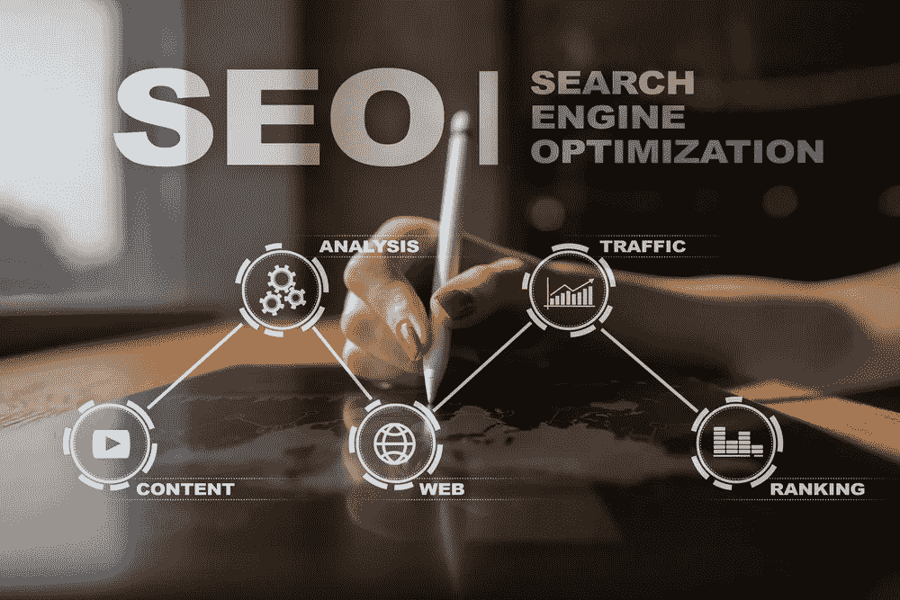

# 为什么你应该关心搜索引擎优化！

> 原文：<https://medium.datadriveninvestor.com/why-you-should-care-about-seo-a9efcce449c4?source=collection_archive---------3----------------------->

**初创企业和企业家搜索引擎优化入门指南**

我今年给初创企业和企业家的头号营销建议是什么？照顾好你的 SEO！即使你不知道那是什么意思…

通过社交媒体和广告获得吸引力只会变得越来越难，成本也越来越高，所以如果你想有效地增长，你还需要专注于有机增长。

 [## 睁大眼睛冲破多样性壁垒——数据驱动的投资者

### “科技女性”是蒂芙尼·霍兰的激情之一，最初她在 Twitter 上主持“科技女性”聊天。她也是一个…

www.datadriveninvestor.com](https://www.datadriveninvestor.com/2019/03/20/hurtle-diversity-barriers-with-eyes-wide-open/) 

这就是 SEO 的用武之地。

SEO 是一个庞大、复杂、不断发展的领域。今天，我们将重点关注一些你的企业要想有机会在网上被发现，绝对需要做好的基础工作。

**什么是 SEO？**

SEO 代表搜索引擎优化。它是像谷歌这样的搜索引擎用来帮助人们在搜索像你这样的产品或服务时找到你的网站。你的搜索引擎优化越好，人们在搜索你的品牌名称或与你的业务相关的术语时，就越有可能找到你的业务。

还和我在一起吗？很好！现在遵循以下 4 个步骤:

**#1 让你的网站走向成功**

当雇佣某人来建立你的网站时，你需要确保他们会满足你的基本搜索引擎优化需求。

首先，问问你的网页设计师/开发者，他们是否会把你的搜索引擎优化作为网站建设的一部分。许多人，如果不是大多数人，不要！然后询问这在实践中意味着什么。以下是你应该注意的一些事情，作为你基本策略的一部分:

*   关键词研究
*   内容开发或审查和更新您的内容，以包括关键字
*   清晰相关的页面标题和每个页面的元描述
*   所有图像的准确描述或替代文本
*   联系信息，包括你的商业位置(地图插件对此非常有用！)
*   通过谷歌搜索控制台索引您的网站
*   设置 Google 我的业务

如果搜索引擎优化没有被你的网站提供商完全覆盖，或者如果你正在建立你自己的网站，你可能想雇人帮你做搜索引擎优化，或者投资一些时间来学习搜索引擎优化。如果你跳过这一步，你的网站将不会被发现，你还不如根本没有一个。

**#2 选择合适的关键词**

除了确保你能在网上被找到，SEO 的主要目标之一是确保你对相关关键词的“排名”。换句话说，当人们搜索与你的网站相关的内容时，你应该把目标放在谷歌搜索结果的第一页。

关键词可以分为三大类:

*   品牌术语:你的公司名称、产品名称，如果你是公众人物，还有你自己的名字。
*   *利基或长尾术语*:你产品的具体描述，包括位置、主题、特色和独特卖点
*   *广义术语:*你所属的大的、整体的类别

任何关键词的竞争越激烈，排名就越难靠前。因此，锁定你有机会在竞争中获得排名的关键词总是明智的——比如你的利基关键词。例如，不要试图为“T4 的咖啡馆”排序，你可以将范围缩小到“T5 的有机咖啡馆”或“T6 附近的咖啡馆”。

要想出你的关键词，你可以使用几个付费工具，如 [SEMrush](https://www.semrush.com/) 、 [MOZ](https://moz.com/) 或 [Optimizely](https://www.optimizely.com/) ，但你也可以凭借一点创造力和常识自己动手。拿出一张纸，头脑风暴人们可能在你的网站上寻找的所有可能的东西。使用 [Google Trends](https://trends.google.com/trends) 查看每个关键词每月被搜索的频率。从那里，把它缩小到大约 10 到 15 个条款，并确保它们在你的网站上实现。

如果你的基本搜索引擎优化做得很好，你至少应该能够对你的品牌术语进行排名——除非你有一个共同的公司名称。注意:在你的网站上线或者实现你的 SEO 之后，通常需要 4 到 6 周的时间来开始排名。

**#3 开始写博客**

SEO 需要博客吗？简单的回答是肯定的。

提高你的 SEO 的最好方法之一就是为登陆你网站的人提供真正有用的资源。博客创造了教育人们的机会，并围绕与你的业务相关的话题建立权威。

不确定如何想出你的话题？一个简单的方法是查看你的关键词，列出人们可能会问的相关问题。只是要确保在为“搜索引擎优化”写博客时，始终把最终用户放在心上永远为人写作，而不是为机器人。

**#4 做季度签到**

在开始的时候投入时间来建立你的 SEO 基础是至关重要的，但是如果你从来不做任何超出这个范围的事情，从长远来看你不会得到结果，因为其他玩家在不断地研究他们的 SEO，并且新的网站一直在发布。

不用怕，你不用每周都花几个小时在 SEO 上。即使仅仅一个季度的更新也会有所不同。设置一个日历提醒来定期检查。以下是要包括的内容:

*   通读你网站上的所有内容，确保所有内容都是准确和相关的。至少添加/更新一些内容来保持新鲜感。例如，你可以添加一篇感言、一个案例研究、新的图片或新闻报道。
*   进入匿名或私人浏览模式，在搜索引擎中输入你的目标关键词。看看你的排名，看看你上面和下面的网站。考虑改变你的关键词，如果它们不再理想，或者寻找新的机会将它们融入你的网站。
*   检查你的谷歌分析，看看你的流量如何。如果你的有机流量没有随着时间的推移而增加，你可能需要更新你的方法。
*   如果你想更深入，可以考虑使用付费工具，比如 Alexa，给你清晰的指示，告诉你如何提高你的搜索引擎优化。
*   如果你还没有，开始写博客，并定期更新。

最后一个注意事项；搜索引擎优化并不能取代你所有的其他营销策略。健康的、多元化的、全面的营销策略，包括社交、PR 或付费搜索等。，可以给你的排名带来真正的提升，并确保你的目标受众了解你的业务，以及为什么他们应该选择你而不是竞争对手。

如果你有关于如何创建一个聪明的营销策略，完整的搜索引擎优化的问题，我很乐意聊天！在 mreussink@the-emms.com 的[给我写封短信。](mailto:mreussink@the-emms.com)

想学习更多营销技巧？关注我获取更多见解。