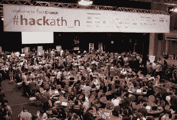
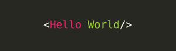
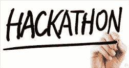

# 为什么你应该去参加黑客马拉松，即使你不知道如何编码

> 原文：<https://medium.datadriveninvestor.com/why-you-should-go-to-a-hackathon-even-if-you-dont-know-how-to-code-fc4d2a66fdad?source=collection_archive---------14----------------------->

两年前的这个周末，我在密歇根大学参加了我的第一次黑客马拉松。对于你们中不熟悉的人来说，黑客马拉松通常是 24-48 小时的比赛，在比赛中，程序员试图做出最酷和最具创新性的项目，通常包括赞助商的软件或技术。黑客这个词经常让我想起计算机天才们俯身在黑色和绿色的计算机屏幕上，闯入政府数据库或窃取你的信用卡信息的画面。我能告诉你的是，这和我遇到的情况相差甚远。当然，黑客马拉松包括入侵或闯入一项技术，让它执行没有被编程的任务，但它更多的是关于制造而不是破坏。

临近周末的黑客马拉松，我越来越不确定我是否能从这个活动中得到什么。我对编码的了解很少，来自于我上过的两门 C++/Python 编程课。在很大程度上，和我一起合作的朋友都是一条船上的人，他们中只有一个人对编码有基本的了解。但问题是，**这些都不重要。在参加了我的第一次黑客马拉松后，我可以自信地说，无论你的技能水平、知识或兴趣如何，你都会从这次经历中有所收获。我们最终使用 [Twilio](https://www.twilio.com/) 构建了一个基于 SMS 的程序，允许大型群组**

决定去哪家餐馆。尽管没有达到我们创建一个 iOS 或 Android 应用程序的目标，但我们都知道这是一个很好的学习机会，所以离开了这个活动。

活动组织者邀请了几位专家来领导关于编程各个方面和领域的研讨会，从 OS/Android 开发到 Hackerboards ( [Arduino](https://www.arduino.cc/) 和 [Raspberry Pi](https://www.raspberrypi.org/) )到虚拟和增强现实。那些一生中从未写过一行代码的人和有抱负的软件工程师同样可以学到东西。除了黑客马拉松提供的教育资源之外，他们还为任何正在努力发展黑客技术的人提供按需帮助。在 MHacks，有一个[休闲](https://slack.com/?cvosrc=ppc.google.slack&cvo_campaign=&cvo_crid=174207553415&Matchtype=e&utm_source=google&utm_medium=ppc&utm_campaign=chatbrand&c3api=5542,32209847475,kwd-102375580&gclid=CPrUx4j79NICFUQaaQodn30GIg)频道，可以播放你能想象到的所有内容，有几次我请求帮助，结果导师在几分钟内就出现了。作为一个在经验丰富的程序员的海洋中工作的新程序员，帮助永远不会超过几步之遥。

参加黑客马拉松不仅仅是构建一个很酷的技术，它还包括与更多的创新思想家交流和联系。在黑客马拉松上，你通常可以选择团队合作，寻找队友的参与者可以毫不费力地找到其他愿意参与某个项目或保护他们的黑客。就像其他事情一样，你和越多的人交谈，你学到的就越多。MHacks 拥有来自北美各地大学(甚至一些高中)的学生，以及来自几家公司的代表，例如 [Capital One](http://api.reimaginebanking.com/) 、 [DRW](https://www.drw.com/) 、 [MixMax](https://mixmax.com/) 和 [Linode](https://www.linode.com/) 等等。将这么多聪明的头脑聚集在一起，提供了一个学习、交友和创造美好事物的绝佳机会。

因此，如果你是一个希望学习或提高编码技能的企业家，或者只是一个想看创新思想家构建令人敬畏的技术的人，我建议你尽快参加黑客马拉松！你可以在这里找到即将举行的活动的日历[！](https://mlh.io/seasons/na-2017/events)