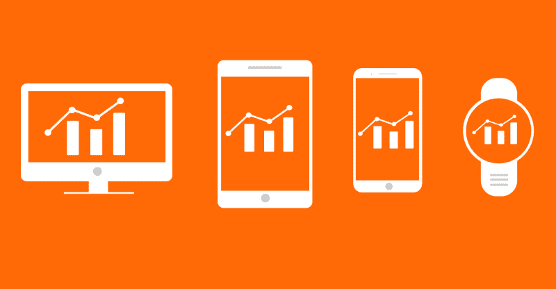
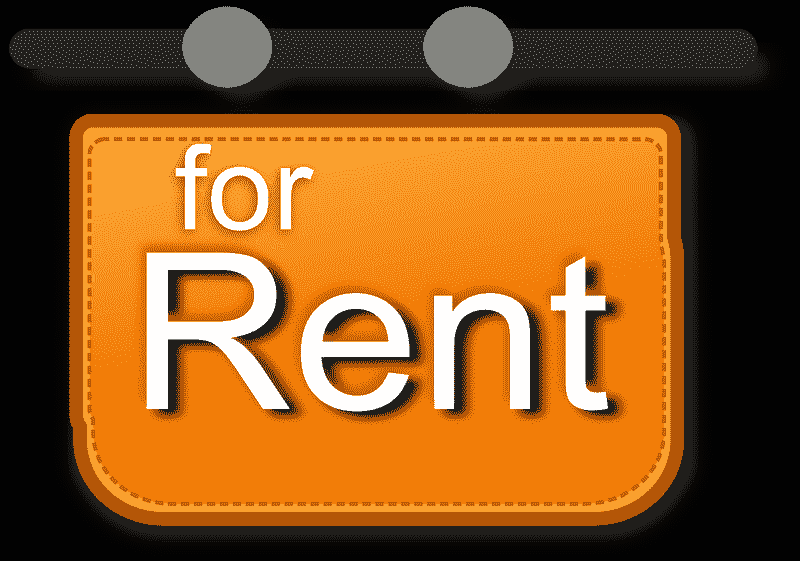
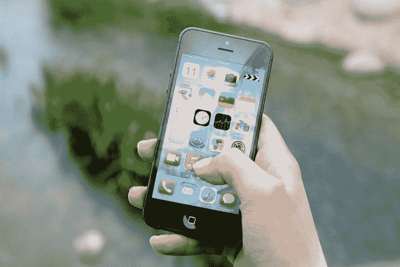
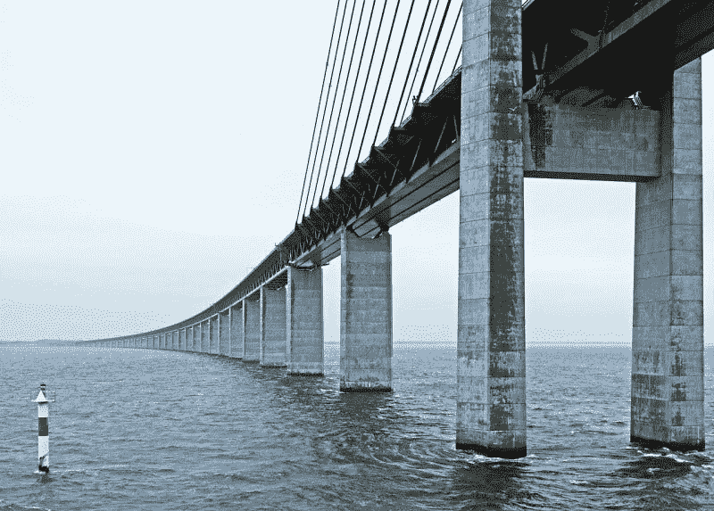
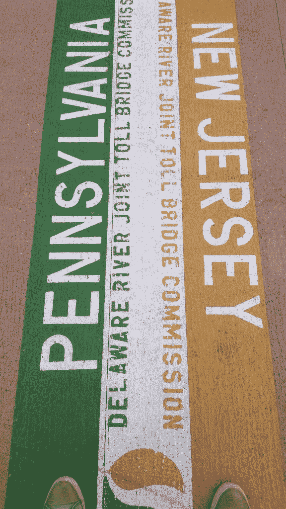
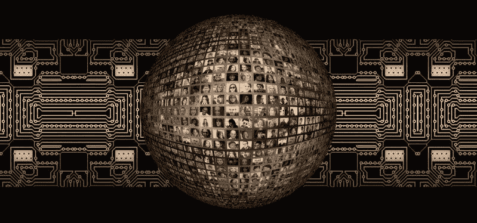

# 为什么你应该投资平台，而不是公司或加密货币——市场疯人院

> 原文：<https://medium.datadriveninvestor.com/why-you-should-invest-in-platforms-not-companies-or-cryptocurrencies-market-mad-house-dc61b8c0f0b5?source=collection_archive---------4----------------------->

如果你想在 21 世纪赚钱，你必须投资平台，而不是产品。因此，你需要识别这些公司；、或加密货币，以及有利可图或潜在有利可图的平台。

解释一下，平台就是网络；或生态系统，为顾客提供商品和服务。例如，**亚马逊(NASDAQ: AMZN)** 平台提供商品和视频等数字产品。

 [## 股票市场投资的机器学习——数据驱动的投资者

### 当你的一个朋友在脸书上传你的新海滩照，平台建议给你的脸加上标签，这是…

www.datadriveninvestor.com](https://www.datadriveninvestor.com/2019/01/30/machine-learning-for-stock-market-investing/) 

相应地，**苹果(纳斯达克股票代码:AAPL)** 正在将自己重塑为一个提供金融服务和娱乐的平台， *OneZero* 作家 Jathan Sadowski [透露](https://onezero.medium.com/landlord-2-0-techs-new-rentier-capitalism-a0bfe491b463)。因此，苹果现在通过 Apple Arcade 提供游戏，通过 Apple TV 提供电影和电视，通过 Apple 提供金融服务。

美国消费者新闻与商业频道[估计，具体来说，苹果计划在 2019 年花费 70 亿美元在音乐和视频内容上，以推动访客访问其平台。这 70 亿美元包括苹果在 2019 年第一季度用于娱乐的 17 亿美元。](https://www.cnbc.com/2019/04/26/amazon-on-pace-to-spend-7-billion-on-video-and-music-content.html)

# 苹果拥抱平台资本主义

苹果正在从销售设备转向平台，因为它可以通过平台赚更多的钱。例如，一些金融分析师估计，苹果的平台在几年内可以从 1 亿用户中获得每年 70 亿美元的收入。

因此，苹果正在从传统资本主义转向萨多夫斯基称之为“[平台资本主义](https://www.wiley.com/en-au/Platform+Capitalism-p-9781509504862)”的商业模式。澄清一下，在传统资本主义中，企业通过出售商品和服务赚钱。

然而，在平台资本主义中，企业出售平台的使用权。客户付费获得卖家的访问权限，卖家付费获得客户的访问权限。

# 平台如何赚钱

例如，亚马逊、**阿里巴巴(纳斯达克股票代码:BABA)** 和**易贝(纳斯达克股票代码:EBAY)** 向商家和顾客收取费用。与此同时，观众需要向**网飞(纳斯达克股票代码:NFLX)** 、Hulu、[迪士尼+](https://www.techradar.com/news/disney-streaming-service-disneys-all-inclusive-streaming-package-explained) 和苹果电视付费才能观看流媒体视频。

实际上，亚马逊向商家收取访问客户的“租金”，而 **Alphabet (NASDAQ: GOOG)** 向广告商收取访问其 SEO 平台的租金。此外，网飞和 Hulu 向观众收取租金。

毫不奇怪，迪士尼正试图通过在固定节目中通过 Disney +提供其许多电影来避免支付租金。因此，迪士尼将收取“租金”，而不是 [Hulu](https://www.cnbc.com/2019/05/01/hulu-announces-28-million-subscribers-new-marvel-shows.html) 或网飞。

# 平台如何通过食利资本主义赚钱

此外，平台资本主义的另一个流行名称是食利资本主义。事实上，萨多夫斯基称今天的技术平台模型为“[房东 2.0”。](https://onezero.medium.com/landlord-2-0-techs-new-rentier-capitalism-a0bfe491b463)

解释一下，在房东 2.0 中，所有者将数字空间“出租”给客户。比如 **Alphabet (NASDAQ: GOOGL)** 通过 Google AdSense 出租广告位等。，而亚马逊通过[亚马逊网络服务](https://onezero.medium.com/open-source-betrayed-industry-leaders-accuse-amazon-of-playing-a-rigged-game-with-aws-67177bc748b7) (AWS)租用云空间。另外，亚马逊租用 Alphabet 这样的广告空间。

当它成功时，食利资本主义可以成为一种有利可图的商业模式。例如，美国消费者新闻与商业频道[指出](https://www.cnbc.com/2019/01/31/aws-earnings-q4-2018.html)，AWS 在 2018 年第四季度创造了 74.3 亿美元的收入。值得注意的是，AWS 收入占亚马逊季度销售额的 10%。此外，亚马逊报告 2018 年第四季度的广告收入为 34 亿美元， *Geekwire* [估计](https://www.geekwire.com/2019/amazons-big-new-business-heres-much-advertising-revenue-company-generated-2018/)。

此外，亚马逊；该公司拥有几个租金收费平台，2018 年第四季度的收入为 723.83 亿美元，毛利为 275.97 亿美元。与此同时，Alphabet 报告 2018 年第四季度收入为 393 亿美元。Statista [计算](https://www.statista.com/statistics/540128/quarterly-revenue-of-alphabet/) Alphabet 的收入从 2017 年第四季度的 323.23 亿美元增长到 12 个月后的 393 亿美元。

# 平台能赚多少钱？

奇怪的是，Alphabet 和亚马逊都不是最赚钱的云平台运营商。有趣的是，这个区别属于**微软(纽约证券交易所代码:MSFT)** 。

例如，[微软](https://marketmadhouse.com/will-microsoft-msft-make-money-from-github/)声称其在 2018 年第四季度从商业云业务中赚了 90 亿美元。因此，微软从云上赚的钱比亚马逊多。此外，微软声称其 [Azure](https://azure.microsoft.com/en-us/) 云业务在 2018 年第四季度增长了 76%，美国消费者新闻与商业频道[报道](https://www.cnbc.com/2019/01/30/microsoft-earnings-q2-2019.html)。

事实上，微软拥有几个平台；包括 Windows、 [GitHub](https://marketmadhouse.com/microsoft-buys-github/) 、Azure、X Box、Azure、[微软 Office 365](https://www.office.com/) 。因此，微软可以向开发者、程序员、公司、组织和个人收取几种“租金”

# 微软是科技界最赚钱的平台吗？

很明显，微软从租金中赚了很多钱。例如，微软报告 2018 年第四季度的收入为 305.17 亿美元，毛利为 204.01 亿美元。此外，微软 2018 年的年收入为 1103.6 亿美元，毛利为 720.07 亿美元。

此外，微软在 2018 年 12 月 31 日拥有 1316.18 亿美元的现金和短期投资。微软积累了大量现金，因为它在 2018 年第四季度的运营现金流为 135.2 亿美元，自由现金流为 109.55 亿美元。

# 微软的平台赚了很多钱

事实上，微软赚了这么多钱，我认为它比亚马逊或 Alphabet 更有利可图。相应地，Alphabet 年的年度现金流总额为 479.17 亿美元。此外，截至 2019 年 12 月 31 日，Alphabet 拥有 1091.4 亿美元的现金和短期投资。

与此同时，亚马逊报告 2019 年的运营现金流为 307.23 亿美元，自由现金流为 194 亿美元。此外，截至 2018 年 12 月 31 日，亚马逊拥有 412.5 亿美元的现金和短期投资。

因此，我认为微软是比亚马逊或 Alphabet 更好的价值投资，因为其股票在 2019 年 5 月 1 日的交易价格为 129.70 美元。与此同时，Alphabet 的交易价格为 1184.29 美元，亚马逊的售价为 1939.22 美元。

此外，微软计划在 2019 年 6 月 13 日支付 46₵的股息。相比之下，亚马逊和 Alphabet 都不支付股息。

# 沃伦·巴菲特如何投资平台

有趣的是，最早注意到平台经济的人之一是沃伦·巴菲特。解释一下，**伯克希尔哈撒韦公司(纽约证券交易所代码:BRK。A)** 投资多个平台。

例如，美国消费者新闻与商业频道[估计](https://www.cnbc.com/2019/02/15/berkshire-trimmed-its-apple-stake-but-it-wasnt-buffett.html)伯克希尔在 2018 年第四季度持有 2.495 亿股苹果股票。此外，彭博[报道](https://www.bloomberg.com/news/articles/2018-05-30/buffett-said-to-have-offered-uber-3-billion-but-talks-crumbled)，巴菲特去年试图向数字交通平台优步投资 30 亿美元。

值得注意的是，苹果公司报告 2019 年 4 月 30 日手头有 2254 亿美元现金，美国消费者新闻与商业频道[报道](https://www.cnbc.com/2019/04/30/apple-now-has-225-billion-cash-on-hand.html)。此外，该公司还计划回购 750 亿美元的股票。因此，巴菲特投资于现金充裕、善待股东的平台。

此外，苹果将于 2019 年 5 月 16 日支付 77₵股息。4₵从 2019 年 2 月 11 日开始增加股息，当时它是 73₵.此外，我认为市场先生在 2019 年 5 月 1 日将苹果股票公平定价为 213.21 美元。

此外，巴菲特承认他犯了一个错误，没有在 1994 年、1997 年和 21 世纪初投资亚马逊。另一方面，叔叔承认他对亚马逊持怀疑态度，尽管他钦佩首席执行官杰夫·贝索斯。

因此，巴菲特要么投资于能产生大量现金的稳定平台(苹果)，要么投资于价格合理、具有潜在利润的平台(优步)。此外，巴菲特会拒绝任何有风险但利润丰厚且不便宜的平台。

# 沃伦·巴菲特版的平台资本主义

独特的是，巴菲特认为平台资本主义是“收费桥”，而不是租金。例如，Seeking Alpha 的撰稿人蒂姆·奥(Tim Au)将巴菲特描述为在实践一种投资的“收费桥梁模式”。

详细来说，收费桥通常是点与点之间的唯一连接，就像一条河的两岸。如果人们想过河，他们必须支付通行费，游泳或花更多的钱在船上。

因此，人们很容易想到网飞、微软、亚马逊、Alphabet 等公司。作为收费桥或者说收费站。解释一下，这些门户控制着其他人想要进入的数字生态系统。因此，这些公司通过收取通行费来赚取收入。

此外，一些公司允许免费进入生态系统，但对其部分功能收费。例如，谷歌的搜索引擎对任何人来说都是免费的，但是 Alphabet 向你收取广告费用。

# 巴菲特的收费桥梁资本主义是如何运作的

因此，巴菲特寻找他可以购买或投资的收费桥梁。毫不奇怪，当前的伯克希尔哈撒韦公司(纽约证券交易所代码:BRK。B) [控股](http://www.berkshirehathaway.com/subs/sublinks.html)包括部分收费站。"

例如，伯灵顿北圣达菲(BNSF)铁路公司对运输多种货物收取通行费。此外，BNSF 实际上垄断了美国许多地方的大宗货物运输。

伯克希尔的其他持股包括:[商业新闻](https://www.businesswire.com/portal/site/home/)(一个发布新闻的平台)、管道、公用事业和许多报纸；BH 媒体。而且，巴菲特曾经是电视台的大投资者。解释一下，像布法罗新闻这样的报纸在几代人的时间里有效地垄断了美国大多数城市的平面广告和新闻。

此外，广播电视台过去一直经营着类似谷歌的广告垄断。解释一下，电视台免费赠送他们的产品电视。然而，电视台在广播期间收取广告费。

另一方面，巴菲特正在离开电视和报纸，因为这些业务都在赔钱。沃伦大叔明白，没有过路费的收费站是没有用的。

# 如何投资平台

归根结底，平台资本主义是有利可图的，而且在当今世界可能会变得更加有利可图。因此，你可以通过投资平台来赚钱。

以下是我对投资平台的建议:

1。寻找有能力收取通行费或租金的企业。例如，亚马逊从商家、Prime 订户、电影制片人、使用 AWS 云的公司和许多其他人那里收取“通行费”。

2。寻找像微软、苹果和 Alphabet 这样能产生大量现金的公司。记住，没有收银机的收费站是没有意义的。

3。寻找被低估的；或者不被看好的地主，比如微软和苹果。

4。寻找拥有多个平台的公司。比如说；微软、苹果、亚马逊和 Alphabet。

5。寻找其他投资者忽略的不寻常和不太可能的平台。例如，微软，以及一些较小的科技公司，如 [**、甲骨文**](https://marketmadhouse.com/how-much-money-is-oracle-orcl-making/) **(纽约证券交易所代码:ORCL)** 、 [**奥卡多集团有限公司**](https://marketmadhouse.com/is-ocado-the-future-of-groceries-and-does-it-make-money/) **(伦敦证券交易所代码:OCDO)** 、 [**英伟达**](https://medium.com/datadriveninvestor/cash-in-on-video-games-with-nvidia-data-driven-investor-6e0b4b9360fa) **(纳斯达克代码:NVDA)** 、**易贝(纳斯达克代码:EBAY)** 以及 [**贝宝**](https://marketmadhouse.com/the-power-of-paypal-pypl-should-a-dividend/)

6。有远超硅谷的平台可能性；例如，**福特(NYSE: F)** 正在建立一个[交通移动云](https://medium.com/cityoftomorrow/why-were-working-with-autonomic-to-create-a-platform-that-can-power-future-cities-96700c2824e6)来收集车辆数据。此外，甚至像**克罗格(纽约证券交易所代码:KR)** 和 **TJX 公司(纽约证券交易所代码:TJX)** 这样的零售商也具有平台属性。

7。请记住，没有一个平台是万无一失或永久不变的。因此，任何平台都可能停止赚钱。特别是，广播电视和报纸的缓慢消亡表明，没有一个平台是永恒的。

最后，在投资前仔细研究平台，对任何新的或不寻常的平台保持警惕。即使少数平台产生大量现金，大多数平台永远不会赚钱。

*原载于 2019 年 5 月 1 日 https://marketmadhouse.com***。**