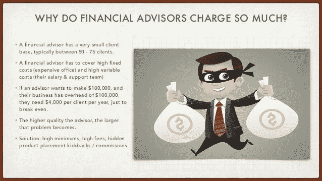

# 为什么永远不要相信理财顾问

> 原文：<https://medium.datadriveninvestor.com/why-you-should-never-trust-your-financial-advisor-58ea53d9d200?source=collection_archive---------1----------------------->

[rawpixel](https://unsplash.com/@rawpixel?utm_source=medium&utm_medium=referral) on [Unsplash](https://unsplash.com?utm_source=medium&utm_medium=referral)

很少有人有空闲时间来调整金融秩序或关心他们的债券收益率。因此，我们大多数人都把自己的财务事务交给顾问处理。以下是你应该重新考虑雇佣顾问的原因。

不仅仅是自 2008 年金融危机以来，金融世界变得令人困惑，对某些人来说甚至令人恐惧。银行业用难以理解的术语来攻击你，用这些上下波动的图表来迷惑你。而且投资产品的种类反正是超大的。如果你对所有这些问题都没有职业接触点，你肯定根本不会对此产生积极的兴趣。不足为奇的是，我们大多数人认为需要一个财务顾问。

因此，许多人把他们的财务责任交给专家。财务顾问可以帮助你增加储蓄，为你的未来制定有效的计划，并擅长所有的交易技巧。 [**根据西北互助银行发布的一项研究**](http://news.northwesternmutual.com/planning-and-progress-study-2016) ，大约 40%的美国人*将他们的财富或退休投资组合交给理财顾问。越富有的人越相信这种咨询技巧:在拥有 500 万美元以上的人中，超过 80%的人寻求专业建议。*

# 你的财务顾问有责任和利益冲突

知道了这些数字，令人惊讶的是大多数美国人实际上并不相信它们。只有 2%的人声称对金融服务业完全有信心。相比之下，大多数人(65%)表示，他们不相信金融专业人士会按照他们的最大利益行事——这是有充分理由的，正如以下 CBC 关于金融王乐的新闻报道所示。

嗯，这只是一个随机的电视节目，需要良好的收视数字，你现在可以介入。是的，通常我会证明你是对的。但不幸的是，这种欺诈行为甚至是有科学依据的。两年前，在明尼苏达大学和芝加哥大学工作的三名科学家检查了超过 100 万名金融顾问在 2005 年至 2015 年之间的报告。令人震惊的结果 :这些顾问中有 87.000 人，也就是 7%，因为欺诈或不当行为而受到处分。黑暗的数字可能更高。总百分比可能大大超过。

> ***“金融是一门将钱从一只手传到另一只手直到它最终消失的艺术”——罗伯特·w·萨诺夫***

这种欺骗行业的真实规模可以在一些最令人发指的法庭诉讼中得到持续追踪: [**富国银行因欺诈性开户和未经客户同意秘密发行信用卡而被罚款 1 . 85 亿美元**](https://www.nytimes.com/2016/09/09/business/dealbook/wells-fargo-fined-for-years-of-harm-to-customers.html) 。美国银行因在自己的交易中使用客户的现金支付了 4 . 15 亿美元。四名前巴克莱员工因操纵伦敦银行同业拆放利率被判入狱。你看:金融部门相当狡猾。

# 挑战你得到的每一个建议

原因很简单:仅在美国，大约 90%的金融顾问是金融经纪人。这意味着银行向他们支付向客户销售金融产品的费用。因此，财务顾问通常会从*的角度推销主要是昂贵的产品。*为了赚取一次性销售佣金或年度许可费收入*，*他们特别关注人寿保险、主动管理投资基金或支付利息的年金。由于许多经纪人必须完成白鞋公司至少 500，000 美元的全年目标，他们中的一些人追求可疑的策略，不利于他们的客户。

Personal Finance for Engineers / Financial Planning & Goals ([Adam Nash)](https://www.slideshare.net/adamnash/stanford-cs-00708-personal-finance-for-engineers-financial-planning-goals)

当然，我不想打击你。唱衰这个行业是我最不想做的事。当然，大多数顾问都很正直，这一点我没有任何疑问。但考虑到所有这些埋伏，你应该问问自己晚上是否还能睡得安稳。不知道你的财务顾问是否行为不端或赌博输光了你的钱，这可能是一种严重的睡眠剥夺。

最终，整个系统充斥着利益冲突的披露。不管你的财务顾问看起来多么友好或可信，永远记住:**你的经纪人不是你的朋友。**

*你曾经做过财务顾问吗？你有哪些经历？我很期待听到你们的故事！*

*原载于*[*https://femalemoneymag.com/*](https://femalemoneymag.com/)*。在* [*推特上关注我！*](https://twitter.com/Kurznotizen)