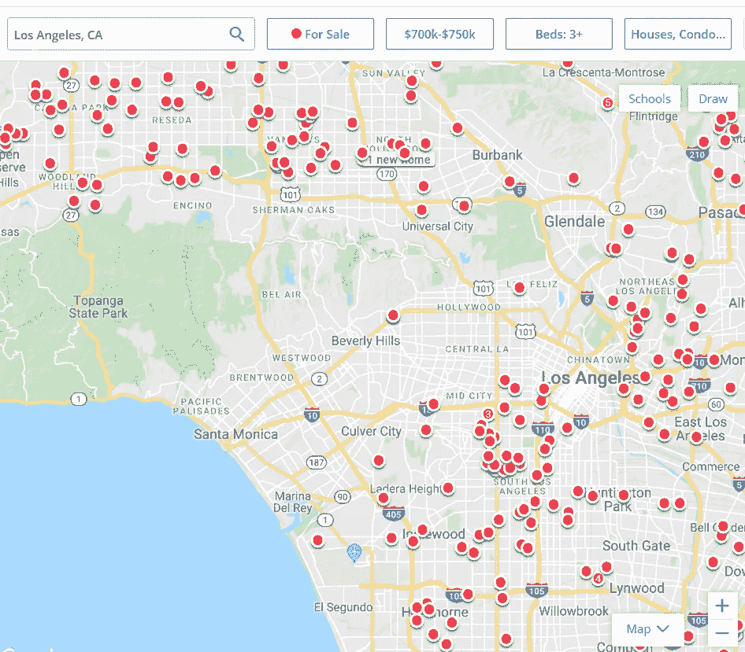
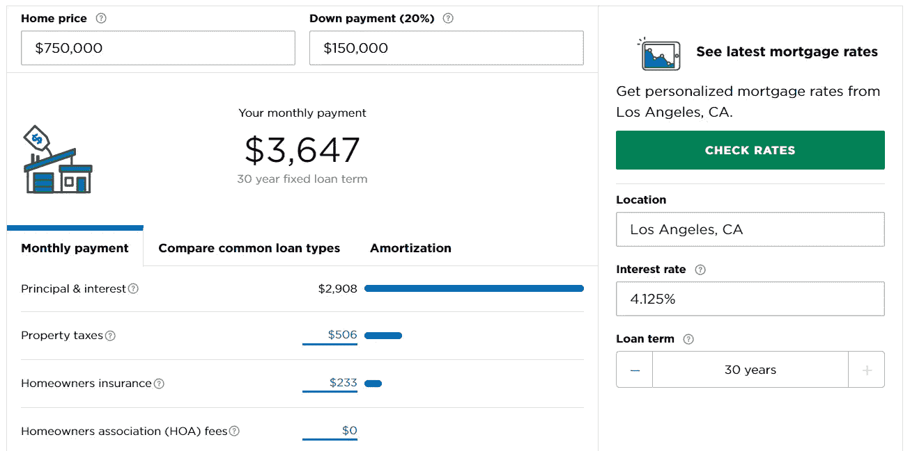

# 为什么 2020 年你不应该在洛杉矶买房

> 原文：<https://medium.datadriveninvestor.com/why-you-should-not-buy-a-house-in-los-angeles-in-2020-7e498bdfc11c?source=collection_archive---------0----------------------->

快到 2020 年了，新年决心开始在我们的脑海中盘旋。除了通常的“假日饮食减肥 10 磅”之外，许多天使可能会着眼于在天使之城买一栋房子。

大错特错！有 3 个原因可以解释为什么 2020 年在洛杉矶买房会是你犯下的最大的财务错误。

首先，宏观经济对你不利。市场已经强劲了 10 年，早就该调整了。自 2010 年以来，我们的经济取得了令人难以置信的增长。物价很高，但失业率很低。太好了。不幸的是，在这么长的时间里这是不正常的。我很想深入了解经济如何运行的细节，但我不是经济学家，只是一个跟踪像沃伦·巴菲特和雷伊·达里奥这样有史以来最伟大的投资者的人。

不管你的背景如何，我都强烈建议你花 30 分钟来看一下雷伊·达里奥(世界第 25 大富豪，净资产超过 180 亿美元)的这段简单易懂的视频。

到最后，你会知道衰退每 5-8 年发生一次，以及为什么它们是必要的。你还会看到债务是如何在这一切中扮演重要角色的。更重要的是，看这个视频可能会为你一生节省数百万美元。帮你自己一个忙，让它在你电脑上的一个单独的标签中打开。

反正如果衰退来了，物价会下降，就业会下降，你的收入可能确实会下降。然而，如果你在 2020 年 2 月花 140 万英镑买了一套房子，那么这些丰厚的月供将保持不变。

 [## 风险投资家在给创业公司播种时会考虑什么标准？数据驱动的投资者

### 2017 年，风险投资资金攀升至十年来的最高水平。你的创业公司目前吸引风险投资的机会是…

www.datadriveninvestor.com](https://www.datadriveninvestor.com/2018/04/20/what-criteria-do-venture-capitalists-consider-when-seeding-a-startup/) 

投资获胜的关键是低买高卖。很简单。难的是，当你的情绪阻碍了你，并告诉你的大脑这是低的，当它远离它的时候。我现在告诉你，这很高。10 年后，你的房子会更值钱，但在 2030 年回升之前，它会贬值。那只是经济学。

**其次，机会成本太大。**我们来做一个例子……

如果你想在洛杉矶找一个最高预算为 75 万美元的房子，你会找到一个不错的选择。有些社区是禁区，但你会找到一些东西。

A Zillow search performed on 11/20/2019 for 3+ bedroom homes for sale in LA between $700k and $750k.

这意味着，如果你以 75 万美元的价格买了一套房子，首付 20%(15 万美元！)，30 年期抵押贷款的月供为 3647 美元，15 年期抵押贷款的月供为 5215 美元。考虑到这还不包括 HOA 费用(适用于共管公寓、联排别墅和其他高档社区)、维护和维修、安全和公用事业，这个数字可能会更高。

不考虑所有这些其他费用，人们会变得“房子有钱，现金没钱”

Here are the numbers.

你想说什么，布拉德？我的观点是，尽管洛杉矶的房租上涨了很多，但房租仍然赶不上我们最近看到的疯狂上涨。

换句话说，与美国大多数其他城镇相比，在洛杉矶租房还是很划算的。花 750，000 美元，你可以在美国的许多地方买一栋 8 单元的公寓，每月支付你 8000 美元。减去你的抵押贷款，税收，维护，以及聘请物业管理公司的费用，你可能会在每个月底盈利 3500 美元。

但是你猜怎么着？你刚刚买了一棵摇钱树，它会每月给你带来钱来支付你的房租，而资产会随着时间的推移而增加。所以你要么在洛杉矶买下你想要的房子，用你所有的钱来偿还，要么在其他地方买一处房产，来支付你想要的房子的租金。

不同之处在于，如果你或你的配偶失业，如果(当)经济衰退或你只想搬家，你可以自由地这样做，只要你有一笔永久资产来支付这笔费用。

最后，房租管制正在洛杉矶扩展！【1842 年议会法案于今年早些时候签署，该法案将扩大洛杉矶的租金控制，直至 2030 年。虽然对所涵盖的财产类型有所规定，但该法案规定，房东每年的租金涨幅不得超过当地通货膨胀率的 5%。

该法案仅涵盖洛杉矶 15 年以上的旧房产，但它让长期居住在洛杉矶的居民松了一口气。

对我们来说，这意味着我们现在可以支付租金溢价，但从长远来看，我们决定为我们服务。这和过去 10 年来洛杉矶和纽约的居民一样，都处于租金管制的境地。现在花 3500 美元买一套三居室公寓可能听起来很贵，但 10 年后当所有人都在花 6000 美元时，花 4100 美元买就很划算了。

关于洛杉矶租金控制的更多细节，请阅读这篇文章:[下面是加州租金控制法将如何运作](https://la.curbed.com/2019/9/24/20868937/california-rent-control-law-bill-governor)。

总而言之，我在这里不是要阻止你实现拥有住房的人生中最大的梦想之一。重点是让人们意识到正在发生的事情，这样你就可以通过拥有一个经济和情感安全的家来实现你真正想要的东西。

了解宏观和微观经济，投资现金流，低买高卖，一定能让你成功。

更多掌控你的财务和生活的方法，请访问[千禧一代的理财指南](http://youtube.com/themillennialsguidetomoney)。

布拉德利·贾里德

戴夫·拉姆齐更喜欢金融蔻驰

[BradleyJarryd.com](http://BradleyJarryd.com)//insta gram&Tiktok:@ IamBradleyJarryd