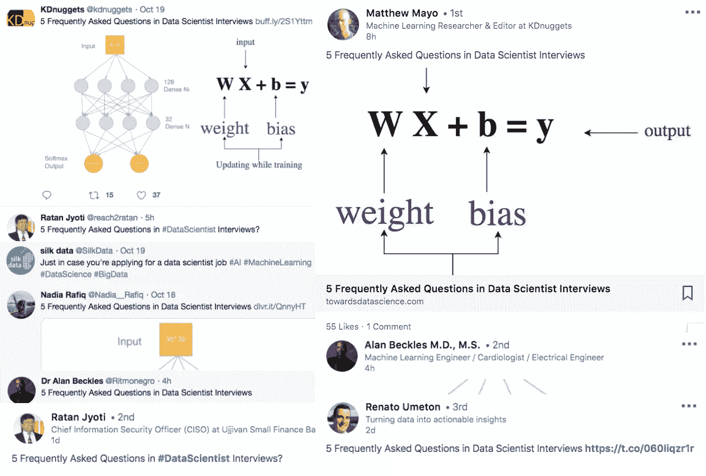

# 为什么你应该开始写下值得作为人工智能专业人员传播的想法

> 原文：<https://medium.datadriveninvestor.com/why-you-should-start-writing-down-ideas-worth-spreading-as-ai-professionals-7053daae2a76?source=collection_archive---------50----------------------->

约翰·肯尼迪说过，“一个人可能会死去，国家可能会兴衰，但一个思想会永存。”有 3 个理由让你开始通过写作分享你的想法，或者更具体地说，人工智能相关的技术写作。

**1。写下值得传播的想法**

第一个原因是分享值得传播的技术和经验。现在对人工智能人才的需求很大。数据科学家、机器学习工程师或研究工程师所需的技能包括数学、统计学、ML 算法、数据可视化、云架构等。因此，有抱负的高级人工智能专业人员正在花费大量时间进行研究和学习。

结构良好、清晰简洁的文章可以提高学习效率。像视觉化和讲故事这样的写作技巧也能让经历变得更有趣、更刺激、更愉快。

如果你通过学习不断更新自己，如果你对人工智能技术充满热情，如果你认为你有义务支持年轻的专业人士，你可以尝试一下科技写作——写下值得传播的想法；写下人们认为值得分享的想法。

**2。你看见我，所以我是**

写作的第二个原因是，从哲学上来说，你看我，所以我在。一个基本的本能，或者说人类的需求，就是被其他人看到。笛卡尔写道:“我思故我在”。也许冒犯，我不同意这位伟大的哲学家。有一句祖鲁语，“一个人是通过其他人的一个人。”

上周日，我偶然发现一些人工智能专业人士正在他们的 LinkedIn 或 Twitter 上分享我的媒体文章，例如，“ [**5 个数据科学家采访中的常见问题**](https://towardsdatascience.com/5-frequently-asked-questions-in-data-scientist-interviews-6fb3eeeb497)**”**。这太令人惊讶了，因为他们中的一些人是我的职业偶像，我在网上关注他们已经有一段时间了。

通过写作，我得到的评论，喜欢，信息，问题，确实让我觉得我确实存在于这个世界上。我不是某人头脑中的想象，因为我通过你的眼睛看到了我自己。我也是来让你见识见识的。你可以从反馈和支持中获得成就感，更重要的是，找到自己的存在。

**3。诚实表达自己**

写作可以是表达自己的一种方式。武术家、演员、电影导演李小龙在接受采访时说，“诚实地表达自己……很难做到。我的意思是，对我来说，很容易装模作样，趾高气扬，充满了趾高气扬的感觉，然后觉得自己很酷，你明白我的意思，被它蒙蔽了双眼，或者我可以向你展示一些非常花哨的动作。而是诚实地表达自己，而不是欺骗自己……现在，我的朋友，这是很难做到的。”

科技写作背后的原理与武术或表演是一样的。科技写作不是用复杂的数学公式或晦涩难懂的示例代码来迷惑人，以炫耀作者有多聪明。

这是为你的读者服务。这是代表观众思考的问题。它是关于深入挖掘知识，并找出一种以直观和可理解的方式描述它的方法。到最后你会发现，用文字解释一个技术概念和表达自己是完全一样的。你选择的方式，花哨或简单，迂回或直接，费解或清晰，都取决于真实的你。

在这篇文章中，我分享了你应该尝试科技写作的 3 个理由。目的是让更多的人可以写下值得传播的想法，在旅途中更深入地了解自己，并与有趣的头脑建立联系。我只有一个担心，TED 会因为我使用了“值得传播的想法”这个口号而起诉我吗？