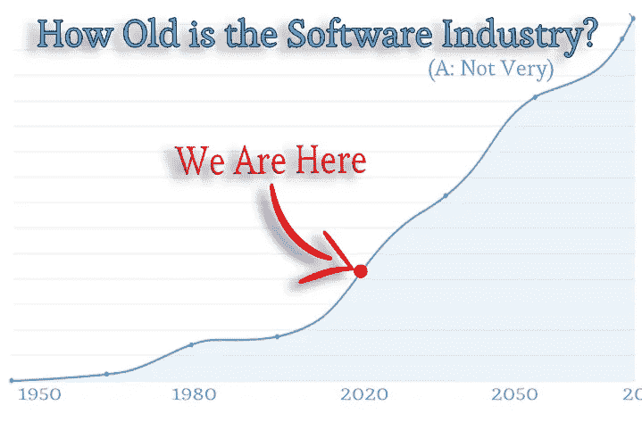

# 有你的大软件想法的空间

> 原文：<https://medium.datadriveninvestor.com/why-you-should-think-big-14d878a48f55?source=collection_archive---------1----------------------->

## 所以建造一些很棒的东西

软件行业有足够的空间让你去做真正大的事情吗？你错过机会之舟了吗？

让我们做一个简单的类比来了解我们在软件历史中的位置。

简而言之，在这场游戏中，你可以感受到*还有多早*。

T 他把内燃机历史上的第一次具体发展确定为如下由[百科](https://en.wikipedia.org/wiki/Internal_combustion_engine#History):

> 1791 年，[约翰·巴伯](https://en.wikipedia.org/wiki/John_Barber_(engineer))研制出[燃气轮机](https://en.wikipedia.org/wiki/Gas_turbine)。

现在，将它与我们可能认为的具体软件开发的开端进行比较:

> 1948 年 6 月 21 日上午 11 点，存储程序计算机第一次持有并执行了一个软件[……]

因此，我们可以公平地说，我们无法真正猜测即将发生的事情，因为事情发展得非常快。

 [## 创建折衷书架的程序员指南|数据驱动的投资者

### 每个开发者都应该有一个书架。他的内阁中可能的文本集合是无数的，但不是每一个集合…

www.datadriveninvestor.com](https://www.datadriveninvestor.com/2019/03/25/a-programmers-guide-to-creating-an-eclectic-bookshelf/) 

这就是为什么亚马逊的云革命让大部分机构措手不及。

很可能软件还没有到达亨利·福特时刻(扩展一下内燃机的比喻)。

软件创新的伟大历史就在这里，来自 David Wheeler，我鼓励你去读它:

 [## 最重要的软件创新

### 太多的人把软件创新和其他因素混为一谈，比如计算机和网络的速度越来越快…

dwheeler.com](https://dwheeler.com/innovation/innovation.html) 

从事软件行业的一大乐趣就是创造性地开发东西。但随之而来的是我们发现自己所处的环境，也就是说，我们在新的领域工作了很多，做的工作实际上推进了边界。

我们实际上是在探索一个尚未被思考和构建的可能性的精神领域。

那是令人兴奋的。这就是为什么编码有如此多的活力。

认为我们自己是思想先驱是件好事。但是原始的事实支持它。将心灵的视角从地面提升到空中是一件鼓舞人心的事情。

暂且把如何完成那个小部件或 API 端点放在一边。你正在做的这个叫软件的不守规矩的东西是什么？

50 年后会是什么样？会对这个世界产生什么影响？

我们可以看到，在汽车行业，即使在福特奠定基础的一百年后，新的品牌和技术继续成功地进入这个领域。

因此，当你问自己你的想法或愿景是否有足够的跑道时，你必须说:当然有。

这是一片开阔的田野。

因此，明智的，甚至是*义不容辞的*我们有责任去满足我们更大的想法并追求它们。

这个被称为软件的最年轻、最奇特的行业/创意领域的本质正在形成。

激励我们并推动我们达到更高水平的创造力和行动——这才是最有价值的。

我们面前有多么大的机会啊。

马特·泰森是[黑马集团公司](http://www.darkhorse.tech/)的首席技术官

**有关服务的信息:** dev@darkhorse.tech

[www.darkhorse.tech](http://www.darkhorse.tech)