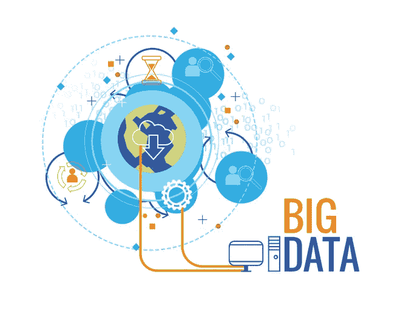
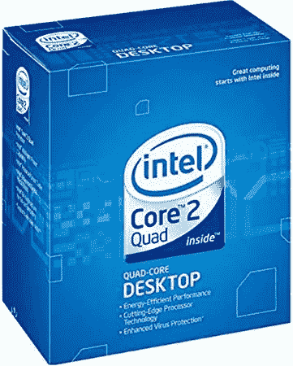
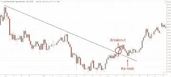
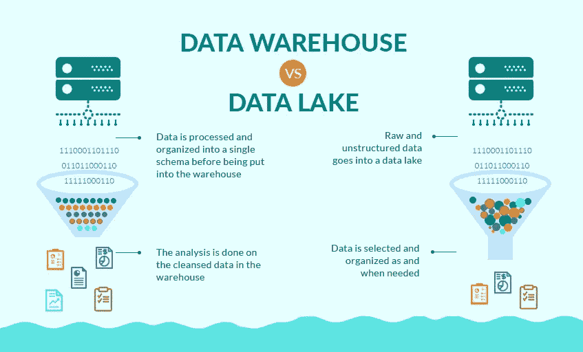

# 为什么您不应该害怕大数据

> 原文：<https://medium.datadriveninvestor.com/why-you-shouldnt-be-afraid-of-big-data-ecef8a16a405?source=collection_archive---------7----------------------->

近年来，有人担心企业大数据会像吸水海绵一样吸收任何和所有信息，不管这些信息与用户有多相关。新闻出版物经常发布关于数据保密性的恐惧观点，在数据科学中，我们称这个话题为“数据伦理”是的，公司在不断地收集和出售我们的信息，但我们真的需要将隐私和安全融入我们生活的方方面面，依靠传统硬件和变通解决方案来提供安全性吗？可能不会…试图逃离这个数据管理狂热的梦想是一场艰苦的战斗，试图在不完全切断自己与电子产品的联系的情况下逃离是完全不道德的。

# 不可行

让我们面对它，数据收集无处不在，就像一个整体在一个二乘四覆盖着木材填料。不被数据收集所困扰的唯一生活方式就是将数据从你的生活中完全剔除。很可能你对这篇文章的阅读，你在这一页上花的时间，你向下滚动了多远，你在屏幕上触摸或点击了哪里，这些都在此刻被收集起来。如果你在打电话，你的手机会通过手机信号塔将位置和活动数据直接发送给你的 ISP。如果你的路由器和 ISP 之间有类似的关系，wi-fi 的情况也不会好到哪里去。

至于计算机，它们是建立在一层又一层的数据收集之上的。任何计算机最重要的部分是中央处理器。两家旗舰 64 位处理器制造商都采用了旨在将数据管道送回家中的技术。这些功能可以归结为一些细节，如单圈时间，笔记本电脑检测到它在你的膝盖上与在桌子上的时间，指纹扫描，以及任何由 CPU 调制的硬件(换句话说，所有硬件)。)

该功能最糟糕的部分是，即使有开源修改，也没有人能够闪存掉英特尔管理引擎，因此，拥有一个不监视你的英特尔处理器也需要使用我小时候新的处理器，可能最强的非服务器选项是 Q6600。

此外，只使用自由/开源软件可能会很乏味，尤其是当你习惯于其他东西的时候。虽然人们普遍认为 GNU 很棒，也许你们都可以换一个新的操作系统，但对于普通用户来说，为了避免被窥探，这是一个很大的要求。

It was great while it lasted.

# 但是为什么呢？

在数据收集的混乱中，有一点非常重要:

> 为什么？

数据窥探之所以如此盛行，是因为归根结底，这些都是生意。企业最重要的生命线之一是分析。对于消费者来说，分析是一种完全不受限制地交流想法和事实的好方法。例如，英特尔利用您的笔记本电脑窥探您的膝上或桌面数据，这些分析在确定哪类用户将购买他们的笔记本电脑方面可能非常有用。你不会向只在笔记本电脑上观看在线视频的人推荐 7 英寸的工作站。

因此，你的很多信息并不一定是你的，而是经过分析，在至少 5000 个像你一样的人的其他观察数据中做出具体的预测。尽管从表面上看，被监视的前景是多么可怕，但重要的是要注意，这些数据并不用于数据管道和商业分析之外的许多事情。

你的数据通常驱动的不一定是间谍活动，而是一个绝对的分析机器的怪物。窥探的全部目的是向制造商提供关于消费者的一般细节，而不是逐案调查。

# 范围

大数据的范围超出了人类大脑的物理记忆好几光年。要了解大数据的真实规模，我们需要了解它的组织。

数据范围始于数据中心。它从数据中心进入所谓的数据湖，这是未处理数据的一个较小部分，其大小需要一台超级计算机来处理。数据湖下面是数据仓库，它包含了数据湖中更有组织性、更易理解、更小的数据版本。当然，数据存储的这些含义是完全动态的，但通常是以添加段的形式，而不是表示段的形式。我们的漏斗旅程将我们带到了更小的数据库。数据库仍然不完全是观测数据。数据库的范围通常太大，需要提取出来才能进行任何种类的分析。

这就是我们数据的最终命名，数据表。数据表通常包含 5000 到 500 万个观察值，这是由我们当前这一代硬件的局限性造成的限制，至少在中等范围内是如此。

因此，在这种规模下，真的很难对一个人的数据进行推断和篡改。大数据的范围如此之广，以至于雇佣个人来筛选某些输入只是浪费金钱，因此通常情况下，查询是从数据库中随机选择的，并提取到数据表中进行分析。

# 最后

数据伦理是一个可以讨论很长时间的话题。然而，通常令人担心的典型数据窥探和“暴露”往往不值得担心…也就是说，即使值得担心，在我们的历史中，在不扔掉所有设备的情况下，真的没有办法从你的生活中删除它。业主是技术业务的一个目录，当然不会很快消失。如果你想要一个现代的 CPU，现代的 RAM，和一个 GPU，那么就不可能避免所说的数据窥探。大数据并不像它被夸大的那样可怕，坦率地说，大部分数据都不是出于恶意产生或访问的。