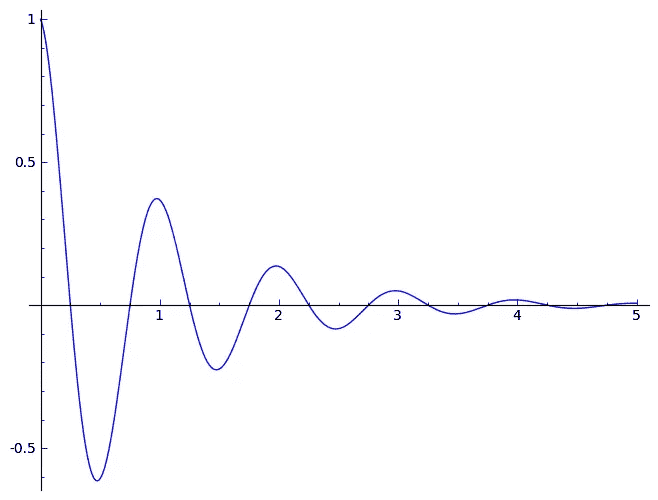

# 为什么你不应该害怕 UX 设计中的趋同与趋异

> 原文：<https://medium.datadriveninvestor.com/why-you-shouldnt-be-afraid-of-convergence-divergence-in-ux-design-31bd8c8521f0?source=collection_archive---------19----------------------->

UX 设计的一个重要支持者是迭代和识别什么时候一个想法不起作用，需要改变。

迭代是随着时间的推移对产品、流程或程序的重复和持续改进，作为一种接近近似解决方案的手段。迭代不是应该害怕的事情，而是一个设计师最终应该努力去经历的事情。通过经历失败，了解哪里出了问题，然后改进这些想法，设计师可以更有效地找到解决方案。

虽然我们 UX 设计师经常使用迭代来推动基于研究的解决方案，但我们有时只是走过场，我认为重要的是将自我意识带到我们有时会忘记大脑在迭代过程中经历的思维过程中。这个过程就是趋同和趋异。

# 趋同；聚集

从本质上来说，融合是我们所有的研究、数据和综合汇集在一起，形成我们想要推向市场的产品或原型。它是将我们带到 MVP 或我们产品的后续迭代的各种因素的顶点。它甚至可能是在一个失败的可用性测试被引入到产品中之后的迭代，以改进它向前发展。

> 聚合是移动部分的向内运动，以驱动整个视觉。

# 发散度

因此，如果收敛向内移动，那么发散就是向外移动——或者远离——你当前的位置。偏离意味着完全脱离愿景，在你的产品泡沫之外提出新的想法，这些想法可以整合到产品中并加以改进。

> 分歧是偏离愿景的移动部分的向外运动，希望学习一些新的东西，这些新的东西可以在峰值反转时被带回到产品中。

# 这看起来像什么？

Sine curve that demonstrates convergence and divergence.

正弦曲线是这一概念的最佳例证。想象一下，标有 1 到 5 的 x 轴是你的基线——那是你的产品想要的位置。y 轴代表您的设计随着时间的推移(x 轴)通过进一步迭代的有效性。即 1 可以表示迭代 1，而 5 可以表示迭代 5。

一开始，你的设计是有缺陷的，有巨大的波峰和波谷。当它靠近生产线时，它向最佳产品汇聚，当它向下通过时，它向外发散。

随着时间的推移，你的波峰和波谷越来越小，直到最终你足够接近一个最佳的产品。

一个特定的功能或设计可能会与基线平行，但是当你在产品中集成一个新的功能时，这个过程又会重新开始。仅仅因为一个产品达到基线并不意味着迭代过程应该结束。无论你使用什么媒介或过程，总有改进的余地。

# 自我意识

重要的是，我们要自我意识到在一个过程中我们实际上在进行什么过程，而不仅仅是走过场。这不仅允许我们认识到我们的过程，还允许我们迭代我们自己的过程本身。

趋同而不趋异根本行不通。分歧和融合形成了一种共生关系，这种关系驱动迭代过程，并允许我们作为设计者为人们和他们的问题创造更好的解决方案。不要害怕偏离你的设计，因为否则你可能不会接触到你不知道存在的更好的解决方案。

不管你在做什么，或者你的产品目标是什么，只要记住偏离你的想法并不是一件坏事。它实际上对我们的产品非常有益，并开启了一个全新的可能性世界。

