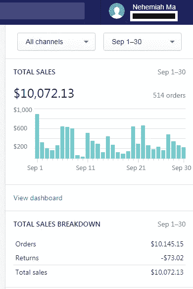

# 为什么不应该辞职创业？

> 原文：<https://medium.datadriveninvestor.com/why-you-shouldnt-quit-your-job-to-start-a-business-6eb8cce60acd?source=collection_archive---------19----------------------->

你厌倦了为这个人工作，意识到你想自己当老板。你有一个想法，和 6-12 个月的生活费用。你已经准备好辞职专注于你的事业了，对吗？

**错了**。让我们从基础开始。你有商业经验或知识吗？学习经营企业的基本技能需要过去的经验。

**做生意就像练习一种乐器。**你第一次玩的时候不会表现得很好，而且你肯定没有准备好在一小群人面前玩现场游戏。你创业和失败的次数越多，你就会变得越好。你将学会避免哪些陷阱，以及失败带来的其他一切。

**失败是必不可少的，而且注定会发生在你身上。90%以上的初创企业失败的原因有很多。不要试图回避统计数据，做好最坏的打算。在我的一家公司盈利之前，我失败了 3 年(并从中吸取了教训)。我从以前的冒险中学到的一切都被投入到我下一次的冒险中，一次又一次地获利…**

一个企业有它自己的肚子，它只接受美元。

> "但是我有 6-12 个月的应急现金储备！"

那没什么。你需要的是稳定的收入流(你的日常工作)来不断地资助(养活)你的生意。让我告诉你为什么。先说一个基本的例子。客户购买你的库存，现在你的库存快用完了，你必须投资购买库存，但这次要多一点，因为有批量折扣，或者因为你预测会有更多的业务。现在，你将大部分利润投入到购买更多的存货中。

但是等等，一个企业只有一个 SKU 现实吗？假设平均有 10 种不同的产品。这是 10 种不同的方式让你的钱被库存套牢。而这只是冰山一角。如果你不是一个网上商店，你有租金，水电费，和一个可能的雇员。哦，等等，你怎么把消息传出去？数字营销对新手来说不是最友好的地方。“但我有这个很酷的产品，所以人们会来找我！”没有。无论你有多么酷的产品，亚马逊可能都必须这样做。一个企业有它自己的需求，只有通过花钱才能解决。市场将永远决定你是英雄还是失败者。

一旦你开始一个合法的生意，6-12 个月的储蓄可以维持你 2-4 个月。即使是成功的企业也存在资金问题，这是有原因的。

他们所有的钱都滞留在库存中，永远无法兑现。

有一份稳定的薪水会让残酷的现实变得温和，让你内心平静，这是你创业时需要的。

我个人每月挣 7-$10K，但仍在做我的日常工作。仅营销一项就花了我 2 美元——影响者的 3K，其中一些只是浪费钱。单是库存就花了 5000 美元(够我用 2-3 个月)，而且每个月的 10K 都不是很高。

把你的日常工作想象成一张安全网。承担经过计算的风险是好的，但不是愚蠢的风险。

我正在围绕企业家精神、商业、营销、销售和我的生活建立一个 [YouTube 频道](https://www.youtube.com/channel/UCqufPaDRZ3QDiQXt7WlfsPw)。请务必查看并通过[推特](https://twitter.com/nehemiahcma)与我联系。