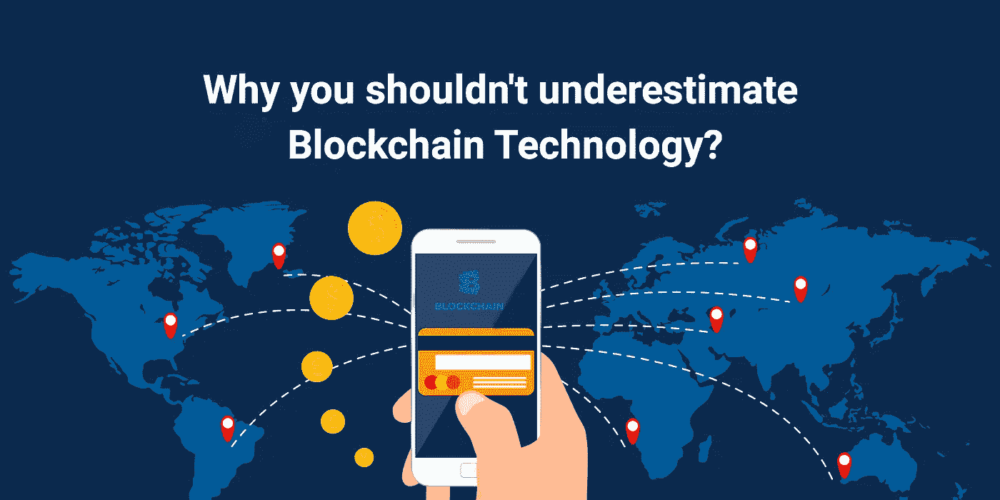

# 为什么你不应该低估区块链技术？

> 原文：<https://medium.datadriveninvestor.com/why-you-shouldnt-underestimate-blockchain-technology-4d9d57d17420?source=collection_archive---------21----------------------->

[Blockchain Technology](https://www.2basetechnologies.com/services/blockchain-development-company)

加密货币在 2017 年无法停止，是[区块链](http://bit.ly/Blockchain-dev-2Base)技术让它成为可能。

那么，什么是区块链技术呢？简而言之，区块链是一个分布式、数字化和去中心化的[账本](http://bit.ly/2SZV3vr)，它是大多数虚拟货币的基础，负责记录所有交易，而无需使用银行等金融中介。因此，换句话说，它只不过是一种转移资金或简单地登录信息的手段。

**突然需要区块链技术**

*区块链是根据开发者的愿景创建的，他们认为当前的银行系统存在大量缺陷*。

坦率地说，他们认为银行是窃取不必要交易费的第三方。此外，他们对支付结算和验证需要大约五个工作日的想法嗤之以鼻，特别是对于跨境交易。使用区块链技术，整个实时交易是一个很大的可能性，而银行是从等式中删除，这是为了减少交易费用。

作为一个处理各种趋势科技项目的经验丰富的企业家，我觉得区块链可以简单地降低任何低效率的机会。此外，解锁价值存在于需要中介来验证、记录和协调交易的现有行业领域。这并没有给原始交易增加任何附加值。

**区块链技术可以应用的领域**

**●资金转移和支付处理**

你知道区块链最合理的用法是加速资金从一方转移到另一方吗？如前所述，银行并未参与或被排除在等式之外，交易的验证每周 7 天、每天 24 小时持续进行，使用区块链处理的大多数交易将在几秒钟内完成。

**●零售和忠诚度奖励计划**

毫无疑问，区块链可以轻而易举地革新零售体验。成为忠诚度奖励的首选，这是可能的。在这里，通过开发基于代币的系统，消费者得到奖励，代币存储在区块链境内。

现在，这只会刺激消费者回到特定的商店购物。此外，它还可以消除与卡相关和纸张相关的奖励计划相关的各种欺诈和浪费。

**●检查供应链**

在监控供应链时，区块链非常方便。在这里，人们可以消除与纸张相关的痕迹，这意味着企业可以立即查明供应链中存在的低效率，还可以实时定位物品。

此外，区块链将允许企业和消费者从质量控制的角度观察产品从原产地流向零售商时的表现。

**●房地产&土地**

你知道区块链的主要目标之一是把纸从等式中去掉吗？众所周知，书面记录是造成混乱的主要原因。如果你正在出售或购买土地、汽车或房屋，你必须转让或获得所有权。

有了区块链，你可以轻松地在网络上存储图书，而不是在纸上处理。这将允许透明的转让，以及显示法律所有权的水晶般清晰。

**●医疗记录**

好消息是，多年来，医疗行业在某种程度上已经远离了用于记录的纸张。但是有了区块链，就有了更多的方便和安全。

除了存储患者的记录之外，那些拥有访问数字记录的钥匙的患者将很容易被获得数据访问权的人所控制。此外，这将是加强[健康保险流通与责任法案(HIPAA)](https://www.hhs.gov/hipaa/for-professionals/privacy/laws-regulations/index.html) 的手段，该法案旨在保护患者的隐私。

**掌握区块链**

正如本文所述，区块链技术为许多应用提供了大量的机会。此外，由于技术不断进步，它的适用性甚至会继续变得更广泛。