# 为什么你讨厌的朋友不停地抱怨比特币

> 原文：<https://medium.datadriveninvestor.com/why-your-annoying-friend-wont-stop-ranting-about-bitcoin-9808a132480?source=collection_archive---------2----------------------->

Calm down and get a hold of yourself!

这篇文章献给不喜欢比特币和/或还没有比特币的人。

比特币已死。泡沫破灭了，我们终于可以从这种疯狂中走出来，完成一些真正的工作。采用比特币的呼声越来越令人绝望、疲惫，坦率地说，还令人悲伤。看，这东西从 2 万美元跌到了 3200 美元。我知道没有人用它购物。比特币制造者不懂经济学。BTC 不是钱，它是所有骗局之母，每秒只能处理 7 笔交易。这听起来耳熟吗？

所有这些争论**都不重要**，这篇文章将解释为什么。

我想这篇文章会让一些人不高兴(尤其是第二部分——不要错过)，尤其是那些花时间/金钱/精力在替代硬币、区块链或 DLT 上的人，但我宁愿错了，让人们生气，也不愿对了，没有提醒我所关心的人市场告诉我们的新真相。对货币的错误投资可能最终导致可怕的后果，没有人愿意为此负责。

首先，我们需要列出一些我*认为*每个人都会同意的假设。如果我的假设不正确，请在评论中告诉我。

1.  金钱是必要的，但是[它是零和](https://en.wikipedia.org/wiki/Zero-sum_game)和[非生产性资产](http://financialuproar.com/2014/08/21/difference-productive-non-productive-assets/)，这意味着当一种货币的价值上升时，另一种货币的价值(购买力)在公开市场上竞争时下降。它是非生产性的，因为拥有和持有多种货币或更多某种货币不会有效地促进经济增长。本质上，你想持有/使用最好的货币，而不必处理世界上所有其他的垃圾货币。
2.  不说别的，比特币为人们印刷专有货币开辟了一个新市场，并允许所有货币在个体层面上进行国际竞争(散户投资者现在可以交易货币)。我们通过印刷成千上万的加密货币和创建允许它们竞争的交易所看到了这一点。在比特币出现之前，这对于零售来说并不存在。
3.  由于货币是非生产性的，货币的价值最终取决于[货币膨胀的难易程度](https://www.bloomberg.com/opinion/articles/2019-01-10/u-s-economy-modern-monetary-theory-bets-deficits-don-t-matter)以及人们对商品和服务的接受程度(信任，或相信货币会保值并在未来可以兑换)。有时，枪支或政府命令鼓励人们接受货币，但最终货币依赖于通货膨胀率和信任网络。如果人们对货币失去信心，货币很快就会贬值。只要通货膨胀率不太高，投入的资金越多，以资本衡量，金钱就越值钱，**。**

我们能就这些假设达成一致吗？很好。以下是我几乎每天都会遇到的反对比特币的论点，它们最终是让人们尝试 BTC 时需要克服的最后/最困难的障碍。

# 论据一:我不了解比特币，不信任它，不喜欢它，也不关心它，我拒绝使用它。比特币制造者很烦人。闭嘴走开菲尔。

我能理解这一点。很多时候我都觉得自己很烦人，我不喜欢我的理解迫使我对这件事大发雷霆。世界上 99.9%的人还不明白他们**需要**比特币，所以他们真的很难在乎。我咆哮，因为我关心你和我的社区，这是你需要知道的信息，以保护自己的财务。

最起码，我们早些时候同意比特币为个人印刷自己的货币开辟了一个新的市场，并观察他们的货币如何在国际上竞争。现在有一个完全自由的货币市场。这种情况上一次出现是在黄金通过自由市场成为主导货币的时候。当黄金货币化时，你不想被抓到持有[珠子](https://en.wikipedia.org/wiki/Trade_beads)、 [rai 石头](https://en.wikipedia.org/wiki/Rai_stones)、铜或[银](https://en.wikipedia.org/wiki/History_of_the_rupee)，因为持有那些较软的货币(更容易通货膨胀)意味着你通常会被那些持有较硬货币(更难通货膨胀)的人奴役/征服。这不是理论。它发生了。

现在有了一个自由开放的货币市场，你必须密切关注每种货币的属性以保护你的财富，因为如果一种货币随着时间的推移变得更大，这意味着所有其他货币的购买力都会下降。如果世界上有足够多的人转向更强势的货币，你不会想被抓到持有纸币。通过什么都不做和忽视比特币，**你**正在让世界各地的个人通过向一种不同的、更硬的货币注入信心和资本来削弱**你的购买力。**

> [DDI 编辑推荐—区块链和比特币基础](http://go.datadriveninvestor.com/bcfundamental/matf)

比特币是全球金融的一个不断扩大的黑洞。[它没有通货膨胀](https://medium.com/datadriveninvestor/inflating-bitcoin-d8634c3e5c0d)，[它拒绝中央集权](https://keepingstock.net/bitcoin-refuses-to-centralize-1c2a50182d28)，而且一天天越来越难杀。尽管最近价格下跌，世界各地仍有少数但持续增长的个人(不是政府，不是银行，不是企业)正在消除对传统货币的信心，增加对比特币的信心。这些人正在做出影响你的决定，你无法阻止他们。

# 论据 2:菲尔，你不懂经济学，你刚才说的是观点，你对钱是什么的理解是错误的。

说得好。你不应该相信我告诉你的任何事情，因为我很想告诉你这些事情。也就是说，同样的动机适用于你读到的所有关于经济和金钱的东西。所有的经济学家都被他们“教育”你的系统所强烈激励。**我们来看看一些关于比特币的客观指标。**

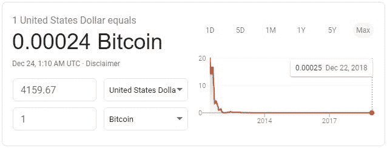

USD/BTC linear chart… should we even bother with the defibrillator at this point…?

2010 年，1 美元可以买 50 多个比特币。现在，1 美元可以买到 0.00025 BTC。过去十年美元的强劲表现。这里，让我们调整一下，用对数来看这个:

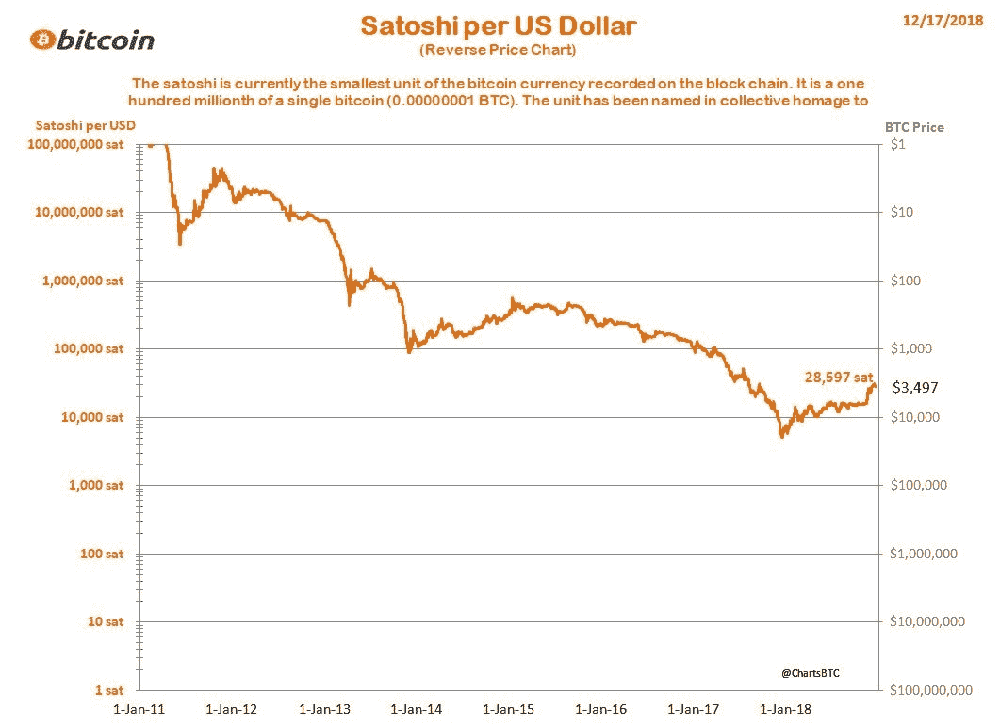

Logarithmic view of the USD getting the absolute shit kicked out of it by BTC over the last 10 years

哇，看看自 2018 年 1 月以来，以 BTC 为单位，美元升值了多少。过去 10 年只是昙花一现，对吗？我用对数图来显示美元*获得了多少购买价值*(收回？)去年在 BTC。对你来说，美元看起来像是一个强劲的买入吗？

说真的，持有比特币而非美元超过 2 年的人正在成为一个新的全球经济精英阶层。

但是我们怎么知道比特币是否会继续增值呢？嗯，世界上几乎没有人拥有任何数量的比特币(估计约占人口的 0.5%)，所以更多的用户是一个非常强有力的指标，表明价格将长期持续上涨。

以下所有图表均来自**一个单独的** **点对点交易所，**因此它们不涵盖任何其他在线发生的 BTC 交易所交易。来源如下:【https://coin.dance/volume/localbitcoins】T4

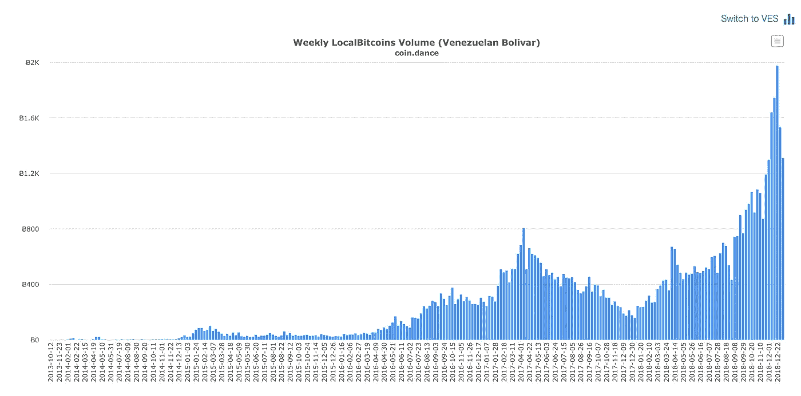

唉，又是委内瑞拉的例子*。比特币制造者总是用 VZ 作为例子，因为在委内瑞拉的恶性通货膨胀中幸存的 3200 万人正在寻找逃离玻利瓦尔的任何方法。比特币只是碰巧比目前的替代品更好，但使用 BTC 的人可能会在革命后信任新的政府货币……对吗？他们每周只在 BTC 上花费 800 万美元，而他们周围的社会却在崩溃。这看起来像任何其他金融危机时尚。掉进桶里。*

*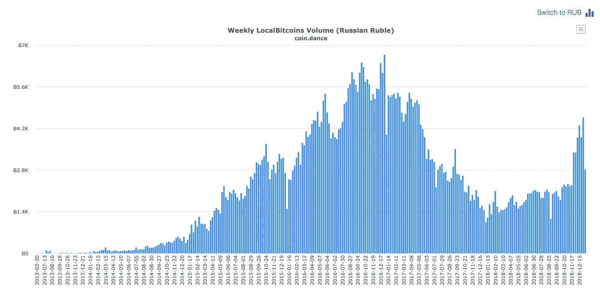*

*看啊！自 2017 年 1 月以来，俄罗斯尚未在该交易所达到 ATH BTC 的周交易量。2017 年 1 月，BTC 的价值为 900 美元/BTC。他们当时每周在 BTC 的花费不到 630 万美元，现在每周在 BTC 的花费大约为 1200 万至 1800 万美元。完全是杯水车薪。*

*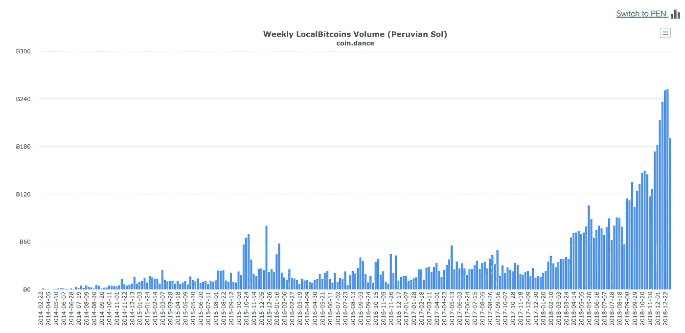*

*又一个不好的例子。这还不到每周 300 BTC 交易量。他们现在在秘鲁的 BTC 上每周只花 100 万美元。简直是杯水车薪！*

*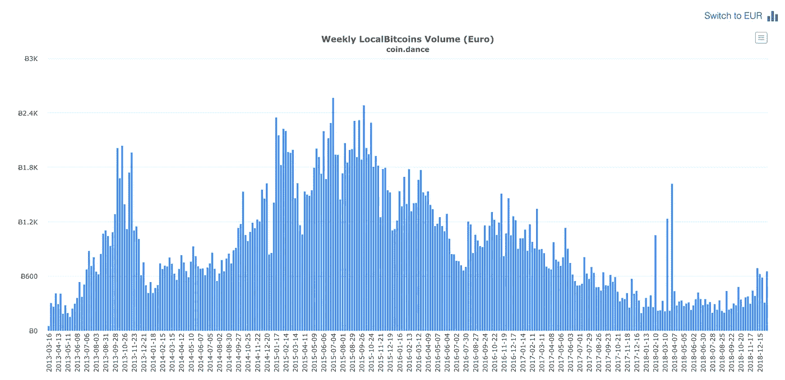*

*这张图表清楚地表明，欧洲人并不需要比特币。上一次 ATH 卷是在 2015 年，价格是 240 美元/BTC。那一周，他们在 BTC 上花了 60 万美元，而现在在这项交易中，他们每周只在 BTC 上花 280 万美元。扔进他妈的桶里。*

*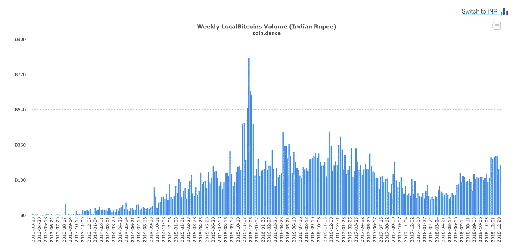*

*印度每周 100 万美元。滴。*

*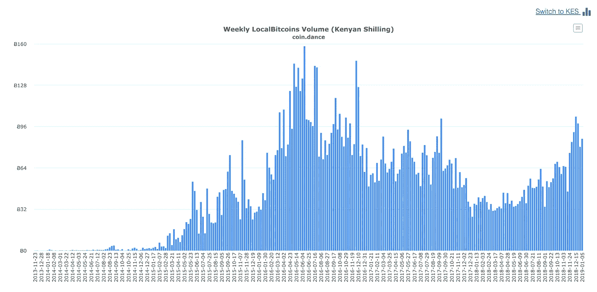*

*在…肯尼亚每周 30 万美元？滴。*

*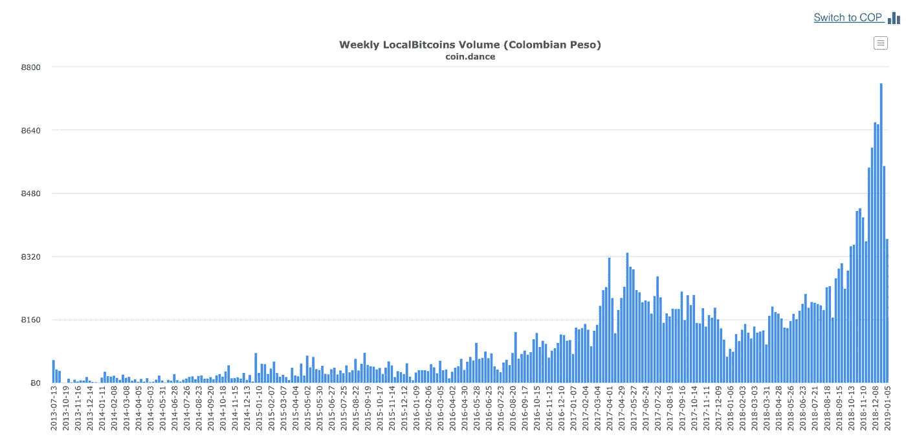*

*哥伦比亚每周 200 万美元。滴。*

*不管怎样，这都没关系，因为你已经听说比特币是一种旧技术，几乎肯定会被更快、功能更多的东西取代(就像任何技术一样)。至少你很确定这是个科技产品。你在 SF [的软件工程朋友为一个建立在以太坊](https://www.youtube.com/watch?v=kUheuFDHSvI)上的加密定义平台工作，并告诉你以太坊是未来。Web 3.0 宝宝。*

*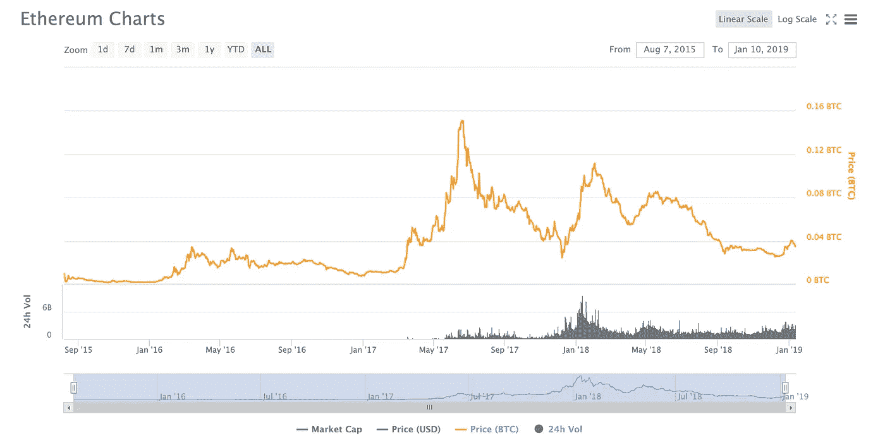*

*Billions(!) of dollars invested in this thing and yet ETH has been losing value to BTC for almost 2 years (because it’s a softer and more centralized currency)*

*好吧，这只是以太坊 1.0 的图表(自 2017 年 6 月“[翻转](https://www.flippening.watch/)”以来，它在 BTC 还没有过 ATH)。一旦他们转移到 [ETH 2.0](https://www.youtube.com/watch?v=kUheuFDHSvI) 、[股权证明](https://currencies.ru/vitalik-buterin-bitcoin-cash-bch-supporter-or-crypto-18081719191233.htm)、[切分](https://www.youtube.com/watch?v=D6_d5NODsdQ)、[君士坦丁堡](https://www.youtube.com/watch?v=D6_d5NODsdQ)、[宁静](https://www.youtube.com/watch?v=xK3yuxrmCac)、[闪电网络](https://www.investinblockchain.com/bitcoin-lightning-network-accelerated-growth/)，我指的是[等离子](https://www.youtube.com/watch?v=xK3yuxrmCac)，他们将*最终*用他们的[位于区块链的世界计算机](https://www.youtube.com/watch?v=oHg5SJYRHA0)下放财务。在 BTC 衡量价格并不重要，因为以太坊拥有最多的开发人员，最多的风投资金，最多的 [cryptokitties](https://www.ccn.com/cryptokitties-isnt-as-popular-as-you-think-it-is/) ，[它是分散的](https://www.coindesk.com/vladimir-putin-vitalik-buterin-discuss-ethereum-opportunities-recent-forum)，Vitalik 明确表示 ETH 在他创造它的时候并不打算成为一种货币，这就是为什么他在为自己和他的朋友印刷后放弃 ETH 以换取另一种货币，目前[将它作为一种货币投资于项目](https://cointelegraph.com/news/ethereum-foundation-announces-5-million-grant-to-parity-technologies)。这是一个不可信的平台，所以不要担心运行一个完全有效的历史节点。相信我们。*

*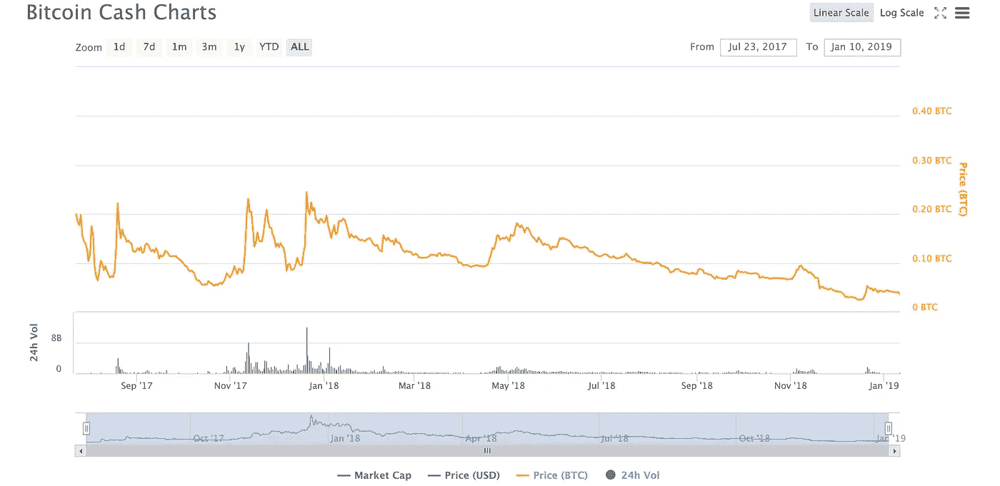*

*The market firmly rejecting inflation*

*BCH 的营销人员称之为白皮书所设想的 Satoshi 的真实愿景，而市场显然认为这是胡说八道。它出生(排泄？)出于 2017 年 8 月 BTC 的共识，自 2018 年 1 月加入[比特币基地](https://cointelegraph.com/news/coinbase-faces-fresh-bitcoin-cash-insider-trading-lawsuit-following-initial-rejection)后立即被市场抹杀，此后再无 ATH。他们可以在一个区块中进行更多的交易，因此显然他们认为这比比特币更有价值。[比特大陆，一家在 BCH 豪赌的中国大型矿业公司，损失了 12 亿多美元，因为是*市场*不理解白皮书](https://www.scmp.com/tech/policy/article/2181392/bitmains-two-founders-step-aside-chinese-cryptocurrency-giant-taps) …*

*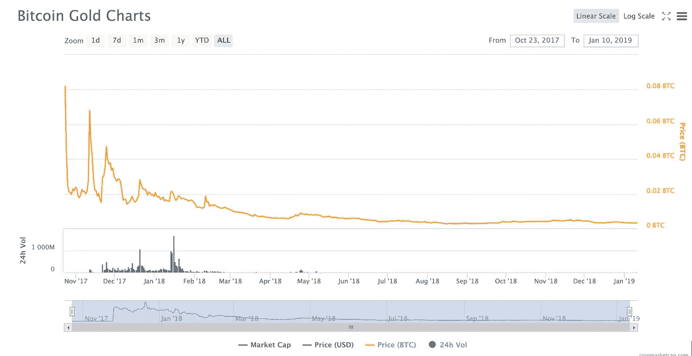*

*复制比特币和印刷新货币现在变得微不足道，因此出现了通货膨胀*

***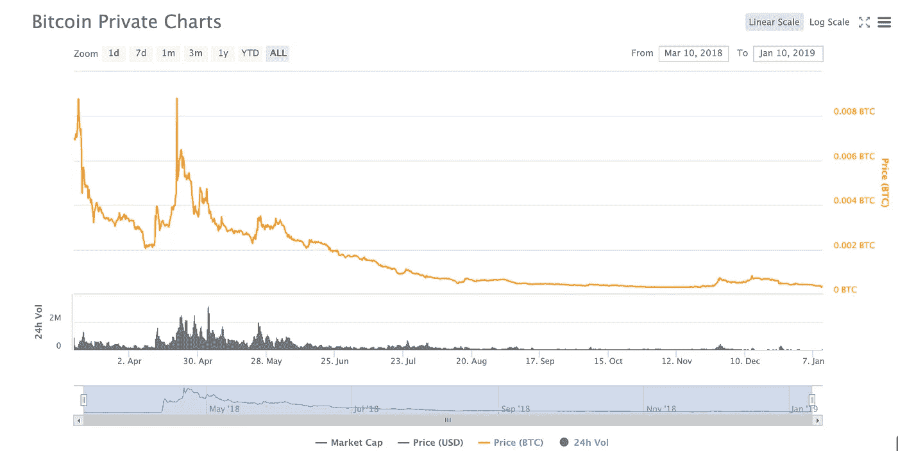*

*嗯，这些例子*肯定是*精挑细选出来的。BTCP 和 BTG 是不安全的，因为有 51%的攻击发生。每个人都知道区块链应该是不变的、分散的、不可信的和安全的。等等，这些是怎么被黑的？不用担心，区块链的医疗保健数据将会彻底改变医疗保健。所有这些都不重要，因为*

*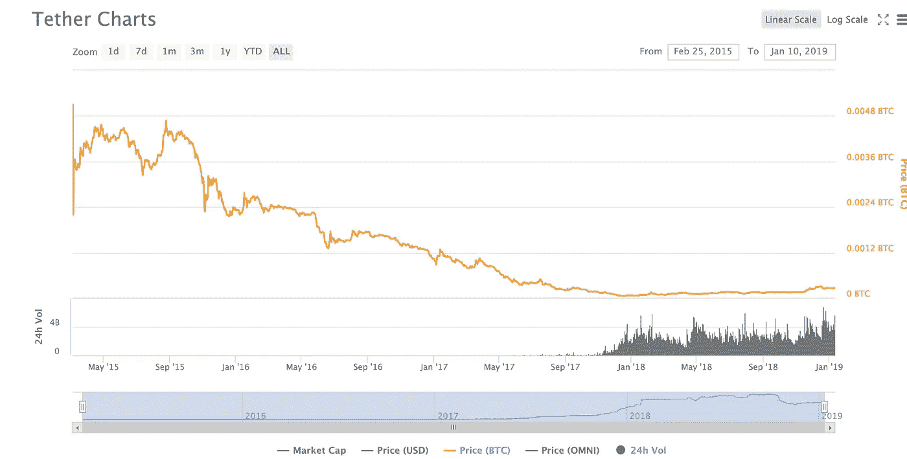*

*如上图中稳定向下倾斜的价格所示，[稳定的收入是未来的](https://cryptoslate.com/stablecoins-money-of-the-future/)。没有人想要比特币，因为从长远来看，它的价格会持续上涨。将死比特币。你没听说吗？M [开采比特币正在破坏环境](https://bitcoinist.com/bitcoin-mining-renewable-coinshares/)。*

# *行动呼吁*

*天哪，别错怪比特币，让它溶解你的财富。问题不在于你是否喜欢、关心或相信 BTC，你的问题在于世界上其他人相信什么，因为你现在正与他们争夺 2100 万 BTC 的固定供应量，不管你愿不愿意。请记住，金钱是零和游戏，比特币为所有货币打开了市场，让它们在国际上以**个体**的水平竞争。如果有足够多的人相信 BTC 是货币并使用它；这是钱，即使它不遵循我们的[诺奖得主](https://www.ccn.com/bitcoin-taking-money-back-300-years-nobel-economist-paul-krugman/) [经济学家](https://www.cnbc.com/2018/10/11/roubini-bitcoin-is-mother-of-all-scams.html)告诉你的旧规则。市场正在给旧规则上新的一课。市场就是现实，你的(和*尤其是*我的！)意见就是意见。*

*通过将少量(1-5%取决于风险承受能力)的任何其他货币投入 BTC **来保护你的财富不受比特币的影响，然后忘掉它 5 年。**搞定。如果比特币消亡，你可以尽情嘲笑那些认为货币可以在没有通胀或慈善银行业控制全球经济的情况下运转的疯子。如果它没有死，你可能就避免了贫困。*

*我不是财务顾问，这篇文章是糟糕的财务建议。*