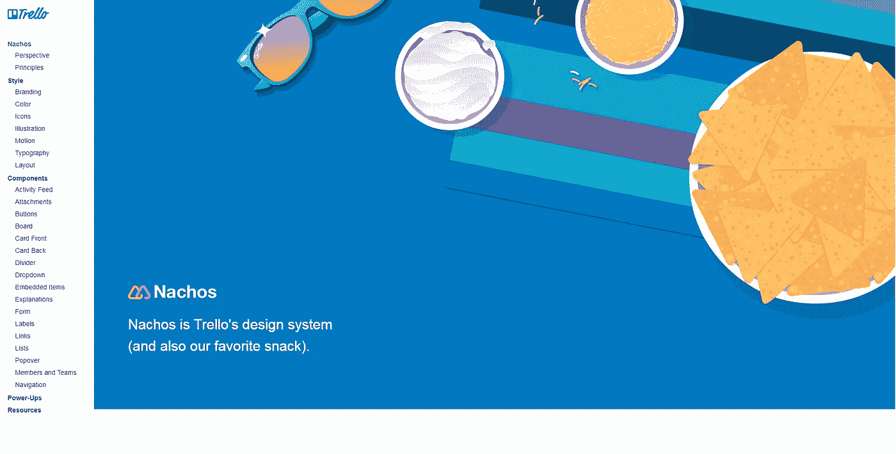
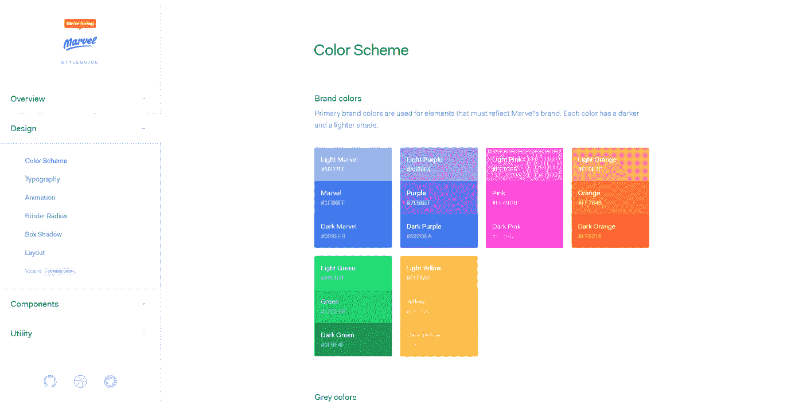
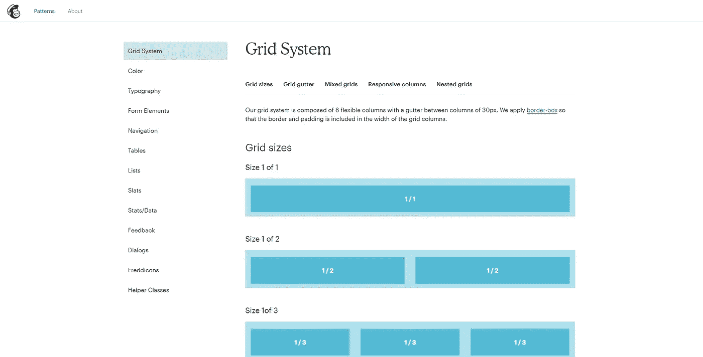
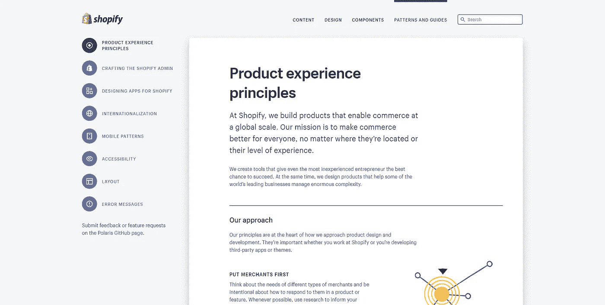
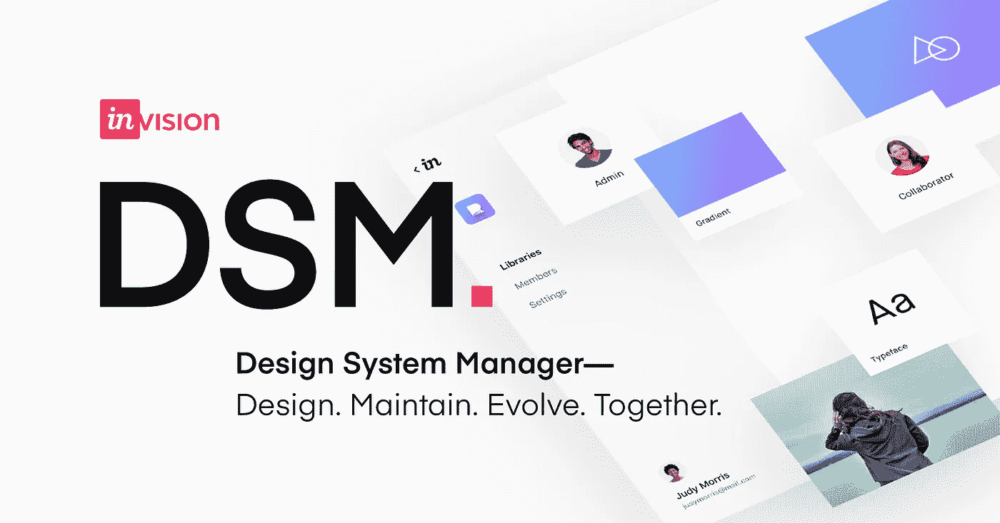
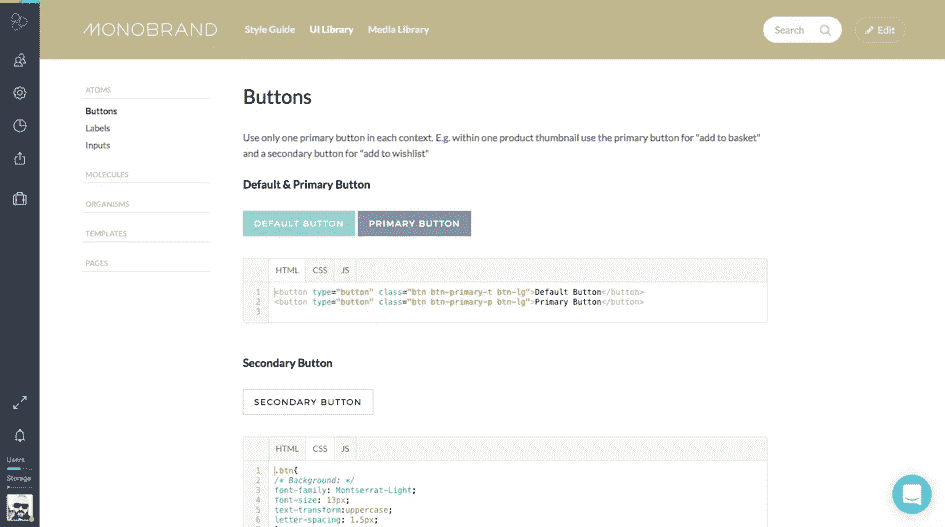
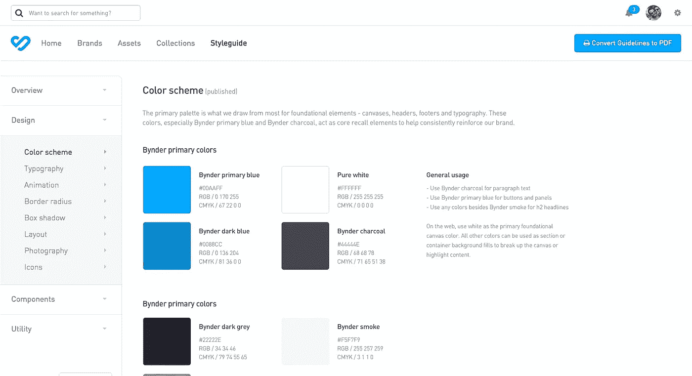

# 为什么您的企业需要设计系统

> 原文：<https://medium.datadriveninvestor.com/why-your-business-needs-a-design-system-be3586475c18?source=collection_archive---------15----------------------->

Image credit www.unsplash.com

虽然设计系统的概念已经存在了相当长的一段时间，但只是在最近几年，领先的技术公司才开始分享他们的视觉设计规则、实践和惯例。

也许最著名的例子是谷歌的[材料设计](https://material.io/design/)框架，该框架于 2014 年首次亮相，并继续为该公司的各种网络和移动产品——从 Gmail 和谷歌文档到 Android——形成视觉设计基础。

其他例子包括苹果的[人机界面](https://developer.apple.com/design/human-interface-guidelines/)指南、火狐的[光子设计系统](https://design.firefox.com/photon/welcome.html)和美国政府的[美国网页设计系统。](https://designsystem.digital.gov)

世界各地的大公司已经发现了他们视觉品牌需求的集中真实来源的好处。然而，你不一定需要在纽约证券交易所上市才能利用这些概念。

几乎任何企业(大或小，在线或离线)都可以并且应该利用设计系统来确保其视觉设计和团队的一致性。

# **设计系统对比风格指南对比模式库**

首先，让我们弄清楚一些语义问题。

你经常会听到“风格指南”、“模式库”和“设计系统”这些术语可以互换使用。

虽然这在技术上是不正确的，但重要的是要认识到，随着这些概念的增长和被更广泛地采用，它们之间的分界线变得模糊了。

各个品牌和企业对这些术语的理解各不相同，在构建他们自己的视觉设计资源时，可能会借用其中一个(或另一个)的一些方面。

尽管如此，理解这些术语之间的区别仍然是有益的。

一个**设计系统**比一个简单的风格指南或模式库要健壮得多。

它包括一整套公司应该遵守的设计标准。这包括(除其他之外)文档、基本原则、模式和实现这些标准所需的组件。

正如 Colm Tuite 在最近的[文章](https://medium.freecodecamp.org/how-to-construct-a-design-system-864adbf2a117)中雄辩地指出的，它是“一个控制产品构成的不断发展的规则集。”

Image credit design.trello.com

特雷罗的设计系统被称为[玉米片。](https://design.trello.com)正如你从所附的截图中看到的，Nachos 绝对包括了与 Trello 视觉品牌相关的一切——从像素网格布局和调色板到按钮设置和 popover 风格。

此外，该系统还记录了与该视觉品牌相关的其他几个重要方面，如视角、指导原则、风格指南和组件库。

另一方面，品牌**风格指南**是一个相对简短的文件，它规定了一个企业或组织应该如何在视觉上表现自己。

它旨在作为一种参考工具，通过记录这些品牌的外观、声音和感觉来帮助组织保持其品牌的一致性。

当一个组织使用多个人员时，这些文档尤其有用，例如设计师、开发人员、文案、营销人员，他们都需要参与到视觉品牌中来。

Image credit marvelapp.com

漫威优秀的，总是最新的，风格指南包含其视觉设计的所有方面的指导方针。

这些包括它的配色方案和排版设置，以及诸如框阴影和边框半径等常见属性的标准。

同样值得注意的是，许多较小的在线企业已经开始利用单页风格指南向潜在员工和/或承包商简要传达他们的视觉品牌指南。

最后，一个**模式(或组件)库**就像它的名字所暗示的那样，仅仅是一个组件的集合，也就是用来代表一个组织的设计的符号和资产。

这些组件可以包括按钮、卡片、表格和表单等。

随着专业 UI 设计软件如 [Sketch](https://www.sketchapp.com) 和基于组件的 JavaScript 框架如 [React 的兴起，组件库近年来变得特别流行。](https://reactjs.org)

Image credit ux.mailchimp.com

如果你选择为你的企业创建一个组件库，你的组件库可以像 Sketch 或 Figma 库一样简单，也可以像 Mailchimp 的[解决方案](https://ux.mailchimp.com/patterns/about)(如上图)一样健壮，该解决方案为其所有的可视组件提供了全面的指导，包括导航、列表和图标。

选择对您的业务需求最有意义的解决方案和术语。

尽管如此，我还是提倡一个全面的设计系统，因为我相信视觉品牌远远不止是样式和组件。

Image credit polaris.shopify.com

例如，Shopify 的 [Polaris](https://polaris.shopify.com/) 设计系统编纂了公司的使命、方法、价值观和原则，这些都是 Shopify 所做的一切的基础——一直到其视觉设计——并以一种整个 Shopify 团队都可以轻松学习和理解的方式呈现出来。

如果只是含蓄地，这些原则存在于每一个按钮、组件和代码片段中，企业可能会在品牌中使用它们。

在我看来，这些原则最好通过设计系统来捕捉(和传达)。

> 但是不管你决定给你的框架取什么名字，你都需要为你的视觉品牌建立某种集中的智慧库。

即使你暂时只是一个人(或女人)操作，你仍然可以从有一个通常引用的品牌组件的本地化文档中受益，例如十六进制代码和组件样式，以及在业务中对你最重要的原则。

这些文档也可以作为新员工入职的有用资源，让他们了解你的品牌和业务的重要视觉(和非视觉)方面。

无论你决定做什么，重要的是不要让自己纠结于细节。

根据凯蒂·塞勒-米勒(Katie Sylor-Miller)为 DesignBetter.co写的文章，“你的技术方法并不重要，重要的是创造一个灵活、可维护、稳定、可扩展、长期成功的有生命的呼吸系统。”

# **如何创建设计系统**

希望你已经相信视觉设计系统对你的企业来说是非常有用的资源——特别是如果你已经开始和一个团队一起工作。

现在，问题仍然是:如何开始？

您的解决方案可能不需要像我上面举例说明的那样健壮。

如果你只是运行一个小的在线操作，那么你可能只需要几页概述你的企业的价值观，观点，色调，调色板，排版设置，图标，和一些视觉组件。

一个简单的方法是创建一个简单的草图文件或 PDF，但是与多个团队成员共享可能会变得很麻烦。一个更灵活的解决方案是一个基于浏览器的专用软件，如下所示:

Image credit invisionapp.com

## **vision DSM**

根据该公司的[网站，](https://support.invisionapp.com/hc/en-us/articles/115005685166-Introduction-to-Design-System-Manager) Invision Design System Manager(或 DSM)是“一个平台，通过帮助团队创建、维护和发展一个强大的设计系统，提供一种简单、统一的方式来进行大规模设计。”

它包括一个草图插件，浏览器视图，以及一组 API，旨在快速轻松地为您的品牌的所有视觉元素创建一个真实的来源。

最棒的是，它完全免费开始！付费计划的起价仅为每月 15 美元。

Image credit frontify.com

## **加前缀**

Frontify [称](https://frontify.com)自己是“一个易于操作的、基于云的品牌管理软件”，为用户提供创建风格指南、品牌门户、模式库甚至媒体库的能力。

虽然 Frontify 提供 14 天的免费试用，但如果你想充分利用该平台提供的一切，你就必须付费。

Frontify 的 Plus 计划“为自由职业者和初创公司”每月收费 29 美元，而 Pro 计划“为小企业”每月收费 49 美元。

Image credit bynder.com

## **比恩德**

Bynder 是一个“数字资产管理平台”,被许多顶尖公司使用，如 Ocean Spray、Canon 和 Spotify。

像 Frontify 一样，它提供各种解决方案来解决各种各样的业务，从简单的风格指南到品牌门户网站、媒体库和全套设计系统。

Bynder 有一个相当奇怪的定价系统，因为它不像大多数其他服务那样提供分层计划。相反，该公司要求您提交贵公司的详细信息，以便生成定制报价。

据推测，这将是最适合大型组织的。但如果这听起来像你，那么你很难找到比 Bynder 更全面、更容易实现的东西。

你觉得怎么样？

你有没有在你的业务中使用这些工具中的一个来实现类似设计系统的东西——或者其他完全不同的东西？如果是，它对您的营销、设计和/或入职流程有何影响？

即使你以前从未尝试过这样的事情，我也鼓励你尝试一下。从一个简单的谷歌文档、草图文件或 PDF 文档开始，看看它是否能提高你的工作效率。

我很高兴在评论区收到你的来信！