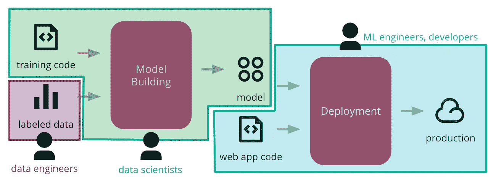

# 为什么你的数据科学工具没有让机器学习变得更容易(还没有)。

> 原文：<https://medium.datadriveninvestor.com/why-your-data-science-tool-hasnt-made-machine-learning-easier-yet-4bdcedeb1c3f?source=collection_archive---------9----------------------->

这里分享的观点是我自己的，并不代表我现在或过去的雇主。

当我开始在 VC 工作时，我的第一天投资论文是关于**为数据科学家**找到更好的工具。在前往波士顿加入 OpenView 之前，我在亚马逊的一个机器学习团队中从事金融& BI 方面的工作。这是我和一个由 50 多名工程师、数据科学家、研究人员和经济学家组成的团队，他们一起在一个核心模型上以疯狂、创新、协作的热情工作(这个核心模型经常受到批评，也更经常被误解的是[特色的商业算法](https://medium.com/informed/amazon-featured-merchant-status-e8276f5e1479)，对于那些想知道的人来说)。

但即使拥有庞大的团队和亚马逊的所有资源，我发现管理机器学习项目的端到端生命周期仍然非常困难。有许多跨职能的利益相关者，而不是像软件开发那样只管理代码库，每个人都必须同时处理数据、模型和应用程序代码的变化。管理这样一个有着所有这些功能孤岛的动态项目花费了大量的时间，并以大量的沟通失误而告终。因此，项目和实验进展缓慢，甚至无法完全投入生产。

 [## 成为数据科学家所需的 8 项技能|数据驱动型投资者

### 数字吓不倒你？没有什么比一张漂亮的 excel 表更令人满意的了？你会说几种语言…

www.datadriveninvestor.com](https://www.datadriveninvestor.com/2019/02/07/8-skills-you-need-to-become-a-data-scientist/) 

当然，有很多初创公司和开源项目试图让机器学习项目变得更容易。快进到我在 VC 的第一年，我可能已经看到了一百个“数据科学家的工具”推介。但是，我越是与新成立的数据科学团队或 ML-powered 初创公司的首席执行官交谈，就越能清楚地看到，将机器学习应用带入生活仍然非常非常困难。

那么，脱节在哪里呢？为什么所有这些数据科学工具都没有让机器学习变得更容易？

当我在这个领域遇到的大多数创始人开始构建他们的数据科学工具时，他们会考虑由一些世界上最好的开源软件开发工具支持的产品导向型增长战略:为个人最终用户设计，并做出可以自下而上采用的东西。创始人脑海中浮现出一个孤独的数据科学家在研究一个兼职项目的形象，并问自己:“我如何让这个人的生活变得更轻松？”毕竟，这就是你如何在终端用户时代打造病毒式产品的[，对吗？建立一个人想要在个人生活中使用的东西，最终他们会付费在工作中使用它(想想像 Slack、Trello、Zoom 或 Calendly 这样的工具的相同采用模式)。](https://openviewpartners.com/blog/what-is-product-led-growth/)

**但问题来了——数据科学本质上不同于软件开发。**一个 ML 应用不能像软件开发那样由一个利益相关者来管理。数据科学家不能自己造东西。他们需要很多帮助才能实现目标。

ThoughtWorks 最近发表了一篇关于机器学习的[连续交付](https://martinfowler.com/articles/cd4ml.html)的文章，这篇文章很好地解释了机器学习中的不同利益相关者，以及它与仅仅编写代码有何不同。简而言之，软件开发有一个变化的主轴(代码)，而机器学习有三个——数据、模型和应用程序代码。在软件开发中，开发人员可以很大程度上依靠自己的力量来实现某些东西。在数据科学中，**这是一项团队工作。许多构建数据科学工具的团队都忽略了这种“群体”心态。**

事情是这样的。虽然通过为数据科学家构建工具，端到端的机器学习生命周期可以变得稍微容易一点，但他们不是最终用户创始人应该考虑的唯一对象。在数据科学领域，为最终用户构建意味着为不止一个人构建，在改进数据科学家、数据工程师和开发人员的合作方式方面，还有很多工作要做。

当然，也有一些企业采用自顶向下的方法。他们正在强制进行重大的流程改革和资源密集型的实施周期，这对更小、更有战斗力的团队来说毫无意义。正如我们在软件开发或 Slack 和 Zoom 等日常工具中看到的，一些最好的产品被自下而上地采用。我认为数据科学也不例外。

因此，对于所有正在开发数据科学家喜爱的工具的企业家，我要求你们从终端用户的角度进行不同的思考。不要想象一个数据科学家独自研究一个模型，想想整个数据团队。想想他们是如何一起工作的，他们是如何惹恼对方的，他们多么希望能够交流。通过为整个团队构建，你将打破孤岛，帮助 ML 团队更快地获得更好的结果，并在为各种形状和规模的团队释放机器学习的力量方面发挥作用。

*原载于 2019 年 10 月 30 日*[*【https://medium.com】*](https://medium.com/@OpenView/why-your-data-science-tool-hasnt-made-machine-learning-easier-yet-80e3864369c4)*。*