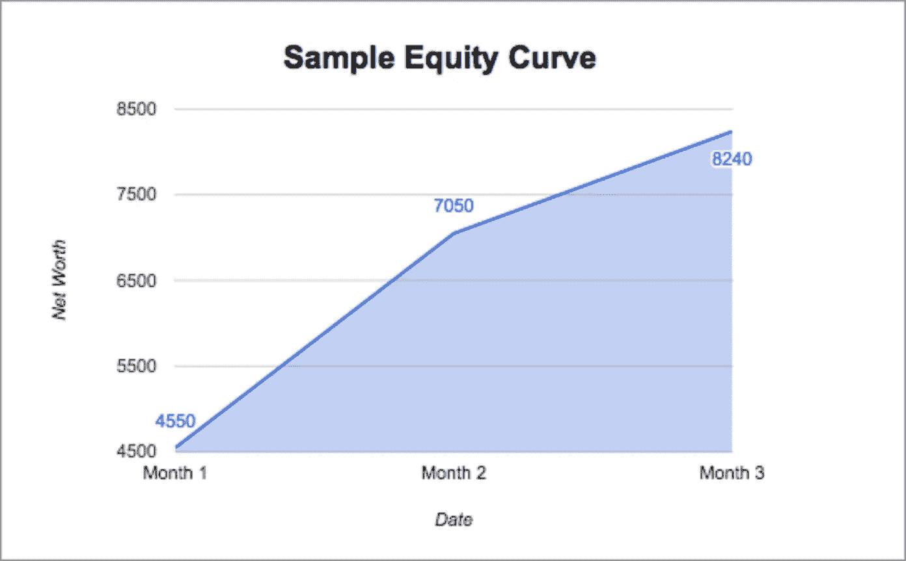

# 为什么投资加密货币时你的权益曲线是关键

> 原文：<https://medium.datadriveninvestor.com/why-your-equity-curve-is-key-when-invested-in-cryptocurrency-a693062c0948?source=collection_archive---------16----------------------->

在我们进入实质之前，我认为解释一下什么是权益曲线是很重要的。

那么什么是权益曲线呢？好吧，我的好朋友，股票曲线基本上就是一个交易账户在一定时期内价值变化的图形表示。

具有持续正斜率的股票曲线本质上告诉你，无论你作为投资者做什么都是有效的，你的投资组合是盈利的，而负斜率则表明你可能需要重新考虑当前的投资策略。

人们花很多时间分析他们个人的赢家和输家，寻找某种帮助他们“把握比赛”的洞察力。“也许如果我改变我的[相对强弱指标](https://www.investopedia.com/terms/r/rsi.asp)的设置，或者如果我早点止损，我会赚得更多”，虽然所有这些在观察一两项投资或交易时会有所帮助，但通过这种方式很难鸟瞰你的整体投资。你有没有诚实地维护同一个系统足够长的时间，甚至去分析小的调整会有什么帮助？

回顾个人投资是至关重要的，但更重要的是回顾你的股票曲线。疯狂的是，如果你绘制你的股票曲线，你会看到一些和你在价格图表中看到的一样的模式。当你回顾你的股票曲线时，你可以清楚地看到你是如何处理市场提供给你的信息的，以及这些信息对你交易的影响。如果你在开始每笔交易之前，先看一下股票曲线，然后开始回顾你的投资组合，那会更好。这会让你知道这是你的系统还是你自己在破坏自己。

现在你可能会对自己说，“我没有时间跟踪我所有的加密投资”，那么我有好消息告诉你， [Moonfolio 应用程序](https://moonfolio.com/)可以为你做所有这些！ [Moonfolio](https://moonfolio.com/) 可以与您的钱包和交易所同步，让您全面了解您的整个加密组合，并显示您的个人交易历史。自己来看看 [**这里！**](https://moonfolio.com/)

这里也发表[。](https://steemit.com/investing/@moonfolio/why-your-equity-curve-is-key-when-invested-in-cryptocurrency)