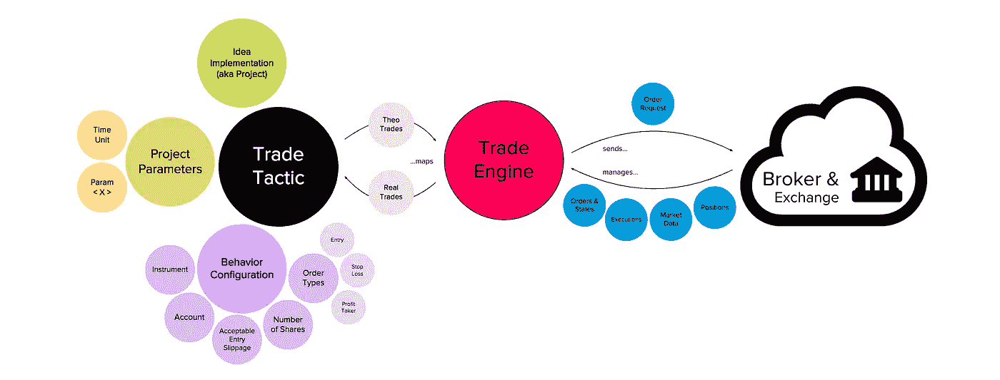
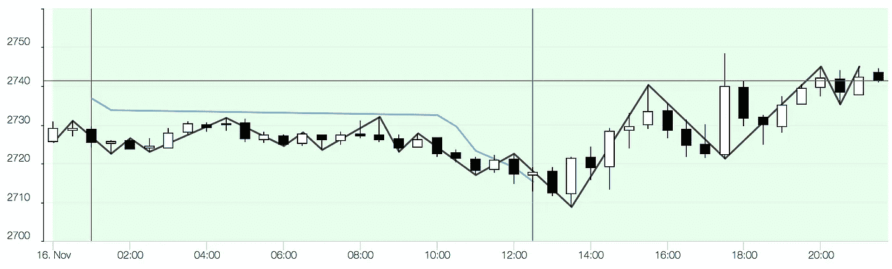
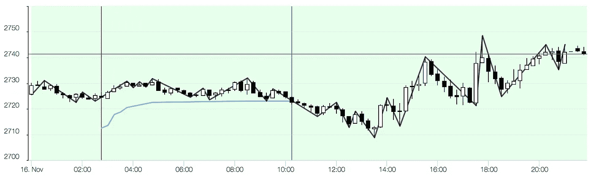
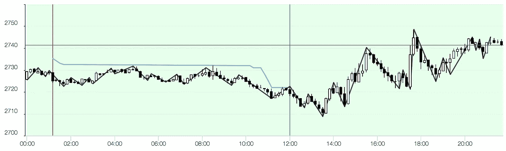
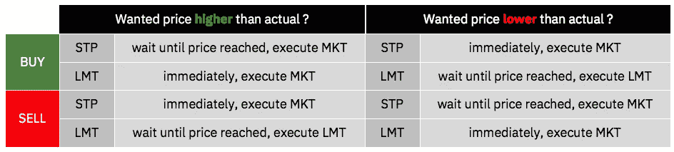
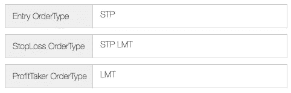

# 为什么你伟大的交易想法在一开始是次要的

> 原文：<https://medium.datadriveninvestor.com/why-your-great-trading-idea-is-secondary-at-first-7282d206fd7a?source=collection_archive---------1----------------------->

Photo by [Sharon Pittaway](https://unsplash.com/photos/N7FtpkC_P7o?utm_source=unsplash&utm_medium=referral&utm_content=creditCopyText) on [Unsplash](https://unsplash.com/search/photos/idea?utm_source=unsplash&utm_medium=referral&utm_content=creditCopyText)

## 一个让你对个人算法交易的优先次序一目了然的指南

这些年来，我有过无数次关于被动收入和个人道路的谈话，每个人都试图去实现这个伟大的目标。太令人兴奋了！

我听到了各种有趣的想法——讨论了许多众所周知的，有时甚至是新颖的**交易策略**,以有意义的**时间尺度**选择**工具**。我已经用全自动交易算法实现了其中的一些。

# 相关文章

我可以建立自己的交易系统！
[关于期货交易你需要知道的 6 件事](https://medium.com/@thomas.reinecke/6-things-you-need-to-know-about-future-trading-c6ed6dda8bb3)
[价值投资者最相关的 9 个指标](/the-8-most-relevant-indicators-for-value-investors-8d1517dd6c8)

当试图把想法写在代码中时，我最大的领悟是主要的问题不是想法:两个主要的挑战是监督交易系统的复杂性以使其正确执行，第二是当你把理论输入转化为实际交易时最大化一致性(T21)。

> 如果我们的交易现实是在颠簸的沙漠中远离道路，我们的想法一文不值，而理论上我们应该在高速公路上平稳行驶。

为了让我们开始，让我们回到人们对算法交易真正感到兴奋的这个重要时刻

# 听着，我有个好主意！

F 在我最近的一次谈话中，我把这个很棒的想法带走了……
***Twitter 想法***

> *这是超级容易的伙计！我将利用 Twitter API，通过情绪分析来运行输入流，这让我知道社区是如何思考的，并从那里提取我对单只股票甚至整个市场的进入信号，然后我将开始摇滚！*

*O kay，这是我自己几年前发明的另一个，为了更有趣一点……这个****爆发修正想法*****

> ***我会选择一个流动性很强的期货( [ES](https://www.cmegroup.com/trading/equity-index/us-index/e-mini-sandp500.html) 、 [NQ](https://www.cmegroup.com/trading/equity-index/us-index/e-mini-nasdaq-100.html) 、 [YM](https://www.cmegroup.com/trading/equity-index/us-index/e-mini-dow.html) 或者可能是 [RTY](https://www.cmegroup.com/trading/equity-index/us-index/e-mini-russell-2000.html) )，计算当天的局部高点和低点，以确定“趋势”，然后我会根据趋势定位，适度止损，严格止盈。冒 5 倍于我收入的风险可能没有问题，因为无论如何我都希望自己是对的！***

***O ne more，现在我们真的要发疯了，这是从一个贸易引擎执行测试开始的，并产生了惊人的见解…这个****模长思想*******

> ***期货是很棒的，作为一个方向“做多”似乎更有可能。根据当前价格的简单模 5，我做多 [ES](https://www.cmegroup.com/trading/equity-index/us-index/e-mini-sandp500.html) ，拿 2 点(100 美元)作为利润，然后离开。是的，这很容易一天发生 30 次，我也不担心冒超出我收入的风险。反正长发生了！***

***我们不要贸然下判断。这些想法中的每一个都是深入细节并开始寻找事情成功或失败的原因的绝佳机会。***

***为了让我们继续下去，我将马上进入正题…***

# ***端到端算法交易环境***

***所以我们有了一个有趣的想法，太好了！假设我们可以用编码实现来表达这个想法——顺便说一句，这很难，将在后面的章节中介绍。***

***好吧，这只是下一张图中的绿色泡泡，它不比一个更复杂的端到端算法交易系统中的这一个多一点或少一点，你需要这个系统(在某种程度上)来实现你的想法***

******

***A trading idea in context of an e2e AlgoTrading system***

***在非常高的水平上…***

*   ***你需要某种水桶，从现在开始我称之为**贸易策略*****
*   ***它用于将实现的想法(我将调用**项目**与其**参数**配对，以告诉它如何运行***
*   ***此外，它还存储了一个**行为配置**来告诉您的经纪人"*什么"*(**工具**)、*哪里"*(**账户**)和"*如何"*(**股数**、**可接受滑点**、预期**订单类型**)它将被执行***
*   **从流程的角度来看，贸易策略正在产生由**贸易引擎**服务翻译成**订单请求**的 **Theo 交易****
*   **这些会被发送给你的经纪人，他是你的证券交易所的桥梁**
*   **在返回的路上，交易所提供**市场数据**、**订单&状态**、**执行**和**头寸**，TradeEngine 必须管理这些数据并将其转换为**真实交易**，这些交易映射到您的 Theo 交易**
*   **从这个映射中，您的 TradeEngine 可以计算差异，这就是它的实际“*生产订单***
*   **理想情况下，这种流动会变成一个无止境的循环，最终产生积极有利的结果。**

**如果你还不满足，让我们更详细地看看最相关的方面…**

# **理解机制:**

****

**Photo by [Isis França](https://unsplash.com/photos/hsPFuudRg5I?utm_source=unsplash&utm_medium=referral&utm_content=creditCopyText) on [Unsplash](https://unsplash.com/search/photos/machine?utm_source=unsplash&utm_medium=referral&utm_content=creditCopyText)**

# **一…乐器**

**在选择交易工具时，给你一个具体的建议是不合适的。这个工具必须符合你的想法，并且在很大程度上符合你和你的信念。你对单只股票感兴趣还是对整个市场感兴趣？你对农产品赌博感兴趣还是对加密货币更感兴趣？你想要一个在许多期货中已知的杠杆效应，或者甚至用期权来冒险吗？这是一个纯粹的个人决定，每个人都必须为自己做出决定。**

**我目前只交易指数期货，因为它们结合了影响理论和实际交易一致性的 **5 个关键特征**:**

*   ****流动性非常高** —为了最大化一致性，你需要每天尽可能多的分笔成交点，这也推动了交易量。例如，在过去 10 年中， [ES](https://www.cmegroup.com/trading/equity-index/us-index/e-mini-sandp500.html) 平均每天有大约 43K 滴答。它给你 24 小时平均 12 点/分钟，或者每 5 秒钟一次进出市场的机会。当然, [ES](https://www.cmegroup.com/trading/equity-index/us-index/e-mini-sandp500.html) 在正常交易时间的流动性要高得多，在那里你每秒钟都有多次交易机会，所以你更有可能得到你想要的价格。**
*   ****杠杆效应** —对于提到的指数期货变动的每一个点，您将使用工具乘数移动您的未实现业绩/损失(PL)。 [YM](https://www.cmegroup.com/trading/equity-index/us-index/e-mini-dow.html) 上 5(表示[上的一分，YM](https://www.cmegroup.com/trading/equity-index/us-index/e-mini-dow.html) 移动你的 PL，数额为 5 美元) [NQ](https://www.cmegroup.com/trading/equity-index/us-index/e-mini-nasdaq-100.html) 用 20， [ES](https://www.cmegroup.com/trading/equity-index/us-index/e-mini-sandp500.html) 和 [RTY](https://www.cmegroup.com/trading/equity-index/us-index/e-mini-russell-2000.html) 用 50。然而，乘数较高并不一定意味着这些工具风险更大，因为它们通常以 1 的约数变动。由于 [YM](https://www.cmegroup.com/trading/equity-index/us-index/e-mini-dow.html) 以 1:1 的比率移动，而 [NQ](https://www.cmegroup.com/trading/equity-index/us-index/e-mini-nasdaq-100.html) 以 1:4 的比率移动，因此对于最小的可能分笔成交点，两者的 PL 金额都是相同的 5 美元。这里重要的是，杠杆效应让你每天赢(但也亏)几百块钱。我们将了解为什么这对算法交易很重要。**
*   ****24x5 交易** —我提到了 24 小时内的平均分笔成交点数量，这起初看起来有点奇怪。为什么我们不使用常规交易时间，或者更好的“流动交易时间”(一些经纪人提供的信息)？我在这里的建议是，首先尽可能保持事情的简单性——你不希望管理你的经纪人背后的实际股票交易所的交易时间，以及运行你的交易系统的主机的时差，包括夏令时。不要低估这方面的复杂程度！当然，所有这些都是可能的，你可能真的需要这样做，但是我的个人经验告诉我完全消除时间偏移因素，使用 24x5 交易的工具，周末休息。**
*   ****每日波动(修正值也很高)**——双向波动，这使得期货非常适合做多和做空交易。理论上讲，每一个动作都创造了获利的机会。**
*   ****佣金是合理的**——根据你使用的经纪商，相对于期货给你的获利机会，一份合约的佣金通常是可以接受的。在我目前使用的定价模型中，期货价格约为每股 2.05 美元，每笔交易为每股 4.10 美元。假设你能在每笔交易中始终只在 YM 上做一个点，你就已经有点积极了…实际上是平的，这只能告诉我们一件事:期货佣金对于日内交易来说可能是可以的。**

****

**Photo by [Aron](https://unsplash.com/photos/BXOXnQ26B7o?utm_source=unsplash&utm_medium=referral&utm_content=creditCopyText) on [Unsplash](https://unsplash.com/search/photos/hourglass?utm_source=unsplash&utm_medium=referral&utm_content=creditCopyText)**

# ****两个…时间刻度****

**我相信你已经从前面的方法中注意到，我的重点是相当短期的，这解释了为什么当我看时间尺度时，我只区分两个主要方面:我们是在看当天的**还是长期的**？**时间刻度**通常被指定为一个输入到你的交易项目中的参数——我过去称它为**时间单位** (TU)******

****在**日内**，TU 描述多少**分钟的数据**流入一根蜡烛线。****

****让我们看几个不同 tu 上 ES 的场景，看看它的相关性…****

********

******2018-11-16** : TU 30mins, Short at 2725.5, Long at 2715.5, PL 496.3$ (ES, one contact)****

********

******2018–11–16** : TU 15mins, Long at 2726.5, Short at 2722.75, PL -191.2$ (ES, one contact)****

********

******2018–11–16 :** TU 10mins, Short at 2727, Long at 2722.25, PL 233.8$ (ES, one contact)****

****同一天，同样的数据，同样的交易理念，除了时间单位之外同样的参数:三种完全不同的行为，不同的结果，不足为奇。总的来说，不管你在日内选择哪个 TU，都很难在日内范围内保持一致，因为相对于佣金和滑点，日内交易的利润率通常比长期交易要小得多。****

****在 **longterm** 中，我用天数来定义一根蜡烛线的宽度，这允许在几乎任何期望的时间尺度上控制交易行为。我通常只停留一天，以确保每天都有停留。****

# ******三种……订单类型******

****一致性的另一个关键因素(可能是阴，而**滑动**是阳)是订单类型的正确选择。以下是对可能性的全面概述:****

 ****[## 订单(交换)-维基百科

### 订单是在股票市场、债券市场、商品市场等交易场所进行买卖的指令

en.wikipedia.org](https://en.wikipedia.org/wiki/Order_%28exchange%29)**** 

## ******市场订单******

****价格并不重要，你甚至不能限定价格。你想买进或卖出，证券交易所的交易算法很可能会在订单簿上找到一个合作伙伴，它也可能离当前价格相对较远，因此它可能会下跌。这就像去相亲，如果事情变得有点奇怪，不要感到惊讶；)然而，在两种情况下，MKT 很有意义:****

*   ******长期定位**，例如趋势跟踪交易:你希望持有几周或几个月，你真的不能错过它。即使你的进入可能会有一点下滑，这是不相关的，你会选择 MKT 来确保你进入****
*   ******紧急退出**:由于某种原因，你的常规止损单没有兑现，你已经想退出的交易继续对你非常不利。你感觉像坐在一架坠毁的飞机上。幸运的是，你还有你的 MKT 降落伞，不管付出什么代价，你都可以拉着它离开。在这种情况下，忘掉一致性吧。当然，滑点无论如何都将是一场灾难****

## ****STP 和 LMT 订单****

****我们对其中之一的决定取决于具体情况。如果您需要触发特定事件以特定价格进入或离开市场，那么 **STP** 订单类型非常有用。它的默认行为是，当到达价格(auxPrice)时，它将它变成一个 MKT 订单，这使你陷入上面提到的缺点。另一方面，LMT 订单完全按照你想要的价格或更好的价格执行，但风险在于，当交易所无法在订单簿上为你找到匹配的交易伙伴时，这些订单可能无法执行。****

****STP 和 LMT 订单的行为因场景而异:****

********

****execution scenarios for STP and LMT orders****

****您还可以将 STP 和 LMT 配对，以结合它们的一些优点。另一件要记住的事情是:默认情况下，一些工具的订单是在被称为**正常交易时间(RTH)** 的限制下输入的，这意味着它们只在正常交易时间内执行。对于 24x5 AlgoTrading 项目，您必须在订单上指定在 RTH 之外执行。****

****回到我们寻找**一致性**的过程，您会看到实际上没有帮助选择订单类型的灵丹妙药。我一直在说，还是那句话，这完全取决于你的交易想法和你交易的时间表。你当然可以用 LMT 或 STP-LMT 订单来最小化滑点，但是你要承担无法交易的风险(不管怎样，这可能经常是一个令人高兴的情况；).这是我通常在日内交易项目中使用的一个典型配置，这个配置使用止损和止盈来管理出场:****

********

****Typical order-type configuration for a day-trading project****

# ****四…滑动****

****W 这种现象我们已经接触过几次了，这是我们的杨——本质上你期望的是一个具体的价格，但你得到了别的东西，太糟糕了！你的愿望和实际现实之间的差异我们称之为**滑移**。对于期货，我们主要谈论的是最小可能的一两个基点(在常规交易日)，如果你交易更多**长期**它不会真的伤害你，你可以忽略它。然而，在今天**的盘中**，这扼杀了大多数在理论上看起来如此伟大的想法。和订单类型一样，你必须自己决定(它必须符合你的想法)滑点是否相关，什么样的滑点是可以接受的，以及市场是否愿意给你这个滑点。****

****请记住，“可接受”也只是相对的，它是你可以假设或断言的事情，你真的需要这样做来对你的想法进行相对合理的回溯测试，但是永远不要忘记市场决定现实，市场永远是正确的，而且大多是不可预测的。****

****如果滑点与你有关(在所有的日内情况下都是如此)，确保你考虑了这三个方面:****

*   ******“傻瓜测试”**——将“可接受的”滑移(甚至可能是一个缓冲)纳入参数优化，然后进行回溯测试。这会告诉你在滑点扼杀你的想法之前，你能走多远。****
*   *******【冒险家测试】****——*在纸上交易账户上运行你的交易想法，对照你的理论假设评估你得到的实际滑点。****

************

******what a badass… Photo by [Darius Bashar](https://unsplash.com/photos/mLAp01fMxr0?utm_source=unsplash&utm_medium=referral&utm_content=creditCopyText) on [Unsplash](https://unsplash.com/search/photos/badass?utm_source=unsplash&utm_medium=referral&utm_content=creditCopyText)******

# ******你的实现(项目)******

******因此，我们已经看到了一些影响理论交易与实际交易相一致的关键因素。然而，西奥贸易从何而来？******

******让我们再来看一下“ ***【模长理念】***”——我们已经了解到，交易系统理想情况下是在一个无止境的循环中运行的，这个循环实质上是处理来自你的经纪人的市场数据，为运行我们多样化交易项目的许多交易策略提供信息。所以这个项目是一段遵循清晰接口的代码(可以是 Java POJO 或任何你喜欢的语言)——因为你当然希望能够并行运行不同的想法，事实上，出于分散风险的原因，你必须这样做。这个界面看起来有点像这样:******

******一个项目必须足够通用，以便**用一个参数集初始化**(TU 肯定是一个你将永远拥有的参数)。它将通过 **addDataPoint** 消耗数据，并最终提供其结果(包括 theo 交易及其状态),如果你喜欢可视化的图表。这种模式允许您在回溯测试和实时交易场景中运行您的交易项目，而不做任何更改。******

******要大致了解"*模长思想的工作原理，请查看以下伪代码:*******

*******让我们假设你给这个项目输入`PARAM_MODULO=5`,然后你对 YM 运行这个项目，无论何时`currentPrice%5 == 0`,它都会创建一个 **theo 交易**,所以它会在 25855、25900、25905 等价位做多。尽管这可能不是产生利润的最佳主意，但我们在这里所做的仍然是相当明智的:*******

*******我们已经在一个项目中实施了一个想法。回到第一章，绿色泡沫是你交易系统的组成部分之一。这是很小的一部分，但是非常重要，因为你的项目将会推动你整个想法的大部分成功。*******

# *******摘要*******

*   *******你有主意了，太好了！如果你现在明白这很重要，但绝对不是你要追寻的第一件事，那么我已经达到了我的目标*******
*   *******你需要实现你的想法，手放在键盘上伙计！*******
*   *******选择乐器，确保它符合你的个性和想法*******
*   *******选择项目所需的时间刻度和其他参数*******
*   *******最后，将所有这些联系在一起，决定订单类型、账户和股票数量*******

*******准备好摇滚了吗？现在还缺少的就是我刚才说的这个神秘的交易系统。我们将在我的下一篇文章中讨论这个问题。*******

# *******未来展望*******

*******那是一个非常有趣的话题，不是吗？我很高兴分享我多年来积累的知识，并希望你能与它一起成长。*******

*******我想我会把这篇文章作为一个更广泛的关注算法交易的系列的起点。我觉得上面提到的几个方面必须分开，需要在专门的文章中进入适当的细节层次。以下是我将开始关注的事情…*******

*   *********您的算法交易系统的灰色优势** —您的交易系统 TradeEngine 服务的技术内/外视角*******
*   *********被称为回溯测试的苦药**——对我在算法交易中寻找圣杯之旅的批判性反思*******
*   *********社区算法交易发展**——一个将极客车库项目提升为严肃商业的策略*******

*******所有这些文章仍然是 WiP &你可以在这里用你的反馈来影响它们的速度。*******

*******如果你喜欢这个故事，并想在 medium 上阅读成千上万个这样的故事，你可以成为 medium 会员，每月仅需 5 美元。如果你愿意支持我的写作，请使用我下面的推荐链接，我将免费获得你的一部分会员资格。*******

*******[**https://medium.com/@thomas.reinecke/membership**](https://medium.com/@thomas.reinecke/membership)*******