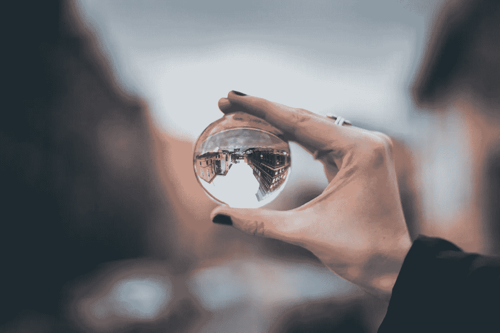

# 为什么你的生活没有你想象的那么糟糕

> 原文：<https://medium.datadriveninvestor.com/why-your-life-doesnt-suck-as-bad-as-you-think-it-does-273363a9b2c?source=collection_archive---------2----------------------->

一个关于视角的故事。

Photo by [Anika Huizinga](https://unsplash.com/photos/RmzR87vTiYw?utm_source=unsplash&utm_medium=referral&utm_content=creditCopyText) on [Unsplash](https://unsplash.com/search/photos/perspective?utm_source=unsplash&utm_medium=referral&utm_content=creditCopyText)

首先，我想说，我意识到在我的身体健康方面，我并没有经历太多的困难。对于大多数面临严重健康问题的人来说，我无法想象这段旅程有多艰难。我向你致敬。

今天早上，我接到当地诊所打来的电话，告诉我我的子宫颈细胞计数异常。如果你不知道的话，这可能会导致宫颈癌，这已经让这个星球上许多了不起的女性走了很远。

我坐在办公桌前，完全目瞪口呆。当我盯着电脑屏幕时，各种想法在我脑海中闪过。

 [## 摔倒不是失败。-数据驱动型投资者

### 你只有在放弃的时候才会失败。每个英雄都会倒下，我们活着就是为了失败者出现的时刻；上升到…

www.datadriveninvestor.com](https://www.datadriveninvestor.com/2019/01/17/falling-isnt-failing/) 

*这意味着什么？我得了癌症吗？我会得癌症吗？如果我 30 岁前就死了呢？* *那一辈子呢？*

我想到了我的女儿和她没有母亲的生活。我把自己想象成一个癌症患者，为正义而战。我对自己说，我绝不可能强大到足以做到这一点。

在你指责我太戏剧化之前，我确实在办公室的洗手间大哭了一场后，把自己拨了进来。收到这样可怕的消息后，消极思想和病态“如果”的螺旋上升是很自然的。

当我等着去我的后续预约以进一步查看我的测试结果时，我被我从一个小信息中获得的观点震惊了。

问题是，我们生活中面临的大多数问题并没有那么糟糕。现在，在你给我讲述你是如何经历这一切的悲伤故事之前，当然你是这个规则的例外，让我来解释一些事情。

## 如果你正在读这篇文章，你是幸运的。

是的，你。如果你有一台电脑或手机，可以用来阅读和沉迷于许多大师的作品，那么你比这个星球上的数百万其他人拥有它更好。

为了方便起见，我在这里先概括一下。也有例外，但世界上的千禧一代是某种软蛋。我们中的许多人甚至不能理解“生活艰难”是什么意思。如果我是诚实的，我对此完全有罪。

对我来说，成长的艰难是没有足够晚的宵禁和为一颗破碎的心哭泣。那时，感觉好像你的世界正在终结。不是的，我很好。你也是。

## 心碎很难。如果你单身或孤独，你是幸运的。

有多少人会选择经历他们所能想象的最具毁灭性的心碎，而不是健康长寿？

答案大概是接近 100%。

我去过那里。心碎或经历极度孤独是悲伤的。感觉就像你要死了，但是你猜怎么着？你不是。你还活着，你有一切机会重塑你的生活，让它变得更好。

当人们经历艰难的分手或被信任的人欺骗时，很难获得任何观点。这几乎就像你被吸进了一个“悲哀的是我”和“我将永远孤独”的黑洞。

事实是，你的生活还没有结束。事实上，你很幸运，有机会学习、成长和体验做人的感觉。你有第二次，第三次，第四次，甚至第五次机会找到对你好的伴侣。

有些人？他们没有这种奢侈。不要想当然。

## 如果你因为电视机坏了或者有人对你不礼貌而感到紧张，你仍然是幸运的。

有多少次，我们这些戏剧女王会因为一些与大局无关的事情而抓狂。

你丈夫在外面呆得比平时晚一点，把你和你两个熟睡的孩子单独留在你崭新的房子里？你很好。

你应该在你的新住处接上你的网络，但是他们迟到了，现在你不能再看一周《网飞》了？你很好。

你的老板因为你上班迟到而责骂你，因为在你出门前，你的孩子把牛奶洒在你的裤子上。你很好。

生活抛给你的大多数情况只会给你带来一些最糟糕的不便。我们夸大事实的能力很强。放松，你会没事的。

## 如果你从来没有担心过你的生活，你是非常幸运的。

我很幸运有非常轻微的恐惧。我从来没有经历过医生让我坐下来，告诉我我得了晚期癌症，或者告诉我我得了不治之症，最终会杀死我。

我听说过很多人的故事，他们前一天还好好的，下一天你就知道他们只能活 3 周了。我认为我们从来没有意识到这对一个人及其家庭的真正影响，除非我们受到它的直接影响。

如果你从未体验过担心生命被缩短的真实感受，你是幸运的。

当我等待我的后续预约时，我觉得我从这次经历中获得了很少的视角。一种对我生命中所拥有的一切(好的和坏的)的感激之情不知从哪里冒了出来。

幸福的关键在于感激当下。如果你不懂得感恩，你永远不会真正快乐。我从未真正明白这一点，直到我的心灵把我带到一个地方，在那里我所拥有的一切都可能被夺走。不要等到你害怕了才开始感激你被给予的生活。

如果你活着，呼吸着，你就有机会创造你一直想要的生活。你有机会扭转局面，改变你的态度。你有体验真实的人类体验的天赋。

下一次你感到沮丧时，问问自己:*如果明天这一切都可以从我身边夺走，我现在会有什么不同的表现？*

关于健康和福利的每周想法和文章，在这里注册我的电子邮件列表[。](http://eepurl.com/gobdkn)