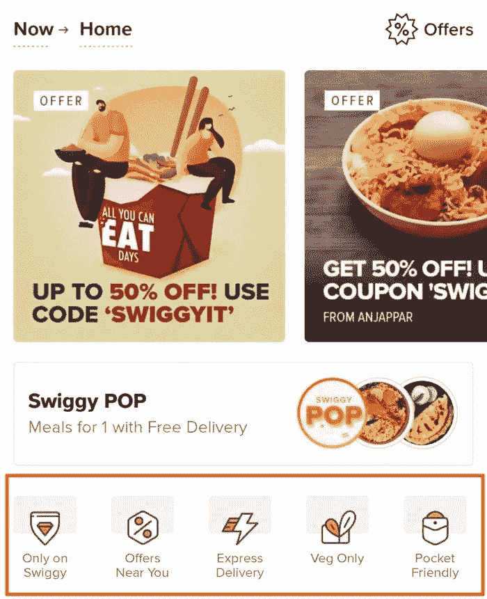
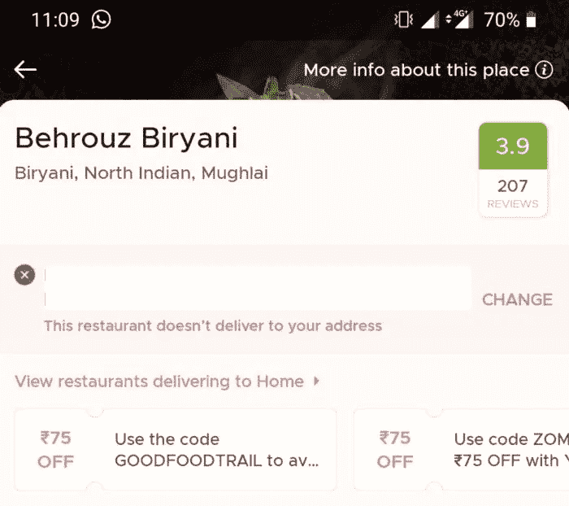
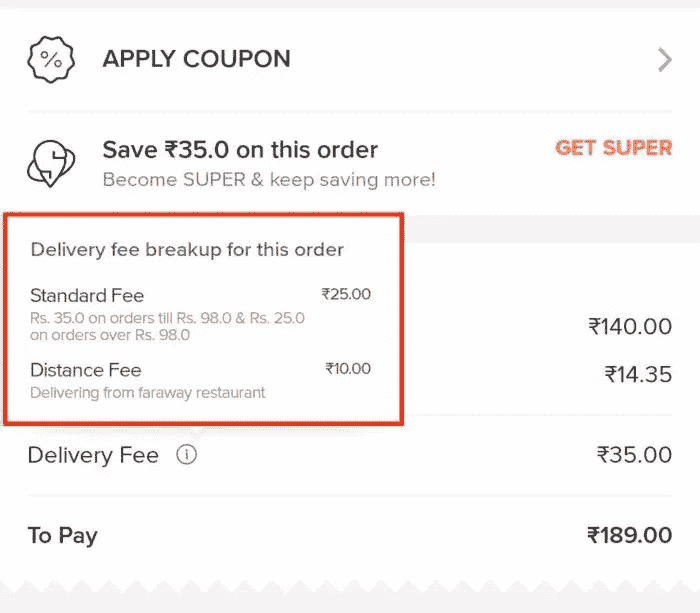
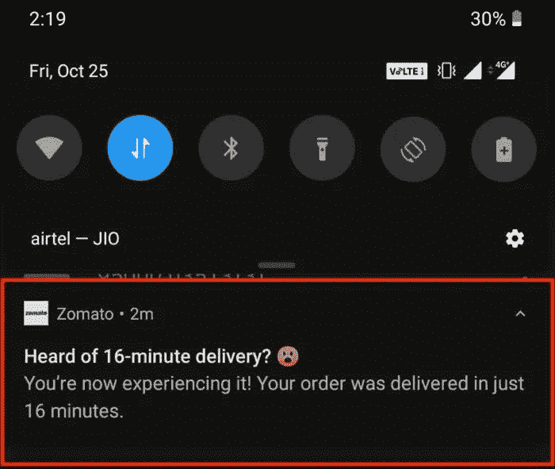

# 为什么 Zomato 作为一款送餐应用吸引力下降

> 原文：<https://medium.datadriveninvestor.com/why-zomato-is-less-appealing-as-a-food-delivery-app-b38f2d79d81a?source=collection_archive---------0----------------------->

当我想了解一家餐馆时，我做的第一件事是，拿出我的手机，打开 Zomato。使用 Zomato 已经成为任何想了解所在城市餐馆的人的一种习惯。这家公司成立于 2008 年，已经走过了漫长的道路。它们在几个城市和国家迅速发展，并帮助数百万用户找到了他们最喜欢的餐馆。

当他们在城市推出送餐服务时，我认为它会立即获得成功。我认为，访问 Zomato 寻找下一个喜欢的餐厅的人也会使用 Zomato 的食品交付应用程序向他们点餐。

 [## 睁大眼睛冲破多样性壁垒|数据驱动的投资者

### “科技女性”是蒂芙尼·霍兰的激情之一，最初她在 Twitter 上主持“科技女性”聊天。她也是一个…

www.datadriveninvestor.com](https://www.datadriveninvestor.com/2019/03/20/hurtle-diversity-barriers-with-eyes-wide-open/) 

但是，这并没有发生。相反，人们用 Swiggy 点餐。

当我问人们他们最喜欢 Zomato 送餐服务的什么功能时，大多数人都谈到了 Zomato 如何列出评论，他们的订餐功能等等。没有人谈论他们的食物运送。我不明白为什么人们不能把 Zomato 作为一个送餐应用程序。是因为他们只把它看作一个餐馆列表应用程序吗？应用程序中的送餐部分用户体验差吗？

我非常想知道为什么 Zomato 作为一个食品配送应用程序不那么有吸引力。

为了深入这个话题，我和 Zomato 一起玩了一个星期，我得到了一些提示。

# 附近的餐馆不是重点

当我饿的时候，我不会太挑剔。我会想从离我最近的最好的餐馆点菜。那可能是我已经吃过饭，在上班或回家的路上见过的地方。

因此，我的食品配送应用程序的主要过滤器应该是显示附近餐馆的过滤器。

但是，当我切换到 Zomato 的食品配送应用程序时，我看到的前四个过滤器是**一人用餐、Zomato Gold、大优惠、**和**卫生评级**。快递过滤器要么半隐藏在第二行过滤器中，要么我必须水平滚动到类别部分才能找到快递。

这种方法的问题是，当我从其他类别中选择一家餐厅时，这家餐厅往往很远，我最终要支付 15 印度卢比的距离费。这些加起来就是包装费，偶尔激增的费用和税收在我的口袋里烧了一个大洞。前几天我试着点了一份烤鸡。biryani 的价格是 150 印度卢比，扣除所有费用后的总账单是 225 印度卢比。**那是 50%的增长！**

但是，斯威奇却不是这样。他们的前四个类别是 **Only on Swiggy、附近的优惠、快递**和**纯蔬菜**。我可以找到最近的餐馆，还可以节省一些路费。

令人惊讶的是，当我查看 Zomato 的餐厅列表应用程序时，情况并非如此。那边的第一个过滤器是离我最近的**。此外，它还显示了离我最近的餐厅。当我点击一家餐馆时，我可以选择了解这家餐馆的更多信息，也可以从这家餐馆订餐(如果这家餐馆接受在线订单的话)。对我来说，这比试图在促销餐厅和云厨房中找到最近的餐厅更无缝的体验。**

我知道按照正确的顺序排列类别是一个艰难的产品决策。但是，想象一下最终用户的心态，我会把快递视为前三个选项之一，而不是必须横向滚动才能找到它。

我不知道类别的顺序是否会随着使用而改变。Zomato 团队或频繁用户将不得不阐明这一点。

但是，当谈到食品交付显示接近是优先事项。

# 一些误导

好几次都被 app 里提供的信息误导了。让我给你举几个例子。

有一天，当我打开 Zomato 时，它告诉我，当时它没有足够的乘客，当我从几家餐馆点菜时，它可能会收取激增费。但是，当我滚动浏览餐馆时，没有视觉提示告诉我哪些餐馆将收取激增费。我只有点击餐厅后才能找到答案。这同样适用于远程费用。没有明确表示哪些餐厅向我收取距离费。

如果我是一个试图省钱的人，我将不得不点击每家餐馆，以了解它是否收取激增费或距离费。这种体验让用户感到沮丧。

另一个例子是，我在浏览餐馆列表时，发现了一个供应异国风味的印度炒面的地方。点击餐馆后，我看到一个通知，上面写着:“本餐馆不送货上门”。对于这次经历，我有两个问题。首先，为什么在我的送货区之外的餐馆会出现在我的位置列表中？第二，为什么告诉我我选了餐厅之后他们就不送了？

让我从最终用户的角度谈谈这种体验的缺点。

当有人从无止境的餐馆中选择一家餐馆时，他们或多或少地决定从那个地方点菜。而且，精神上他们也松了一口气。但是，当他们发现餐馆不送货时，他们又回到了起点。几次类似的经历会阻止他们再次使用这款应用。

# 波动的送货费用

当我试着点几道菜时，我意识到送货费在 22 卢比到 43 卢比之间波动。我试着从一家离我家一公里远的餐馆点餐，送货费是 38 印度卢比，当我试着从另一个我认为是云厨房的地方点餐时，送货费是 22 印度卢比。令人惊讶的是，两家餐厅的预计送货时间都在 30 分钟左右。如果是这样，为什么会有 16 卢比的差别！

为什么送货没有固定收费！如果你根据餐馆的距离来改变送货费，这是有道理的。但是，这是要收费的。那为什么没有标准的配送费！

还有，这个送货费是怎么定的？

Swiggy 已经确定了他们的标准交货价格。如果订单价值低于 98 印度卢比，送货费为 35 印度卢比，如果订单价值高于 98 印度卢比，送货费为 25 印度卢比。当用户查看订单时，他们还会用一个漂亮的小工具提示来教育用户。更加清晰。

我认为 Zomato 应该定义他们的送货费。这肯定会减轻最终用户的体验。

# 佐马托依然光芒四射

Zomato 的亮点是推送通知。产品团队在向用户发送上下文推送通知方面投入了大量的精力和创造力。

有一次，我在附近的一家餐馆点餐，它很快就送到了。当我在想它有多快时，我收到了一条推送通知，上面写着“听说过 16 分钟送达吗？你经历过。你点的菜 16 分钟就送到了。”这是新的，令人耳目一新。我遇到过类似的上下文推送通知。

Zomato 应该专注于在整个应用程序中为用户带来类似的体验。

人人都爱 Zomato 这个餐厅列表 app。但是，通过对用户体验的一些调整，人们也会开始喜欢它作为一个食品交付应用程序！最简单且被证明有效的方法是从用户的角度来看应用程序。