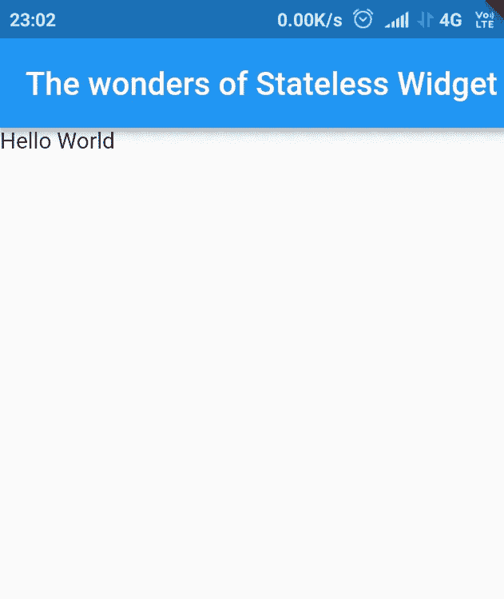
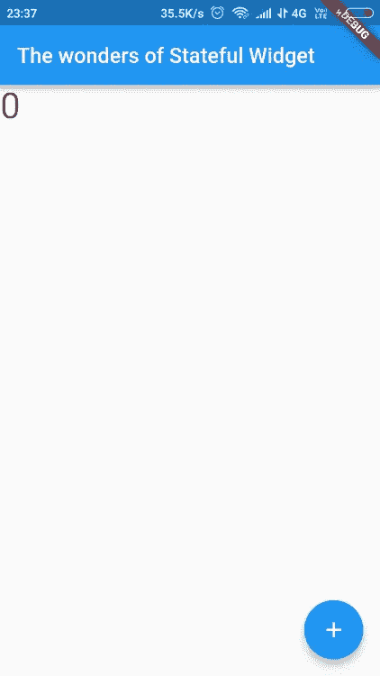
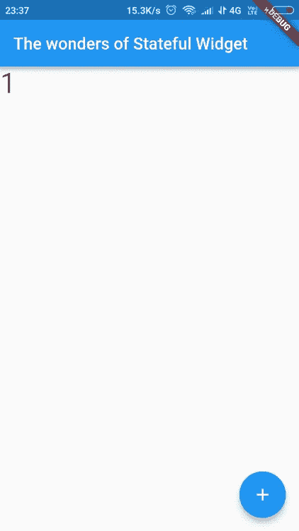

# 小部件:无状态和有状态

> 原文：<https://medium.datadriveninvestor.com/widgets-stateless-and-stateful-2e3b8adced71?source=collection_archive---------7----------------------->

[](http://www.track.datadriveninvestor.com/1B9E)

在本文中，我将讨论无状态和有状态小部件的区别和简单实现。它们是任何简单应用程序的组成部分。任何开始使用 flutter 的人都需要了解何时使用无状态或有状态小部件，以及每个小部件为应用程序提供什么属性。

> 我是 android 开发的初学者，在学习的过程中，我写了一些关于它的东西。如果你认为我文章的任何部分是错误的，请评论它以便我能改正它。谢谢！

# 颤动:


当你开始使用 Flutter 时，你在任何文档中读到的第一句话是:

> “一切都是小部件”

在 flutter 中，你用小部件来构建你的用户界面。意义，布局的结构。想要添加图像、按钮、文本、列表等吗？你用小工具。这并不意味着小部件只用于布局。它们也用于应用程序的功能。这意味着，就 Android 开发而言，flutter 没有两个不同的“XML”和“Java”页面，而只有一个“Dart”页面。

# 实施:

*任何小部件都只不过是一个 Dart 类，它扩展了一个 flutter 类。*如果您仔细阅读了最后一句话，那么这段代码应该是有意义的:

```
class MyWidget extends StatelessWidget{// bunch of code}
```

在这个例子中，我们基本上是在创建一个名为`MyWidget`的小部件类。这个小部件从类`StatelessWidget`继承而来，它是一个 Flutter 类。(注意:这里，我们使用的是*继承*属性。这是面向对象语言的关键概念之一。如果你不明白，请在网上查找)

# 布局类型:

假设您正在创建一个应用程序的布局。你可以把它的一部分大致分为两种类型:

**静态布局:**一旦 app 构建完成就不会改变。比如标题栏或者一行文字。你不希望任何形式的用户活动改变应用程序的标题栏，对吗？

**动态布局:**能够根据用户活动改变正在进行的隐藏过程(以及其他因素)的布局。想想电影评论应用程序中最喜欢的图标。当您轻按特定电影的收藏图标时，其星形图标会充满颜色，收藏的总数会增加。这意味着由于某些用户活动，布局发生了变化。

所以很自然地，flutter 制作了两个小部件来适应它们。这些是(*你猜对了)* StatelessWidget 和 StatefulWidget。它们为应用程序提供了不同的属性。StatelessWidget 用于静态布局，而有状态 Widget 用于布局的动态部分。

> 我把这些小部件写成‘StatelessWidget’或‘stateful widget ’,因为这是它们在软件中的定义和使用方式。当创建这样一个小部件时，我们将使用这样的关键字。

让我们看看这两个小部件的基本结构。

# 无状态小部件:

```
class MyWidget extends StatelessWidget{ @override Widget build(BuildContext context){ return *Widgets*; }}
```

在创建任何类之后，必须覆盖的函数是`build()` 方法。这条规则在这里也适用。构建方法是您指定布局的地方。在一个典型的应用程序中，这个方法的返回语句将包含您的主要小部件。比如‘material app’。

# StatefulWidget:

```
class MyWidget extends StatefulWidget{MyWidget({Key key}) : super(key:key); @override _MyWidget createState() => new _MyWidget();}class _MyWidget extends State<MyWidget>{ Widget build(BuildContext context){ return *Widgets*; }}
```

> 注意:遗憾的是，实际的代码将包含更多复杂和丰富多彩的代码行，但是这里只解释了最基本的实现。

StatefulWidget 没有 build 方法，而是有一个`createState()` 方法。该方法返回该类的一个实例，它从`State<>`继承属性。

有状态小部件是可变的，因为它们在应用程序的生命周期中不止构建一次。当您希望更改布局时，StatefulWidget 会重新构建。这就是为什么它们不仅仅有一个要覆盖的构建方法，而是有一个针对其类的特定实例的构建方法。

现在让我们看一些代码，就像它出现在 IDE 中一样。

# 无状态小部件:

让我们创建一个简单的应用程序，它有一个标题和一个文本小部件。别忘了我们第一个应用的传统“Hello World”文本。

```
**import 'package:flutter/material.dart'**;**void** main() => runApp(**new** MyApp());**class** MyApp **extends** StatelessWidget {
  @override
  Widget build(BuildContext context) {
    **return new** MaterialApp(
      title: **'Flutter Stateless Demo'**,
      home: Scaffold(
          appBar: AppBar(
              title: Text(**'The wonders of Stateless Widget'**)
          ),
          body: Text(**'Hello World'**),
      ),);}}
```

正如您在输出中看到的，构建的应用程序不包含任何功能，只有一行简单的文本。一个`StatelessWidget` 提供了创建没有任何功能或内部流程的布局的能力。



StatelessWidget Example (App Screenshot)

# StatefulWidget:

```
...
      home: MyHomePage(),
    );}}**class** MyHomePage **extends** StatefulWidget {
  MyHomePage({Key key}) : **super**(key: key);@override
  _MyHomePageState createState() => _MyHomePageState();
}**class** _MyHomePageState **extends** State<MyHomePage> {
  int **_counter** = 0;**void** _incrementCounter() {
    setState(() {
      **_counter**++;
    });}@override
  Widget build(BuildContext context) {
    **return** Scaffold(
      appBar: AppBar(
        title: Text(**'The wonders of Stateful Widget'**),
      ),
      body: Text(
              **'**$**_counter'**,
            ),
      floatingActionButton: FloatingActionButton(
        onPressed: _incrementCounter,
        child: Icon(Icons.*add*),
      ),);}}
```

是的，看起来很复杂。虽然，起步是一样的。我创建了`MyApp` 类，在它的`Scaffold()`小部件中，我调用了`home:` 部分中的`MyHomePage`。之后，我创建了作为有状态类的`MyHomePage`类。

现在来看`_MyHomePageState`的 Widget build()函数。支架小部件由三个元素组成。应用程序栏标题，即显示在应用程序上的标题，主体内的一行文本和一个浮动的操作按钮。

该应用程序的目的是在应用程序开始时显示“0”。当用户点击屏幕上的按钮时，显示的数字就会增加。因此，`MyHomePageState`需要是一个 StatefulWidget，因为我需要文本在每次按钮被按下时改变(递增)。

如果你想用 C++为此写一个程序，你可以创建一个函数来递增计数器并返回更新后的值。这里，*返回更新值*的过程类似于*重建小部件。*

实质上，无论何时按下按钮，都会调用`_incrementCounter`函数，该函数会增加`setState()`函数中的`_counter`变量。每当调用 setState 方法时，小部件都会再次构建，其范围内的信息会被带到下一次构建中。因此，新构建的“MyHomePage”小部件将显示增加的值。



StatefulWidget Example (App Screenshot)

希望这篇文章能帮助你学习一些新的东西。

感谢阅读！

阿南特