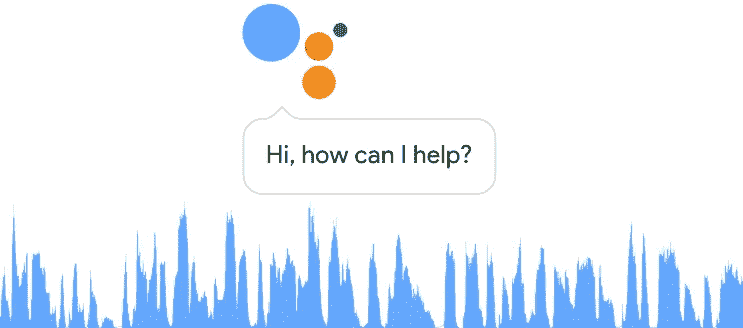

# 2019 年会是语音 AI 年吗？

> 原文：<https://medium.datadriveninvestor.com/will-2019-be-the-year-of-voice-ai-d90e66a07d28?source=collection_archive---------23----------------------->

## 随着今年 CES 上 Alexa 和 Google home 等联网设备的大肆宣传，人工智能到底有多先进？

在今年的 CES 上，随着语音助手越来越受欢迎，亚马逊 Echo 和谷歌助手都占据了中心舞台。

人工智能绝对是今年 CES 上的热门话题。随着亚马逊、谷歌、微软和苹果等公司的大量投资，2019 年的人工智能已经开始比赛。亚马逊最近证实已经向 T2 售出了 1 亿台 Echos。迄今为止，谷歌家庭设备已经售出 5200 万台。此外，谷歌助手预装在 Pixel 上，据估计，到 1 月底，谷歌助手将安装在 10 亿台设备上。

> [DDI 编辑推荐—学习构建亚马逊 Alexa 技能&与机器对话](http://go.datadriveninvestor.com/alexa1/matf)

但是 AI 到底有多聪明？有现成的解决方案，如 [Dialogflow](https://dialogflow.com/) 或 [Wit.ai](https://wit.ai/) ，它们理解基本的意图和话语，但远非无所不知。今天的大多数人工智能实际上是技术上被认为是“监督学习”的，并涉及“分类”，这是基于包括正确答案的训练数据的机器学习。简单来说，这意味着人类必须训练人工智能理解它不知道的东西。在中国，他们正在利用廉价的劳动力来快速制作人工智能图像标签。

> ***没有人类的训练，AI 就不会存在。***

*Hot dog, not hot dog.*

在 Convrg，我们与雅诗兰黛公司和 T2 格莱美奖等企业品牌合作，打造语音体验。我们构建的每一个体验，我们都必须不断地训练人工智能，让它理解品牌特有的方言。当我们致力于格莱美聊天机器人和语音体验时，我们必须训练人工智能来了解并理解石头庙飞行员和 21 飞行员之间的区别！

那么你的虚拟助手有多聪明呢？如果你有一个，你就知道它没那么聪明。它只知道它被编程去做什么。虽然它可以设置定时器和调暗家中的灯光，但它肯定不够智能，无法与用户进行自然的对话。目前，语音助手是一个更功利的助手，而不是“智能”。

在 CES 上，谷歌和亚马逊都有很大的影响力，并宣布与各种智能扬声器、家庭设备和耳机集成。谷歌宣布了[翻译模式](https://www.wired.com/story/google-assistant-interpreter-mode/)，该模式将他们的助手变成两个试图在同一物理空间聊天的人之间的实时语言翻译，并正在酒店进行测试。去年推出了谷歌双工系统，可以帮你打电话。毫无疑问，我们看到了人工智能领域取得的巨大进步。

家庭中新设备的涌入正在训练用户如何与人工智能助理交谈，随着时间的推移，我们将看到人们如何与他们互动。科技巨头们正在竞相主宰人工智能领域，并将他们的语音助手注入到每一种可以想象的“智能”硬件中——恒温器、灯光控制、扬声器、门铃、耳机，甚至厕所和宠物小方块！语音助手在我们的生活中已经无处不在，但奇点还很远很远。

请随时联系我，了解 Convrg 如何在快速增长的语音人工智能领域与您的品牌合作。最好通过 twitter @mraudreywu 联系我