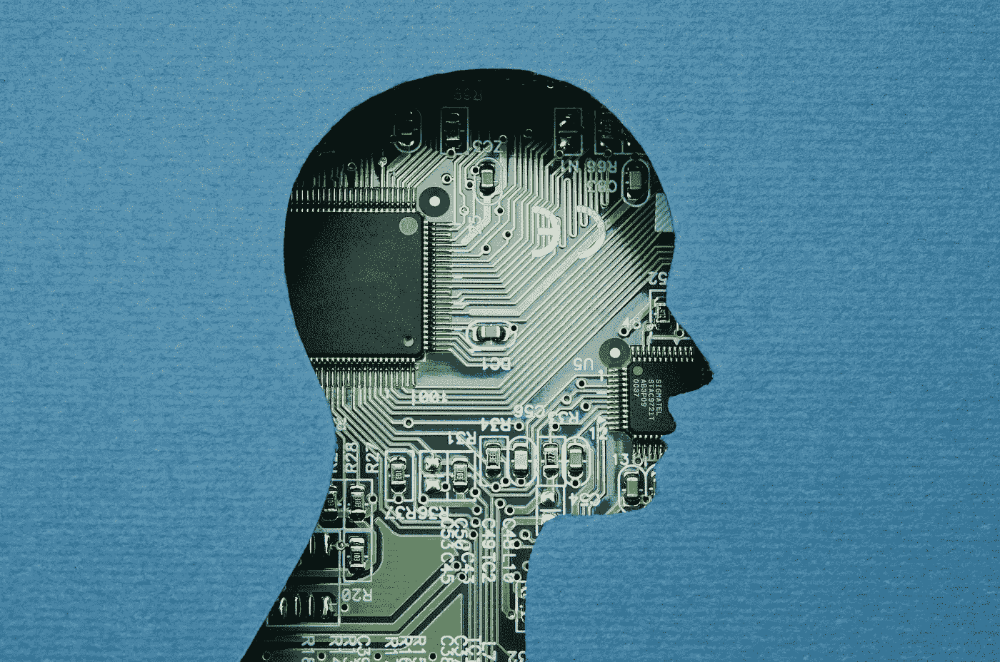

# AI 会取代你的工作吗？

> 原文：<https://medium.datadriveninvestor.com/will-ai-replace-your-job-f326b034c92d?source=collection_archive---------1----------------------->

人工智能(AI)通过为机器提供替代人工任务的有效方法，彻底改变了科技行业。各种规模和行业垂直领域的组织都在追求自动化，特别是那些由人工智能驱动的组织，以提高劳动力生产率和最大化盈利能力。

突破性技术领域正式发明于 1956 年——尽管背景研究可以追溯到 20 世纪 30 年代末——为了一个特定的目的:赋予机器智能以更好地服务于人类。

 [## 挑战你对人工智能和社会的看法的 4 本书——数据驱动的投资者

### 深度学习、像人类一样思考的机器人、人工智能、神经网络——这些技术引发了…

go.datadriveninvestor.com](http://go.datadriveninvestor.com/4AI1) 

然而，技术、智力及其复制人类行为能力的提高引起了明显的担忧。许多人认为，人工智能将发展到机器将取代我们的工作，失业率将呈指数级上升的地步。

为了探索人工智能取代人类劳动力的可能性，我们需要评估技术进步如何影响就业行业。

**人工智能将取代的工作岗位**

世界经济论坛最近进行的一项研究发现，在不久的将来，人工智能技术的增长和发展将扰乱就业行业，夺走人类的一些工作，但同时也创造了前所未有的新工作机会。[研究公司 Gartner](https://www.gartner.com/smarterwithgartner/gartner-top-strategic-predictions-for-2018-and-beyond/) 进一步证实了人工智能创造的工作岗位多于它取代的工作岗位的假设，预测在 2020 年，人工智能将创造 230 万个新工作岗位，同时消除 180 万个传统工作岗位。最终，员工将被期望为逐渐过渡做好准备，并学习补充人工智能等技术的技能。

作为一个非详尽的例子，以下职业最有可能在不久的将来被人工智能取代:

*   电话销售:在数字广告时代，直接电话销售越来越不受欢迎，企业可以分析潜在客户的数据，并展示有针对性的广告。人工智能为识别最可行的广告目标铺平了道路，并使客户更容易在线了解最有吸引力的产品和服务。因此，电话销售人员的角色正在从直接客户广告中淡出。
*   客户支持:许多客户联系服务提供商来解决基本的技术问题或顾虑。与此同时，商业组织不断面临着缩短客户获得支持的等待时间的挑战。人工智能机器人在几个方面为这一挑战提供了可行的解决方案，包括持续可用性、同时为许多客户服务的高可扩展性，以及快速找到解决客户面临的问题所需的正确支持信息。因此，组织正在利用人工智能机器人技术，而不是扩大他们的劳动力来解决日益增长的客户支持需求。
*   簿记:人工智能是会计的未来，簿记实践是最先自动化的。事实上，一系列会计软件供应商已经提供了自动数据输入、对账和其他簿记实践。与容易出错的人为因素不同，人工智能技术让企业更快、更低成本地获得可靠、准确的会计信息。
*   接待:亚马逊 Alexa 和谷歌 Home 等技术开创了人机交互的新时代，有很大的潜力取代人类接待员。当前台接待员无法回应每一位顾客，或接听潜在顾客的电话时，雇主就失去了商机。另一方面，人工智能接待员为每一位与业务互动的客户提供量身定制的智能响应。 [Gartner 预测](https://www.gartner.com/smarterwithgartner/gartner-top-strategic-predictions-for-2018-and-beyond/)到 2021 年，50%的企业在开发人工智能机器人上的投资将超过他们在传统移动应用开发解决方案上的投资。
*   销售和市场研究:在当今的数字时代，每天都会产生大量包含无价销售和市场知识的大数据。对于人类个体来说，筛选可用数据并提取最有用的见解几乎是不可能的。与此同时，提取人工智能支持的市场情报的能力可以使组织能够识别否则不会显而易见的关键业务机会。这使得人工智能有可能取代人类完成销售和市场研究任务。根据研究公司 IDC 的数据，到 2020 年，大数据和商业分析的收入流预计将达到 2100 亿美元(T2)的大关，这并不奇怪。

这些职业拥有共同的基础元素，这些元素为人工智能接管提供了很高的潜力。这些包括重复性，与思维过程和智能相比，对人工努力的高度关注，也许最重要的是，机器复制有效执行这些工作所需的过程的能力。

[麦肯锡](https://www.mckinsey.com/business-functions/digital-mckinsey/our-insights/where-machines-could-replace-humans-and-where-they-cant-yet)将这些职业分为以下几类，标记为对自动化“高度敏感”,表明通过人工智能替代的巨大潜力:

*   可预测的体力工作:已知环境中的重复性体力工作-78%可能被自动化取代。
*   数据处理:处理数据的重复性手工任务——69%可能被自动化取代。
*   数据收集:从不同来源提取和维护数据的重复性手动任务—64%可能被自动化所取代。

相比之下，最不可能被自动化取代的工作包括管理他人(7%)、应用专业知识(14%)、利益相关者互动(16%)和不可预测的体力工作(12%)。

然而，普通人接受这种变化可能需要很长时间。当人工智能机器人接待员无法提供个性化的回应或提供一些额外的优惠时，酒店客户将如何反应？人工智能聊天机器人如何处理沮丧的客户，并帮助确定问题的真正原因？企业部署 AI 技术来替代低成本高效率的人类劳动需要多少成本？

人工智能接管你的工作的概念不仅与科学进步有关，还与决定新技术在现实世界中的有效性的社会方面有关。虽然这些问题肯定需要回答，但历史告诉我们，我们最终会为我们生活中的人工智能等下一代技术让路。我们只需要找到最佳点，并有效地利用人工智能。

在那之前，人工智能接管你所有的工作并让人类失业的概念只不过是一种伪科学的误解。

*原载于 2018 年 4 月 16 日*[*【www.datadriveninvestor.com*](http://www.datadriveninvestor.com/2018/04/16/will-ai-replace-your-job/)*。*

# DDI 推荐阅读:

*   人类不需要申请:人工智能时代的财富和工作指南
*   [*生活 3.0:成为人工智能时代的人类*](http://go.datadriveninvestor.com/daib04/mbmp000104) 马克斯·泰格马克著
*   [*Python 人工智能:为 Python 初学者和开发者构建智能应用的综合指南*](http://go.datadriveninvestor.com/daib09/mbmp000104) 作者 Prateek Joshi