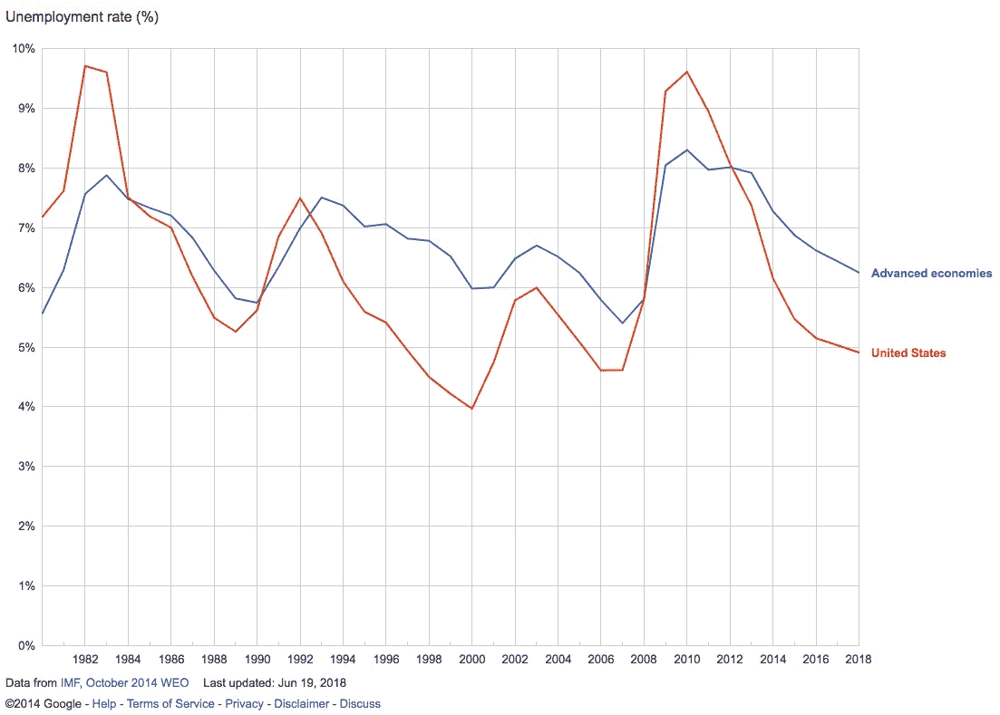

# AI 会抢走我们所有的工作吗？

> 原文：<https://medium.datadriveninvestor.com/will-ai-take-away-all-our-jobs-9fd3eac1ac63?source=collection_archive---------8----------------------->

关于人工智能通过自动化消除我们工作的讨论无处不在。

然而，自动化并不新鲜，对就业影响的警告也不新鲜。20 世纪 20 年代的劳工部长詹姆斯·戴维斯和 20 世纪 80 年代的诺贝尔奖获得者瓦西里·列昂季耶夫就是两位著名的历史人物，他们警告自动化将导致大规模失业。

尽管许多自动化发明被成功设计成用完美的机器取代不一致的人工劳动，但数据并不支持失业率上升。

如果机器成功地取代了人类的工作，那么为什么失业率没有上升呢？两个因素解释了这个悖论:O 形环理论和人类的贪婪。

# o 形环理论

生产流程通常由一系列相互关联的任务组成。完善这些任务的子集并不会使生产链中的其他功能变得不必要。相反，这让他们更加挑剔。

1986 年，挑战者号航天飞机在发射后不久爆炸，在一场灾难中结束了任务。事实证明，在这个数十亿美元的项目中，一个被腐蚀的 O 形圈导致了助推火箭的故障，并导致了爆炸。

迈克尔·克雷默用这个不幸的例子来比喻生产中每一项任务的重要性，其特征如下:生产依赖于一系列任务
2。任何任务的失败都会降低整个产品的价值，通常为零
3。没有人能以数量代替质量

这种对每项任务完美运行的依赖，具有积极的含义，即一项任务的改进，增加了其余任务改进的经济价值。

例如，让我们看看烤面包。面包制作大约有十项任务——原料选择、混合、初步发酵、分割成型、休息、最终成型、最终发酵、评分、烘焙，最后冷却。这些步骤中任何一步的失败都可能毁掉整个产品。想象一下烘烤面包时间过长，或者使用了错误的原料。除了第一项任务，商用面包机已经完美地实现了所有任务的自动化。因此，第一项任务——原料选择的改进，以及随后的质量改进，具有最高的经济价值。这可能与目前研究的最高焦点相一致。

随着技术的进步和机器的完善接管了更多的任务，我们的专业知识、判断和创造力对于剩余任务的改进变得越来越重要，这些任务随着每次迭代变得越来越困难。

# 人类的贪婪

第二个因素——人类的贪婪——是新产品和服务无休止发明的有益体现。电子鸡和猫瑜伽只是这类产品的两个例子。不用争论这些产品的必要性，他们肯定创造了就业机会。

从历史上看，O 型圈理论和人类贪婪的结合不仅带来了更多的就业，还通过更高的产出带来了更多的总体财富。

至少就目前而言，这两个因素似乎在这波自动化浪潮中仍然有效，因此没有明显的理由相信人工智能会摧毁就业。然而，在这方面有两个因素应该提及。

# 宏观与微观

在宏观经济层面，工作并没有被自动化摧毁。然而，在微观经济层面上，自动化摧毁了整个行业。

一个有趣的例子是人类计算机。人类计算机是进行数学计算的人。整个行业都被计算器摧毁了。

还有更多这样的例子，这些行业要么需要经历一场巨大的变革，要么被摧毁。

人工智能，通过它的多功能性，很可能会比计算器对更多的行业产生这样的影响。

# 财富增长与财富分配

仅仅因为我们通过更高的产量增加了整体财富，并不意味着我们自动地有意义地分配财富。

看看沙特和挪威，我们可以看到两个非常富裕的国家。然而，他们在财富分配上有着巨大的差距。沙特阿拉伯是一个只有一小部分人从他们的财富中获利的王国。挪威是一个民主国家，它成功地在更广泛的层面上分配财富。

有了人工智能，更多的任务将由人类移交给机器。然而，机器的征税与人类不同，即一次性征税，而不是连续征税。因此，通过税收转移财富的既定方法可能不再有效。

总之。没有理由认为人工智能会导致整体失业。这很可能会创造更多的就业机会，增加产出，从而增加总财富。然而，这种转变将是困难的，因为许多行业将受到负面影响。此外，必须解决财富分配问题，因为传统的财富转移方法可能不再适用。