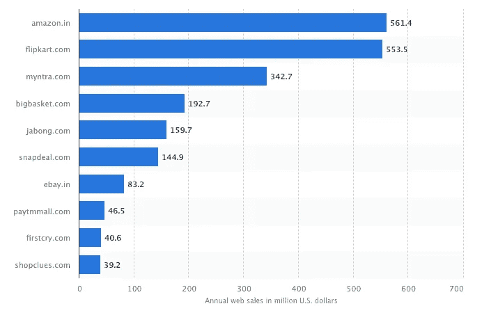

# 《神奇的印度》会成为亚马逊的印度吗？

> 原文：<https://medium.datadriveninvestor.com/will-amazing-india-become-amazons-india-7310c29e7e45?source=collection_archive---------12----------------------->

*我的这篇文章最近发表在 Entrepreneur.com*

*印度电子商务行业经历了重大变革和整合。本土公司繁荣了几年。当 Flipkart 在 2014 年收购 Myntra 时，收购热潮开始了。随后是对 Jabong 的收购，这使得 Flipkart 成为印度电子商务行业唯一的本土灯塔。Flipkart 既无法应对亚马逊的竞争，也无法应对雄心勃勃、财力雄厚的沃尔玛。Flipkart 成为沃尔玛雄心勃勃和财力雄厚的牺牲品。这给了本土电子商务战胜沃尔玛和亚马逊的梦想最后一击。*

*这项收购宣布了美国公司、沃尔玛和亚马逊在印度电子商务行业的主导地位。同样，小米和 Tik Tok 等中国企业也紧随其后，超越了手机行业和印度应用生态系统。这种主导地位进一步使这些利益相关者渗透到支付、保险、物流和其他相关部门。*

# *西方的影响*

*这种渗透更有趣的一面是，深受西方文化影响的 1 亿印度一线城市居民已经成为沃尔玛和亚马逊生态系统的一部分。现在，世界上的亚马逊人正试图进入二线和三线城市，在那里，语言、基础设施和劳动力是进入的主要障碍，即使是本地企业，更不用说外国企业了。*

*从一开始，亚马逊就致力于建设其枢纽和配送中心，以在一线城市创建最好的配送网络。为了进入二三线城镇，亚马逊将其内容翻译成当地语言，建立了一支当地员工队伍，更新了他们的应用程序，以适应低端智能手机和不规则的蜂窝网络，甚至在这些城镇使用小型商店作为包裹仓库。*

**

*Source: Statista*

# *印度的挑战*

*与印度所有电子商务公司一样，亚马逊希望获得零售和杂货领域的所有权，但在占领这个市场方面面临挑战。虽然这不是一个不同寻常的愿望，但一些印度电子商务玩家已经尝试并失败了，亚马逊拥有大多数玩家没有的东西——雄厚的资金和大把的现金，其水平是本土玩家无法竞争的。*

*一方面，国际企业的统治和渗透让印度消费者的生活更加便利，创造了就业机会，建设了基础设施，培养了新的人才。另一方面，它阻碍了本地生态系统的创新和发展。为了在印度电子商务行业发展和生存，本土企业需要大量投资(这很难获得)，首先要雇佣顶尖人才，吸引对价格敏感的消费者，并抵御沃尔玛(Walmart)和亚马逊(Amazon)等现金充裕的竞争对手。*

# *玩家的种类*

*目前，印度市场上有两种类型的电子商务参与者。首先，那些采取典型的自上而下方式的公司:印度的亚马逊(Amazons)和 Flipkarts，它们试图抓住高端消费者。他们自上而下渗透到 1 亿消费者群体的方法之所以奏效，主要是因为他们的消费者群体主要是讲英语的人，他们认为亚马逊是有抱负的。*

*第二类是印度电子商务初创公司的新品种，他们采取了自下而上的方法，如 ShopX、LaYuva、Meesho、Shopmatic 和 Shyplite。他们正试图通过将小卖家放到网上，并将他们与当地消费者联系起来，将二三线城市数字化。尽管二线和三线城市的消费者基数是一线城市的 4 倍，但抓住他们更具挑战性。他们被全国各地的语言、习俗和文化分割开来。这意味着，要想从他们的钱包里分一杯羹，你需要对这个国家有一个基层的了解。这是商店做得很好的一点，但仅凭这种理解还不足以让他们在与亚马逊的竞争中赢得市场。这些初创公司的唯一选择是要么被亚马逊、Flipkart 收购，要么就玩完。*

# *看看中国*

*中国是如何建立本土生态系统的绝佳案例。如果中国没有为国际参与者设置如此高的准入门槛，阿里巴巴、滴滴、JD.com、腾讯和其他许多亚洲科技平台就不会成为现实。中国帮助发展本土生态系统的战略不仅帮助中国企业成为价值数十亿美元的企业，还帮助这些企业进行创新并设定新的全球标准，在本土生态系统中，国际企业只能以受控的身份发挥作用。*

*印度正处于经济周期的关键时刻，增长迫在眉睫。但是增长和机会属于谁呢？它属于向印度市场投入数十亿美元、建设基础设施并创造就业机会的国际企业，还是属于草根本土企业，与亚马逊相比，这些企业资金不足，规模不够大，亚马逊甚至不会将它们视为竞争对手，但它们同样有能力(如果不是更多的话)建立世界级的企业，并能更好地迎合印度零售商和消费者的需求，因为它们理解并能与他们建立联系，特别是在二三线城镇。*

*政府已经注意到了这个话题，并出台了相关法规，帮助本土电子商务企业与外国公司竞争。尽管这将有助于本土企业在更加平等的基础上竞争，但也意味着折扣将开始消失，产品价格将会上涨。作为消费者，我们通常不太关心玩家是外国的还是本地的。我们关心价格和便利，但也许我们应该开始思考我们希望看到谁成为赢家。*