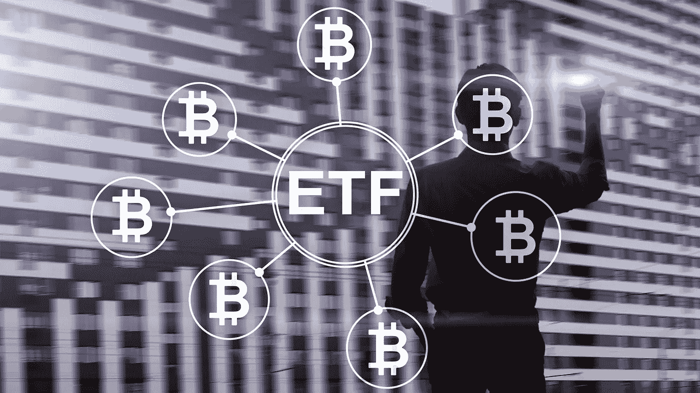
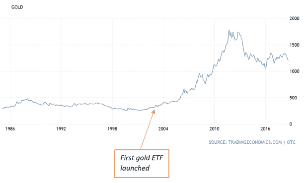
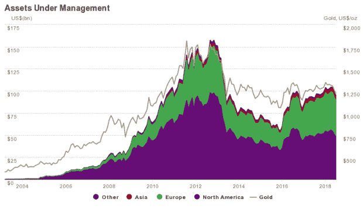
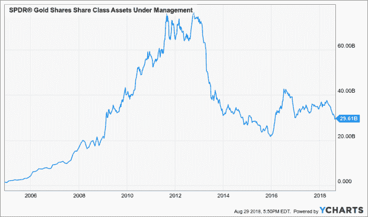

# ETF 会像黄金那样改变比特币吗？

> 原文：<https://medium.datadriveninvestor.com/will-an-etf-transform-bitcoin-like-it-did-in-gold-d5825a36373f?source=collection_archive---------2----------------------->

2003 年 3 月 28 日。那是世界上第一只黄金交易所交易基金(ETF)[ETFS 实物黄金(黄金)](https://www.etfsecurities.com.au/institutional/au/en-gb/products/product/etfs-physical-gold-gold-asx)登上世界舞台的日子。大约 18 个月后，规模最大、最负盛名的实物支持黄金交易所交易基金 [SPDR 黄金信托(GLD)](https://www.spdrgoldshares.com/) 成立并开始运营。从那时起，事情就再也不一样了…

自推出以来的 15 年左右时间里，ETF 对黄金市场产生了巨大影响。即使仅仅从价格来看，当黄金首次推出时，一盎司黄金的价值约为 330 美元。今天，油价已经远远超过了 1200 美元，而在 2011 年，油价曾险些突破 1800 美元。

当然，其他因素也促成了黄金在那段时间前所未有的飙升，尤其是 2000 年代由中国推动的大宗商品超级周期。但很少有人会认为 ETF 不是黄金和贵金属市场的游戏规则改变者，因为在 2000 年代后半期，资金涌入了交易所交易产品。事实上，就管理的资产价值而言，GLD 很快成为世界上最大的基金之一，在很短的时间内超过了 750 亿美元，而在全球范围内，黄金 ETF 的总价值也在同一时期超过了 1，500 亿美元。

[来源](https://www.gold.org/goldhub/data/global-gold-backed-etf-holdings-and-flows#MainContent)

# 比特币会步黄金的后尘吗？

现在看来，尽管最近遭到监管机构的抵制，比特币 ETF 仍有可能在某个阶段生效。这意味着每个人现在都在想，这样一种产品是否能像它对黄金所做的那样，对比特币产生影响。随着 GLD 和其他黄金支持的 ETF 通过让投资者更容易获得这种贵金属而改变了市场，比特币 ETF 是否会同样提高那些渴望获得加密货币领域敞口的人的可获得性？

我们之前讨论过[比特币是否可以被认为是黄金的有效替代品](http://www.datadriveninvestor.com/2017/08/23/is-bitcoin-an-effective-substitute-for-gold/)。然而，鉴于与贵金属相比，数字货币迄今为止的寿命很短，我想说，这个问题还没有定论。但看看它们不可否认的相似之处——被“开采”的固定和有限的供应，作为潜在的价值储存手段，以及几乎完全独立于央行和政府法令——它们各自的 ETF 肯定也应该表现相似吧？

嗯，是也不是…

# 类似

黄金交易所交易基金的吸引力很大程度上在于它们相对于实物黄金交易的便利性。通过参与基金，投资黄金突然变得像购买股票一样容易。事实上，你*正在*购买一家投资信托公司的所有权股份——在 GLD 的例子中，该信托公司在其托管人汇丰银行的伦敦金库中持有实物金条。然后，ETF 像普通股票一样在交易所交易，并以股票的形式买卖。

如果获得批准，比特币交易所交易基金最终也可能获得类似的好处。比特币交易所交易基金可能会出售比特币储备中的股票，这些股票也将被托管。所以，你可以通过正规的经纪账户购买股票。这意味着你不需要通过设置自己的钱包来购买和保护实物比特币。

黄金 ETF 还能让投资者忽略与购买金条相关的许多挑战，如储存、交割和保险。因此，对于希望将黄金纳入投资组合的投资者来说，ETF 被认为是一种更方便、更具成本效益的解决方案。在这方面，比特币交易所交易基金将是类似的——投资者不必处理在交易所开户购买比特币的相关风险和/或成本——交易所似乎越来越容易受到黑客攻击。他们也不必处理复杂的私钥/地址或比特币存储。这些复杂因素导致许多比特币丢失、被盗或对投资者来说变得过时。

和黄金 ETF 一样，比特币 ETF 不会给你基础资产的所有权。相反，它将提供对比特币价格变动的敞口，因此你有可能从这种数字货币中赚钱的灵活性，而不必实际担心拥有它。

众所周知，在资产管理公司看来，加密货币一直难以克服可信度问题。诈骗、黑客攻击、费用和存储风险继续让机构投资者不愿持有比特币，就像存储和交付问题让黄金投资者不愿持有实物金属一样。ETF 可以改变这一切。

# 不管是好是坏…

当然，还需要提到的是，投资黄金 ETF 的*负面*也很可能适用于比特币 ETF。例如，因为您实际上并不拥有实物黄金，而是从受托人处购买股票，这就产生了交易对手风险，即受托人和/或托管人的失败可能会危及您对已发生损失的追索能力。比特币 ETF 投资者也会面临同样的危险。

比方说，在金融危机期间，你提出的任何索赔都很可能以现金结算，这意味着你不会得到任何黄金。同样，在这种情况下，比特币交易所交易基金的运作方式将与黄金交易所交易基金相同——你不会收到任何比特币。

# 分歧的可能性

**安全 vs 投机**:

可以说，黄金和比特币在为投资者提供什么方面的最大区别是，黄金主要是因为其作为避险工具的公认品质而受到需求。在市场不确定的时候，以及其他资产类别暴跌的时候，它经常保护投资者。但到目前为止，比特币能否像避险资产一样有效发挥作用还有待观察。

鉴于这种差异，接下来的问题是，黄金的全球 ETF 持有量中有多少是出于避险目的，有多少纯粹是为了投机？如果是前者占主导地位，那么比特币可能不会从 ETF 的创立中经历如此壮观的转变，因为它缺乏避险品质。毕竟，过去十年 AUM 黄金 ETF 的飙升与 2007 年至 2009 年的金融危机同时开始，在那个时期，当股票、债券和其他一切东西都在崩溃时，黄金显然被作为避风港寻找。

当然，就便利性而言，比特币 ETF 确实有其自身的一系列优势，但它们是否足以像黄金在 2000 年代后半期经历的那样，实现深刻的转变，还有待观察。

**期货 vs 期货:**

SEC 最近拒绝了 ProShares 提交的两只 ETF，这两只 ETF 跟踪商品期货交易委员会去年批准的比特币期货合约。但如果基于期货的 ETF 最终获得批准，它们可能会与基于黄金期货的 ETF 明显不同，比如 DGL 的景顺 DB 黄金基金。事实上，比特币期货交易所交易基金最终很可能会更受欢迎…

与大多数基于商品期货的 ETF 一样，一旦近月合约到期，黄金期货合约必须展期至下一个月合约。这通常会使 ETF 暴露于两个期货合约之间的价格急剧变化，特别是考虑到商品期货市场在大多数时间都处于*期货溢价*(当近期期货合约捕捉到的预期未来现货价格低于下个月的期货合约时)。

价格差异反映了买家更愿意在未来支付黄金溢价，而不是支付与今天购买黄金相关的储存、保险和运输成本。在期货溢价的情况下，滚动期货合约最终意味着卖出较便宜的近期合约，买入较贵的合约。因此，在期货溢价的情况下，ETF 投资者从一个合约转到下一个合约可能会付出相当大的代价。

但鉴于缺乏实物基础商品，基于比特币期货的 ETF 不会遭遇这种持续升水的问题。最终，这种产品可能会比基于黄金/大宗商品期货的 ETF 便宜得多，因此也更受欢迎。

但截至目前，美国证券交易委员会(SEC)不会推进这一提议，因为目前的比特币期货交易量“目前可能不足以支持 etp 寻求 100%的比特币多头或空头敞口。”因此，在我们向前推进之前，眼前的挑战似乎是提高比特币期货的流动性。

*原载于 2018 年 11 月 19 日*[*【www.datadriveninvestor.com】*](https://www.datadriveninvestor.com/2018/11/19/will-an-etf-transform-bitcoin-like-it-did-in-gold/)*。*

