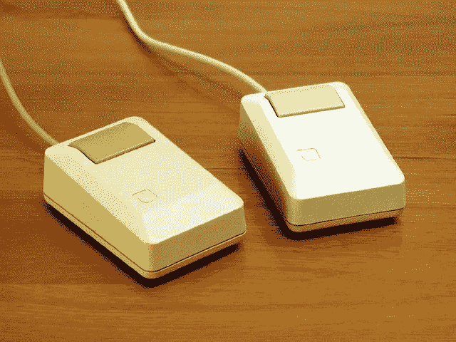
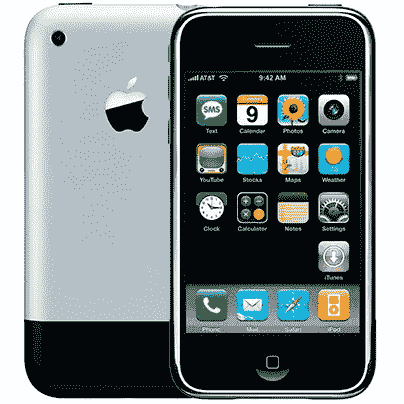
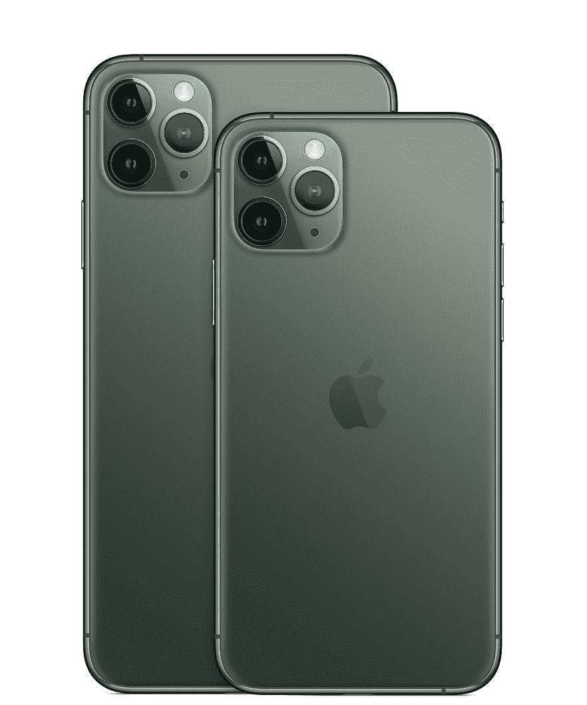
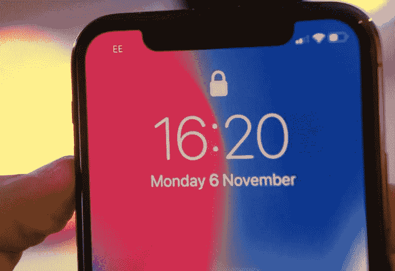
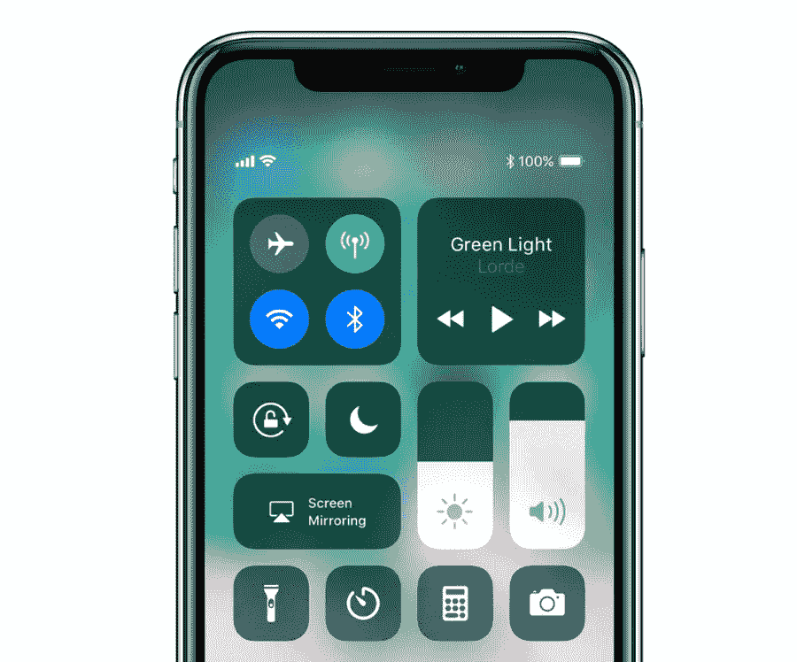

# 苹果会再次给我们带来惊喜吗？

> 原文：<https://medium.datadriveninvestor.com/will-apple-be-able-to-suprise-us-again-8687e11119cb?source=collection_archive---------16----------------------->

Unsplash: [photo-1534802046520–4f27db7f3ae5](https://images.unsplash.com/photo-1534802046520-4f27db7f3ae5?ixlib=rb-1.2.1&ixid=eyJhcHBfaWQiOjEyMDd9&auto=format&fit=crop&w=2202&q=80)

当我开始使用我的第一个苹果产品 iPhone 3GS 时，我开始关注苹果，自从我拥有了那台设备，我就成为了一个狂热的苹果粉丝。我成为粉丝并不是因为 iPhone 成为那段时间最受欢迎的手机之一，而是因为苹果在这款产品上投入的细节水平。

当史蒂夫·乔布斯去世时，我们看到了苹果从引入突破性技术到仅仅跟随其他公司已经开始的当前趋势的衰落。例如，在智能手机行业，制造商开始使用 2 个或更多摄像头来拍摄更好的图像。智能手机行业也引入了突破性的图像处理技术，以提高使用该软件的图像质量。苹果对此的回应是，“好吧，我们也做一个。我们将在实现这一趋势的过程中添加一些类似苹果的东西。”

 [## 苹果会成为新的网飞吗？数据驱动的投资者

### 有可能。然而，该公司肯定会与大公司竞争。许多人不得不看到这一天的到来…

www.datadriveninvestor.com](https://www.datadriveninvestor.com/2019/02/15/will-apple-be-the-new-netflix/) 

所以像我这样的人开始怀疑苹果是否还在创新。

那么…苹果还在创新吗？

## 是啊！

苹果仍在创新，但他们的创新不再有任何“哇”的因素。苹果的期望如此之高，因为无论是手机市场还是笔记本电脑/台式机市场，市场竞争都变得如此激烈。

2007 年，苹果向世界推出了 iPhone。苹果重新发明了手机。它是今天手机的催化剂。

我认为苹果需要找到新的理由，为什么他们应该看看手机必须能够做什么，才能在日常生活中赋予人们权力。

# 蒂姆·库克是问题所在吗？

## 简单的回答是肯定的。

但他不是唯一的问题。但是，我确实认为他对他接任首席执行官后苹果为何缺乏惊人的创新有影响。

让我们检查一下迄今为止最大的软件公司之一，不要看得太远，因为我们要检查一下微软。让我们看看塞特亚·纳德拉和微软在他的领导下是如何创新的。在短短几年内，我们看到微软向企业和消费者市场推出了如此惊人的硬件、软件和服务。令人惊叹的产品，如微软 Office 365 和 Azure。史蒂夫·鲍尔默时代的微软不是这样的，即使是比尔·盖茨时代他们经营公司的时候。是的，史蒂夫·鲍尔默和比尔·盖茨奠定了非常坚实的基础，但让我们看看塞特亚·纳德拉是如何经营微软的。简而言之，他正致力于培养微软内部的文化。同理心盛行的文化。在这种文化中，人们会犯错误，人们会鼓励其他人变得更好。在这种文化中，他们蓬勃发展，通过技术赋予人们权力。这种方法是我认为微软今天成为万亿美元公司的原因。

现在让我们回到苹果。由于蒂姆·库克是我们如此仰视以获取灵感的公司的首席执行官，我认为他的工作之一，除了确保苹果公司保持盈利，就是实践和鼓励苹果公司以其著称的创新。蒂姆·库克在苹果拥有巨大的权威和影响力，但苹果的批评者认为他只是追求数字，让董事会成员开心。在这个视频中，蒂姆·库克(Tim Cook)与乔尼·艾夫(Jony Ive)进行了交谈，乔尼看起来像是在 2019 年 WWDC 活动中，在他们新的 2019 年 Mac Pro 和新的苹果 XDR 显示器上走过蒂姆·库克。这可能暗示着蒂姆·库克其实没那么在乎苹果产品。

苹果需要尽快找到新的愿景。

# 苹果能做些什么再次给我们惊喜？

嗯……我有几个愿望清单，我认为如果苹果公司考虑的话会有意义，我希望我们大多数人会同意这个愿望清单中的一些项目。

## 苹果应该重新发明 iPhone

2007 年，苹果重新发明了手机。它改变了整个智能手机行业。这种范式转变拖垮了受欢迎的手机公司，因为它们无法跟上 iPhone 创造的新市场。而在这个时候，没有一个移动操作系统能与 iOS 相提并论。

2010 年，苹果发布了 iPhone 最具创新性的版本之一 iPhone 4。iPhone 4 如果不是当年最惊艳的智能手机，也是最惊艳的 iPhone。它树立了旗舰手机应该具备的黄金标准。

我所希望的是，苹果应该看看它的辉煌岁月，并从中汲取灵感。从鼠标的发明，到 macOS 的推出，从 iPod 点拨轮的推出，从手机多点触控显示屏的普及，到令人惊叹的东西，不像几乎没有人使用的 3D touch。

一款全新的 iPhone 将为未来十年的手机树立新的黄金标准。

## 让相机简单

2019 年 9 月，苹果刚刚宣布了新的 iPhone 系列，即 iPhone 11、iPhone 11 Pro 和 iPhone 11 Pro Max。iPhone 11 Pro 背面有 3 个相机镜头。我希望苹果能研究这一点并进行创新。我希望他们简化这三个相机模块设置成一个相机模块。

通过这样做，他们可以改变拍照手机应该如何制造的现状，并引领创新，让人们的事情变得简单，而不是变得复杂。对我来说，一部手机有三个摄像头太复杂了，DSLR 只有一个镜头，它有一个大镜头，但我想说的是，为了简单起见，手机摄像头应该只有一个。

有三个摄像头的手机看起来不像苹果设计的产品。让我们来看看麦金塔电脑的第一款鼠标。

看起来很简约。它只有一个按钮。你只需要指向并点击原来的麦金塔鼠标。现在我们来看看初代 iPhone 的设计语言。

The original iPhone

看看当初的 iPhone。它遵循同样的原则。最初的 iPhone 引入了 Home 键。一键点击。正如史蒂夫·乔布斯在他的主题演讲中介绍 iPhone 时说的“无论你在哪里，它都会带你回家”。现在我们来看看 iPhone 11 Pro。

iPhone 11 Pro

看起来苹果方面在这个问题上做出了很多妥协。他们只是把目前市场上有效的东西拿来改编，使之成为他们自己的东西。

## 消除缺口，提高 Face ID

The iPhone notch that started with the iPhone X

老实说，我真的不在乎刻痕。我几乎没有注意到它。我注意到凹口之间的图标与凹口和我的眼睛并不对齐，当我关注这些图标时，我有点沮丧。这看起来“不像苹果”。去掉凹口后，iPhone 乍一看可能和其他手机没什么两样，但 iPhone 是软件。iPhone 是包装在一个漂亮硬件中的软件。当我们打开屏幕时，我们看到了 iOS——我们看到了 iPhone。

## 安全性和性能

安全性和性能三倍下降。这是我仍然选择苹果产品的主要原因之一，即使其他竞争对手提供了更多非常诱人的花哨功能。

另外，我希望苹果不要把安全和隐私作为营销活动。这些年来越来越像这样了。安全和隐私确实很重要，但安全和隐私应该真正融入 iPhone 和整个苹果生态系统的体验中。

## 全新的 iOS 设计

从头开始重建 iOS 用户界面。自 iOS 7 以来，我们已经看了 6 年相同的界面，它变得相当乏味。

把控制面板弄好，苹果。控制板真的很丑。

iOS’ Control Panel

在 iPadOS 中创建桌面级体验。既然苹果试图在他们的 iPad 产品线中推广 Pro 这个名字，既然他们目前在 iPad 上的文件系统访问上加倍努力，他们也可以在 iPad 上创造桌面级的体验。macOS 的强大加上 iPad 的便携性。

## 将订阅作为捆绑包

苹果公司正在创建基于订阅的服务，如 Apple TV+，Apple Music，Apple Arcade，Apple News+，我们可以预计在未来几个月将会有更多的服务出现。看到这种策略让我很痛苦，因为从苹果标准的角度来看，他们的订阅模式很复杂。我喜欢他们的新服务，只是我认为有太多的服务需要付费。不如介绍一种可以提供捆绑订阅的服务。他们目前的做法让苹果看起来非常想要我们的钱。

## 让 Siri 变得有价值

当史蒂夫·乔布斯还活着，还在研发 iPhone 的时候，苹果收购了一家名为 Siri 的小公司。苹果推出 iPhone 4S 时，Siri 是一项杰出的技术。现在，Siri 和 Google Assistant、Cortana 比起来就是又蠢又没用。Siri 正在积灰，因为 Siri 已经多年无人问津了。当然，像 Siri 快捷方式这样的小更新到处都有，但 Siri 仍然没有价值。

语音助手为什么会存在？苹果需要找到他们对这个问题的答案。如果我要回答这个问题，我会说语音助手的存在是因为它是用户界面的未来。语音助手

## 让 iPhone 更薄

我怀念史蒂夫·乔布斯还活着的日子，因为他总是推出 iPhone 的新版本。他总是比较旧模型和新模型的厚度，然后他要求观众思考他们做了什么来完成这样的壮举。

人们不喜欢更薄的手机，尤其是更薄的 iphone，因为从技术上来说，苹果还降低了手机的电池容量，以适应薄机箱。

## **做一个碳纤维 iPhone**

如果苹果从异国情调的汽车中获得设计灵感，并向大众市场大规模生产一款受异国情调的汽车启发的 iPhone，并且他们开始使用碳纤维等材料来制造他们的手机，那该有多棒。

Pagani Huayra’s Open Carbon Fiber paint

## 让 iPhone 自己供电

也许这个功能远远领先于它的时代，但这就是挑战，对不对？比尔·盖茨刚刚花费了数百万甚至数十亿美元来革新厕所，使其能够为帮助非洲而提供动力。如果比尔·盖茨可以投资自供电厕所，为什么苹果不能在 R&D 投资一部可以自供电的 iPhone，对吗？

## 或者做一个真正无线充电的 iPhone

我不是很懂无线充电。我们插上无线充电板，然后把手机放在无线充电板上。如果我拿起手机，手机将不再充电，因为它失去了与无线充电板的联系。我认为苹果公司也想到了这一点，但他们只是妥协，为他们的 iPhones 实现 Qi 无线充电，因为市场需要它。

我希望苹果能够找到一种方法，真正实现真正的无线充电体验，因为苹果相信真正的无线未来。

## 制作专业版 iPhone 变体

加载疯狂的性能，疯狂的前后摄像头的东西。做一个专门针对 Pro 用户的 iOS。

## 把这该死的东西改成 C 型

照明端口不再需要存在。我认为苹果选择创建照明端口是因为我们永远不会犯把 lightning 连接器插到你手机上的错误。插入 lightning 连接器没有错误的方法。但是，USB Type-C 是现在的标准。我认为降闪电采用 USB Type-C 是一个实际的举动。

## **让苹果产品中的苹果 Logo 再次发光**

用苹果产品的人，往往不盖苹果 logo。他们大胆地展示它，因为他们是自豪的苹果产品所有者。

苹果因使用其技术改变人们的生活方式而闻名。我希望苹果能够再次找到他们的精神，并向世界展示如何使用能够以天衣无缝、感觉恰到好处的方式实现的技术。