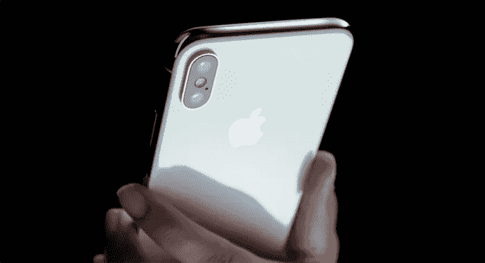

# 苹果会成为新的《碟中谍》吗？

> 原文：<https://medium.datadriveninvestor.com/will-apple-be-the-new-mission-impossible-dca2d95d522b?source=collection_archive---------24----------------------->

## 打电话给汤姆·克鲁斯。由于机器学习和面部识别，我们有了最新的电影。

提示主题曲。开始用你想象中的枪躲进躲出，你要挑战困难，完成挑战死亡的壮举，用你的*苹果电脑*？？等等，什么？？

如果你仔细想想，这确实与事实相差不远。毕竟，我不认为 Ethan Hunt 会考虑带着他的 iPhone 到处走。毕竟，这是最先进的技术，尤其是在[查看了苹果公司在这个行业即将推出的产品](https://vigyaa.com/@pierre/6-developments-well-see-from-apple-soon-if-we-havent-already-7296bed7/)之后。它是巨大的。

 [## 苹果会成为新的网飞吗？-数据驱动型投资者

### 有可能。然而，该公司肯定会与大公司竞争。许多人不得不看到这一天的到来…

www.datadriveninvestor.com](https://www.datadriveninvestor.com/2019/02/15/will-apple-be-the-new-netflix/) 

# 苹果正在做的最新事情是利用机器学习来整合面部识别

实际上，我们已经在最新的 iPhones 上看到了这一点。生物识别是它的优势所在。将此与[人工智能](https://vigyaa.com/@pierre/will-apple-go-ai-or-stick-with-the-iphone-f251a150/)相结合，这就是新时代，真正的科幻小说变成了现实，可以让汤姆·克鲁斯成为现实生活中的少数派报告！这是数据安全的最佳状态，但是让我们诚实地说:*这是一件好事吗？还是说这给了黑客和网络恐怖分子更多的机会？*

面部识别是这样的:问题在于缺少**主动意图**。对于其他流程，如双因素认证系统、验证码等，您必须主动*输入代码或指纹才能成功访问这些系统。面部识别实际上不一定需要任何*主动*意图。*

换句话说，你甚至不需要意识到你的脸正在被扫描。让这句话在你的大脑中沉淀一会儿，想象一下网络恐怖主义的可能性。

然而，现实地说，对于一个黑客来说，要做到这一点是一项艰巨的任务，但我们也见过更疯狂的事情——比如伊森·亨特爬山或建筑。还有[自系带运动鞋](https://vigyaa.com/@pierre/thats-one-small-step-for-man-one-giant-leap-for-smart-sneakers-c138565f/)，虽然理论上可以被黑客攻击，但实际上不会成为问题，原因有很多。

现实可能永远看不到网络恐怖主义和面部识别问题的原因是，机器学习算法将知道其中的区别。当然，一个青少年可以尝试闯入他/她父母的房间，扫描他/她妈妈或爸爸的脸，只是为了侵入电话。但系统会根据父母的眼睛仍然会闭着(推测父母会睡着)这一事实来知道差异。

鉴于数据矩阵考虑了 3D 成像，照片甚至无法通过面部识别的机器学习算法。由于“图片”在 3D 世界中并不存在，所以没有人能够成功地闯入或侵入利用这种技术的系统。实际上，任何人都有可能侵入这个系统的唯一方法是，你进行整形手术，改变你的脸(就像吴宇森的电影《面对面》中尼古拉斯·凯奇和约翰·屈伏塔那样)。但是，嘿，那太牵强了！

我们可以想象，黑客能够侵入这种系统的唯一途径是，如果他们在一副眼镜或其他物体上安装一个微型摄像头，基本上“复制”罪犯或受害者的脸，并将矩阵传递到手机上——只要黑客有手机，而机主不知道。

虽然听起来很牵强…信不信由你，这是一种可能性。也很恐怖。

# 尽管如此，这仍是一项处于最佳状态的创新技术，苹果在这方面处于领先地位

面部识别不仅仅是手机拍一张简单的“照片”它将与他们的新 iPhone X 一起工作的方式是，该设备将在扫描环境中投射总共 3 万个潜在的**点**，就像设备如何记住你的指纹一样。取而代之的是，你的设备将会记录你面部的真实的 **3D 地图**，在一个新的 A11 仿生芯片中处理，只有*直接在手机上存储内存。*

理解这一点很重要，因为您不希望这种信息存储在云中。然而，如此重要的登录信息只存储在手机上，如果黑客能够以某种方式侵入，这就为入侵一个简单的设备并访问大量信息提供了一个很好的机会，但这不是重点。

结果是天衣无缝。你实际上只需要戴上一副集成了这种技术的眼镜，这些眼镜中的机器学习*复制*你的脸，并利用它作为一种安全形式。你能相信我们如此接近拥有这种技术吗？这是真的。

人工智能是数据安全的强大驱动力，因为它是一个旨在适应和分析的框架。理论上，网络钓鱼攻击将成为遥远的过去。Bot 网络将会灭绝。社会工程策略面临障碍。这几乎就像面对索伦之眼，没有人能够靠近而不被发现。

# 我们绝对可以称面部识别为铁证…也就是说，直到…

毫无疑问，黑客可能会找到方法和漏洞来破坏这种系统，但只要像苹果这样的品牌一直保持关注和命名，就没有人会受到损害。很多。一切都会变得更加复杂——至少对于设计这些新技术的专业人士来说是这样。

其他人呢？我们只会从中受益。面部识别技术超级简单。这甚至比使用你的指纹更容易。你所做的就是盯着你的手机！就是这样。谈方便。当然，考虑到 3D 映射结构，它应该更加安全。

感谢上帝，我的女儿们没有想到在我睡着的时候轻轻地拿走我的手机，把我的手指按在按钮上。

如何看待这个新任务:不可能的技术？酷吗？还是没有？ [**现在就注册一个 VIGYAA 账户**](https://vigyaa.com/accounts/login/) ，也一定要去 [**看看《数据驱动投资者》了解更多技术见解**](http://datadriveninvestor.com) ！