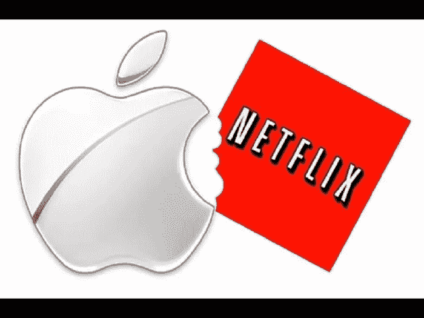

# 苹果会成为新的网飞吗？

> 原文：<https://medium.datadriveninvestor.com/will-apple-be-the-new-netflix-f85c993f2242?source=collection_archive---------24----------------------->

有可能。然而，该公司肯定会与大公司竞争。

鉴于我们所看到的技术趋势，许多人必须看到这一天的到来:我们不再生活在以设备为中心的基础上，尽管我们许多人直到今天仍然把智能手机当作解毒剂。相反，我们选择了云技术和基于订阅的服务，旨在为我们提供丰富的产品，实际上是我们想要的。很明显，像 *Blockbuster* 这样的畅销品牌——DVD、CD 等——突然走向了渡渡鸟之路，以换取更为*的数字化产品*。

# 是的，基于云的订阅服务引领着娱乐技术的发展，但这意味着苹果也应该走这条路吗？

随着 iPhone 销量继续下滑，我们可能别无选择，该公司正在寻找新的方法来渗透趋势市场，并从订阅市场中分一杯羹。正如你从阅读中看到的，馅饼是与娱乐相关的媒体市场——像 Hulu 和网飞这样的平台有一个据点。

美国消费者新闻与商业频道最近报道称，苹果计划提供 Starz、CBS 和 Showtime 等热门网络的订阅服务，内置了自己的电视应用程序，你可以在 iPhone 或 iPad 上使用，尤其是你刚刚花了一大笔钱购买的 Apple TV。当然，公司会从中提成，但是信不信由你，苹果甚至会一头扎进*最初的编程路线*。

没错，你没听错:**苹果可能成为新的网飞*。***

# 我们应该感到害怕，认为这将是一场全面的媒体流战争吗？

毕竟，我们已经让迪士尼这个超级巨头推出了自己的流媒体服务。但是不要担心。最终受益人是*你*:消费者**。苹果公司有足够的影响力来支持他们的这一目标，像瑞茜·威瑟斯彭、史蒂文·斯皮尔伯格和奥普拉·温弗瑞这样的人才已经签约观看一些原创节目，是的，的确，你可以在自己的 iPhone 上独家观看——完全免费。**

**打败它，网飞。**

**你认为“橙色是新的黑色”品牌应该担心吗？ [**加入你自己的免费 VIGYAA 账户，写下你的想法！**](https://vigyaa.com/accounts/login/)**

***亦发表于*[【vigyaa.com】](https://vigyaa.com/@pierre/will-apple-be-the-new-netflix-707de562/)**。****

**最初发表于 datadriveninvestor.com。**