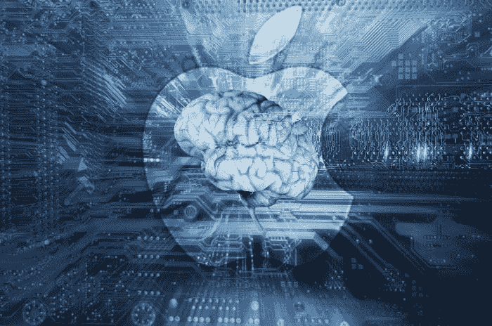

# 苹果会走 AI 还是坚持 iPhone？

> 原文：<https://medium.datadriveninvestor.com/will-apple-go-ai-or-stick-with-the-iphone-3ee7f467d368?source=collection_archive---------19----------------------->

和 iPhone 说再见宜早不宜迟。

嗯，不是，像是，明天或什么的。毕竟，[移动技术仍然在社会上扼杀它](https://vigyaa.com/@pierre/5-reasons-why-mobile-technology-benefits-the-money-minded-00331c57/)，但事实仍然是:苹果看到 iPhone 的销量一降再降。越来越多的人认为，随着其他沉浸式创新技术取而代之，数字设备可能会灭绝。随着苹果继续瞄准相关性，猜猜他们打算瞄准什么创新？ [*艾*。](https://vigyaa.com/@pierre/3-main-reasons-why-ai-technology-shouldnt-be-a-religion-c138565f/)

# 人工智能将很快成为苹果的标志

也就是说，如果它还没有成为标志的话。你听说过 Google Home，对吗？亚马逊在 Alexa 上也有自己的竞争对手。围绕智能扬声器创新的是[人工智能](https://vigyaa.com/@pierre/heres-why-malaysia-believes-that-artificial-intelligence-will-us-0660d26a/)的超能力，它不仅能够娱乐，还能提供信息资源，而无需敲击键盘。

我们可能已经忘记了，但是是苹果公司给我们带来了 Siri 的突破。然而，正如你可能看到的，古老的数字助理已经被每个人都在谈论的谷歌和亚马逊所取代。但不会了。

苹果会反击。怎么会？正如我们所说的，他们正在大力投资于人工智能的改进，重组算法和机器学习部门，努力夺回他们创造的宝座。当心，谷歌和亚马逊。

# 当然，你值得信赖的 iPhone 也在其中

正如我们所提到的，你总是可以使用这些智能手机，但它们可能是我们都希望拥有的内置技术的可信附件，而不是相反。我们不断看到 iPhone X、iPhone X2、iPhone XX、iPhone 永恒，或者诸如此类的东西，但事实是“升级”可能不再是必要的，相反，你的 iPhone 可能只是苹果寻求实现的技术的载体——例如人工智能。你先看这里。

我们还需要读什么吗？ [**最好注册一个自己的免费 VIGYAA 账号，开始写最新的技术趋势吧！**](https://vigyaa.com/accounts/login/)

【vigyaa.com】最初发表于**。**