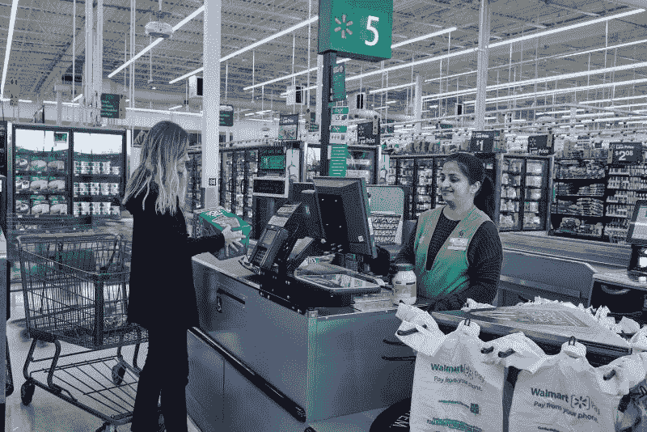
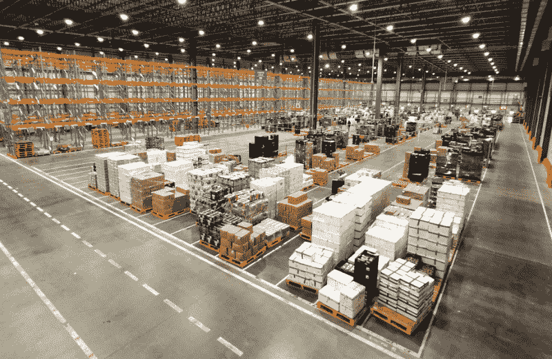
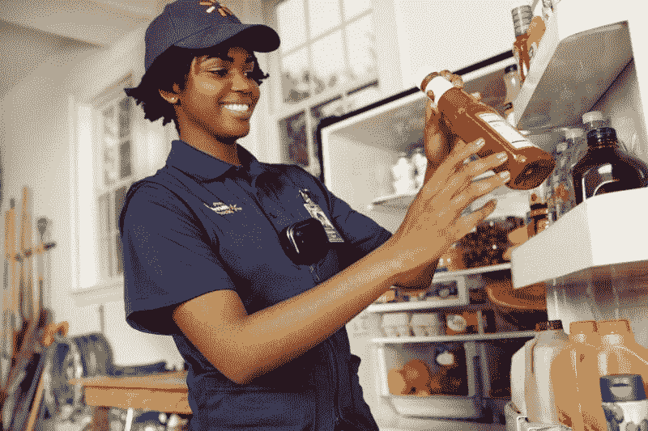
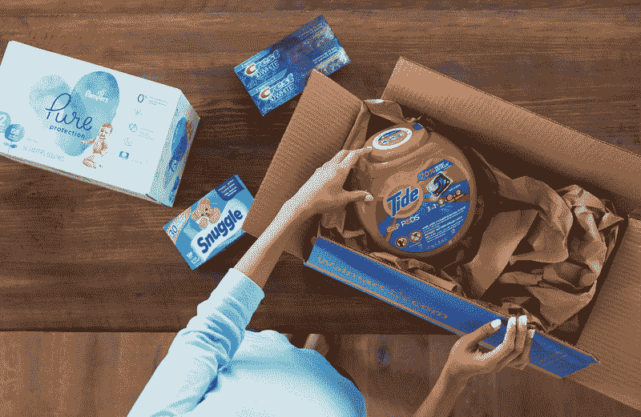
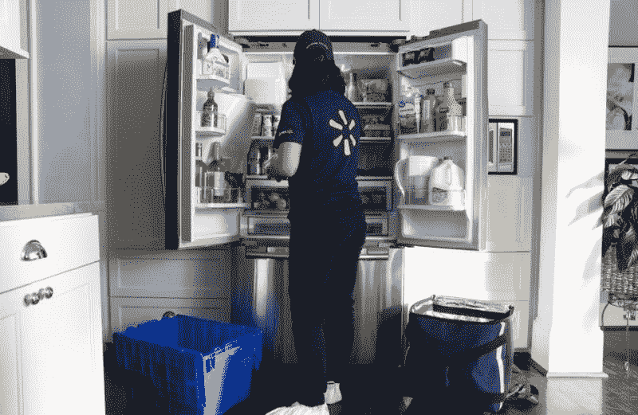
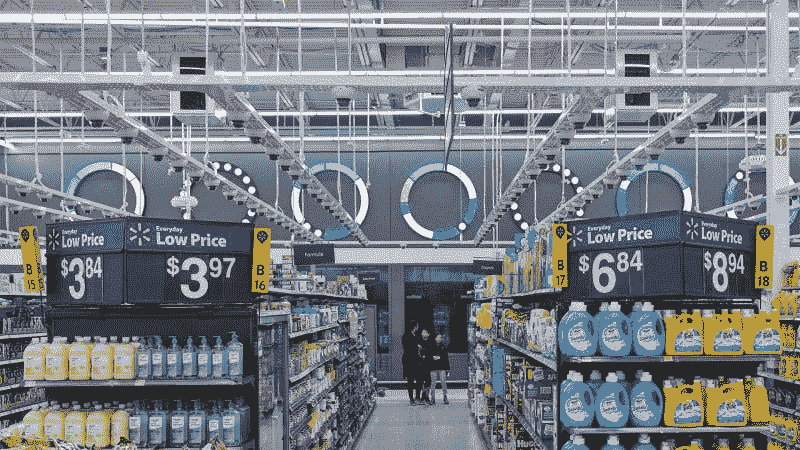

# 人工智能和机器人会给沃尔玛带来回报吗？—市场疯人院

> 原文：<https://medium.datadriveninvestor.com/will-artificial-intelligence-and-robots-pay-off-for-walmart-market-mad-house-4ce23393808f?source=collection_archive---------10----------------------->

沃尔玛(纽约证券交易所:WMT) 在人工智能和机器人上下了大赌注。具体来说，这家零售巨头正在押注客户将自愿接受人工智能(AI)的行为科学实验。

事实上，[将长岛沃尔玛社区市场](https://marketmadhouse.com/walmarts-ai-customer-surveillance-raises-ethical-questions/)改造成了人工智能研究实验室和数据中心的结合体。沃尔玛[在一份新闻稿中承认](https://corporate.walmart.com/newsroom/2019/04/25/walmarts-new-intelligent-retail-lab-shows-a-glimpse-into-the-future-of-retail-irl)，人工智能通过特殊的摄像头监控顾客行为、库存水平和其他因素。

 [## 值得购买的 4 大人工智能股票及其原因|数据驱动型投资者

### 人工智能(AI)在 2019 年继续进入大众意识。通过应用程序…

www.datadriveninvestor.com](https://www.datadriveninvestor.com/2019/03/06/top-4-artificial-intelligence-stocks-to-buy-and-why/) 

店内 AI；或称智能零售实验室(IRL)，可以识别货架上的产品，并将数量与销售额进行比较。此外，人工智能告诉员工他们需要补充哪些产品。

“重点将是从技术中学习，而不是匆忙地实施经营变革，”沃尔玛在 IRL 中写道。因此，沃尔玛致力于人工智能的长期发展。

# 沃尔玛部署机器人军队

人工智能并不是沃尔玛在其门店部署的唯一实验性技术。

据报道，*Big Think*沃尔玛将数以千计的机器人放在销售区。例如，机器人门卫将清洁地板，而简单的机器人将监控库存水平。

# 沃尔玛计划实现库存自动化

与此同时，沃尔玛正在 1200 家门店测试“快速卸载机”(FAST Unloaders)，这是一种自动卸载传送系统。

[快速卸载机](https://www.pulseroller.com/resources/pulsenews/walmart_s_new_fast_unloader_shows_intelligence_of_motor_driven_roller_conveyors)是一条自动传送带，它将箱子从卡车上卸下，并放入手推车。员工将购物车放在商场的适当位置。有趣的是，FAST 的制造商；Pulseroller 声称，其系统可以通过读取条形码将商品导向正确的位置。

沃尔玛可以通过使用机器人推车将商品运送到正确的位置来进一步自动化这个系统。例如，FAST 可以装载一辆装有玩具的手推车，汽车将开到玩具部。一旦进入该部门，一名员工将打开商品包装并上架。

# 自动化备货会给沃尔玛增值吗？

沃尔玛的管理层希望通过自动化备货来降低劳动力成本，提高效率，加快运营速度，降低损失风险。

机器人库存可以通过减少人为错误和员工盗窃的可能性来减少损失。例如，机器人不可能偷电视机并把它们卖给销赃者。

我认为自动化进货可以给沃尔玛增加很多价值——如果可行的话。例如，由于劳动力成本降低，沃尔玛可以开设更多的商店。此外，沃尔玛可以在劳动力成本高的地区开设更多门店；比如最低工资为 15 美元的城市。

此外，沃尔玛可以储存更多的商品和更多种类的物品。重要的是，沃尔玛可以将节省下来的成本以低价的形式传递给消费者，从而增加销售额。

最后，自动化库存将通过降低价格、增加品种和效率来帮助沃尔玛与亚马逊竞争。最后，沃尔玛可以通过少花钱多办事来增加利润。从理论上讲，沃尔玛可以用更少的员工经营更多的商店和更大的商店。

# AI 管理会帮助沃尔玛赚更多的钱吗？

库存不是唯一的劳动力成本，沃尔玛正试图削减。美国消费者新闻与商业频道[报道](https://www.cnbc.com/2019/05/02/walmart-is-testing-ways-to-trim-the-size-of-its-store-management-staff.html)沃尔玛正试图削减管理人员的规模。

鉴于这一启示，IRL 的一个目标可能是用算法或人工智能取代商店经理。解释一下，代替经理，人工智能可以告诉沃尔玛员工做什么。人工智能可以告诉员工该补充什么，该淘汰什么过时的产品。

沃尔玛在这里承担了巨大的风险，因为没有人知道人类员工会对人工智能管理做出什么反应。我的猜测是一些同事可能会欢迎人工智能管理，毕竟人工智能可能比许多经理更聪明。此外，人工智能不太可能是种族主义者，傲慢，腐败，性别歧视，或吹毛求疵。

# AI 会取代人类零售经理吗？

人力经理经常在微观管理、挑剔、不必要的培训和无用的建议上浪费员工的时间。因此，取消经理可以让商店更有效率，提高员工士气。

奇怪的是，寻找或培训优秀的零售商经理很难。我看到一些迹象，承诺给推荐有经验的零售经理到**美元树商店(纳斯达克:DLTR)** 工作的人现金奖励。考虑到竞争，沃尔玛希望停止开办零售经理学校。

最后，裁员可以让沃尔玛提高工资和福利。因此，沃尔玛只能雇佣几名经验丰富、能力出众的员工来经营门店。像好市多(纳斯达克股票代码:COST) 一样，沃尔玛可以为最好的员工支付额外的薪酬。

# 沃尔玛激进的零售实验

沃尔玛正在进行一项激进的零售实验，它可能会像亚马逊正在做的任何事情一样具有颠覆性。因此，沃尔玛承担了巨大的风险，投资者需要理解这一点。

在这种情况下，投资者会问沃尔玛是否赚钱。一般来说，除非管理层感到害怕，否则公司不会进行激进的实验。因此，我认为这种情况让沃尔玛的管理层感到害怕，这种情况应该会让投资者感到害怕。

值得注意的是，沃尔玛在 2019 年 4 月 30 日报告称，其季度收入一年来首次下降。为了解释这一点，沃尔玛报告称，2018 年 7 月 31 日的季度收入为 1280.28 亿美元，2019 年 1 月 1 日为 1387.83 亿美元。然而，沃尔玛在 2019 年 4 月 30 日报告的季度收入为 1239.25 亿美元。

然而，沃尔玛的收入成本正在下降，这证明了新技术实验的合理性。具体而言，沃尔玛在 2019 年 1 月 31 日报告的收入成本为 1049.07 亿美元，到 2019 年 4 月 30 日降至 930.34 亿美元。因此，沃尔玛对新技术和效率的承诺可能会有回报。

# 沃尔玛赚钱了吗？

沃尔玛从业务中赚的钱越来越少。例如，沃尔玛报告 2019 年 4 月 30 日的季度毛利为 308.91 亿美元。

该毛利低于 2019 年 1 月 31 日的 338.86 亿美元和 2018 年 4 月 30 日的 303.83 亿美元。此外，沃尔玛的毛利从 2018 年 4 月 30 日的 57.5 亿美元和 2019 年 1 月 31 日的 60.57 亿美元下降至 2019 年 4 月 30 日的 49.45 亿美元。

相反，沃尔玛的净收入从 2018 年 4 月 30 日的 21.34 亿美元上升；以及 2019 年 1 月 31 日的 36.97 亿美元，至 2019 年 4 月 30 日的 38.42 亿美元。因此，沃尔玛赚的钱变少了，但保留的钱却多了一点。

也许这些数字表明沃尔玛正在变得更有效率。另一方面，这种效率可能不足以扭转沃尔玛的收入下滑。

# 沃尔玛的现金流正在下降

不祥的是，沃尔玛的业务产生的现金越来越少。具体来看，沃尔玛的自由现金流从 2018 年 4 月的 35.41 亿美元降至 2019 年 4 月的 14 亿美元。此外，沃尔玛的运营现金流从 2018 年 4 月的 62.13 亿美元降至 2019 年 4 月的 62.13 亿美元。

奇怪的是，在截至 2019 年 4 月 30 日的季度，沃尔玛的收入增长了 1.01%。我认为收入增加和现金流下降表明，沃尔玛不得不花更多的钱来销售商品。因此，沃尔玛的支出可能会增加。

考虑到沃尔玛的现金流下降，推动人工智能管理、自动进货和机器人技术是合理的努力。简而言之，如果沃尔玛想生存下去，它需要迅速提高效率。

# 沃尔玛能保持竞争力吗？

特别是，沃尔玛管理层希望以更少的员工维持该公司在美国的 4769 家门店。此外，管理层希望保持沃尔玛的历史低价；这是它在零售战中最大的优势。

值得注意的是，竞争对手如**克罗格(纽约证券交易所代码:KR)**；美国第二大杂货商，**、沃尔格林(NASDAQ: WBA)、**和亚马逊都在增强自己的能力。例如，Kroger 计划在英国公司 **Ocado Group PLC (LON: OCDO)** 、*数据驱动投资者* [报道](https://www.datadriveninvestor.com/2019/05/03/ocado-leads-the-robotization-of-retail/)的帮助下，在美国开设 20 个机器人履行中心。

值得注意的是，我最近买了一瓶 100 支装的拜耳阿司匹林，在沃尔格林超市通常售价 3.39 美元，实际售价 13 美元。因此，沃尔格林正在模仿沃尔玛的深度折扣策略。

这些发展可能会迫使沃尔玛在高风险技术和新基础设施上进行昂贵的投资，以保持竞争力。特别是，日益激烈的竞争可能会迫使沃尔玛开设数百家新的小型门店，配备昂贵的自动化库存系统，以对抗沃尔玛的低价。

因此，沃尔玛可以花费大量资金来保持竞争力；此外，它还需要投资数十亿美元用于当天送达基础设施。因此，**沃尔玛(纽约证券交易所:WMT)** 可能是一项比许多人想象的风险更大的投资。

# 沃尔玛有多少现金？

值得注意的是，沃尔玛的流动资产比你想象的要少。例如，2019 年 4 月 30 日，沃尔玛没有短期投资。然而，沃尔玛当天有 92.55 亿美元的现金和等价物。

另一方面，**亚马逊(纳斯达克股票代码:AMZN)** 在 2019 年 3 月 31 日拥有 37.027 美元的流动资产。具体而言，截至 3 月底，亚马逊报告的现金及等价物为 231.15 亿美元，短期投资为 139.05 亿美元。

沃尔玛拥有大量现金，但其最大的竞争对手拥有近四倍的现金。仅此一点就将使沃尔玛难以竞争。

# 沃尔玛(纽约证券交易所代码:WMT)被高估了吗？

鉴于现实和财务数据，我认为市场先生在 2019 年 7 月 18 日将沃尔玛的估值高估了 114.16 美元。

然而，我承认沃尔玛仍然是一只不错的股息股，将在 2019 年 9 月 3 日向 53₵支付每股股息。此外，沃尔玛的股息在 2019 年由 1₵增长，该公司的 52₵股息在 2019 年 1 月 2 日增长，53₵在 2019 年 4 月 1 日增长。

令人印象深刻的是，沃尔玛持续了 44 年的股息增长，Dividend.com 报道。此外，2019 年 7 月 18 日，沃尔玛股票向投资者提供的股息收益率为 1.85%，年化股息为 2.12 美元，派息率为 44.1%。

总之，沃尔玛仍然是一只不错的分红股票，但该公司正在承担严重的风险。投资者需要小心沃尔玛，因为其管理层正押注于技术。

*原载于 2019 年 7 月 18 日*[*【https://marketmadhouse.com】*](https://marketmadhouse.com/will-artificial-intelligence-and-robots-pay-off-for-walmart/)*。*