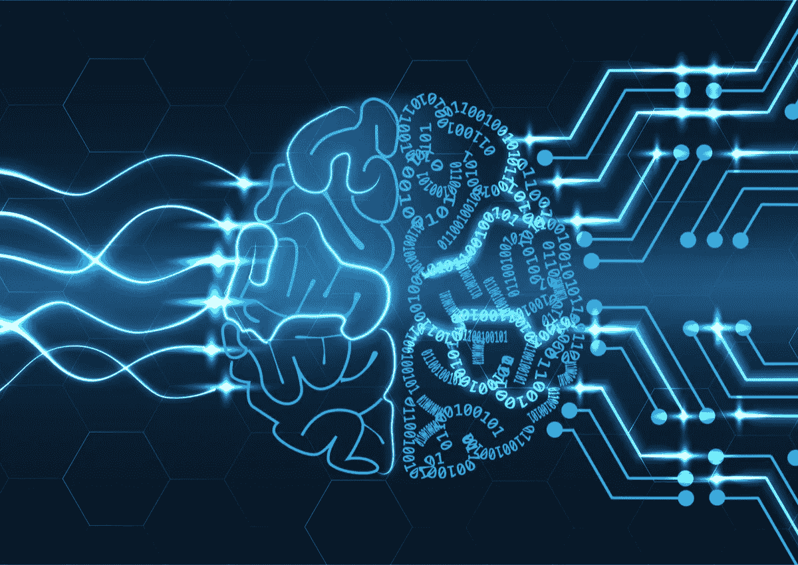

# 人工智能会给我们提供更多的自由吗？

> 原文：<https://medium.datadriveninvestor.com/will-artificial-intelligence-provide-us-with-more-freedom-2315e6ea8a72?source=collection_archive---------0----------------------->

## 人工智能(AI)将从根本上影响我们的社会和政治现实。技术将给我们的生活带来巨大的变化。但是我们怎么能保证我们会从中受益呢？

AI 革命显然不同于以往的工业革命。机器的引入本应通过将工作委托给电器来改善我们的生活，但它实际上促进了一种私人生活和工作之间界限模糊的生活方式。根据最近的未来学家预测，人工智能反而会给我们带来体验一种新生活的可能性，赋予我们更多属于自己的时间，这将我们从义务中解放出来，例如身体紧张、压力大的工作。

然而，有一件重要的事情需要考虑。在一个算法将掌管最重要决策的社会，我们还能定义自己是自由的吗？我们应该对人工智能实施哪些规定和限制，以确保我们将获得更多自由，而不会被机器所控制？

 [## 挑战你对人工智能和社会的看法的 4 本书——数据驱动的投资者

### 深度学习、像人类一样思考的机器人、人工智能、神经网络——这些技术引发了…

www.datadriveninvestor.com](https://www.datadriveninvestor.com/2019/02/28/4-books-on-ai/) 

在我看来，这个问题的答案取决于读者心目中的自由是哪一种哲学概念。在这篇文章中，我将讨论两种自由的概念，以及人工智能将如何为我们提供它。

最后，我将考察有关政治现实和文化转型的潜在问题。

首先，由于技术的发展，考虑我们的社会将会发生的变化是必要的。

人工智能已经得到广泛应用，其应用可能会进一步扩大，影响工作生活和治理。

事实上，人工智能结束了专家的时代。如今，数据分析和机器学习能够通过分配风险分数和比较每个选择的结果来快速评估行动的过程。

数据分析预测总是比任何人类评估考虑更多的因素、可能的后果和更长的时间视角。因此，由算法开发的成本收益分析将总是更有效率。

出于这个原因，人工智能已经管理了公司和政府的许多业务。

例如，人工智能的形式，如社交媒体控制和预防犯罪的个人行为预测，突出了恐怖主义活动和对国家安全的重大威胁，需要干预。

人工智能通过无人机和地理地图，协调全球范围内的灾害应对，并监测社会福利资金的最佳分配，这保证了社会和经济的可持续性。人工智能也在公共医疗保健中发挥着重要作用，它审核疾病状况的统计数据，提供预防性诊断和计划治疗。

其他可以添加到这个列表中的例子:城市规划，金融欺诈预防和分析，以及执法只是人工智能最发达的分支中的一些。

总之，很明显，人工智能可以替代治理的角色。唯一需要采取的行动是收集数据和设定短期、中期和长期目标。在那之后，人工智能将基本上向我们指出实现这些目标的最佳路径。

职业生活也将以同样的方式发生革命性的变化。我们已经见证了人工智能在许多工作领域的应用:不仅是制造业，还有农业、金融服务、医疗保健和零售。

出于这个原因，一个跨大西洋的思想家网络目前正在倡导一个深刻不同的国家未来，它提供了诱人的承诺:工作少得多或根本没有工作的生活，更平静，更平等，更共有，更愉快，更体贴，更充实。尽管这种*后工作*预测仍然存在问题，但它不再被视为乌托邦。

然而，在机器人为我们工作的未来，我们真的能自由决定如何分配资金、如何管理公司和调节国际政策关系吗？

如果管理得当，技术革命将赋予我们自由，原因有二。

首先，基于人工智能的社会最终可以为我们每个人提供规划我们渴望的生活的基本机会。其次，它将捐赠给我们最宝贵的资源，我们总是用完:时间。

第一个陈述回顾了阿马蒂亚·森和玛莎·努斯鲍姆讨论的自由概念，以及菲利普·佩迪特提出的作为非支配的共和自由。

根据“人类发展方法”，社会应该确保能力的最低限度，并让公众决定是否行使这些能力。例如，一个好的社会应该给每个人过健康生活的可能性。然后，每个人都应该自由决定他或她是否想以一种健康或不健康的方式生活，而不被评判。

正如人类发展指数清楚表明的那样，能力的最低限度可以用数量来界定。统计数字和密码可以告诉我们什么时候生命可以被认为是“正常长度”和“健康的”我们再次看到了数据的相关性。数据可以衡量基本人权是否得到尊重。值得注意的是，任何可以翻译成数据的东西都是人工智能的*语言*的一部分。

我的观点认为，任何一个生活在基本权利得到保障的社会中，并且能够按照自己的意愿生活的人，都可以被认为是自由的。

因此，算法可以在保障自由方面发挥巨大作用。最低阈值可以翻译为 AI 需要达到的分数:为了完成结果，最佳选项将被明确指出。

然而，人工智能的干预必须限于社会领域。人工智能的作用应该是致力于确保社会中每个人的福祉有平等的可能性。

因此，它应该处理全球或国家一级的决定，而不干涉私人生活。由此产生的自由可以理解为非任意干涉。

第二个假设是，通过赢得时间，我们将获得自由。

感谢人工智能，我们将有更多的时间为自己，重新发现人文。因此，我们将是自由的——从责任中解脱出来，自由地专注于让我们不同于机器人的东西:社会关系、创造力和创新。要做到这一点，人类需要培养那些区别于机器人的特征。预测和未来学家的分析表明，由于我们将有可用的时间，哲学、艺术、手工和社会关系等方面将被重新唤醒。我们的技术未来将是全人类的，而不是技术。

越来越多的人工智能部署不会彻底改变公民在政治现实中的角色，但会给社会带来有意义的文化变革。

事实上，可能的担忧会质疑我们在政策制定中的角色。它会变成一个设定目标的问题，并把他们的成就委托给比我们功能更好的工具吗？

这听起来可能不可接受。尽管如此，我估计它相当于我们现在的情况。

在目前的选课制度下，参与度微乎其微。代表制不会促进直接的公民参与。民主被认为是一种选择谁来为我们做决定的可能性——选择其“建议菜单”更符合我们利益的代表——而不是直接参与政治现实。

此外，全球事务变得越来越复杂，无法由单一的个人来处理。

因此，将这样的决策过程留给我们可以雇佣的最好的专家——人工智能——会更有效率。

最后，未来派预测着眼于在这样的环境中发展的技能。他们将不再是专业的狭隘知识，而是横向思维，创造性，原创性。能够思考，能够批评，能够表达自己的观点。这是否意味着我们将在智力上自由，不受任何意识形态或常识的支配？

总之，如果我们以适当的方式欢迎人工智能，未来对我们来说是积极的。

我们有机会通过技术实现人类解放。

像机器统治这样的非理性恐惧不能让我们对这个机会视而不见。我们必须记住,“寻求凌驾于他人之上的权力”这一概念仅仅是人类才有的。

我们将能够忘记我们因时间而感受到的持续压力，我们将不得不更多地依靠我们内在的人类特征。

然而，人工智能的使用带来了许多其他的影响和可能的威胁，我不会在这里讨论。

这是我的最后一个问题，我想以此结束:如果我们假设这种情况将成为现实，人类将能够处理他们被给予的自由吗？我们会献身于人文学科，还是会提出新的所谓问题，或作品，或义务，因为毕竟我们需要我们的生活被统治？

请随意评论和分享你对这个话题的看法。