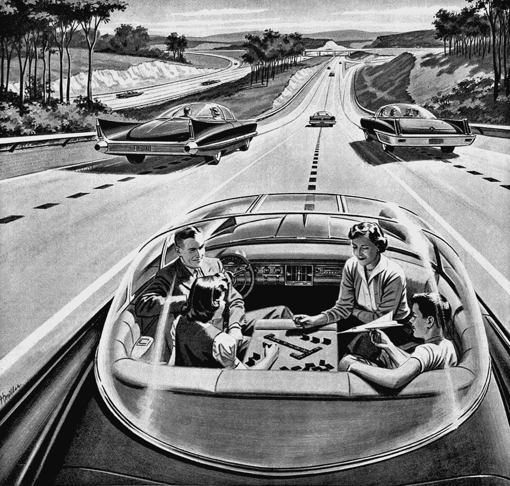

# 阿西莫夫的机器人定律会应用到自动驾驶汽车上吗？

> 原文：<https://medium.datadriveninvestor.com/will-asimovs-laws-of-robotics-be-applied-to-self-driving-cars-ca7b9be0b775?source=collection_archive---------8----------------------->

无人驾驶汽车可能是智能个人机器人的第一个实际和有用的应用，许多人将拥有智能个人机器人，与智能个人机器人互动，经常使用智能个人机器人，而不是玩具。也是人工智能(AI)最早的有用应用之一。我想知道我们是否会要求这些机器人遵循艾萨克·阿西莫夫机器人定律(也被称为机器人三定律)？

阿西莫夫是一位作家，主要写科幻小说，还是一位生物化学教授。他写了大约 500 本书；大部分是科幻小说，但也有科学事实、历史和关于宗教的。他是波士顿大学的生物化学教授，并获得了纽约哥伦比亚大学的生物化学博士学位。他于 1992 年去世。

阿西莫夫是我最喜欢的科幻小说作家之一，我也读过他的许多非小说类书籍，包括一本帮助我进入工程学校的书。阿西莫夫的机器人定律首次出现在 1942 年的短篇小说*中。我第一次读到它们是在他的小说《T2:钢铁洞穴》中，当时我还是个少年。*

阿西莫夫的机器人定律是为了人类的安全而被编程到所有机器人中的，不能被绕过。以下是阿西莫夫的机器人法则，按照机器人的优先顺序排列:

1.机器人不得伤害人类，也不得坐视人类受到伤害。

2.机器人必须服从人类给它的命令，除非这些命令与第一定律相冲突。

3.机器人必须保护自己的存在，只要这种保护不违反第一或第二定律。

如果这些机器人定律被用于自动驾驶汽车，它们将被编程到自动驾驶汽车中，并且在所有者没有转换到手动驾驶模式的情况下，所有者可能无法改变它们。

Source: Americas Electric Light and Power Companies

我有几个关于自动驾驶汽车和阿西莫夫机器人定律的问题:

*车内人员的安全是否比车外人员的安全更重要？机器人法则并没有解决设定一个人类不会伤害的优先级的问题。

*如果在撞上 10 个人的人群或开下悬崖杀死一名乘客之间有一个不可避免的选择，自动驾驶汽车会做出什么决定？法律没有一个不伤害人类数量的尺度。

*如果汽车不是乘客所有，而是一辆出租汽车或出租车，编程将是什么？出租汽车公司或出租车公司是否被允许指定程序以某种方式做出这样的决定，以减少他们的法律责任，而不考虑道德影响？人们可以想象一名律师为了客户的商业和法律利益，帮助定义机器人法律在客户的无人驾驶汽车车队中的实施方式。

*无人驾驶汽车超速行驶或违反轻微的交通法规是否可以接受？这个问题很重要，因为有些时候，一个人的最佳出路就是违反轻微的交通法规。自动驾驶汽车的程序会允许它这样做吗，即使这可能会暂时给乘客带来轻微的风险？

阿西莫夫的机器人定律不仅影响了其他科幻小说作家，也影响了正在开发机器人和人工智能的科学家和工程师。不能保证人工智能机器人会遵循阿西莫夫的机器人定律，因为它们必须以一种不能删除或改变定律的方式进行编程。一切都在程序中。

获奖科幻作家罗伯特·J·索耶在 20 世纪 90 年代早期在他的网站上写道，

首先，请记住，阿西莫夫的“定律”在物理定律是定律的意义上几乎不是定律；相反，它们是半个世纪前为一些有趣的益智故事提出的可爱建议。老实说，我不认为它们会应用于未来的计算机或机器人。今天，我们有许多计算机和机器人，但它们中没有一个具有内置的三大定律的雏形。“设备故障”很容易导致人员死亡，毕竟这直接违反了第一定律。”显然，索耶先生认为这三个定律不会在现实世界中使用。

德克萨斯 A&M 大学的罗宾·r·墨菲(Robin R. Murphy)和俄亥俄州立大学的大卫·d·伍兹(David D. Woods)在 [IEEE 智能系统](http://www.inf.ufrgs.br/~prestes/Courses/Robotics/beyond%20asimov.pdf)的【超越阿西莫夫:负责任的机器人三定律中写道，

“这三大定律已经通过娱乐被成功地灌输到公众意识中，现在它们似乎塑造了社会对机器人在人类周围应该如何行动的期望。…甚至医学博士也在三大法则的背景下考虑过机器人手术。”他们还提出了自己不同的机器人定律，这些定律更专注于人类的行动。

我们有许多机器人不遵循阿西莫夫的机器人定律，就像军队在战斗中使用的无人机一样。它们被设计成在人类控制者的直接指令下杀人或轰炸建筑物。但是这种无人机真的不同于枪支吗？无人机当然有更多的技术，但它仍然只是一把枪或一架自动投弹的飞机。真的是 AI 机器人吗？这不是阿西莫夫写《机器人定律》时所想的。他想到了一个能够独立于人类做出决定的人工智能机器人(见第二定律)。据我所知，现在使用的军用无人机不能独立决策。

20 世纪的工业设计师、未来主义者和流线型设计的先驱诺曼·贝尔·格迪斯(Norman Bel Geddes)在他 1940 年的书《神奇的高速公路》中写道:“1960 年的这些汽车和它们行驶的高速公路将会有能够纠正人类驾驶员错误的装置。他们将防止司机犯错误。他们会阻止他出现在车流中，除非在他应该出现的时候。他们将帮助他通过十字路口，而不会减速或导致他人减速，也不会危及自己或他人。”

贝尔·格迪斯看到了一个从 1940 年到 1960 年的未来，无人驾驶汽车将保护人类免受伤害，尽管他没有完全描述机器人的法则。他是 1939 年纽约世界博览会上通用汽车公司赞助的立体模型《未来》的创造者，该模型预测了汽车运输的未来，是本届世界博览会上最受欢迎的展品。他的设想在 1960 年没有实现，但现在正被汽车技术开发人员付诸实施。

为了让无人驾驶汽车执行阿西莫夫的机器人法则，机器人需要超级智能，甚至比已经掌握国际象棋比赛的计算机更智能，这些计算机现在经常击败世界上最好的人类国际象棋选手。国际象棋是一种有固定规则和有限选择和结果的游戏。无人驾驶汽车有更多的选择和决策要做，尤其是在遵循机器人法则的情况下。

阿西莫夫为他的机器人创造了虚构的“正电子大脑”，赋予它们思考和行为的能力，接近人类。这个大脑也是实现阿西莫夫机器人定律所必需的，因为否则计算任务是不可能的。机器人决策的时机至关重要。做出生死决定的延迟是不可接受的，尤其是在真实的汽车驾驶情况下。

以下是一些无人驾驶汽车如何模仿阿西莫夫机器人定律的例子，以及遵循这些定律可能会出现的一些问题:

1.机器人不得伤害人类，也不得坐视人类受到伤害。

现代汽车中有许多旨在保护乘客的安全功能，如气囊、变道辅助、自动刹车、摄像头等。但是车外的人呢？其中一些功能可能会保护他们，但其他可能不会。重点是保护乘客，而这第一部法律并没有明确规定哪些人是优先保护对象。

2.机器人必须服从人类给它的命令，除非这些命令与第一定律相冲突。

自动驾驶汽车会听从哪个人类的命令？让我们假设它会听从司机的命令，但如果司机失去能力，汽车会听从其他人，如乘客或车外的人的命令吗？

3.机器人必须保护自己的存在，只要这种保护不违反第一或第二定律。

除了作为保护乘客的副产品，现代汽车还没有自我保护的程序。这很可能是最后一个要实施的机器人定律，因为它相当复杂，而且远不如前两个定律重要。

**结论**

我不相信在可预见的未来，我们有技术在无人驾驶汽车上实施阿西莫夫的机器人法则。然而，机器人法则的某些方面可以通过软件和硬件编程来实现，尽管无人驾驶汽车不会意识到它正在遵循阿西莫夫的机器人法则。它将不会作出决定，而只是遵循其编程和设计特点。

也许阿西莫夫的机器人法则并不打算被严格遵循，而只是一个设计指南。