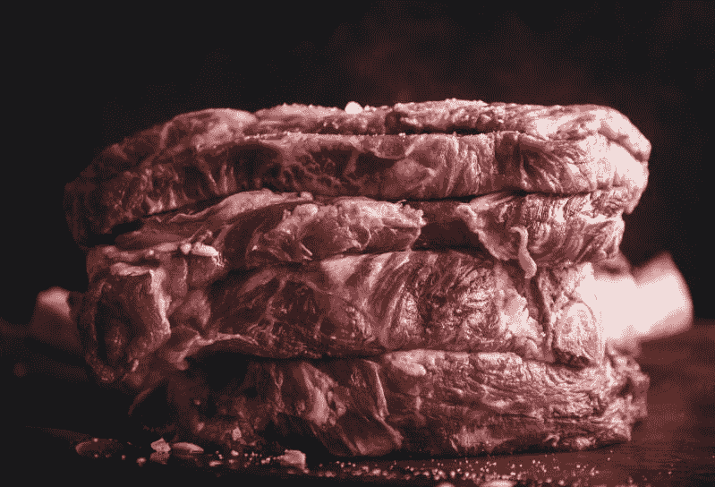
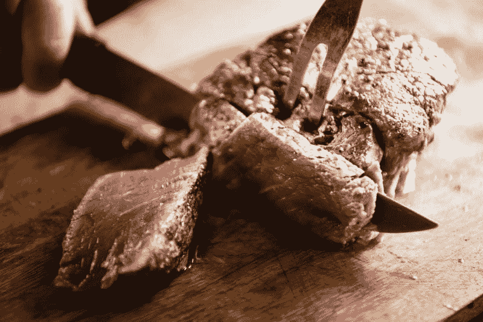
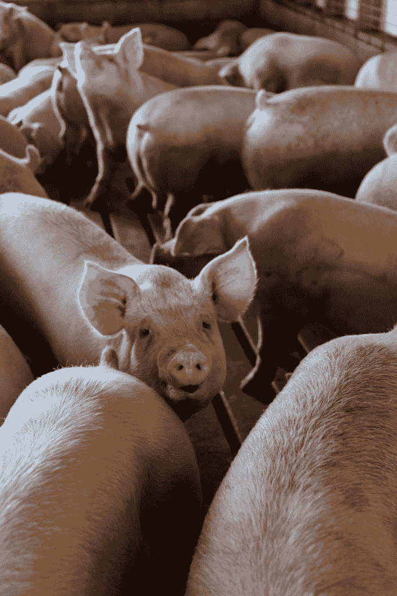
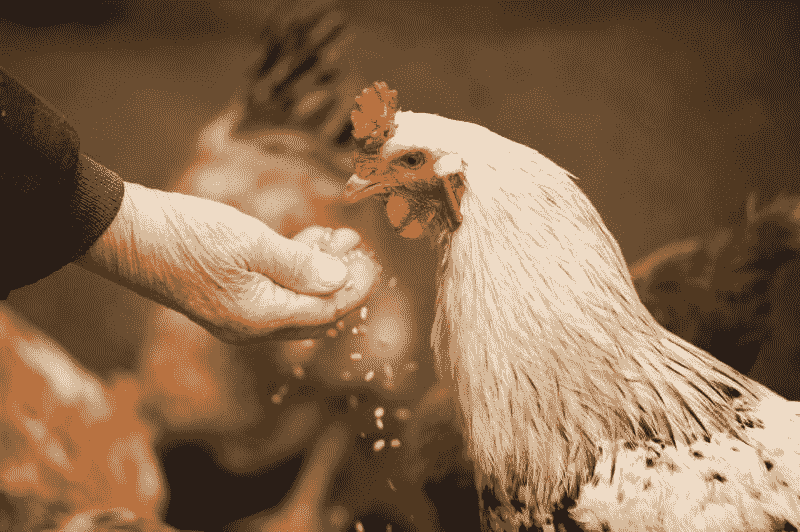
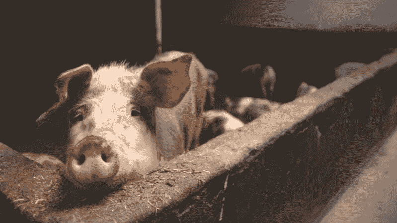
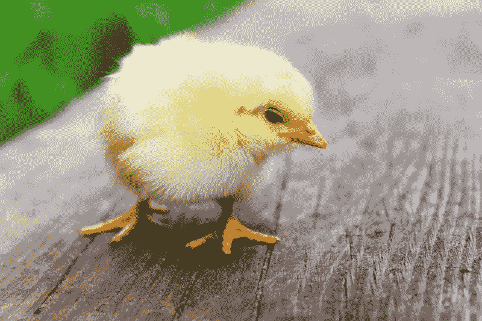
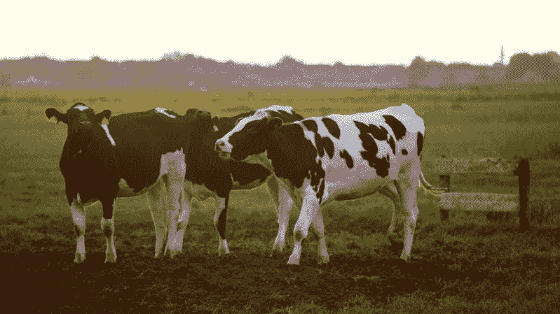
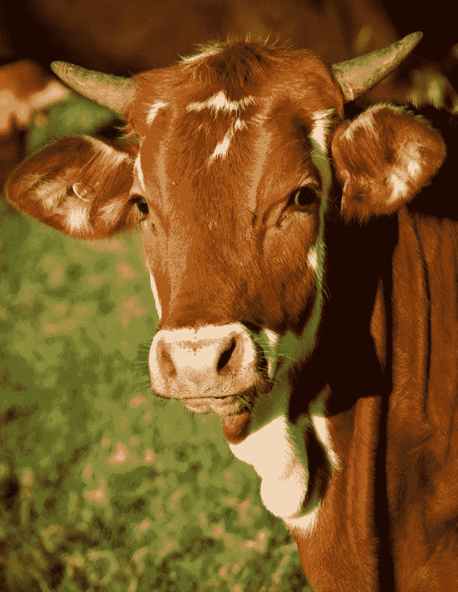
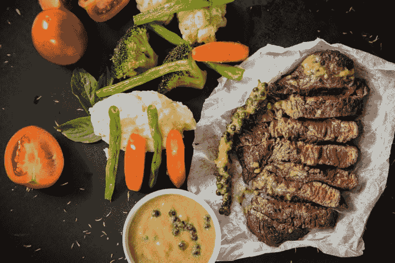

# Beyond Meat 会赚钱吗？—市场疯人院

> 原文：<https://medium.datadriveninvestor.com/will-beyond-meat-make-money-market-mad-house-ce546421eee1?source=collection_archive---------7----------------------->

许多人会问“Beyond Meat 会赚钱吗”，因为这家无肉蛋白制造商是今年最热门的首次公开募股(IPO)。

事实上， **Beyond Meat(纳斯达克股票代码:BYND)** 的股价在 2019 年 6 月 19 日为 169.89 美元。与此同时，Beyond Meat 当天的市值为 102.41 亿美元。

 [## 值得购买的 4 大人工智能股票及其原因——数据驱动型投资者

### 人工智能(AI)在 2019 年继续进入大众意识。通过应用程序…

www.datadriveninvestor.com](https://www.datadriveninvestor.com/2019/03/06/top-4-artificial-intelligence-stocks-to-buy-and-why/) 

相比之下，**优步**；该公司被认为是本世纪的科技巨星，在同一天的交易价格是 43.86 美元。然而，优步在 2019 年 6 月 19 日的市值为 743.76 亿美元。

# 超越肉类是赔钱的

Beyond Meat 和优步有很多共同点；然而，两家公司都在亏损。

例如，Beyond Meat 报告 2019 年 3 月 30 日的运营亏损为-530 万美元，净亏损为-665 万美元。相反，截至 3 月底，Beyond Meat 的毛利润为 1077 万美元，营收为 4021 万美元。然而，截至 2019 年 3 月 30 日，Beyond Meat 的自由现金流为负 1777 万美元，营业自由现金流为负 1329 万美元。

相比之下，优步的运营“现金流”为-7 . 22 亿美元，负的自由现金流为-8 . 11 亿美元。优步实现营业亏损-10.34 亿美元，净亏损-10.12 亿美元。另一方面，优步公布上一季度总收入为 30.99 亿美元，毛利为 14.18 亿美元。

因此，你可以说“市场先生”低估了优步，使其成为一种潜在的价值投资。值得注意的是，Statista [估计](https://www.statista.com/statistics/833743/us-users-ride-sharing-services/)优步在 2019 年全球拥有 9500 万月活用户。

# 是什么推动了肉类的高股价？

观察人士会问，是什么推动肉类价格如此之高，而优步价格却保持在低位。我猜人们喜欢肉以外的东西，但不喜欢或讨厌优步。

例如，媒体作家迈克尔·k·斯潘塞[承认](https://medium.com/utopiapress/beyond-meat-shows-the-world-is-changing-9d17dd057ca7)“我喜欢《肉以外的故事》。”斯潘塞热爱超越肉类，因为他钦佩该公司的道德。此外，斯潘塞将《超越肉类》列为“市场中的千年伦理”的例子

相比之下，许多人鄙视优步，因为该公司的丑闻多得令人难以置信。这是我在创始人兼反社会者特拉维斯·卡兰尼克被解雇之前，于 2017 年整理的优步丑闻的部分列表。

经典价值投资者会说《肉以外》性感、友好、时尚，但优步不是。然而，价值投资者会指出，每月有 9500 万人支付现金使用优步的服务。相反，Beyond Meat 的产品是新产品，而且只在少数市场上销售。

# 超越肉能赚钱吗？

从本质上讲，Beyond Meat 生产了几种植物性替代品来替代广受欢迎的美国肉制品。目前的品牌包括超越汉堡、超越香肠、超越牛肉粉等。

重要的是，美国[最大的独立杂货商](https://marketmadhouse.com/cvs-health-is-one-of-americas-biggest-grocers/) **克罗格(纽约证券交易所代码:KR)** 经营超越肉制品，超越肉制品网站[声称](https://www.beyondmeat.com/)。然而，Beyond Meat 还没有出现在美国最大的杂货店**沃尔玛(纽约证券交易所代码:WMT** )的货架上。

澄清一下，瑞士联合银行[估计](https://www.businessinsider.com/where-americans-are-buying-their-groceries-2017-6)克罗格是美国最大的超市运营商，拥有 2017 年美国杂货市场的 10.2%。奇怪的是，美国最大的杂货销售商是沃尔玛，它在 2017 年拥有 21.4%的市场份额。

不幸的是，大多数美国最大的杂货店；包括艾伯森(5.2%)、 **Costco(纳斯达克股票代码:COST)** (4.2%)、 **CVS Health(纽交所股票代码:CVS)** (3.9%)、 **Target(纽交所股票代码:TGT)** (2.7%)和 **Walgreens(纳斯达克股票代码:WBA)** (2.4%)，都没有出现在经营肉类以外商品的店铺名单中。这个列表可能不完整，因为塔吉特百货的网站销售的不仅仅是汉堡。

因此，除了肉类之外，其他食品都由几家大型零售商掌握，他们可以把这些食品从商店里扔出去。

# 克罗格是 Beyond Meat 最危险的竞争对手吗？

此外，这些零售商之一；克罗格可能成为 Beyond Meat 最大、最危险的竞争对手。

事实上，Kroger 声称截至 2018 年秋季，它出售了价值 23 亿美元的简单真理天然有机自有品牌，*福布斯*作家 Neil Stern [注意到](https://marketmadhouse.com/will-beyond-meat-make-money/#42af908e4dcd)。此外，克罗格的自有品牌销售额在 2018 年增长了 30%。

如果克罗格把自己的 Simple Truth 品牌植物性汉堡和香肠以更低的价格放在 Beyond 产品旁边的货架上，Beyond Meat 会怎么样？我猜 Beyond 的销量会直线下降。由于克罗格已经提供了 1400 多种简单真相产品，简单真相汉堡是不可避免的。

# Beyond Meat 能和 Kroger 抗衡吗？

克罗格的资源超过了 Beyond Meat。事实上， [Kroger](https://marketmadhouse.com/kroger-and-the-future-of-grocery/) 在截至 2019 年 2 月 2 日的季度中，收入为 280.91 亿美元，毛利为 219.03 亿美元。

令人印象深刻的[克罗格](https://www.kroger.com/topic/kroger-family-of-companies)，在美国 35 个州拥有 24 家连锁超市，37 家食品制造厂，17 家牛奶场，2270 家药店，1537 家超市燃料中心，以及超过 2764 家超市和超级广场。克罗格的其他资产包括来自 45 个市场的多达 1，372 家超市的杂货交付、Vitacost 折扣维生素和补充剂零售商以及家庭厨师。

最后，克罗格拥有**奥卡多集团有限公司**6%的股份。Ocado 是一家英国公司，拥有可能比亚马逊更先进的机器人履行系统。Ocado 和 Kroger 计划在美国建立 20 个机器人履行中心，用于当天的杂货交付。

# 餐馆超越了肉类的未来吗？

鉴于克罗格最近的历史，Beyond Meat 的经理们明智地选择了快餐经营者这样的替代渠道。

目前，Beyond Meat 声称其产品出现在 A&W、小卡尔、德尔塔克、TGI 星期五餐厅、汉堡店、Bareburger 和 Veggiegrill 的菜单上。其中最大的连锁店是小卡尔连锁店。卡尔连锁店及其姐妹连锁店哈迪连锁店在美国 44 个州和 43 个国家拥有 3800 多个特许经营点。

不幸的是，Beyond Meat 的网站没有说明卡尔的母公司 [CKE 餐馆](http://www.ckr.com)拥有的其他连锁店是否会提供 Beyond Meat 产品。此外，除了卡尔和哈迪，CKE 还拥有绿色卷饼和红色卷饼。

# 除了蒂姆·霍顿的肉

然而，肉类加工以外的其他连锁店规模要小得多。例如，A&W 在美国只有 625 家餐厅，在全球有 340 家餐厅。

同时， [Del Taco](http://www.deltacofranchise.com/about) 在 14 个州经营着 580 家分店，并声称正在积极扩张。因此，Beyond Meat 可以在美国和其他国家拥有多达 5005 家快餐店。

另外，一份新闻稿称，除了香肠早餐馅饼，现在加拿大的 4000 家蒂姆·霍顿咖啡店都有卖。如果你不熟悉它；蒂姆·霍顿是一家加拿大机构，出售上好的咖啡和甜甜圈。

值得注意的是，蒂姆·霍顿和美国第二大快餐品牌汉堡王拥有相同的母公司；国际餐饮品牌。然而，新闻报道并没有说 Beyond Meat 是否会来到汉堡王。此外，在美国还有 416 家 TGI 星期五静坐餐厅。

在这些连锁店中的一个或多个取得成功可能是超越肉类未来的关键。特别是，Beyond Meat 在 A&W、蒂姆·霍顿或德尔·塔克的强劲销售可能会说服**麦当劳(纽约证券交易所代码:MCD)** 或**百胜！brands(NYSE:YUM)**；必胜客和塔可钟的所有者，提供肉类以外的产品。

# Beyond Meat 能成功吗？

我认为，如果满足某些条件，植物性肉类替代品可能会有巨大的市场。

首先，Beyond 肉制品的价格将不得不明显低于真正的肉类。Beyond Meat 不符合这一标准，2019 年 6 月 14 日，塔吉特百货以 5.99 美元或 3 美元的价格出售了两个 Beyond 汉堡肉饼。我的观点是，除非肉饼能卖到 50₵或 1 美元一个，否则它不会进入大众市场。

真正低的价格将使 Beyond Meat 能够登上 Aldi、Lidl、 **Dollar Tree(纳斯达克股票代码:DLTR)** 、 **Dollar General(纽约证券交易所股票代码:DG)** 和 Costco 等不断增长的折扣店的货架。有趣的是，Aldi 可能会成为美国发展最快的杂货店，拥有超过 1800 家店铺，并计划再开 400 家。

此外，低价可以帮助肉类以外的商品进入药店，药店正在成为食品杂货业的主要参与者。低价也是亚马逊在 21 世纪成为美国最受欢迎的零售商的关键。

第二，无肉产品必须比真正的肉更好的测试。因此，制造尝起来不像肉的产品可能是 Beyond Meat 成功的关键。我认为公众将更有可能购买无肉汉堡；或者香肠，比真正的肉味道更好。

# 印度超越了肉类的未来吗？

如果 Beyond Meat 满足这些条件，其产品可能会有一个光明的未来。此外，除了肉类，还有一个巨大的市场可以开发:印度。

据半岛电视台 [报道](https://www.aljazeera.com/news/2015/08/hindus-drop-80-percent-india-population-muslims-census-150826052655585.html)，人口普查数据显示 79.8%的人口或大约 7.98 亿人是印度教徒。大多数印度教徒将[素食主义](https://www.hinduismtoday.com/modules/smartsection/item.php?itemid=5668)视为他们的信仰宗旨，甚至视牛为神圣。因此，印度可能会超越肉类的最大利润中心。

特别是，如果印度的中产阶级发展出对美式或欧式快餐的偏好，但保持其信仰。据 LiveMint [报道](https://www.livemint.com/news/india/the-anatomy-of-india-s-middle-class-1556088919798.html)，伦敦国王学院的 Maryam Aslany 估计，28%的印度人是中产阶级。鉴于这一数字和印度 13.7 亿人口，我估计印度中产阶级的规模为 3.84 亿。

印度中产阶级可能是超越肉类和销售其产品的快餐品牌的巨额利润的关键。因此，除了肉类以外，它还能在次大陆找到一个巨大的消费市场。

# 远离肉类原料以外的食物

尽管 Beyond Meat 的潜力巨大，但“市场先生”却严重高估了该公司的股价。投资者需要远离 **Beyond Meat(纳斯达克:BNYD)** 直到崩溃到一个现实的价格。注意:鉴于 Beyond Meat 的收入微乎其微，我认为每股 10 美元是一个现实的价格。

对于价值投资者来说，购买优步(纽约证券交易所股票代码:优步)虽然不赚钱，但已经在开发一个巨大的国际市场，这是一个更聪明的举动。然而，Beyond Meat 没有优步的不光彩历史。

Beyond Meat 的故事证明，只为道德投资是短期内赔钱的好方法。最后，我认为一只股票有一个现实的价格才是真正的道德投资。根据这些标准，超越肉类远远不是一项道德投资。

*原载于 2019 年 6 月 19 日*[*https://marketmadhouse.com*](https://marketmadhouse.com/will-beyond-meat-make-money/)*。*

*免责声明:文章中表达的观点和意见仅属于作者，不一定代表 DDI 及其编辑的观点。*