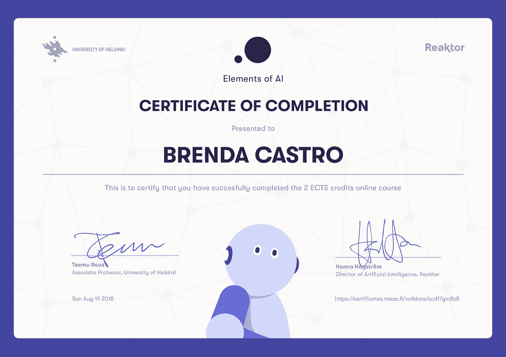

# 有意识的机器会像我们一样糟糕吗？

> 原文：<https://medium.datadriveninvestor.com/will-conscious-machines-screw-up-as-badly-as-we-do-e74c108cc7e8?source=collection_archive---------28----------------------->

几周前，我完成了人工智能的[元素的在线课程，这是一门由](https://course.elementsofai.com/)[赫尔辛基大学](https://www.linkedin.com/school/university-of-helsinki/)和[创新者](https://www.linkedin.com/company/reaktor_/)共同开设的非常出色且非常受欢迎的课程。我的男朋友从他在 Reaktor 的朋友那里读到了一些关于这门课程的积极评论，当我们在家舒适的沙发上度过一些伪智力时间时，他提出了这个问题。我们喜欢做书呆子做的事情，一起学习，嗯，还有什么比手牵手学习人工智能和机器学习的基础知识以及机器人和汽车的可爱插图更浪漫的呢？我可能会想到一些事情，但作为一个小极客(我自己也想成为极客)，这确实是一个好主意。的确如此。

We even got a cute certificate! Thanks Teemu Roos and Hanna Hagström!

该课程的任务之一是对感兴趣的领域相关的人工智能进行一些研究，并找出我们在网上找到的文章和其他类型的内容有多真实和准确。我们将从我们的发现中挑选一篇具体的文章，并带着这些问题进行分析。我可能选择了某种复杂的领域，但我发现非常有趣的是，即使在非常专业和知名的媒体出版物中，主题也可能相对不准确，重要的概念有时被夸大或误导，特别是如果读者不是该领域的专家。

我希望在课程中分享我为任务写的简短分析可以提出好的问题并引发讨论。这是给你们这些好奇的人的！

我从《连线》杂志上挑选了文章[“如何建造一台有自我意识的机器”](https://www.wired.com/story/how-to-build-a-self-conscious-ai-machine/)。我建议你在继续阅读这篇文章之前先阅读这篇文章，或者至少快速浏览一下。如果这对于你的宝贵时间来说太长了(是的，有点长)，那么**这里有一个模糊的总结，以及我在学习 AI 和 ML 基础知识后的观察:**

作者用一种戏谑的方式描述道，毫无疑问,“机器”很快，甚至现在就可以被设计成具有自我意识。他自信地认为，“有一件事(人)肯定会复制(作为一台机器)，那就是我们意识开启的渐进方式”。没有必要详细说明我们是如何做到这一点的，或者这在技术上意味着什么，这不是真正有趣的讨论。所以他把重点放在了这(复制我们大脑的人性方面)是一个多么糟糕的想法的争论上。

休用心灵理论来描述意识是什么，以及作为人是什么。他以简化的方式使用心理理论，作为一个人试图猜测另一个人在想什么的行为。这个解释幽默地描述了我们大脑工作的特殊方式使我们花太多时间担心别人和别人对我们的看法，而不是花时间在更相关的想法上或用我们的大脑做出更好的决策。休认为，由于我们“智力”的这种“人性”，我们实际上做出了许多错误的决定，犯了许多错误，或者浪费了本可以用在更有用的事情上的时间。因此，他认为，如果我们要创造人工“智能”，我们应该避免复制“我们的”智能，而是创造一种更好的智能，一种不会犯我们作为一个物种通常会犯的错误的智能。

我不确定作者表达对构建模仿人类智能的人工智能有多容易充满信心的方式是否是出于他幽默风格的简单讽刺，或者也许我已经带着无聊的批判眼光阅读了这篇文章。然而，我认为，这些对人工智能的描述，以及声称有一种简单的方法可以让机器人在当前的科学和技术状态下像人类一样有意识，不仅缺乏现实主义，而且很容易被误解，并加剧了媒体对“奇点”临近的普遍恐惧。

也许这种对“心理理论”意义的过分简化是困扰我术语不准确的可能后果的一部分。作者忽略了一个事实，即心理理论是关于“精神状态”，其中包括那些自己的。在我看来，这种省略给我们留下了对意识的非常简单化的解释(这是本文的一个主要主题)。在我们能够创造人工意识之前，我们需要对人类意识有一个清晰而普遍的定义。意识，甚至我们的思想和决策机制——包括感知、欲望、感觉和对它们的解释——仍然没有被科学地完全理解。和不理解的东西，因此很难(如果不是不可能的话)精确地复制。

休对这篇文章表达了一些有趣的观点，写作风格使它成为一篇有趣的文章，所以如果你还没有读过，我建议你通读整篇文章。所以如果我的评论破坏了乐趣，我道歉。我担心的是，标题中的两个主要主题:“人工智能”和“意识”的一些重要方面可能会模糊不清，从而使结论成为可能的谬误。

尽管我们如何能够创造出模仿人类意识的人工智能这一问题仍有待回答，但这个故事以一个值得反思的发人深省的想法结束。

> “虽然这样做(创造类似人类的有意识机器)肯定是可能的，但我们可能永远也不会建立一个像我们一样像人类一样的人工智能。然而，无论如何，我们可能会创造出更优秀的人类。”

我们人类真的好到相信复制我们的本性对所有人都是积极和安全的吗？我们是否应该首先关注于理解我们的错误，然后才能使用技术来大规模地改善真正重要的事情？

本文首发于 [LinkedIn](https://www.linkedin.com/pulse/conscious-machines-screw-up-badly-we-do-brenda-castro-pelayo-1d/) 。

*声明:我不是人工智能、人工智能或心灵哲学的专家。因此，我感谢任何与这篇文章相关的评论，这些评论可以启发我和其他具有类似业余知识的人。感谢阅读！*