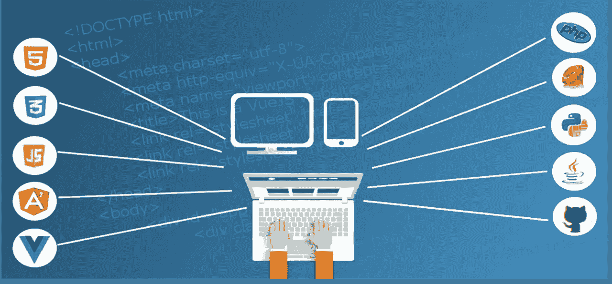
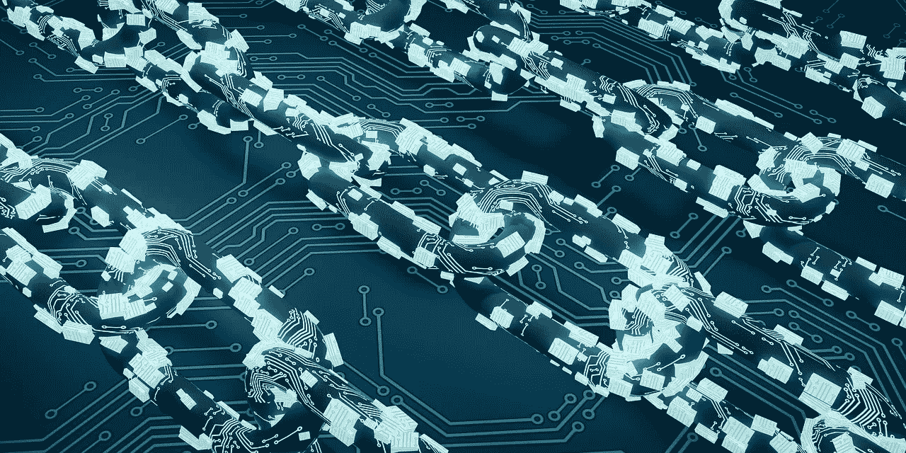

# 投资加密资产会在贝莱德赚钱吗？

> 原文：<https://medium.datadriveninvestor.com/will-crypto-assets-make-money-at-blackrock-7448d11f3c11?source=collection_archive---------2----------------------->

资产管理巨头**贝莱德公司(纽约证券交易所:BLK)** 问加密资产会赚钱吗？

“我们是区块链的大学生，”贝莱德首席执行官拉里·芬克告诉[路透社](https://www.reuters.com/article/us-blackrock-cryptocurrency/blackrock-is-evaluating-cryptocurrencies-ceo-fink-says-idUSKBN1K61MC)。然而，芬克并不认为存在“对加密货币的巨大需求”。

 [## 投资算法快速指南-数据驱动投资者

### 让我们想象一下 30 年前的股票市场:让我们想象一下现在:像现在的许多其他领域一样，投资市场已经…

www.datadriveninvestor.com](https://www.datadriveninvestor.com/2019/01/31/a-quick-guide-to-investment-algorithms/) 

贝莱德正在研究区块链和加密资产，而不是交易加密货币。例如，据《福布斯》特约撰稿人杰夫·考夫林[称](#568280293697)，贝莱德正通过雇佣前**瑞普(XRP)** 产品经理罗比·米契尼克为其“数字财富团队”开发加密资产。

澄清一下，数字财富团队是一个研究区块链、加密货币、加密资产和其他新兴投资类别的工作组。重要的是，芬克没有透露贝莱德打算如何利用区块链，或者贝莱德可能投资哪些加密资产。

# **贝莱德可以投资哪些加密资产？**

我猜测，贝莱德将投资基于智能合约的数字资产，如 stablecoins 和区块链平台。

一个 [stablecoin](https://marketmadhouse.com/exploring-stablecoins-with-stably-or-stableusd/) 是一个包含一个[智能契约](https://www.investopedia.com/terms/s/smart-contracts.asp)或分散应用(DApp)的加密资产。Stablecoin 创建者对智能合约进行编程，以释放信托账户中的资产。

例如，文克莱沃斯 Twins 的**Gemini Dollar(GUSD)**stable coin 智能合约控制对[**State Street Corp**](https://marketmadhouse.com/is-state-street-making-money/)**(纽约证券交易所代码:STT)** 持有的美元的存取。此外， **Paxos 标准代币(PAX)** 提供对 Paxos 信托公司持有的美元的存取权。同时， **GoldMint(黄金)**或 **GoldMint (MNTP)** 令牌控制[访问](https://marketmadhouse.com/is-the-goldmint-cryptocurrency-for-real/)持有金条的信托账户。

为了澄清，稳定币的智能合约在有人消费代币时释放资产。例如，Paxos 信托公司向 PAX Token 的接收者发放一美元。

# 贝莱德会提供稳定币吗？

因此，贝莱德极有可能推出自己的稳定币。此外，贝莱德还可以提供平台代币，让投资者获得智能期货合约。

值得注意的是，智能合约和区块链合约可能是贝莱德接触发展中市场投资者的更廉价、更快捷、更高效的方式。理论上，投资者可以通过智能手机 DApp 访问区块链的投资平台。

因此，加尔各答的投资者可以利用 DApp 投资芝加哥商业交易所(CME)的贝莱德期货合约。理论上，贝莱德可以提供智能合约，让投资者可以投资交易所交易基金(ETF)、股票、期货、债券、债务和大宗商品。

# **为什么贝莱德正在研究区块链**

贝莱德正在调查区块链，因为未来投资市场的大部分增长将发生在发展中国家。

例如，*视觉资本家* [项目](https://www.visualcapitalist.com/worlds-largest-10-economies-2030/)埃及的国内生产总值(GDP)将从 2017 年的 1.2 万亿美元增长到 2030 年的 8.2 万亿美元。因此，视觉资本家*预测埃及的 GDP 将在 11 年内超过德国。*

与此同时，中国和印度的国内生产总值将在未来十年超过美国。具体来说，2030 年印度的国内生产总值可能达到 46.3 万亿美元，中国可能达到 64.2 万亿美元。

在这种情况下，贝莱德想去有新资金的地方。在像印度尼西亚这样的发展中国家。值得注意的是，*视觉资本家*声称印尼的 GDP 将从 2017 年的 3.2 万亿美元增长到 2030 年的 10.1 万亿美元。

理论上，区块链平台或分散式交易所可能是为全球投资者提供服务的最廉价、最安全的方式。因此，一个有效的区块链平台可以让贝莱德接触到开罗、雅加达、班加罗尔和东莞的客户。

# **为什么贝莱德会直接投资区块链平台**

此外，对区块链平台的直接股权投资是一个日益增长的财富管理领域。

事实上，一些美国养老基金正通过基金投资于区块链平台。例如，弗吉尼亚州费尔法克斯县的两个养老基金正在向 Morgan Creek 区块链机会基金投资 4000 万美元。福布斯 [报道](#2d61527f11ae)，养老基金代表警察和国家雇员。

《福布斯》透露，摩根克里克公司正在投资一些费尔法克斯郡的资金于 Bakkt。Bakkt 是一家全球分散的加密资产交易所，由**国际交易所(纽约证券交易所代码:ICE)** 和**星巴克(纳斯达克代码:SBUX)** 支持。重要的是，国际交易所拥有纽约证券交易所和其他金融市场。

此外，密歇根大学的养老基金正在向硅谷风险投资公司 Andreesen Horowitz 拥有的区块链投资基金投资 30 亿美元，新闻稿[显示](http://regents.umich.edu/meetings/02-19/2019-02-IX-1.pdf)。有趣的是，Andreesen Horowitz 的经理们认为区块链可以取代传统的信息技术(IT)基础设施。

# **区块链平台是贝莱德的一项投资吗？**

在这种情况下，我认为贝莱德正计划对区块链平台进行大笔股权投资。

我认为区块链在几个领域的平台可以赚很多钱。具体来说，像 [Yumerium](https://marketmadhouse.com/the-dream-place-meet-yumerium-a-blockchain-platform-for-games/) 这样的游戏平台有一个成熟的产品，有一个巨大的市场。

Yumerium 的商业模式是为游戏创建一个市场和分散的交易所，为游戏开发商提供风险投资。Yumerium 希望游戏玩家能通过其区块链市场投资游戏。

像 Yumerium 这样的平台可以利用快速增长且利润丰厚的多人游戏市场。值得注意的是，像 [*【堡垒之夜】*](https://marketmadhouse.com/best-buy-is-at-the-mercy-of-fortnite/) 这样的多人游戏吸引了数千万玩家，创造了数十亿的收入。

# **区块链平台如何赚钱**

此外，连接制造商和客户等传统企业的区块链可以产生大量资金。

例如， [SyncFab](https://syncfab.com) 计划通过其[区块链](https://medium.com/syncfabmfg/syncfab-2019-q1-update-80c77467756e)向公司出售制造服务。此外，Aitheon 希望向其区块链上的企业出售各种各样的自动化、商业和人工智能服务。

最后，许多其他平台正在提供各种各样的金融服务，如区块链上的借贷和货币兑换。这些平台可以通过对贷款、信用额度和保证金交易收取利息和费用来赚钱。

# **贝莱德赚钱了吗？**

**贝莱德公司(纽约证券交易所:BLK)** 可能会成为区块链的主要玩家，因为它正在赚钱。

例如，贝莱德 2018 年第四季度的毛利为 27.9 亿美元，营收为 34.34 亿美元。此外，贝莱德报告同一季度的营业收入为 12.46 亿美元，净收入为 9.27 亿美元。此外，2018 年第四季度，贝莱德以 4.27 亿美元自由现金流和 5.23 亿美元运营现金流的形式产生现金。

贝莱德有大量资金可以投资于区块链。例如，贝莱德在 2018 年 12 月 31 日拥有 64.88 亿美元的现金和等价物。

因此，如果芬克和他的团队愿意，贝莱德可以成为区块链和加密资产领域的主要参与者。

# **贝莱德是一项好的投资吗？**

因此，对于那些想在区块链投资而不想冒大风险的人来说，贝莱德可能是一只股票。

然而，我认为贝莱德是一个有趣的股息股票，市场先生膨胀。具体来说，我认为贝莱德 2019 年 4 月 17 日交易的每股 467.49 美元太贵了。

另一方面，贝莱德于 2019 年 3 月 21 日支付了 3.30 美元的股息。此外，股息高于 2018 年 12 月 26 日的 3.13 美元和 2018 年 10 月 31 日的 7.3₵。因此，如果你唯一感兴趣的是股息收入，贝莱德可能适合你。

值得注意的是，2019 年 4 月 16 日，贝莱德向投资者提供的股息收益率为 2.82%，年化派息为 13.20 美元，派息率为 47.6%。此外，Dividend.com 报告称，贝莱德的股息在过去九年一直在增长。

贝莱德表明，在区块链投资有安全的方式。更重要的是，贝莱德证明了区块链的未来是他们将用它来建设的基础设施，而不是加密货币。如果想在区块链赚钱，所有的投资者和投机者都需要吸取这个教训。

这个故事也出现在 [*市场疯人院*](https://marketmadhouse.com/) 。