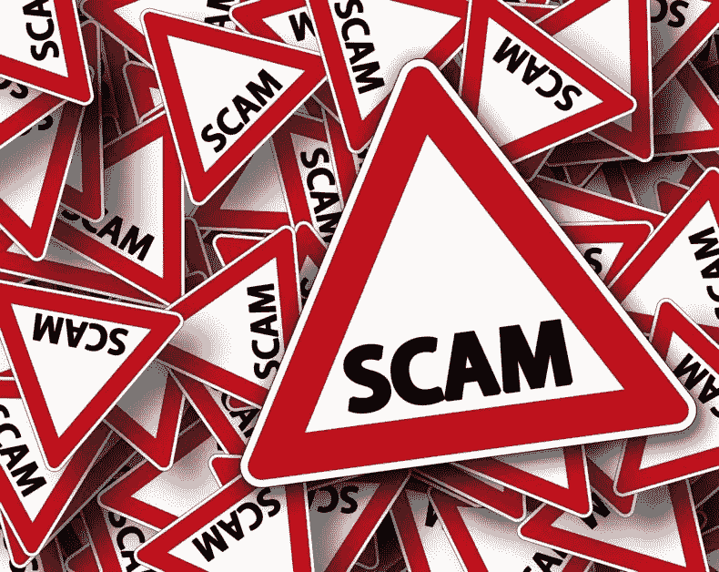
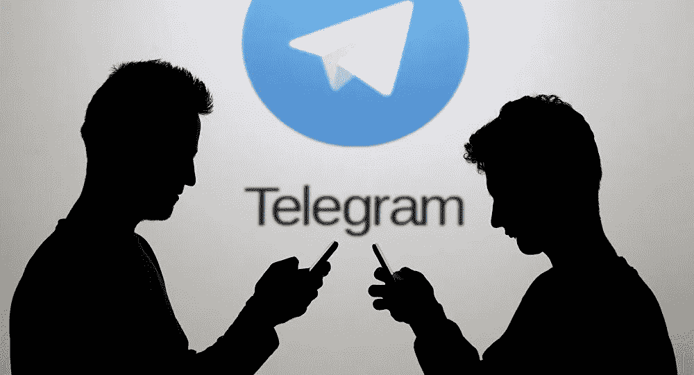
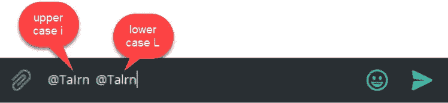

# 秘密骗子会销声匿迹吗？

> 原文：<https://medium.datadriveninvestor.com/will-crypto-scammers-fade-into-obscurity-232ae1a83bb5?source=collection_archive---------2----------------------->

自从进入加密市场，一段时间前我目睹了诈骗的出现，以及它是如何以惊人的速度增长的，尤其是在最近几个月。

看起来骗子的主要藏身之处是电报，在较小程度上是不和。他们倾向于主要关注使用即时通讯形式的平台，而不是网站等静态内容。这大概是因为这让他们有能力制造一种紧迫感，让无辜的受害者带着他们辛苦赚来的资产离开。

电报特别是充满了骗子，似乎没有任何行动，现在或计划缓解这个问题。

虽然 Telegram 已经牢牢地巩固了其在加密货币领域作为主要通信工具的地位，但骗子的数量却呈指数级增长。

如果你和我一样，在你的密码之旅中，你很早就进入了电报世界。

没过多久，我就开始收到伪装成区块链项目合法成员或我加入的许多电报小组管理员的用户发来的直接信息。

对我来说幸运的是，我倾向于对任何新的风险投资保持谨慎，尽管我差点与一些骗子发生冲突，但我天生多疑的本性使我能够避开可能对我的加密投资造成的灾难。

给你一个真实的例子:不久前，我需要一些帮助，并发布了一条消息，询问哪些管理员当时在线。有人自称是管理员直接联系了我。我做了尽职调查，将他的用户名和显示名与该群的个人信息上显示的管理员列表进行了核对。已经核实了。或者至少我认为是的。长话短说，我被要求将资金转移到一个新的钱包地址，而他/她安排退款，因为我犯了一个错误。这是我开始怀疑的时候。我试着直接联系组里的其他管理员，但是由于他们当时收到的大量信息，他们阻止了任何直接联系。

我没有办法确认他/她的方式是否合法。

我灵机一动，决定将潜在的骗子和合法的管理员用户名都复制到 Microsoft Word 中。我把两个用户名都转换成大写字母，就在那时，我意识到骗子用了大写字母“I ”,而不是小写字母“l”。这两个字母在电报中显示时看起来几乎相同。

下面的例子(不是真名)显示了用户名有多相似:

我很幸运没有上当。这一集凸显了骗子伪装成合法管理员是多么容易。

在另一个例子中，一个所谓的管理员试图向我证明他/她自己，他/她用 ICO 的域名发了一封电子邮件。我检查了邮件的标题(源代码),可以很容易地看到，虽然徽标和发送地址是正确的，但他们通过从不同的域名发送邮件来欺骗它。

这些人似乎在这方面越来越好，虽然更有经验的投资者知道该寻找什么，但我同情那些在游戏中缺乏经验的人，他们显然损失了 1000 美元。

那么 Telegram 对此做了些什么呢？….就我所见…没有。他们可以很容易地实现类似 Twitter 的验证状态，或者使注册过程更加严格。目前，如果你报告一个骗子是垃圾邮件，他们可以很容易地使用不同的手机号码再次启动，或者等待封锁期到期后重新开始。

这是对似乎完全依赖用户经验和知识的密码行业的重大挑战。电报似乎忽视了所有改善情况的呼吁。

综上所述，事情正在好转，新的项目正在创建，将提供一个新的舒适水平。对我个人来说，我期待着一个新的项目，可能会在某种程度上消除这个问题。我希望我将不再需要使用电报来进行大部分与加密相关的通信。DESICO 是一个平台，它将把 ICOs(初始硬币发行)的舒适度和安全性提升到一个新的水平。ICOs 将在 DESICO 注册，一旦获得批准，所有交易都将包含在 DESICO 平台中。目前还没有任何消息，但有传言称，他们也可能正在创建一个类似于 Telegram 的平台，该平台将更加安全可靠。

除了接受立陶宛银行和欧洲银行的管理，DESICO 还将会见所有潜在的 ICO，以确保他们的商业计划符合所有要求，并且他们的项目是合理的。

一个由“可信”项目和投资者组成的社区将诞生，为所有加密投资通信提供一个更安全的平台。

查看 DESICO [网站](https://desico.io)获取更多信息。

是的，他们也有一个 T4 电报组。:)但是在里面要小心。