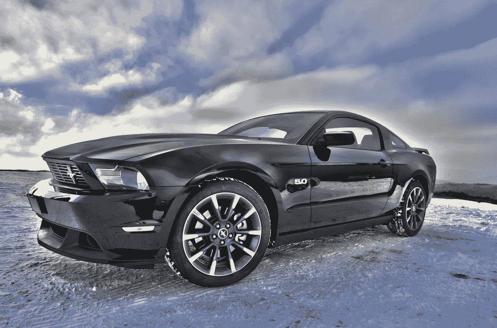

# 福特汽车(Ford Motor)会从自动驾驶汽车中赚钱吗？

> 原文：<https://medium.datadriveninvestor.com/will-ford-motor-f-make-money-from-self-driving-cars-f1dc7347a85d?source=collection_archive---------20----------------------->

福特汽车(Ford Motor)在无人驾驶汽车上下了 40 亿美元的赌注，但这可能永远不会有回报。例如，福特计划在 2021 年开始生产公众可能会讨厌的自动驾驶汽车。

值得注意的是，人们正在亚利桑那州攻击和威胁 Waymo 自动驾驶货车。事实上，执法部门记录了超过 20 起事件，涉及来自**字母表【纳斯达克代码:GOOG】**拥有 Waymo，*有趣工程* [报道](https://interestingengineering.com/waymo-self-driving-cars-have-been-attacked-in-phoenix)的车辆。

例如，2018 年 8 月 1 日，一名男子用左轮手枪瞄准了一辆 Waymo 面包车，*《亚利桑那共和报* [报道](https://interestingengineering.com/waymo-self-driving-cars-have-been-attacked-in-phoenix)。此外，袭击者向 Waymo 车辆投掷石块，并划破 Waymo 货车的轮胎。此外，一辆吉普车几次试图迫使一辆 Waymo 面包车驶离公路。

**福特在无人驾驶汽车上冒了很大风险**

因此，福特汽车公司计划明年在华盛顿特区试驾无人驾驶汽车，这是在冒很大的风险。

CNN [报道](https://www.cnn.com/2018/10/22/tech/ford-dc-self-driving/index.html)，福特子公司 Argo AI 将于明年在美国首都测试自动驾驶汽车。目前，Argo 正在绘制哥伦比亚特区的地图。为了解释这一点，地图将引导无人驾驶汽车穿过街道。

福特和 Argo 面临的主要风险是，DC 公众对自动驾驶汽车的批评将促使一名美国众议员或参议员提出立法禁止这种车辆。我想知道福特管理层在想什么，因为把这些车放在政客们能看到的地方是愚蠢的。

特别是，福特高管必须记住，向自动驾驶汽车扔石头的傻瓜可以投票。事实上，对于任何想要抨击大企业的蛊惑人心的政客来说，攻击自动驾驶汽车都是一场廉价而简单的运动。

这个国家的主要煽动者，唐纳德·j·特朗普总统(纽约州共和党)通常住在华盛顿。因此，福特可能会发现自己成了特朗普在推特上发脾气的目标。

**福特汽车(F)会在自动驾驶汽车上亏损吗？**

在这种情况下，福特汽车(Ford Motor)可能会失去所有投资于自动驾驶汽车的资金。例如，据报道福特花了 10 亿美元收购 Argo。

此外，福特自动驾驶汽车子公司正在计划一项类似于 Alphabet 的 Waymo One 的叫车服务。重要的是，Waymo One 正在亚利桑那州的钱德勒运送乘客，可能会让他们面临暴力袭击的风险。

有趣的是，福特用假的自动驾驶送货车测试了人们对自动驾驶汽车的反应，*司机* [声称](http://www.thedrive.com/tech/21460/ford-uses-pretend-self-driving-cars-to-test-delivery-service?iid=sr-link2)。此外，福特还在**达美乐比萨(纽约证券交易所:DPZ)** 和 Postmates 的帮助下测试自动送货。

因此，福特管理层理解自动驾驶汽车的风险，并试图评估它们。值得注意的是，我认为自动驾驶汽车面临的最大风险是人类的反对。

**福特汽车(F)正在为自动驾驶汽车建造基础设施**

除了风险评估，福特汽车(Ford Motor)正在建设自动驾驶汽车所需的基础设施。

例如，福特和 Autonomic 正在开发一种交通移动云，它将作为自动驾驶汽车的信息共享系统。 *TechCrunch* [报道](https://techcrunch.com/2018/01/09/ford-and-autonomic-are-building-a-smart-city-cloud-platform/)，云将与车辆一起通勤，确定路线，收集数据，分析数据，支持支付处理。

因此，福特进入了利润丰厚的数据业务。例如，福特可以将通过云收集的数据出售给其他汽车公司、汽车租赁公司或优步。

**福特汽车如何从数据中获利**

特别是，福特云可以提高叫车应用的效率。例如，它可以将 Waymo 货车重定向到城市中需求旺盛的地区。此外，这种云可以让车辆绕开交通堵塞或建筑。

收集数据对福特来说是个好主意，因为《经济学家》将数据描述为世界上最有价值的商品。事实上，*经济学家* [宣称](https://www.economist.com/leaders/2017/05/06/the-worlds-most-valuable-resource-is-no-longer-oil-but-data)的数据是“数字时代的石油”因此，数据现在比黑金更有价值。

因此，福特将通过建立一个从自动驾驶车辆收集数据并出售的系统来赚钱。为了解释这一点，优步或 **UPS(纽约证券交易所代码:UPS)** 可以向福特购买有关交通状况的数据。优步和 UPS 将使用这些数据来设计他们的路线。

显然，福特将因进入数据收集业务而收到侵犯隐私和监视的投诉。然而，Alphabet 等其他公司成功躲过了这一劫。

**福特自动驾驶汽车有多值钱？**

鉴于潜在的利润，据报道，福特汽车(Ford Motor)计划投资 40 亿美元收购福特自动驾驶汽车有限责任公司(Ford Autonomous Vehicles LLC)是一个明智的冒险。

解释一下，福特自动驾驶汽车是福特汽车公司(T2)的子公司，将运营打车服务和福特云。他们在 2018 年 7 月推出了福特自动驾驶汽车，*汽车新闻* [报道](https://www.autonews.com/article/20180724/MOBILITY/180729868/ford-commits-4-billion-to-autonomous-vehicles-forms-new-subsidiary)。特别是，福特将向 LLC 投资 30 亿美元，向 Argo 投资 10 亿美元。

目前的计划是福特自动驾驶汽车公司提供一款自动驾驶商用车；可能是福特全顺面包车，2021 年的。最有可能的是，像 Postmastes 这样的公司会使用货车来送货。

目前，运载工具有一个巨大的市场。例如，**亚马逊(NASDAQ: AMZN** )向**戴姆勒(OTC: DAI)** 订购 20，000 辆奔驰 Sprinter 厢式货车，用于送货服务。因此，自动驾驶的福特全顺货车有一个利润丰厚且不断增长的市场。

在这种情况下，福特自动驾驶汽车的价值可以与 Waymo 相媲美。值得注意的是，摩根士丹利声称估计 Waymo 的价值为 1750 亿美元。

如果摩根士丹利(Morgan Stanely)的预测是准确的，那么 Waymo 现在是最有价值的独角兽，即首次公开募股(IPO)前公司。相反，最有价值的已知独角兽是中国的蚂蚁金融价值，其[估计价值为 1500 亿美元。因此，一个有趣的可能性是，福特自动驾驶汽车比福特汽车公司更有价值。](https://www.reuters.com/article/us-ant-financial-fundraising/chinas-ant-financial-raises-10-billion-at-150-billion-valuation-sources-idUSKCN1IU0EZ)

**福特汽车(F)是价值投资吗？**

有趣的是，福特汽车(F)已经是价值投资了。例如，福特在 2018 年第三季度的收入为 376.66 亿美元，毛利为 3.746 亿美元。然而，2018 年 12 月 19 日，福特股票的交易价格为 8.27 美元。

具体来说，福特在 2018 年第三季度产生了 8.64 亿美元的营业收入和 9.91 亿美元的净收入。因此，福特在从现在生产的汽车中赚钱方面有着极佳的记录。

例如，福特 2018 年第三季度的运营现金流为 51.79 亿美元，融资现金流为 1.44 亿美元，自由现金流为 31.98 亿美元。此外，福特在 2018 年 9 月 30 日报告了 185.62 亿美元的现金和等价物以及 177.8 亿美元的短期投资。

因此，福特在 2018 年第三季度末拥有 363.42 亿美元的现金。因此，福特有资源将自动驾驶汽车货币化。例如，该公司计划投资于福特自动驾驶汽车的 40 亿美元还不到 9 月份报告的现金的九分之一。

**为什么福特汽车(F)能从自动驾驶汽车中赚钱**

鉴于福特的财务状况和汽车销售记录，可以肯定该公司可以从无人驾驶汽车中赚钱。

例如，福特销售美国最畅销的汽车 F 系列皮卡。值得注意的是，福特在 2018 年前 11 个月销售了 821，558 辆 F 系列，2017 年销售了 896，764 辆 F 系列，*福特权威* [估计](http://fordauthority.com/fmc/ford-motor-company-sales-numbers/ford-sales-numbers/ford-f-series-sales-numbers/)。因此，福特知道如何向现实世界中的真实人物出售汽车，并从这些汽车中赚钱。

因此，可以肯定的是，自动驾驶的 F 系列将很快成为美国最受欢迎的自动驾驶汽车。值得注意的是，F 系列是北美 21 世纪的首选“家用车”。

锦上添花的是，福特和世界上最大的汽车制造商**大众汽车公司(GR: VOW)** 正在讨论合作共享技术、营销和分销。值得注意的是，大众希望与福特合作的一个原因是福特在自动驾驶汽车方面更强，*底特律自由新闻* [报道](https://www.freep.com/story/money/cars/ford/2018/12/14/ford-volkswagen-broad-partnership/2287604002/)。

重要的是，大众可以接手福特亏损的海外业务。2018 年第三季度，福特在欧洲损失 2.45 亿美元，在亚太地区损失 2.08 亿美元，在南美损失 1.52 亿美元，在中国损失 3.78 亿美元。很明显，大众是中国这个全球最大汽车市场上最畅销的汽车。

**是福特汽车公司支付股息**

在这些条件下，福特汽车(F)是最好的自动驾驶汽车股票，因为它便宜，赚钱，并支付股息。

例如，福特在 2018 年 12 月 3 日支付了 15 英镑的股息。此外，福特在 2018 年 12 月 19 日向股东提供的股息收益率为 7.08%，派息率为 43.5%，年化派息为 60。

福特是一项价值投资，可能会因为自动驾驶汽车而变得更好。如果你想投资自动驾驶汽车而不冒很大的风险**福特(NYSE: F)** 是个不错的选择。

这个故事最早出现在 [*市场疯人院*](https://marketmadhouse.com/will-ford-motor-f-make-money-from-self-driving-cars/) 里，在那里颠覆性技术遇上了市场疯狂。