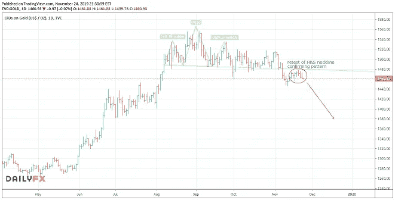

# 黄金会发光还是会下跌？

> 原文：<https://medium.datadriveninvestor.com/will-gold-shine-or-fall-91f8692ba5e4?source=collection_archive---------21----------------------->

**本周一周交易:*空头黄金***

过去几周我一直在谈论美元形成[主要顶部的可能性。然而，价格行为并没有证实这一点——它并没有以我们预期的方式交易。事实上，它一直在寻找重要的支撑——足以表明它可能会走上另一条路，继续沿着其趋势的主要方向重新挑战最近的高点。](https://mangrovetrading.krtra.com/c/L7F8wGEdqfrK/kOJV)

作为交易者，[我们不需要试图预测下一个方向](https://mangrovetrading.krtra.com/c/fPQh4z3JHMYf/kOJV)，我们只需要等待、识别并抓住大概率机会，从市场波动中获利。这样，我们就不需要在犯错的时候受到伤害。现在，我认为美元正显示出足够强大的信号来采取行动和进行交易。

在上周的一周里，我做空了欧元兑美元，本周末我打算增加另一笔交易，试图利用即将到来的美元走强— **做空黄金。**

 [## 2019 年即将改变世界的技术|数据驱动的投资者

### 很难想象一项技术会像去年的区块链一样受到如此多的关注，但是……

www.datadriveninvestor.com](https://www.datadriveninvestor.com/2019/01/17/the-technologies-poised-to-change-the-world-in-2019/) 

一段时间以来，黄金和白银都显示出警告信号，表明它们最近的涨势已经结束，它们可能会走低，至少在一段时间内会如此。然而，市场发现很难迅速扭转大幅波动。现在，我们已经花了一些时间在这些高点盘整，最近的头肩顶看起来将能够在近期内采取行动，使价格下跌。我期待在过去几天的低点得到任何突破做空黄金。

英镑最近的反弹已经找到了一些卖家，看来暂时不会有什么起色。我开始兑现我的利润，退出我的长期 GBPNZD 头寸。我愿意给它一点时间，看看我们在未来几天的交易。

你想学习如何从市场中获得持续的利润吗？ [*点击此处*](https://go.mangrovetrading.com/freetraining) *，我们将通过一系列免费培训视频带您一步步了解我们的整个交易策略。*