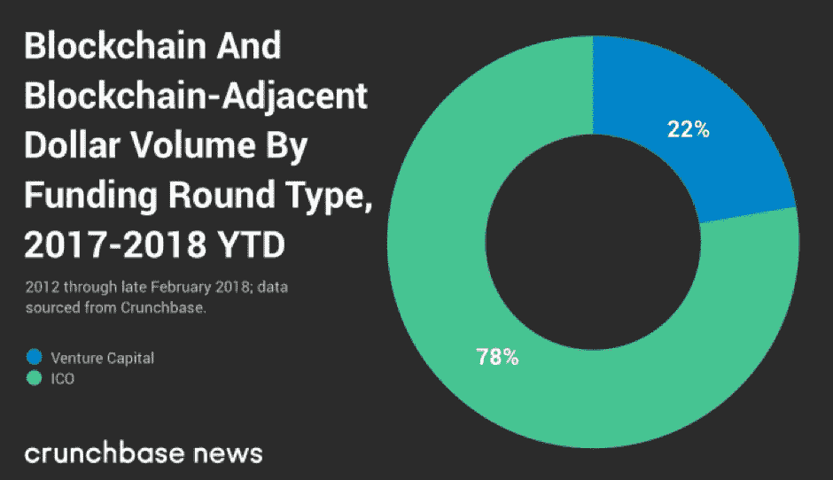
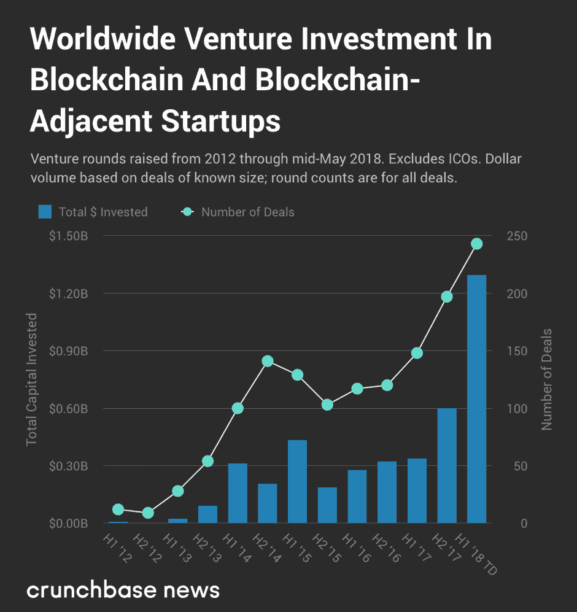
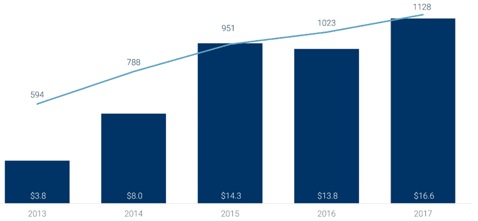

# ico 会取代创业公司的风投吗？

> 原文：<https://medium.datadriveninvestor.com/will-icos-replace-vcs-for-start-ups-25e7b7d4ab2f?source=collection_archive---------2----------------------->

有抱负的初创企业通过风险投资(VC)寻求资金曾经是一种常态。该公司的所有权将通过风险投资公司建立的有限合伙关系在参与投资者之间进行分配，而这些投资者通常会在该公司投资多年。

但在过去的 18 个月左右，公平地说，对于那些利用区块链技术的初创企业来说，全球对首次公开募股(ICO)的狂热彻底改变了融资格局。尽管 ico 在 2013 年首次出现，但直到去年才真正崭露头角，因为新的基于加密货币的项目开始从投资者那里筹集数千万甚至数亿美元的资金。这些项目通常由一份白皮书、一个网站、一个路线图和一个开发团队组成。

根据 CoinSchedule 的统计数据， [ICOs 去年筹集了近 40 亿美元](https://www.coinschedule.com/stats.html?year=2017)——大大超过了[在 2016 年](https://www.coinschedule.com/stats.html?year=2016)筹集的 9500 万美元。2018 年已经设法让去年的数字相形见绌，电报代币的销售引领了迄今为止 125 亿美元的总收入[。此外，2017 年举行的 210 场国际奥林匹克运动会与今年迄今举行的 594 场相比已经相形见绌。](https://www.coinschedule.com/stats.html?year=2018)

更值得注意的是，就区块链项目筹集的资金而言，去年 ICOs shot 超过了风投。在截至 2018 年 2 月的 14 个月中，Crunchbase 观察到，区块链和相关初创企业在全球范围内的传统风投轮次中筹集了近 13 亿美元；而 ico 则筹集了高达 45 亿美元的资金:

因此，就区块链初创企业融资而言，ico 如今不仅对风险投资公司构成了重大挑战，还吸引了更多投资者的兴趣。虽然这种戏剧性的转变对初创企业和投资者的融资偏好提出了重要的问题，但它也引发了对风投未来的担忧。但这种担忧有道理吗？

**ico 案例**

*   可以说，相对于风投而言，ico 拥有的最令人兴奋的优势是，几乎每个人(也就是说，那些拥有在线连接并有足够的钱购买代币的人)都可以投资大多数 ico。代币发行活动已被证明是任何人在短期内赚大钱的真正机会，*不管他们的财务状况或投资者认证水平如何。另一方面，风险投资往往服务于较富裕的投资者群体——对冲基金和私募股权公司等机构，以及高净值个人——而他们通常需要大量的初始投资才会被考虑。*
*   ico 的另一个明显好处是初创企业可以在创纪录的时间内获得流动性。假设 ICO 投资者按计划收到他们的代币，一旦该项目在加密货币交易所上市其代币，二级市场交易将立即开始。反过来，该项目有机会获得即时流动性。然而，在通过出售或首次公开募股退出之前，风险投资资助的项目仍然相对缺乏流动性。因此，投资者必须等待，才能将其投资变现。
*   此外，ico 提供了公司与其利益相关者之间的直接沟通，这在以前是不可能的。虽然投资者有机会“率先参与”一个项目的成功，但当项目上线时，他们也为初创企业提供了一个区块链产品的潜在用户社区。风险投资模式不能提供同样的效率。
*   当然，我们不要忘记 ico 带来的回报。对大多数投资者来说，这已经是天文数字了。风险投资/私募股权公司 Mangrove Partners】发现直到 2017 年 10 月，“如果一个人盲目地向每一个可见的 ICO 投资 1 万€，包括大量失败的 ICO，这将带来+13.2 倍的回报”。与此同时，[波士顿学院最近对 ICO](https://papers.ssrn.com/sol3/papers.cfm?abstract_id=3182169)的一项研究发现了“显著的 ICO 抑价的证据，从 ICO 价格到首日开盘价的平均回报率为 179%，持有期平均只有 16 天。”同样，这种收益无疑是惊人的。

有了 ico 向初创企业和投资者提供的这些额外津贴，人们开始质疑风投模式的未来可行性就不足为奇了。事实上，如果投资者在 ICO 投资上获得了数倍的回报，而初创企业则拥有数百万美元的现金，那么双方肯定都会感到高兴吧？因此，未来风险投资的效用肯定会严重下降吗？不完全是…

**风险投资的案例**

*   虽然 ico 可能正在爆炸式增长，但区块链初创企业的风险投资融资也在蓬勃发展。根据 [Pitchbook](https://pitchbook.com/news/articles/the-top-venture-capital-investors-in-cryptocurrency-startups) 的说法，2017 年为加密货币领域的初创公司带来了“创纪录的风险资本——超过 10 亿美元”，而在截至 2017 年的两年中，“179 名美国投资者参与了至少一项针对加密初创公司的风险投资交易。”与 ICOs 显示的趋势非常相似，今年区块链和区块链的风投融资额也轻松超过了 2017 年的总额:

[*来源*](https://news.crunchbase.com/news/with-at-least-1-3-billion-invested-globally-in-2018-vc-funding-for-blockchain-blows-past-2017-totals/)

*   当然，如果不强调目前该领域明显缺乏明确的监管，任何关于 ico 的讨论都是不完整的。虽然美国证券交易委员会和世界各地的其他监管机构正在采取行动纠正这种情况，特别是在将发行的代币分类为证券或公用事业方面([正如我之前讨论的](http://www.datadriveninvestor.com/2018/04/08/6-key-differences-between-security-and-utility-tokens/))，但该领域的官方规则尚未确定。因此，进行充分的尽职调查就成了一个问题，这也解释了为什么机构投资者到目前为止仍然明显反对 ico。虽然看到每个人都能参与 ICO 令人耳目一新，但这也意味着资金不太可能包含太多“聪明钱”。
*   ICO 领域继续受到骗局的困扰。ICO 咨询公司 Statis Group [最近的一项研究显示](https://research.bloomberg.com/pub/res/d28giW28tf6G7T_Wr77aU0gDgFQ)在 2017 年进行的 ICO 中，超过 80%被确定为骗局项目。波士顿学院研究[也发现](https://papers.ssrn.com/sol3/papers.cfm?abstract_id=3182169)大约 56%由 ICO 资助的初创企业在举办代币销售活动后的四个月内死亡。显然，这对长期投资者来说不是好消息。这些数字还会严重损害 ico 的声誉，并削弱投资者对某些项目的信心，尤其是如果 KYC 和反洗钱要求也没有出现在融资过程中。相比之下，在一个新项目中增加一个风险投资代表了一个项目合法性的强烈标志。有着良好记录的风险投资公司可以给潜在投资者提供信心，并表明在项目开发时间表的下一阶段将有结构化的财务支持。
*   风投的价值不仅仅体现在他们的资金支持上。他们还在公司最不稳定的发展阶段为公司提供技术和管理专业知识。融资的性质——即通过一系列特定的回合——也可能确保公司的发展比预先获得一大笔钱更有条理，就像 ICO 一样。
*   值得澄清的是，ico 代表了区块链初创企业的一种融资机制。更确切地说，*代币发行*区块链初创企业。如果你正在考虑哪种筹资机制最合适，那么肯定值得问问自己，你的区块链公司是否真的*需要*使用加密货币模型。如果不合适，那么风投或其他形式的融资可能更合适。加密货币复合体已经充斥着看似没有内在价值的代币；无缘无故地简单发行代币对提升加密货币作为一种资产类别的声誉没有什么帮助。
*   从整体上看金融科技领域，并不是所有(事实上，甚至不是大多数)新公司都在采用区块链。因此，即使 ico 最终以压倒性优势主宰区块链市场，风险投资也将继续在新的“非区块链”科技公司的融资中发挥主导作用。事实上，CB Insights 最近显示，更广泛的金融科技领域的风险投资继续蓬勃发展:

*2013 年至 2017 年全球风险投资支持的金融科技交易和融资(10 亿美元)*

*(* [*来源:CB Insights*](https://www.cbinsights.com/reports/CB-Insights_Fintech-Trends-2018.pdf?utm_campaign=fintech-trends_2018-01&utm_medium=email&_hsenc=p2ANqtz-83egy6EYyYxm-NcLcpU6eVAyO6DnkbIXzwa6dGkBEP4uKJTgNQjjsoCbAPoO9QLYZ-8sJWOfX3IIzOC69c6eYVK0KMoZbOKiSQUQwAadxTiwpKVww&_hsmi=60205492&utm_content=60205492&utm_source=hs_automation&hsCtaTracking=8a06e7dc-ed7d-4266-ae6a-d35d1b3a1d14%7Cc46556a3-b660-4e05-8adf-63c1eaf948c7) *)*

尽管 ico 代表着初创企业融资演变中一个颠覆性的、令人兴奋的发展，但风投继续提供自己独特的一系列好处，这些好处是新公司无法取代的。

同时，ico 的出现也应该为 VC 模式的演变提供了一个契机。例如，我们很可能会看到风投和 ico 之间更多的合作，这是互利关系的一部分。在公司的早期阶段，从经验丰富的风投那里获得专业知识传统上是融资过程的重要组成部分；对于一家区块链初创企业来说，这应该没有什么不同。至于风险投资公司本身，与 ICO 项目合作可以让它在早期参与一个潜在有利可图的项目，甚至可能让它在投资象征性销售时获得有利条件。事实上，这种趋势似乎已经出现，因为越来越多的区块链平台似乎热衷于在托管其 ICO 之前筹集资金进行营销和开发。

最终，就区块链领域而言，ico 的迅速崛起不应仅仅被视为对风投的威胁。相反，它应该为初创金融部门的合作和发展创造机会。看它如何发展将会很有趣。

*原载于 2018 年 8 月 3 日 www.datadriveninvestor.com***。**