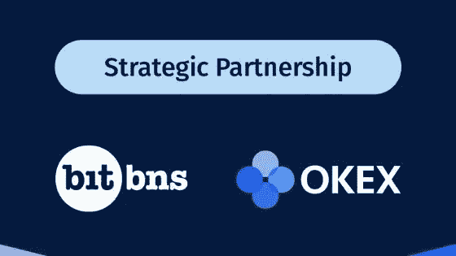

# 在监管僵局中，OKEx 与印度领先的加密交易所合作

> 原文：<https://medium.datadriveninvestor.com/will-indian-crypto-community-rejuvenate-after-this-strategic-partnership-by-a-global-exchange-okex-a97fc4f5ce5a?source=collection_archive---------14----------------------->

## OKEx 与 BitBns 达成合作伙伴关系，作为进入印度加密市场的第一步

OKEx 是世界领先的数字资产交易所，已成为一家可靠且注重稳定性的实体，很高兴宣布与印度领先的交易所 BitBns 建立战略合作伙伴关系，为印度密码交易商带来安全可靠的全球品牌体验。

*(免责声明:本文内容不由任何人赞助，文中提及的观点仅属于作者)*

值得注意的是，与 BitBns 建立战略合作伙伴关系的时机标志着 OKEx 在印度储备银行和印度加密支持者之间的僵局时期进入印度加密生态系统。然而，这种伙伴关系不仅提高了 OKEx 在印度加密行业的地位，而且恢复了对印度加密社区失去的信心，因为 OKEx 拥有无与伦比的全球加密交易经验和资源。

 [## 科罗拉多州正在成为亲加密法规|数据驱动投资者的领导者

### 科罗拉多州已经成为区块链公司的滋生地和避风港。新任命的…

www.datadriveninvestor.com](https://www.datadriveninvestor.com/2019/03/22/colorado-is-emerging-as-a-leader-in-pro-crypto-regulations/) 

作为世界领先的数字资产交易所，总部位于马耳他的加密交易所 OKEx 已经为来自 100 多个国家的 2000 多万用户提供服务，其业务中心遍布世界各地，包括香港、东京、旧金山、卢森堡和首尔。

OKEx 为全球数字资产交易提供安全、可靠和稳定的环境，提供全面的数字资产交易服务，包括法定货币交易(OTC)、现货交易、保证金交易、期货交易、永久掉期(1x-100x)，旨在丰富用户的投资选择，他们计划通过这种合作关系来迎合印度社区。

据 OKEx 的一位官员称，

> “与印度最大的交易所 BitBns 的这一宣布是我们在为印度加密社区服务的愿景之旅中迈出的坚实的第一步。OKEx 一直致力于支持区块链在全球的发展，我们尊重所有国家的法规。为了培养区块链的生态系统，我们一直乐于与当地监管机构分享我们的经验和见解，以改善监管环境。”

在监管不确定性存在的情况下，OKEx 战略上的强大合作伙伴关系旨在传达 OKEx 的强大理念，通过利用两家领先公司在四个主要垂直领域的各自优势，振兴印度加密社区的枯竭精神:

首先，用全球流动性帮助本地交易所，这将加速和扩展 BitBns 的能力，在全球加密领域留下印记

其次，在 OKEx 上列出印度的加密项目，让它们面向全球受众，并刺激次大陆的区块链企业家精神。

第三，将全球加密领域的杰出项目引入印度，因为 OKEx 坚信，让更多的公平货币在市场上流通将推动印度等新兴经济体的发展。

最后，建立一个基金，支持印度区块链在不同垂直领域的项目，为中小型企业(SMB)和分散的企业站点提供技术专业知识。

未来，该公司似乎将全面开放，以积累印度的资源，以及分享生态红利和用户流量。