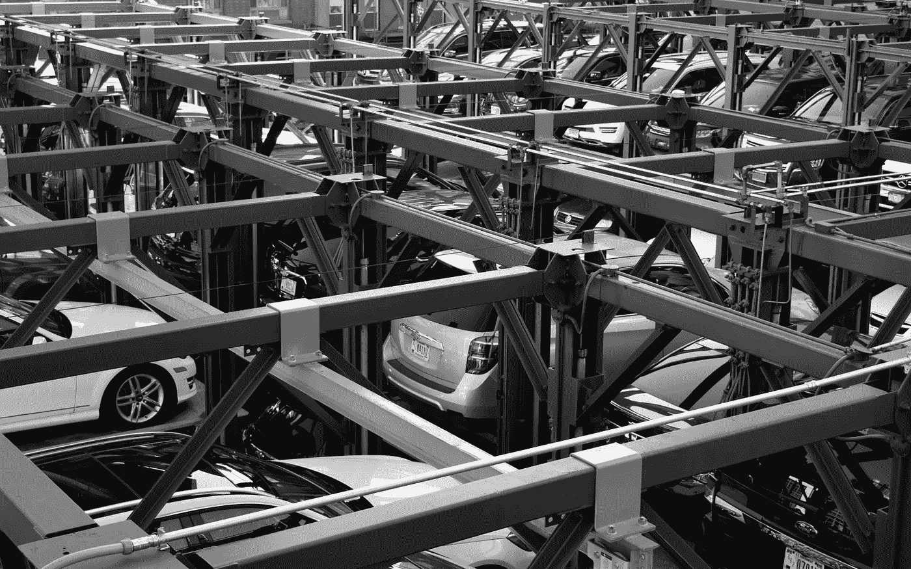
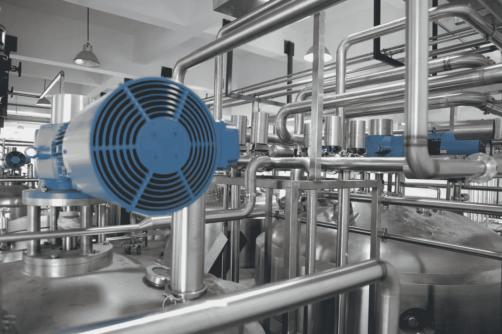
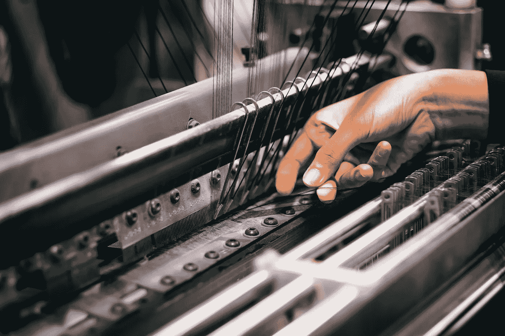
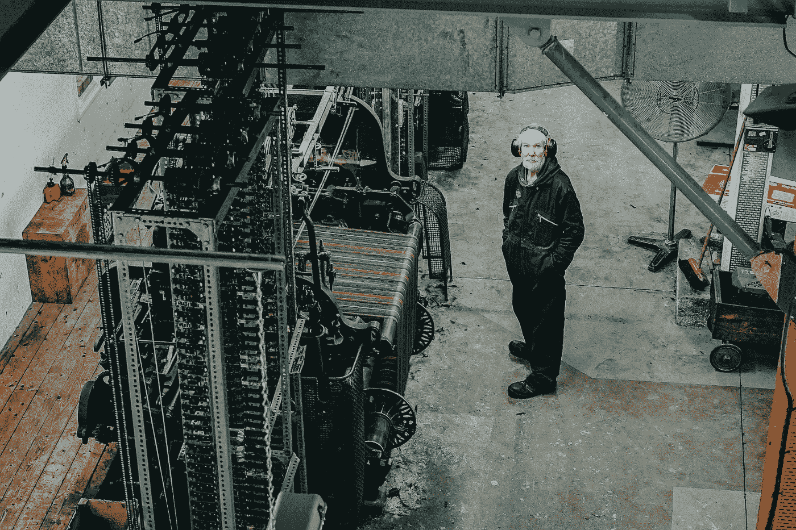

# 工业 4.0 工作岗位会被机器取代吗？

> 原文：<https://medium.datadriveninvestor.com/will-industry-4-0-jobs-be-replaced-by-machines-f0c6417ed0f2?source=collection_archive---------46----------------------->

自从机器人首次亮相以来，它一直是一种恐惧。自从 80 年前吸着烟、会说笑话的机器人 Elektro 首次出现以来，人工智能一直在稳步发展。现在机器已经开始打卡了。

工业 4.0 的吸引力是显而易见的:机器人全天候可用，它们可靠而精确，从不休假。

但是工人也可以从中受益。欧洲经济研究中心(ZEW)报告称，在 1999 年至 2010 年间，自动化实际上对就业产生了积极影响。

原因？随着一些工作被机器取代，自动化也有助于创造这些工作。

那么，高技能的工业 4.0 专业人员可以从自动化的兴起中期待什么？

# 机器的日常任务，人类的分析任务

与其说整个工作被机器取代，不如说机器人通常会承担更多的粗活和重复性工作。除了像在洗衣机上拧盖子这样令人麻木的任务，机器人还可以处理危险和不健康的任务。

此外，尽管算法擅长于涉及数百个步骤的复杂任务，但它们难以做出主观决策和解决问题——这正是人类擅长的。当然，人类首先需要编写和更新算法。

对于工业 4.0 中的高技能专业人员来说，这是一个好消息。

# 工业 4.0 专业人士享受更高薪酬

ZEW 报告称，高技能工人的薪资待遇有望大幅提高。对于科学或管理角色来说尤其如此，这些角色通常涉及不易被机器取代的补充性工作。

事实上，自动化带来了更高的生产率，进而带来了更高的需求和利润。随着新技术加速日常任务，它们带来了更多的增长机会。

几十年前自动取款机的出现就是一个具体的例子。他们可能会终结银行工作。事实上，美国银行的工作岗位数量实际上增加了。自动取款机降低了分支机构的运营成本，促使银行开设更多的分支机构，为银行出纳员提供工作。

# 汽车专业人士更有可能保住他们的工作

海因里希·海涅大学杜塞尔多夫进行的一项研究[得出结论，一旦引入机器人，汽车工人更有可能保住他们的工作。](https://voxeu.org/article/rise-robots-german-labour-market)

随着机器人的激增，人类仍然需要控制它们并做出最终决定。虽然计算机视觉有助于推理和感知，但机器人却难以应对人类从容应对的意外情况，例如更换供应商。

Cobots(协作机器人)使用传感器和感知系统与人类并肩工作，以确保安全。它们可以同时处理多种功能，当人类工人进入工作区时就会关闭。

# 自动化工作的增加带来了哪些挑战？

提高工人的技能是工业 4.0 的一个关键挑战，即使是专业角色。正如我们在帖子中讨论的物联网面临的挑战一样，鼓励行业外的“员工流动”可以促进学习和创新。

尽管高技能专业人员享受着更高的工资，但 ZEW 发现工资不平等差距越来越大。中低技能工人的工资停滞不前。尽管如此，他们没有发现对就业水平的负面影响。

最后，为了保持高昂的士气，公司应该解决员工对工作被机器取代的担忧。关于公司未来发展轨迹的清晰、诚实的沟通应该有助于减轻担忧，提高员工忠诚度。

***寻找你的下一份工业 4.0 工作？*** [*看看我们最新的职位空缺*](https://mastersearch.co.uk/jobs)****拨打 MasterSearch on +44 207 101 9623 或发邮件***[***【rmasterson@mastersearch.co.uk***](mailto:rmasterson@mastersearch.co.uk)***。****

*MasterSearch 专门为欧洲工业自动化和汽车市场安置求职者。我们的候选人和客户从来都不是一个数字:我们用我们的诚实和开放来建立强大、持久的关系。专注于这个行业意味着我们处于独特的地位，能够不断适应这个快节奏和创新市场的变化。*

**原载于*[*mastersearch.co.uk*](https://mastersearch.co.uk/industry-4-0-jobs-replaced-by-machines)*。**