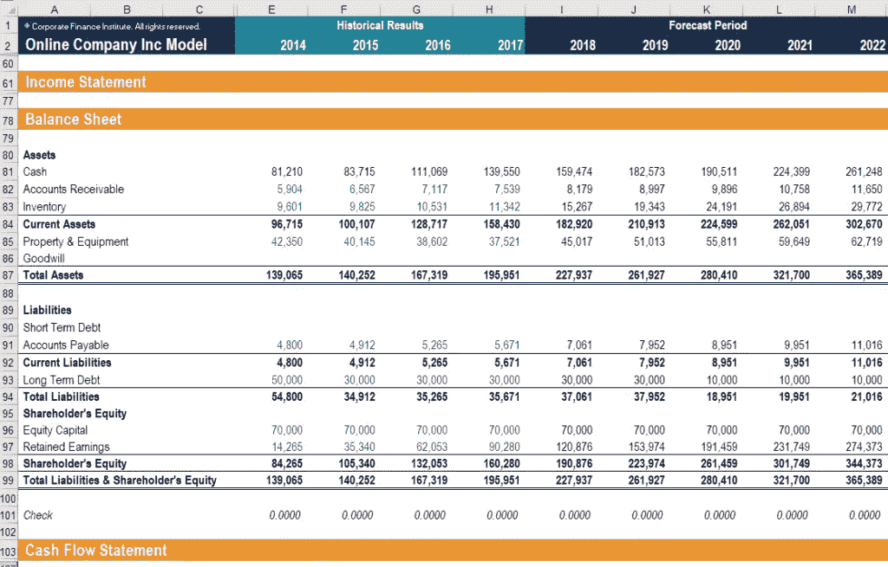

# 投资银行的工作会被人工智能取代吗

> 原文：<https://medium.datadriveninvestor.com/will-investment-banking-jobs-be-replaced-by-ai-695fe9d75d2c?source=collection_archive---------6----------------------->

自从我考虑转行后，我开始考虑我能做些什么。它自然地从金融科技 so AI、机器学习、大数据开始，然后是 Cryptos。

事实上，我的一些朋友目前正在从事人工智能方面的工作。

我也做过牛津金融科技项目，奇点大学项目。

在我浏览这些程序的时候，我想到了[我曾经做过的](https://medium.com/p/ab0f3b9247c3?source=your_stories_page---------------------------)可以被人工智能取代或改进的事情。

我想到的第一件事是，我习惯每天早上在上班前浏览手机，试图阅读我报道的所有股票的晚间新闻。如果我能在就职前做到这一点，我会感到非常高兴，因为这意味着我有几分钟的时间[阅读一些足球新闻](https://medium.com/p/451a8447a5ac?source=your_stories_page---------------------------)。

> 在这个过程中实际上有太多的主观性，比如我必须决定一条新闻是否重要，它对股价是积极的还是消极的——当我滚动到下一条新闻时，在几分钟内决定所有这些。

我在哪里找到这些新闻，即新闻来源也很关键。当我刚开始的时候，我经常因为错过关键新闻而被骂，那时候，我不知道去哪里找。是的，不是所有的新闻都来自彭博。作为一名员工，你应该是第一个知道所有消息的人，这显然是不可能的，因为你是唯一收集消息的人，而如果你是买方，你会有一大群人给你发消息。当然，**这导致了信息溢出，这是 AI** 潜在可以解决的另一个问题。

> 因此，我相信人工智能可以帮助分析师更系统地收集新闻，分析和分类股价，以及在何种程度上上涨或下跌。当然，不同的人会有不同的权重和算法，所以答案是不同的。他们可能还需要不断更新这些以保持领先。

接下来，我们的很多建模都是在 Excel 中完成的。**已经有算法读取财务报表，并有 Excel 电子表格作为输出。因此，目前由合伙人完成的许多工作可能会被取代。**

我估计这种演变有点像我听学长跟我说，他当协理的时候，他们没有 Excel。电子表格是在纸上计算的，如果他们改变了预测，就必须擦掉他们的预测并重写。

当我们为投资想法写报告时，它是整理信息片段或马赛克理论。我认为这可能是人工智能需要更多指导的部分，但一些维护研究，如结果记录和每日/每周/每月记录，很可能会被人工智能取代，从而再次影响助理或初级分析师的工作。

> 我还认为，在人工智能的帮助下，将会有更多的多面手分析师覆盖多个行业或公司。目前，研究通常按行业划分，即分析师有特定的行业重点。在人工智能的帮助下，分析师将有能力覆盖更多的行业和公司。还可以更加关注主题投资，如受贸易战或“一带一路”影响的股票，而不是只关注行业。

最后一点是，我刚开始的时候，有很多关注[基本面分析的](https://medium.com/p/1686fb118200?source=your_stories_page---------------------------)。H **然而，近年来，媒体和社交媒体分析变得越来越重要，因为它们对短期股价有直接影响。需要有更系统的方法来分析这些信息，这不是一个分析师就能做到的。**随着投资期限变短，人们也更加关注短期股价走势。