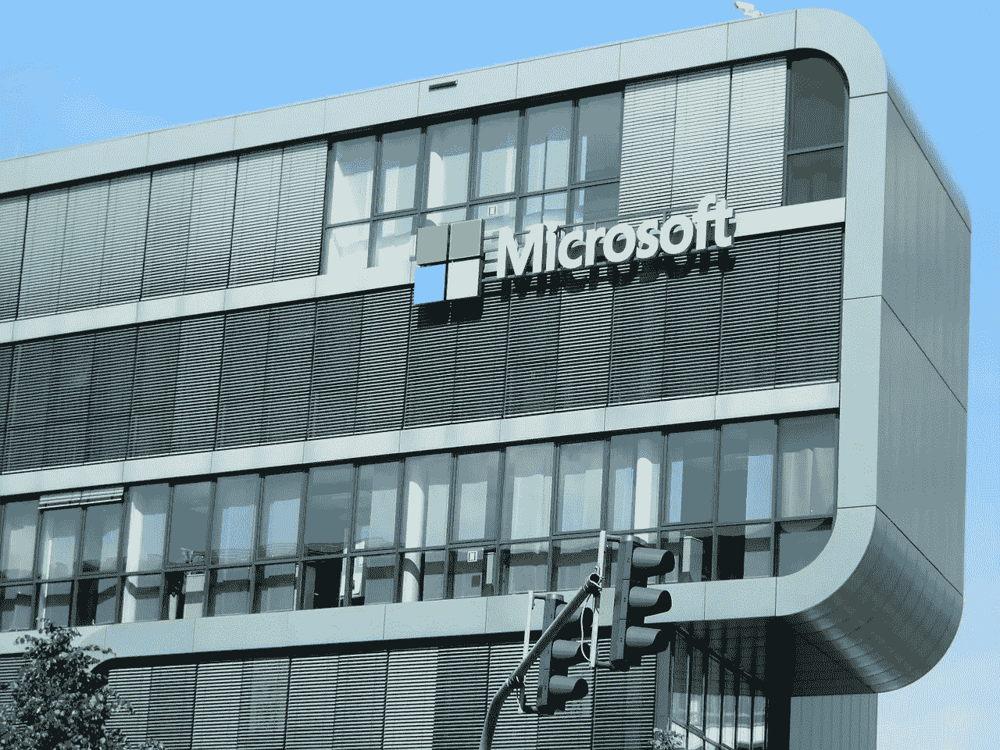
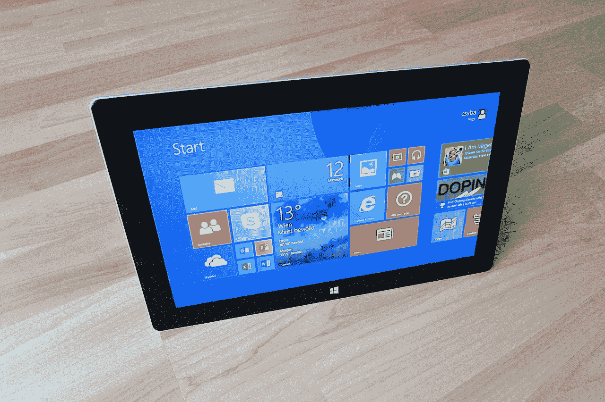
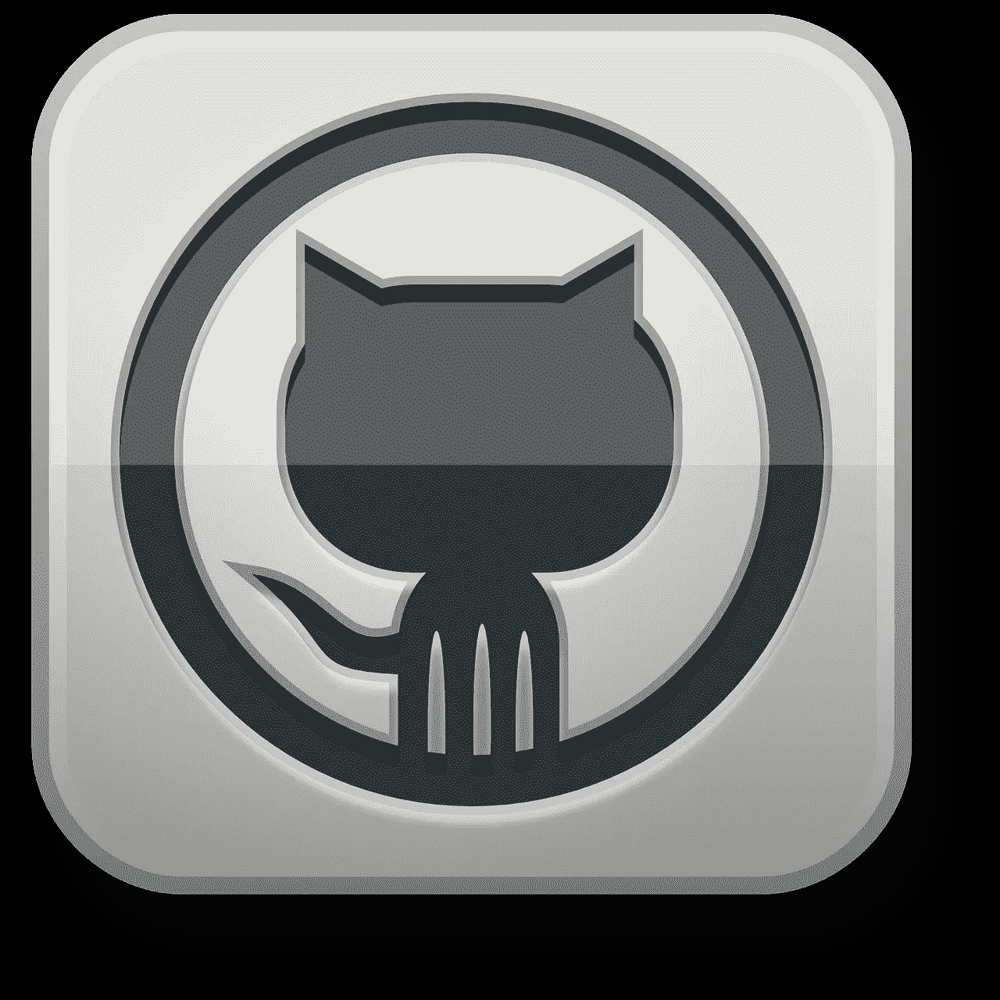

# Will Microsoft (MSFT) Make Money from GitHub?

> 原文：<https://medium.datadriveninvestor.com/will-microsoft-msft-make-money-from-github-31642f1a83ec?source=collection_archive---------3----------------------->

Microsoft (MSFT) is taking some huge risks with its $7.5 billion GitHub acquisition. Thus we have to ask if Microsoft will make money from GitHub.

**Microsoft (NYSE: MSFT)** is already a very profitable company. For example, Microsoft recorded a gross profit of $19.179 billion on revenues of $29.084 billion on 30 September 2018.

Additionally, Microsoft recorded an operating income of $9.55 billion and a net income of $8.24 billion for 3rd Quarter 2018\. Thus, Microsoft is still a very effective money machine.

**How the GitHub Acquisition could threaten Microsoft (MSFT)**

The greatest risk to Microsoft from GitHub is the open source developer platform’s very public battle with the People’s Republic of China.

Notably, GitHub was the target of what *Wired* [calls](https://www.wired.com/story/github-ddos-memcached/) “the greatest distributed denial of service (DDoS) ever” in March 2018\. Cybersecurity experts believe the Chinese government launched the DDOS attack.

In particular, the DDoS attack affected 100,000 memached servers connected to GitHub. To explain, a memached service is a private database catching system based in the cloud.

Many organizations use memached servers as an alternative to expensive hardware hosting. Hence, memached servers are a favorite target of hackers and cyber predators.

**Will China’s War on GitHub Hurt Microsoft (MSFT)**

Chinese security services attacked GitHub because they view the platform as a threat to their nation’s “[Great Firewall](https://en.wikipedia.org/wiki/Great_Firewall).”

To clarify, hackers and developers were using software from GitHub to evade China’s strict regime of internet censorship. The Great Firewall; or Golden Shield, is a popular nickname for the barrier separating the Chinese internet from the rest of cyberspace.

In retaliation, China attacked GitHub with its “Great Canon DDoS weapon,” author Elizabeth C. Economy alleges. For more details of the Great Canon assault on GitHub see Economy’s book [*The Third Revolution: Xi Jinping and the New Chinese State*](https://www.amazon.com/Third-Revolution-Jinping-Chinese-State/dp/0190866071).

Therefore, protection from China and the Great Canon could be the real reason GitHub’s founders sold out to Microsoft. They realized GitHub needs a powerful patron to protect itself from China.

**Will Microsoft (MSFT) Destroy GitHub?**

Thus, Microsoft (MSFT) could make itself a target of Chinese cyberwar with its GitHub acquisition. The Chinese government could seize or shutdown Microsoft operation in China in retaliation for GitHub content.

我们应该赞扬微软首席执行官萨提亚·纳拉亚纳·纳德拉(Satya Narayana Nadella)冒险收购 GitHub。纳德拉拥有 GitHub，让他的公司面临中国网络攻击的严重风险。

然而，愤世嫉俗者会猜测中国是否在利用微软审查 GitHub。在这种情况下，微软可以通过破坏 GitHub 的独立性来降低其价值。

**GitHub 为微软(MSFT)带来大量价值**

GitHub 稳定的 2800 万开发者为微软(MSFT)带来了巨大的价值。

GitHub 的一个显而易见的用途是向普通消费者提供开源代码、应用程序、主机、软件和服务。具体来说，微软可以开放一个应用商店类型的界面，向每个人提供 GitHub 产品。

此外，微软现在可以向其 12 亿 Office 用户和 1.2 亿 Microsoft Office 365 商业用户提供 GitHub。澄清一下，微软可以通过对每笔 GitHub 交易收取少量费用来赚钱。

对微软来说，一个明显的步骤是在 365 和 Windows 的每个新版本中添加 GitHub 应用商店。除此之外，微软可以将 GitHub 应用商店添加到 Xboxes 及其微软 Azure 云平台中。

**微软(MSFT)如何利用 GitHub 赚更多的钱**

此外，微软可以通过 GitHub 提供下一代解决方案，如 Linux、区块链、加密货币、以太坊、物联网(IoT)、侧链和 memached 服务器。GitHub 的另一个有利可图的用途是合资企业。

例如，微软和**沃尔玛(纽约证券交易所:WMT)** 达成了一项名为 4.co 的五年战略云合作伙伴关系。在 4.co，两家公司的工程师将利用微软 Azure 开发内部应用程序，并将沃尔玛的运营迁移到云端。

4.co 团队可以利用 GitHub 雇佣开发者，并通过 GitHub 销售应用来赚钱。此外，4.co 可以大大增加 GitHub 开发人员的智力和专业知识。

计划中的可以利用 GitHub 的 4.co 项目包括内部聊天机器人、食物腐败跟踪、传感器以及对微软无注册订购的改进。4.co 团队将在得克萨斯州奥斯丁的办公室工作。

因此 GitHub 值得微软去冒险。特别是，GitHub 极大地增强了微软的 R&D 能力，而无需在新设施或人员方面进行大规模投资。

微软(MSFT)赚了多少钱？

微软能够承受来自 GitHub 的风险，因为它赚了很多钱。

例如，微软报告 2018 年 9 月 30 日的收入为 290.84 亿美元。独特的是，这些收入在 2018 年第三季度以 18.53%的速度增长。

特别是，截至 2018 年 9 月 30 日，微软的运营现金流为 136.57 亿美元，自由现金流为 100.55 亿美元。因此，微软是一家现金充裕的公司，可以轻松承担 GitHub 带来的风险。

令人印象深刻的是，微软在 2018 年 9 月 30 日记录了 1358.8 亿美元的现金和等价物。值得注意的是，这些钱都是现金和等价物。他们在 2018 年 9 月 30 日的微软资产负债表上没有列出短期投资。

**GitHub 将如何帮助微软(MSFT)对抗亚马逊网络服务**

因此，微软有资源让 GitHub 更上一层楼，征服云。

特别是，微软在与亚马逊网络服务(AWS)的竞争中处于有利地位。例如，微软可以提供 memached 服务器、侧链和区块链作为 AWS 的替代品。

此外，**亚马逊(NASDAQ: AMZN)** 的垄断倾向和与美国军方的联系可能会驱使客户转向微软。由微软建立并通过 GitHub 销售的独立网络服务器将会是一个巨大的赚钱机器。

**微软(MSFT)是一只很棒的分红股票**

拥有 GitHub 使**微软(纽约证券交易所:MSFT)** 成为一只迷人的成长股，但它也是一只伟大的分红股。

例如，微软经历了 14 年的股息增长。更重要的是，2018 年 11 月 5 日，Dividend.com 给微软的年化股息为 1.84 美元，股息收益率为 1.73%，派息率为 43.3%。

微软计划在 2018 年 12 月 13 日派发 46 英镑的股息。股息将比 2018 年 9 月 13 日支付的 42 英镑增加 4 英镑。总之，我认为微软是一个伟大的股息，收入和成长股。