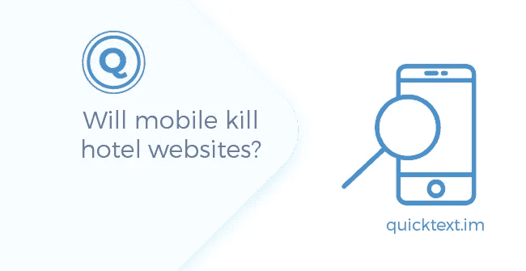
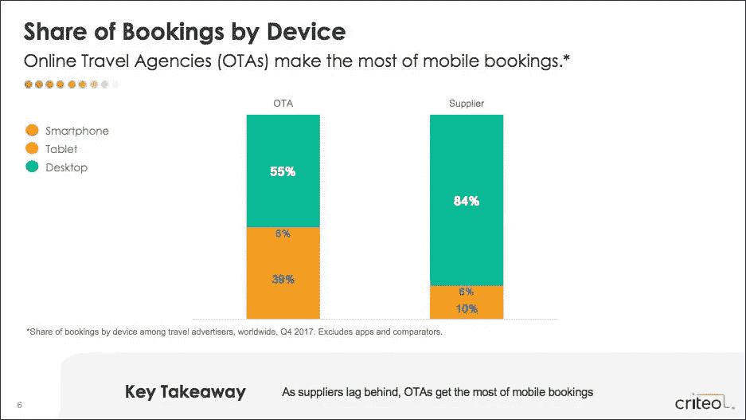
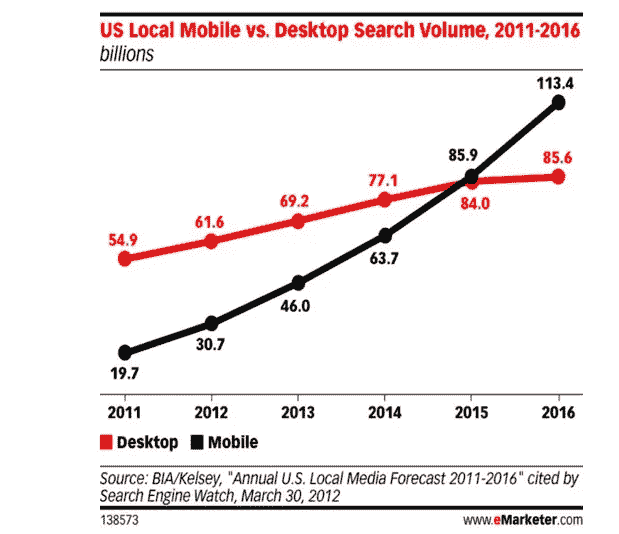
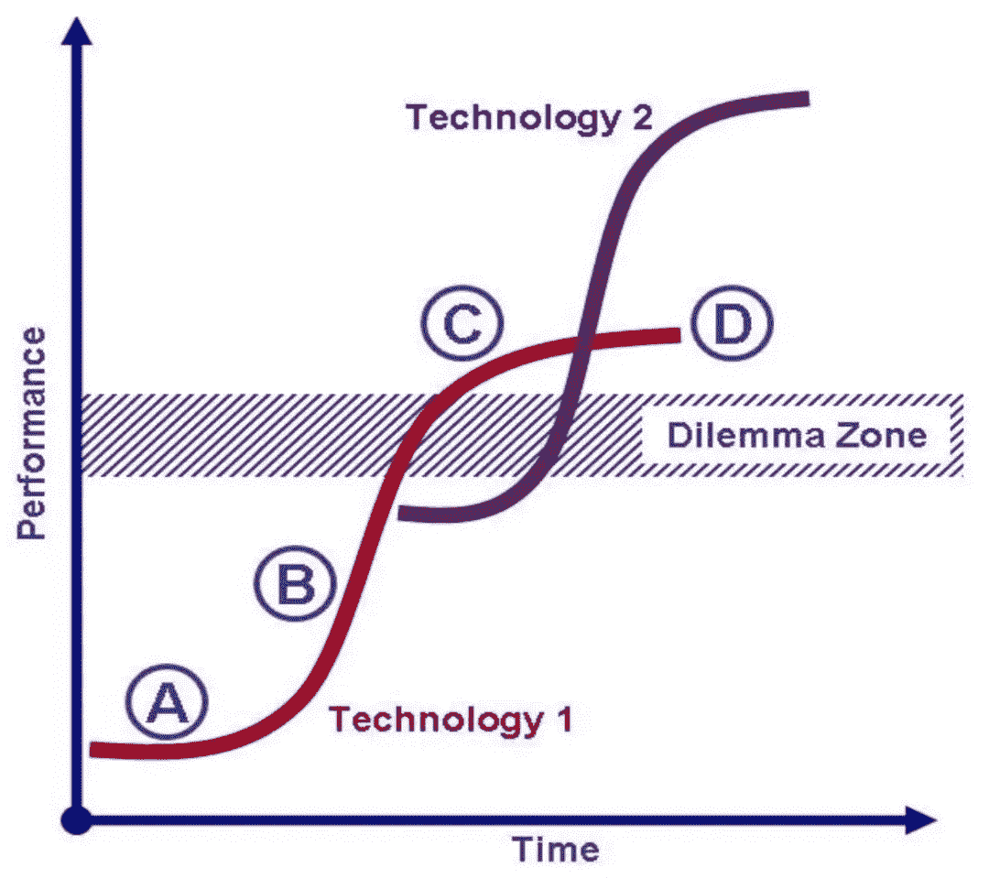
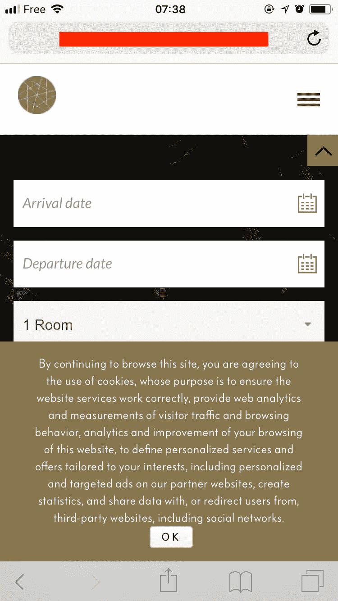
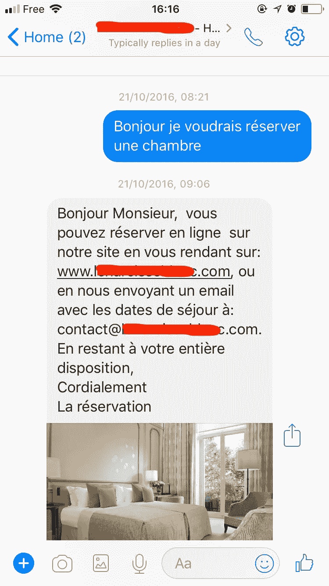
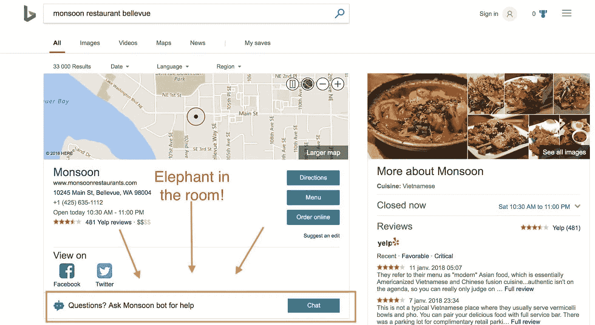
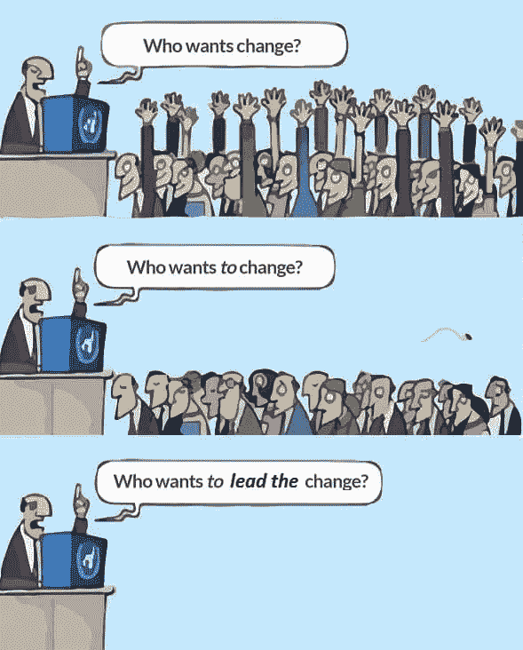

# 移动会杀死酒店网站吗？

> 原文：<https://medium.datadriveninvestor.com/will-mobile-kill-hotel-websites-66ab99f91d8b?source=collection_archive---------25----------------------->

手机占你在线流量的 60%以上，但不到你销售额的 10%。根据一些网络营销人员的说法，这是因为人们使用手机进行研究，更喜欢在桌面上预订。这是我听过的非喜剧演员在舞台上说的第二愚蠢的话。

指望在手机上搜索你的人会努力直接在桌面上预订是病态的、一厢情愿的想法。只有一个地方和一个时间可以出售，就是此时此地。

醒醒！手机已经占据了超过 40%的在线销售额，旅游业也不例外。那么，为什么移动业务占 OTA 销售额的 39%，同比增长 63%，而酒店运营商几乎不到 10%？

这篇文章将帮助你理解为什么酒店在移动销售上失败，如果你想改变这种情况，你可以采取一些措施。

> ***关键见解***

*   移动是一项颠覆性技术，因此你需要从投资回报和不作为的风险两个方面正确评估其投资回报率。
*   智能手机不是小电脑。他们遵循不同的逻辑，试图让你的网站适应更小的屏幕对你没有多大帮助。
*   研究什么在移动设备上有效，主要是应用程序和即时通讯平台，并尝试获得一些营销见解，你可以将其应用到自己的电子商务战略中。
*   在移动领域取得成功所需的技术已经存在，但你的主要障碍叫做遗留效应，也就是你自己对变革的抵制。

ROI:不作为的风险

在做决策时，人们喜欢评估投资回报率，这是理所当然的。ROI 通常是您期望从执行一项操作中获得的收益。这也是无所作为的危险，也就是不作为的风险。

在考虑你的下一个战略举措时，你应该考虑投资回报的这两个方面，因为当你处理破坏性创新时，保持现状将在一段时间内产生积极的投资回报，但不作为的风险将呈指数增长。这就像泰坦尼克号一样——它在它的航线上一直很好，直到它不行了。

虽然手机已经成为搜索量第一的设备，但保持专注于网络的心态显然是非常危险的。当然，你有一个响应迅速的网站，但是我想告诉你的是，你不能通过缩小网站来解决问题。要想成功，你需要理解并应用移动逻辑。

创新者总是遇到相同的困境，即现有技术(桌面)仍然表现很好，并且仍然提供更高的性能。问题是，旧技术已经充分发挥了它的潜力，而新技术(手机)正在不断发展。问题是你不能一夜之间从一种技术转换到另一种技术，因为有一种叫做学习曲线的东西。

虽然桌面不太可能消失，但移动是电子商务的新燃料，你应该了解它的规则，以避免中途耗尽汽油。

> ***手机网站:为您的客户实用***

最近参观了手机版的 hotel Nxxxxxxxx 5* Paris。在你看到任何东西之前，cookie 策略就弹出来了，每次你从一个页面转到另一个页面时，预订引擎就不断入侵屏幕。20 分钟后，我从酒店打电话给 Cecile，她向我解释了如何关闭 BE 弹出窗口。你的客户中有多少人愿意努力理解你？确保你总是尽最大努力。你做的是卖酒店房间的生意，不是智商测试。

任何销售行为都是由 MAT 因素(动机、能力和触发因素)定义的。你的客户在你的网站上完成一个动作所需要的思考量降低了他们的购买能力，阻碍了销售。这个例子是许多例子中的一个。在同情这家酒店之前，好好照照镜子，因为任何人都可能犯同样的错误。

> ***智能手机不是小型电脑***

界面决定行为是我听过一个营销人员在台上说的最鼓舞人心的话。我们是非理性的，相信自己的自由意志，但事实上，外部因素对我们行为的影响远远超出我们的想象。(关于这一点的更多内容，请看罗里·萨瑟兰的《来自一个广告人的人生教训》和他所有精彩的演讲。)

你知道如果你想卖东西，格式和内容一样重要。所以你花了很大的力气来做一个漂亮的网站。但是，审美不是一种格式！格式实际上是架构(也称为交互设计)，而图形设计只是颜料。

而且不，只要合适就不好！当然，通过移动响应网站进行预订在物理上是可能的，但人们不会这样做，因为每种格式都有自己的逻辑，响应度等于在智能手机上强制使用桌面格式！搜索和点击在桌面上非常舒适，但在智能手机上非常笨拙，因为我们都有小屏幕和胖手指。

移动营销就是互动——而不是点击、滚动或换页。让我们从有效的方法中获得灵感，而不是依赖网络。

*   **应用**除非你是 Booking.com，否则你是够不着的，因为人们平均会下载 15 个他们会非常频繁使用的应用，而你不在其中。不要指望人们会特意为你着想。事实上，就连 Booking.com 也不仅在利用应用程序，还在开拓 Facebook Messenger([https://youtu.be/MEG2VOS6t7o](https://youtu.be/MEG2VOS6t7o))。
*   即时通讯可能是一个更好的选择，因为它更开放，更便宜，而且人们大部分的移动时间都在那里度过。它们的主要特点是:
*   **会话**:提供点播内容。
*   **基于关系的**:多重互动，思考以客户为中心和客户参与。
*   **全渠道**:不要让客户来找你。你去找他，因为他是免费的，并欢迎选择他最喜欢的信息应用程序与你的品牌互动。

“移动第一”这个词被创造出来是为了更进一步，并确认我们不应该将移动视为网络的延伸，而恰恰相反。移动设备正在影响人们的行为，即使是在桌面上。

那么如何让营销变得像 WhatsApp 的对话一样自然呢？

> ***交互性***

在过去的几年里，聊天已经在大多数电子商务网站上出现，但它们的人力资源成本如此之高，以至于大多数酒店都负担不起。一些聊天外包选项是可用的，但从长远来看是不可持续的，因为随着移动成为你的电子商务战略的核心，你不是在寻求快速解决方案，而是真正试图解决一个关键的战略挑战。从长远来看，将客户互动外包就像你洗衣服一样被证明是灾难性的，因为你没有增长公司的学习曲线。

聊天机器人可能是一个开始寻找的好地方。这就是为什么我决定大力投资他们。当我开始的时候，只要有人提到机器人与人类互动，所有人都吓坏了。现在它被各行各业广泛接受。对话代理不是与人比较，而是与网站比较。他们根据每个客户在任何平台上的特定需求提供您的内容，包括网络、脸书、WhatsApp 等。他们可以管理占所有客户交互 80%的所有重复性任务，只有他们无法管理的任务才需要人工协助。体验看起来是这样的:[https://youtu.be/tlTsDQRoIoo](https://youtu.be/tlTsDQRoIoo)

> ***以客户为中心***

手机是一种个人设备，你的手机策略应该旨在建立一种关系。当客户在手机上与你的品牌互动时，他们关注的是你。珍惜时间，占据尽可能多的大脑空间，尽可能深入，为你的竞争对手创造进入壁垒。

> ***全渠道方式***

即时消息和社交网络是你的移动战略的关键组成部分，不应该被视为跟班。这是一个酒店忽略脸书的明显例子，而且可能不是唯一一个。如果顾客想通过 Facebook Messenger 聊天来预订，那是他的权利，酒店应该满足他的要求，就像 Booking 或 Expedia 一样。=> [Expedia Facebook Messenger 预订](https://youtu.be/ZFo6SdIh7mc)

所有主要的即时通讯渠道现在都已经开放:脸书、WhatsApp、微信、iMessage 等。新技术的出现使得全渠道沟通更容易管理。看起来是这样的:【https://youtu.be/uREEJl_3M5c】T2

移动是关键平台，但这并不意味着网站将会消失:它们将会发展(见下面的必应截图)。你的客户至少在一段时间内还会使用它们。但要明白，现在客户的行为是由他们在移动设备上能做什么决定的。

那现在怎么办？

挑战不是技术上的，而是心理上的。您在移动领域取得成功所需的技术资源已经准备就绪。主要的障碍是你自己对改变的抗拒。15 年来，你一直在努力发展网上业务，游戏规则正在发生变化，而你从未像今天这样擅长上网。这就是所谓的遗产效应，衡量不作为的风险是对抗它的良好开端。

> *如果你想讨论更多或者对聊天机器人和 AI 有任何疑问，欢迎通过*[*bde @ quicktext . im*](mailto:bde@quicktext.im)联系我

*最初发布于*[*www . quicktext . im*](https://www.quicktext.im/news/will-mobile-kill-hotel-websites)*。*