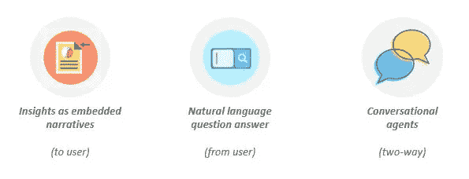

# 自然语言会让我们到达分析的最后一英里吗？

> 原文：<https://medium.datadriveninvestor.com/will-natural-language-get-us-to-the-last-mile-of-analytics-1265daf1c199?source=collection_archive---------18----------------------->

我们都知道数据的力量及其包含的丰富信息。历史上，组织一直试图通过采用各种形式的分析从数据中获取价值。正如汤姆·达文波特十多年前写的那样，企业正在接受分析，并将其作为一种 T2 的竞争优势。除了极少数组织，许多组织缺乏急需的专业知识，并且未能将数据驱动的文化内化。最常见的陷阱与这样一个事实有关，即“[最后一英里分析](https://www.bain.com/insights/chris-brahm-the-last-mile-of-analytics-video/)”(分析输出和实际改变的行为之间的距离)的重要性经常被忽视和低估。

> **组织在分析领域展开竞争，不仅仅是因为他们能够——当今的商业充斥着数据和数据处理器——也是因为他们应该这样做。**
> 
> **–汤姆·达文波特**

 [## DDI 编辑推荐:5 本机器学习书籍，让你从新手变成数据驱动专家…

### 机器学习行业的蓬勃发展重新引起了人们对人工智能的兴趣

go.datadriveninvestor.com](http://go.datadriveninvestor.com/5ML1) 

如今，市场上有各种各样的分析平台和工具。您可以从不同来源获取和集成数据，汇总和分析数据，创建报告和仪表板。传统数据库、机器日志、客户反馈、互联设备、社交媒体、外部网页等。然后，整个分析范围可以帮助组织回答诸如发生了什么、为什么会发生、将会发生什么、我们如何改进等问题。

开源工具真正将分析放到了一个真正公平的竞技场上。任何人都可以挖掘数据，告诉客户想要什么，哪些营销渠道可以产生最大回报，哪些线索应该是优先目标，公众对品牌的情绪如何，对产品的预期需求是什么，等等。然而，从上到下获取这些见解和预测，并将其下达到每一级的决策者，实际上仍然很困难。这正是组织可以建立可持续竞争优势的地方。

人工智能，特别是最近在理解人类语言细微差别方面的进展，正在重塑机器与组织各级决策者沟通的方式。

# 作为叙事的见解

如今，商业智能工具已经成熟，具有强大的分析能力。虽然他们中的大多数在发现和展示对企业最重要的东西方面做得很出色，但他们总是让用户承担解释和理解它的负担。用户(各级决策者)解释的质量和一致性取决于多种因素:用户的定量熟练程度、分析或演示的复杂性以及所需的时间或精力。

以叙述的形式为任何图表或仪表板提供见解，可显著改善受众消费和消化 BI 报告的方式。想象一下，一位客户服务经理正在查看他/她的每周仪表盘。借助由深度分析驱动的动态叙述，他/她不仅可以看到某个 KPI 在上周是如何下降的，还可以了解它为什么会下降以及是什么推动了这种变化。这就是每个决策者指尖的分析能力。

# 自然语言问答

问对问题的人会得到最相关或最有意义的答案。就像 Siri 和 Google Assistant 这样的认知助手如何为我们日常生活中的常见问题提供答案一样，商业用户将能够向 BI/分析工具提出任何问题，并了解对他们来说最重要的是什么。在线的人可以提出最相关的问题。

一旦创建了仪表板或报告，就大大缩小了任何数据集的分析范围。任何仪表板或报告都类似于一个冻结的视图，显示(构建报告的)人员如何着手分析数据。切片和切块的性质、单向比较的次数、双向比较、选择用于分析的变量、选择深入特征、使用统计方法等。自然语言问答(NLQA)神奇地消除了这一障碍，并为在人类语言界面中进行分析/查询提供了机会。

# 引导决策的对话代理

当我们使用能够理解用户输入并以自然语言回应的对话代理来转变双向通信时，真正的奇迹就发生了。解析用户输入和识别意图的能力决定了用户想要什么。然后，机器或工具执行必要的分析，并以自然语言提供见解/发现。

一个简单、直观的界面，你可以用人类语言与之对话，它可以理解你的问题并立即给出相关答案，它可以建议你采取最佳行动，它可以及时提醒你采取关键行动。这全面提升了组织在工作中使用数据和技术的方式，并增强了各级决策者的能力。