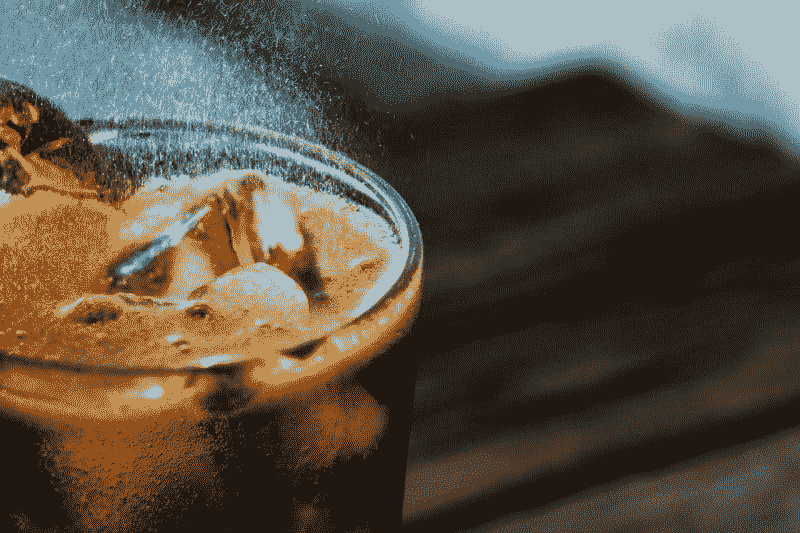
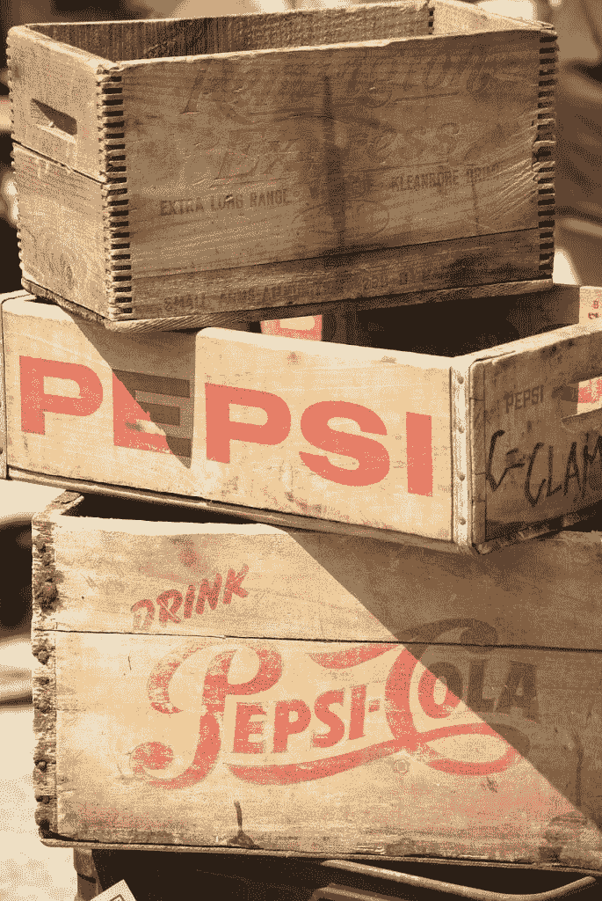
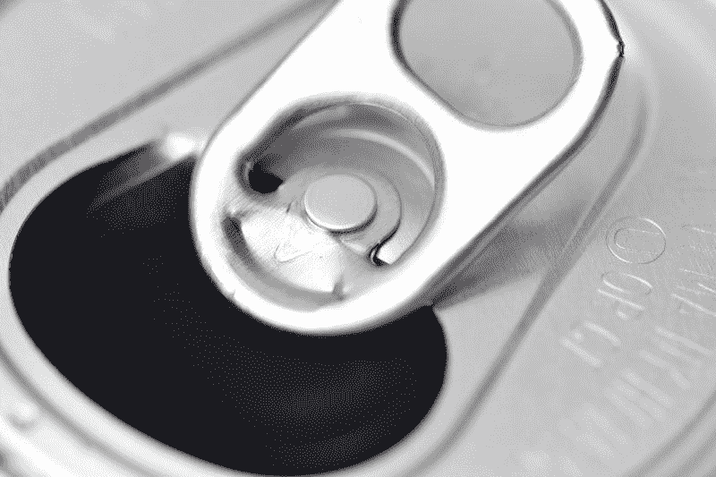
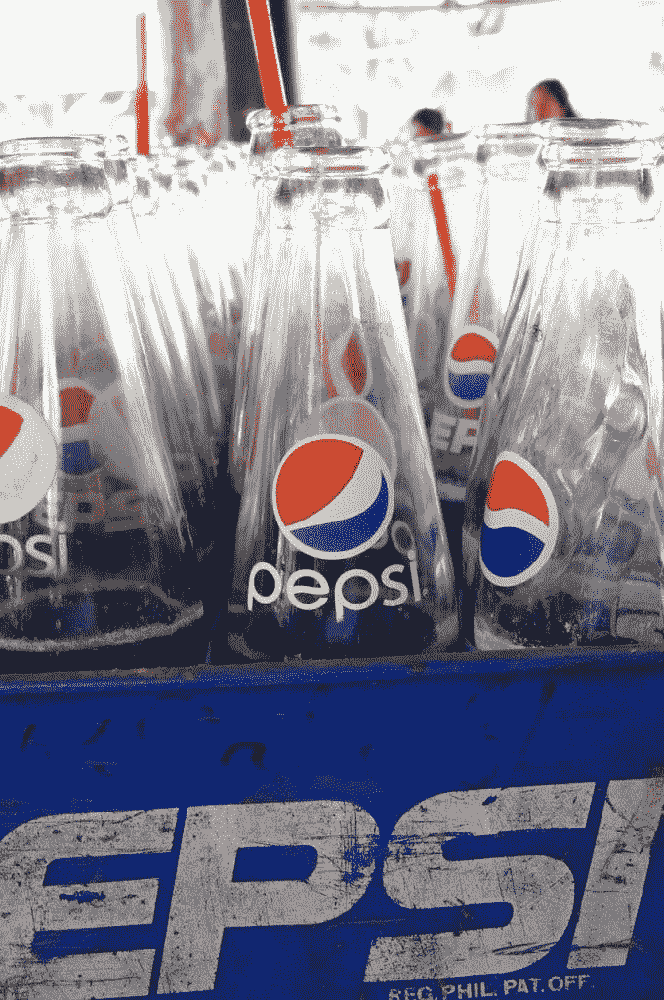
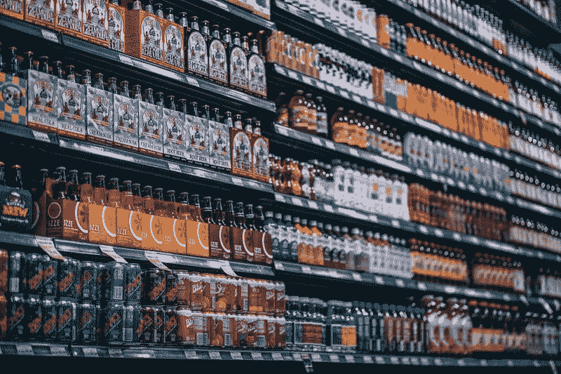
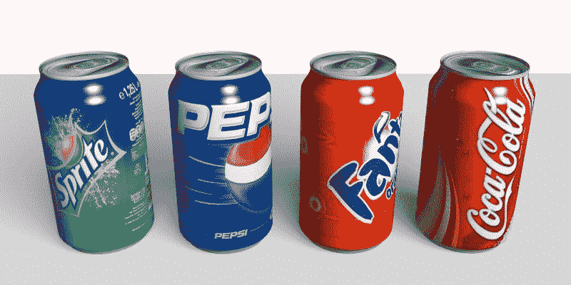

# 百事可乐会幸存吗？—市场疯人院

> 原文：<https://medium.datadriveninvestor.com/will-pepsico-survive-market-mad-house-e43688581c85?source=collection_archive---------19----------------------->

我问百事公司能否生存下来，因为软饮料消费在美国直线下降。例如，自 2012 年以来，百事可乐在美国的销售额下降了 9%，石英 [估计](https://qz.com/1520602/americans-want-to-drink-more-water/)。

然而，**百事可乐(纽约证券交易所代码:PEP)** 在截至 2019 年 6 月 15 日的季度中，收入增长了 2.23%。此外，Pepisco 的收入从 2019 年 3 月 23 日的 128.84 亿美元增加到 2019 年 6 月 15 日的 164.49 亿美元。

 [## 算法交易的机器学习|数据驱动的投资者

### 当你的一个朋友在脸书上传你的新海滩照，平台建议给你的脸加上标签，这是…

www.datadriveninvestor.com](https://www.datadriveninvestor.com/2019/01/30/machine-learning-for-stock-market-investing/) 

此外，百事可乐的毛利从 2019 年 3 月的 71.99 亿美元增长到 2019 年 6 月的 91.34 亿美元。因此，尽管对其旗舰产品的需求下降，百事仍在增长。

令人印象深刻的是，百事可乐的季度营业收入在 2019 年 3 月至 6 月期间从 19.91 亿美元增长到 29.24 亿美元。此外，同期季度净收入从 14.13 亿美元增长到 20.35 亿美元。

# 百事可乐为什么赚钱更多？

为什么百事可乐在汽水需求下降的情况下赚了更多的钱？答案很简单，美国人购买的罐装和瓶装饮料比以往任何时候都多，但苏打水却越来越少。

值得注意的是，欧睿国际估计，2012 年至 2018 年间，美国碳酸水的销量增长了 88%。与此同时，调味水的销售额同期增长了 72%。据美国有线电视新闻网商业[报道](https://money.cnn.com/2018/08/20/investing/pepsico-sodastream/index.html)，可以预见的是，百事公司在 2018 年以 32 亿美元的价格收购了苏打水和苏打水制造商 SodaStream。

因此，汽水市场的变化并没有影响百事的收入和利润。如果消费者不想要苏打水，百事公司会卖给他们苏打水、水、运动饮料、茶或果汁。

因此，百事公司目前的[稳定品牌](https://www.pepsico.com/brands/product-information)包括:立顿茶、纯果乐橙汁、佳得乐、Aquafina 水、纯叶茶、Soby 茶、Bubly 苏打水、Propel 水、裸汁和星巴克冷咖啡饮料。

此外，百事可乐还销售各种各样的食品和零食产品。受欢迎的佩皮斯科食品包括沙布拉鹰嘴豆泥、雷薯片、弗里托玉米片、桂格燕麦、智能食品爆米花、斗牛士肉干、饼干杰克、生活麦片和大米 a Roni。

因此，无论你什么时候去便利店或自动售货机，百事可乐都能赚钱。如果你不买百事可乐，百事可乐可以卖给你一袋薯片、瓶装水、茶、苏打水，甚至牛肉干。

# 百事公司赚了多少钱？

百事公司业务的一个吸引人的方面是它产生现金的能力。例如，百事公司在截至 2019 年 6 月 15 日的季度中，运营现金流为 13.88 亿美元，自由现金流为 10.48 亿美元。

很明显，运营现金流从 2019 年 3 月 23 日的-3.45 亿美元上升。此外，自由现金流从 2019 年 3 月 32 日的-7.85 亿美元增长。

百事公司是一家现金充裕的公司，2019 年 6 月 15 日拥有 33.443 亿美元的现金和等价物，以及 2.91 亿美元的短期投资。因此，百事公司有 37.34 亿美元的现金和短期投资。

然而，百事公司的现金和短期投资从 2019 年 3 月 23 日的 55.51 亿美元和 2018 年 6 月 16 日的 181.29 亿美元下降。因此，百事可乐的现金比去年少得多。

# 百事公司是一个很好的股息股

目前，我认为**百事可乐(纽约证券交易所代码:PEP)** 是一只股价高的好股息股。

令人印象深刻的是，百事公司于 2019 年 6 月 6 日支付了 95.5₵的股息。此外，2.75₵在 2019 年增加了股息。具体来说，PEP 股息从 2019 年 2 月 28 日的 92.75₵上涨到 6 月的 95.5₵。

此外，Dividend.com 将 46 年的股息增长归功于百事公司。2019 年 8 月 28 日，百事公司股东收到的股息收益率为 2.84%，年化派息为 3.82 美元，派息率为 67.1%。

尽管百事可乐的股价为 134.43 美元，但投资者仍将从中赚钱，市场先生在 2019 年 8 月 28 日给出了该股。百事公司的股东可以因为丰厚的股息而赚钱。

# 为什么百事可乐是一项价值投资？

我认为百事可乐是一个可能的价值投资，因为该公司业务多元化，产生大量现金。

具体来说，百事公司在三个不同的市场运作；休闲食品、饮料和食品。此外，百事公司在这些市场中实现了产品线的多样化。

例如，在饮料方面，百事出售苏打水、茶、果汁、苏打水、运动饮料、咖啡饮料和水。与此同时，在休闲食品方面，百事出售鹰嘴豆泥、牛肉干和各种薯片。因此，一个不喜欢饼干或薯片的人可以吃油炸玉米片或多力多滋。

聪明的是，百事可乐正在适应不断变化的市场，而不是抵制变化。百事公司并没有忽视健康饮料，而是在销售它们。此外，百事可乐正在增加其休闲食品系列。相反，百事没有因为口味的改变而失去市场份额，而是通过迎合这些口味的改变来赚取更多的钱。

# 百事公司能抵御衰退吗？

有趣的是，我认为百事公司不受经济衰退的影响，因为它销售低成本的物质享受。值得注意的是，一些观察家如沙龙的 [Boby Hennelly](https://www.salon.com/2019/08/25/no-cushion-for-the-trump-recession-why-this-one-could-be-worse-than-2008/) 和美国[参议员 Liz Warren](https://medium.com/@teamwarren/the-coming-economic-crash-and-how-to-stop-it-355703da148b) (D-Massachusetts)认为一场严重的衰退即将来临。

解释一下，即使是最穷的公民也能买得起一袋油炸玉米饼或一罐百事可乐。因此，如果这些人买不起沙布拉鹰嘴豆泥，百事公司仍然可以从他们身上赚钱。

在这种情况下，百事可以从复苏或衰退中获利。在复苏中，人们会购买更多的 Soby 或 Sabra 鹰嘴豆泥。在经济衰退时，他们会购买更多的立顿茶、乐事薯片和无糖百事可乐。

因此，**百事可乐(纽约证券交易所代码:PEP)** 可能是保护你的投资组合免受经济衰退影响的好股票。

# 百事可乐亚马逊证明了吗？

有趣的是，百事可乐可能不受亚马逊的影响。澄清一下，大多数人从便利店或自动售货机购买薯片、软饮料、瓶装水、茶和肉干。

因此，如果**亚马逊(NASDAQ: AMZN)** 消灭了大多数实体店，百事的大部分市场仍将存在。人们仍然会从自动售货机购买百事可乐和多力多滋，从便利店购买牛肉干和 Aquafina，即使他们在网上订购其他东西。

因此，百事可乐是一家消费者品牌公司，为零售业的末日提供了一些保护。只是，它的一些产品，如 Rice-a-Roni 和 Sabra Hummus 是杂货店品牌。

归根结底，**百事可乐(纽约证券交易所代码:PEP)** 对于一个混乱且快速发展的消费品牌市场来说，看起来是一个相当安全的价值投资。不过，我会等到 PEP 的价格跌一点再买。

*原载于 2019 年 8 月 28 日*[*https://marketmadhouse.com*](https://marketmadhouse.com/will-pepsico-survive/)*。*