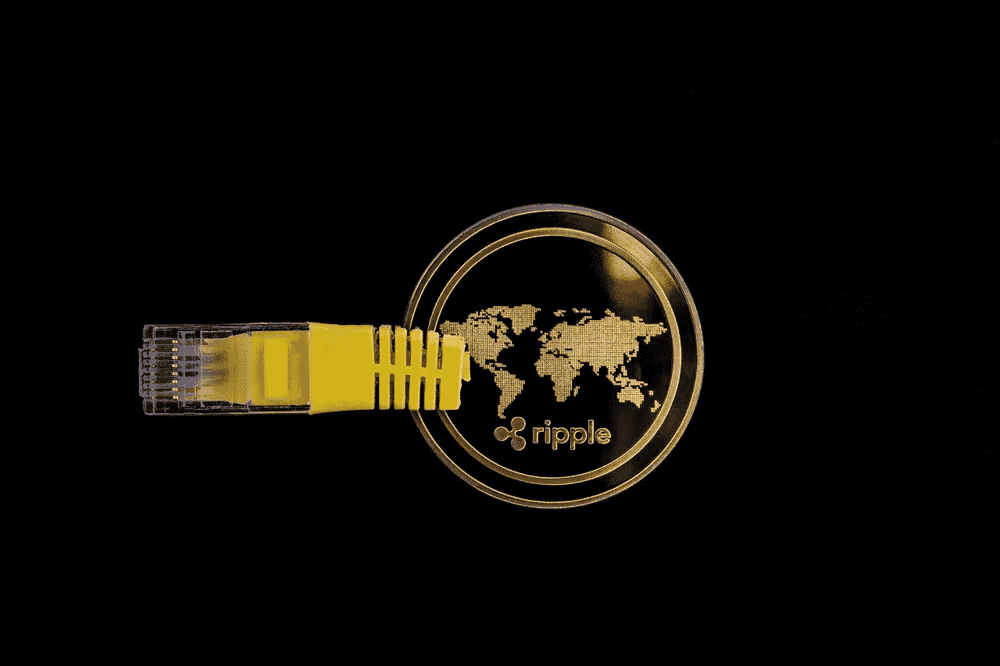

# Ripple 会是下一个比特币吗？

> 原文：<https://medium.datadriveninvestor.com/will-ripple-be-the-next-bitcoin-e7057c480470?source=collection_archive---------6----------------------->

Image by [WorldSpectrum](https://pixabay.com/users/WorldSpectrum-7691421/?utm_source=link-attribution&utm_medium=referral&utm_campaign=image&utm_content=3424779) from [Pixabay](https://pixabay.com/?utm_source=link-attribution&utm_medium=referral&utm_campaign=image&utm_content=3424779)

每当我们认为加密货币不会变得更受欢迎时，它就会回来用一些新的头条新闻打我们的脸。然后，他们又回到了每个人的新闻源上！

2018 年初，加密货币的市值达到 8000 亿美元。这意味着在那段短暂的时间里，它和谷歌的母公司 Alphabet 一样有价值。在那之后，直到今天，加密货币也经历了许多糟糕的时期。

在我之前的文章中，已经写了很多关于[比特币和以太坊](https://opinined.com/bitcoin-versus-ethereum-an-in-depth-analysis/)的内容。今天，我想写一写 Ripple，因为人们已经开始怀疑 Ripple 是否会成为下一个比特币。

 [## 2020 年应该投资比特币还是以太坊？

### 迷茫应该投资比特币还是以太坊？

medium.com](https://medium.com/swlh/should-you-invest-in-bitcoin-or-ethereum-in-2020-a5fe4ef4ac46) 

在你投资 Ripple 之前，有几件事你需要知道。

## 什么是涟漪？

比特币变得非常受欢迎，因为它普及了分散式全球数字货币的理念，这意味着它是一种不受任何大银行、任何政府或任何私人实体监管的货币。它由比特币的用户控制和管理。

所以对很多人来说，比特币是他们摆脱银行系统干预的方式。

 [## 总部位于瑞士的 ETP 进入加密交易市场|数据驱动的投资者

### 虽然金融市场几乎没有沉闷的时刻，特别是在引入…

www.datadriveninvestor.com](https://www.datadriveninvestor.com/2019/03/10/swiss-based-etp-enters-the-crypto-trading-market/) 

涟漪有点不一样。Ripple 直接与大银行合作，而不是试图避开它们。所以对一些人来说，Ripple 违背了加密货币的宗旨，因此他们不喜欢 Ripple。

对其他人来说，这很好，因为大银行和政府有很大的权力。如果假设有更多的银行开始使用 Ripple，这可能意味着 Ripple 硬币以后会有更多的价值。

## Ripple 或 XRP 是如何工作的？

XRP 是涟漪的象征或硬币。假设你想把你银行账户里的钱寄给你在伦敦的表弟。要做到这一点，你将不得不经历一大堆的银行转账费用，而且你的钱需要几天才能到达你堂兄的银行账户。

Ripple 的目标是像传递信息一样传递货币。现在，如果你想给伦敦的某个人发电子邮件，你可以在一瞬间完成。但是你的钱要花很长时间才能到达那里。Ripple 正试图改变这种状况。

目前，Ripple 可以让你在大约 3-4 秒内将货币发送到世界的另一端，而这样做的成本不到 1 美分。所以它有特定的用途。

但这不正是比特币应该让你做到的吗——让货币无国界地流动？

是的，有点。问题是用比特币不如用 Ripple 实用。根据 Ripple 首席执行官的说法，如果我们用比特币进行我刚才谈到的相同交易，你将花费大约 40 美元，并需要几个小时来结算。这就是为什么它不像 Ripple 那样适用于这种类型的事务。

换句话说，所有的加密货币都不一样。

## 你如何购买波纹硬币或 XRP？

在说买波纹币之前，我先提一下，你投资任何东西都是永远不保证赚钱的。你甚至可能会赔钱。这就是为什么你应该先和你所在地区的律师和财务顾问谈一谈，这样你才能了解当地所有管理投资的法律法规。

购买 Ripple 有点棘手。如果你想购买任何加密货币，你必须使用加密交易所。但是 Ripple 并没有在所有的加密交易所上市。

如果你想买瑞波，你必须通过几道关卡。让我用三个简单的步骤来说明如何做到这一点。

**第一步:**在像[比特币基地](https://www.coinbase.com/)这样的交易所购买一种容易获得的硬币，如比特币或以太币。这种首次购买可能需要一些时间，因为最近有太多的用户进入加密货币。

**第二步:**一旦你拥有以太坊或比特币，就在[比特币基地](https://www.coinbase.com/)将这些硬币转移到允许你购买 Ripple 的交易所。允许你这样做的最受欢迎的交易所之一叫做币安。

**第三步:**一旦你在[币安](https://www.binance.com/en)上有了你的比特币或以太币，你就可以把它转换成瑞波币或 XRP 币。

你必须跳过这些步骤的原因是，如果你用你的美元购买 Ripple，你可能需要几周的时间才能得到足够的验证。上面解释的过程使它更快。

这实际上可能在未来发生变化，这就是为什么你需要关注加密货币世界正在发生的事情。

 [## 即将到来的 2020 年比特币减半有什么大不了的？

### 预计 2020 年比特币减半将对比特币价格产生影响。但是具体怎么做呢？阅读来找出答案。

medium.com](https://medium.com/swlh/whats-the-big-deal-about-the-upcoming-bitcoin-halving-in-2020-318680a66915) 

## 保护你自己

你需要注意[加密货币骗局](https://opinined.com/the-fear-of-cryptocurrency-scams/)，并在开始交易之前通过了解一个交易所来保护自己。

 [## 追踪退出后的加密货币骗子

### 了解如何追踪加密货币骗子，即使他们带着你的钱逃跑了！

medium.com](https://medium.com/swlh/tracing-cryptocurrency-scammers-after-their-exit-dd805597d250) 

您还可以通过添加额外的安全层来保护自己，允许您在交易所外使用外部钱包存储加密货币。换句话说，你会像平常一样购买比特币或 Ripple，但不是让你的加密货币坐在交易所里，而是把你自己的加密货币转移到外部钱包里。这样，如果有人侵入交易所，你的硬币就不会被黑客拿到。

外面有一堆外置钱包。有些是物理的，有些是在线的。所以做你的研究，选择一个你最喜欢的。

## 了解涟漪的价格

大约有 1000 亿个 Ripple 单位存在，并且大部分这些硬币是由 Ripple 公司自己拥有的。每个波纹硬币的价值实际上取决于硬币的可用性，以及其他人愿意为你的波纹硬币支付多少钱。这是供求关系的运作方式。如果你拥有 Ripple，很多人想买，那么价格自然会上涨。

在过去的几年里，许多人都对 Ripple 感到兴奋，因为一些大银行已经投资了数亿美元来测试 Ripple。因此，如果 Ripple 流行起来，它可能会变得更有价值。

一般人很难接触到 Ripple。一些人猜测，如果 Ripple 通过进入像比特币基地这样的交易所变得更容易获得，它将有大量的买家涌入，这将导致价格上涨。

但同样，这只是猜测。没有人能预测未来。

## 投资于财务，而不是情感

投机能赚大钱吗？当然，在 21 世纪初，很多人都投资过房地产，但如果你持有时间太长，或者你的负担超过了你的承受能力，房地产真的会让你吃不消。

2017 年，Ripple 在短短一年内从每枚硬币 0.006 美分的交易价格上涨到每枚硬币 2 美元以上。这意味着它上升了 30，000%以上。太疯狂了。

但是要记住，过去某个东西涨了，并不一定意味着会继续涨。加密货币背后有很多炒作和投机，但炒作和情绪不可能永远推动资产上涨。

加密货币非常不稳定，这意味着它可以快速上涨，也可以快速下跌。

*原载于 2019 年 11 月 29 日*[*【https://opinined.com】*](https://opinined.com/what-you-need-to-know-before-investing-in-ripple/)*。*