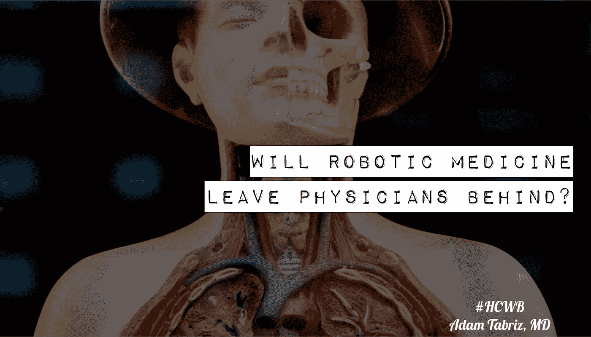

# 机器人医疗会把医生甩在后面吗？

> 原文：<https://medium.datadriveninvestor.com/will-robotic-medicine-leave-physicians-behind-db808ba8ee54?source=collection_archive---------11----------------------->

#hcwb #healthcarewithoutborders

> 医疗实践是一门艺术。它一直是，并将永远是！
> 
> *作为医生，我们从一个病人的过去和现在收集临床和非临床数据，我们试图像组装乐高积木一样组装这些数据，以创建一个类似于足够清晰的结构的诊断，来描述影响我们客户的疾病"* ***病人*** *。"*
> 
> 健康信息和临床数据是医疗实践的基础。医生需要利用这些来做出正确的诊断。医疗保健 IT 行业和其他一些公司、保险公司、药店、在线零售商等。—正在积极渗透医疗保健市场。
> 
> 公司只有一个目的，那就是在短时间内赚更多的钱。他们使用时髦的词语“ ***扰乱医疗保健市场*** ”来制造宣传。数据挖掘和大数据是他们的现代淘金努力。这是危险的，需要医疗界的充分关注。
> 
> 传统上，医生依赖于听诊器、纸和铅笔。但是，随着我们向前迈进，在技术进步的世界中导航，越来越多的数据可供医生利用，使我们能够在更短的时间内以更定制的方式做出更精确的诊断。
> 
> *但是医生并不是制造这些数据技术的人。*
> 
> 技术一直在以更快的速度扩展和发展，而医生们仍在不断追赶。我们无法改变和适应新的工具，或者有效地利用它们来帮助我们建立更好的医疗实践，维护患者安全和医疗保健系统的健全。到目前为止，技术已经向前发展，并将在缺乏医学界合作的情况下继续发展。
> 
> 大公司正在通过开发高度创新的技术，而不是与医疗使命同步，来扰乱医疗保健市场。这对医生的实践来说是压倒性的，并且影响了病人从他们的提供者那里得到的护理质量。
> 
> 建立一种技术，利用商业智能或机器学习(或者让我们称之为人工智能)形式的预先编写的算法，通过挖掘从各种来源收集数据，这是一种日益增长的可怕趋势。从商业角度来看，这将是有价值的，就像我们这个世纪的淘金热一样，并且从质量和利用率的角度来看，直接涉及到病人护理。
> 
> 医生需要确保他们在治疗患者时收到正确的数据来构建他们的病例。不相关的算法曲解了分析，基于公司商业利益的有偏见的临床信息渠道会损害结果。
> 
> 我们正走在机器人医疗的不归路上，而且时间很短，很快就会用完。
> 
> 医师不能回避技术；他们也不能改变道路，只能站起来面对现实。他们需要学习、适应、控制和实施它。不要使用不公开算法、过程和效用的系统。
> 
> 医生必须要求完全透明，并利用为您提供这些信息的企业。患者、医生和提供者必须要求对他们的知识拥有完全的所有权，未经数据所有者的书面同意，不得进行数据挖掘，即使他们的个人统计数据是保密的。

# 完全的个人认证权力，无一例外

医疗专业人士未能从企业实体获得药品，将使治疗成为另一种流水线制造业务，只会使千篇一律的药物进入下一个阶段，使管理式医疗体系成为一个宏大的医疗保健计划。

每个个体都是不同的；照顾一个病人需要一个村子的力量。治疗一个病人不是一个数学公式。当务之急是收集和利用临床数据，并在单次医生-患者就诊时交付这些数据。这是提供最好药物的机会之窗，当然，在医生和病人之间再多一个中间人只会带来灾难性的后果。

*为所有人创造医疗保健需要我们的奉献和勤奋。*

## 来自 DDI 的相关故事:

 [## 用 7 个步骤解释深度学习

### 和猫一起

medium.com](https://medium.com/datadriveninvestor/deep-learning-explained-in-7-steps-9ae09471721a)  [## 数据科学和软件工程哪个更有前途？

### 大约一个月前，当我坐在咖啡馆里为一个客户开发网站时，我发现了这个女人…

medium.com](https://medium.com/datadriveninvestor/which-is-more-promising-data-science-or-software-engineering-7e425e9ec4f4)