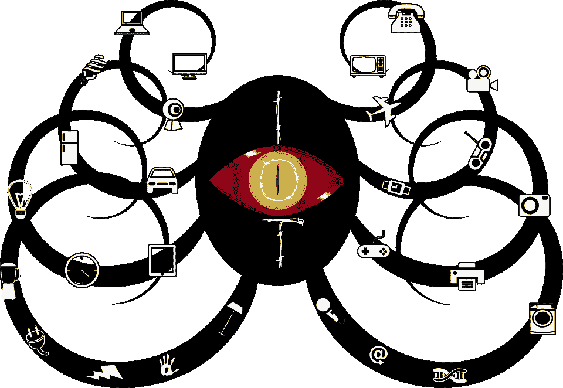
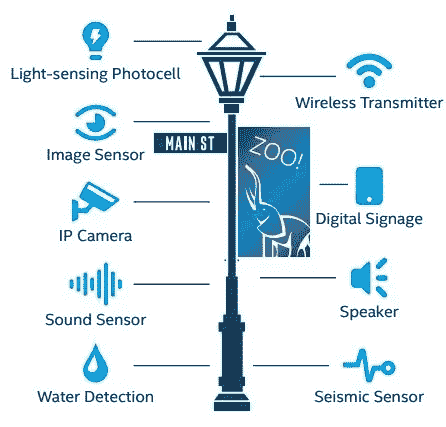
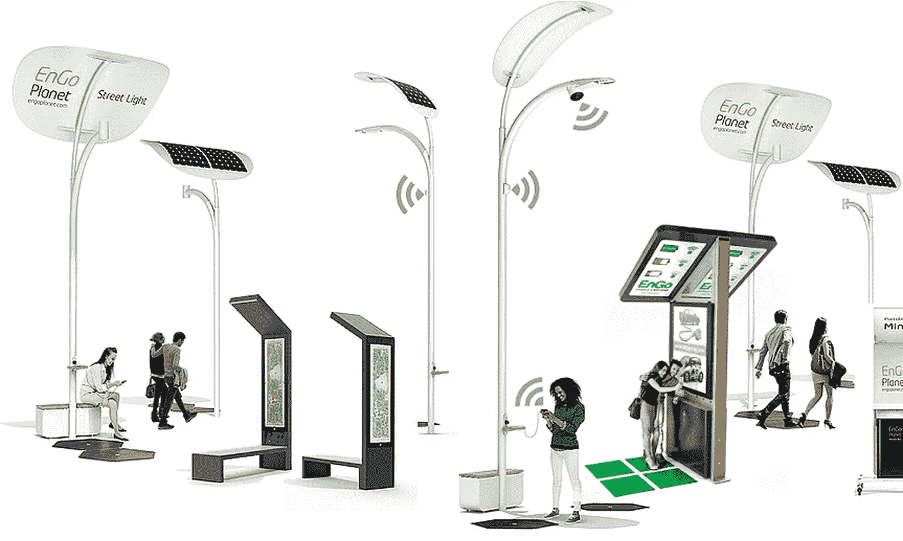
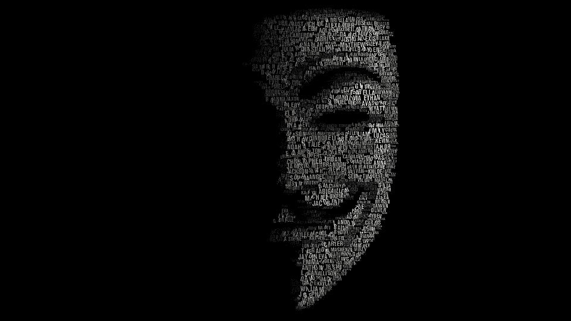
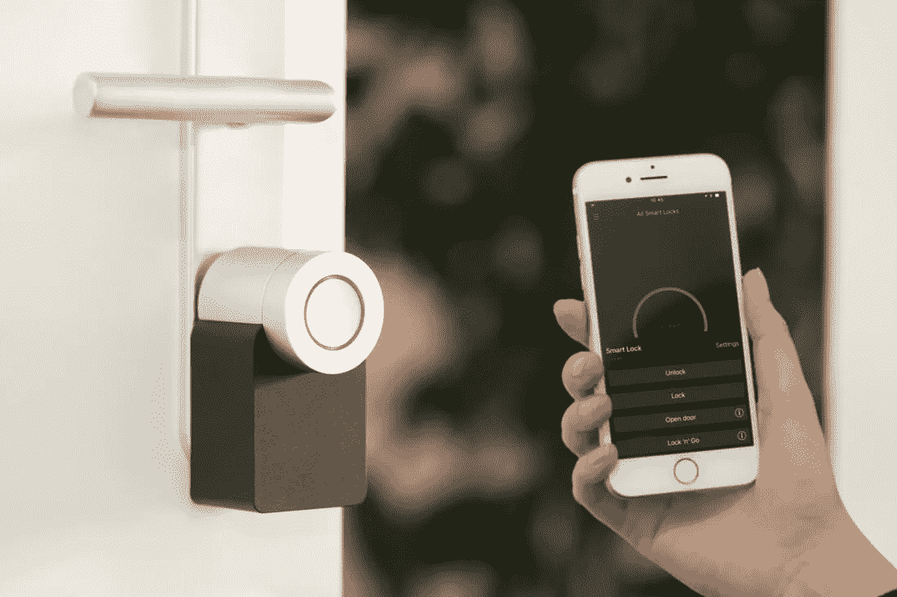

# 未来路灯会窥探我们吗？物联网的黑暗面。

> 原文：<https://medium.datadriveninvestor.com/will-street-lights-spy-us-in-the-future-dark-side-of-the-iot-cb047f4e2ab4?source=collection_archive---------3----------------------->

物联网是未来最有前途的领域。全世界都在关注物联网领域的进步和发展。它有许多优点值得考虑。因此，越来越多的人关注物联网的优点，而忽略了它的阴暗面。

意识到物联网的缺点(阴暗面)并不是一件新鲜事。许多研究人员从一开始就从理论和实践两方面解释了物联网的缺点。但故意让人们无法接触到它们。

Image by [Gordon Johnson](https://pixabay.com/users/GDJ-1086657/?utm_source=link-attribution&utm_medium=referral&utm_campaign=image&utm_content=1220817) from [Pixabay](https://pixabay.com/?utm_source=link-attribution&utm_medium=referral&utm_campaign=image&utm_content=1220817)

本文关注物联网的主要问题，即其安全漏洞。文章的流程将标题细分为进一步的三个问题，*未来路灯怎么转？* *他们会如何监视我们？为什么我们会被监视？*这三个问题的三个答案将以未来路灯为例，清晰勾勒出物联网的安全漏洞。

 [## 网络安全非营利组织帮助中小企业打击网络犯罪|数据驱动的投资者

### 一个名为全球网络联盟(GCA)的非营利组织发誓要改善…

www.datadriveninvestor.com](https://www.datadriveninvestor.com/2019/02/22/cybersecurity-non-profit-to-help-smes-fight-against-cybercrime/) 

# 未来路灯怎么转？

我们生活在一个城市化的世界。发展中国家和发达国家都在努力为他们的国家建设一个更好的生活环境。这在政治和经济方面都非常重要。智能城市是他们对未来的最终选择。智能路灯是置于人们之间的智慧城市的主要组成部分。所以未来路灯会变成智能路灯

Source: [https://www.intel.com/content/dam/www/public/us/en/documents/solution-briefs/smart-street-lights-for-brighter-savings-solutionbrief.pdf](https://www.intel.com/content/dam/www/public/us/en/documents/solution-briefs/smart-street-lights-for-brighter-savings-solutionbrief.pdf)

这是目前智能路灯的原型。需要注意的主要方面有 IP 摄像头、声音传感器和图像传感器。它们都是物联网的，可以被任何接触到它们的人控制。这种智能路灯具有录制视频、声音和识别周围物体的能力。在智能城市中，人是最突出的对象。

Source: [https://www.smart-magazine.com/innovations-city-traffic/engo-planet/](https://www.smart-magazine.com/innovations-city-traffic/engo-planet/)

智能路灯由互联网上成千上万的物联网网络协同工作。*如果有人破坏了那个网络？*你会在文末得到答案。

这里我用未来的路灯作为物联网的象征。因此，我们将讨论物联网以获得进一步的解释。

# 他们会如何监视我们？

黑客(黑帽)一直是计算机社会和互联网的一大威胁。他们也是物联网的主要威胁。

Image by [Javad Rajabzade](https://pixabay.com/users/JavadR-1130270/?utm_source=link-attribution&utm_medium=referral&utm_campaign=image&utm_content=813290) from [Pixabay](https://pixabay.com/?utm_source=link-attribution&utm_medium=referral&utm_campaign=image&utm_content=813290)

黑客是一个众所周知的术语。大多数时候，即使是普通人也会利用互联网上的教程进行黑客攻击。但问题是物联网公司不太关注物联网的安全性。将物联网作为更有利可图的产品来实施是他们的主要意图。生意就是生意权！

不仅仅是黑客。任何可以访问物联网的人都可以轻易地滥用它们。

在大多数情况下，我们使用智能手机作为物联网的连接器。在连接过程中，我们的智能手机和物联网应该连接到同一个网络。如果物联网此后遭到黑客攻击，他们就很容易攻击我们的智能手机。黑智能手机和黑我们效果一样。

你可以听到一种新的安全解决方案，智能锁。这是在没有物理密钥的情况下保护您的资产的一种便捷方式。你再也不用担心找不到钥匙了，因为你总是有指纹和智能手机。它们足以打开一把智能锁。指纹不是一个大问题，但通过智能手机解锁可能是一个威胁。因为任何有智能锁 mac 地址的智能手机都可以打开它。如果他们访问智能锁，他们将访问智能手机。

这只是一个例子。如果物联网的应用很大，那么威胁也很大，比如家庭自动化。

# 为什么他们会监视我们？

偷窥人主要有两个原因。

Photo by [Chris Nguyen](https://unsplash.com/@cspek?utm_source=medium&utm_medium=referral) on [Unsplash](https://unsplash.com?utm_source=medium&utm_medium=referral)

**办理数据业务**

如今，人们的数据是最有价值的。最近，一些科技巨头因数据篡改问题支付了数十亿美元的罚款。所以数据盗窃是一种严重的犯罪，影响了人们的隐私。物联网完全面向数据，包括人的声音和图像。

Photo by [Lianhao Qu](https://unsplash.com/@lianhao?utm_source=medium&utm_medium=referral) on [Unsplash](https://unsplash.com?utm_source=medium&utm_medium=referral)

任何人都可以控制物联网，他们可以获得物联网收集的所有数据。然后他们通过暗网将它们卖给非法或商业组织，获利数百万。

**出于政治目的**

在选举时期，执政党可以利用智能路灯的数据发现人们的想法。他们会利用这些来获得更多的选票。

Photo by [Marco Oriolesi](https://unsplash.com/@marcooriolesi?utm_source=medium&utm_medium=referral) on [Unsplash](https://unsplash.com?utm_source=medium&utm_medium=referral)

政府将监控其公民的行为，并根据具体情况采取行动。政府总是为公民谋福利？一点也不。有些政府会操纵公民的行为，试图达到自己的目的。

# 结论

即使物联网有很多好处，我们也不得不考虑它们的缺点。如果我们让他们没有任何注意，这将是一个很大的危害人们的正常生活和隐私。各国物联网的未来计划是智能城市。我们以智能路灯作为物联网的例子。有些政府黑客出于不同的目的需要我们的数据，如数据业务和政治目的。这是物联网的阴暗面。

但是这些是正在进行的研究的一些结果。由于法律问题，这些证据很难公布。但这些结果引发了对物联网安全的更多研究。因此，在未来，人们将会有一个安全的物联网世界。

您使用任何设备吗？ *你认为他们安全吗？*请在下面的评论区告诉我。