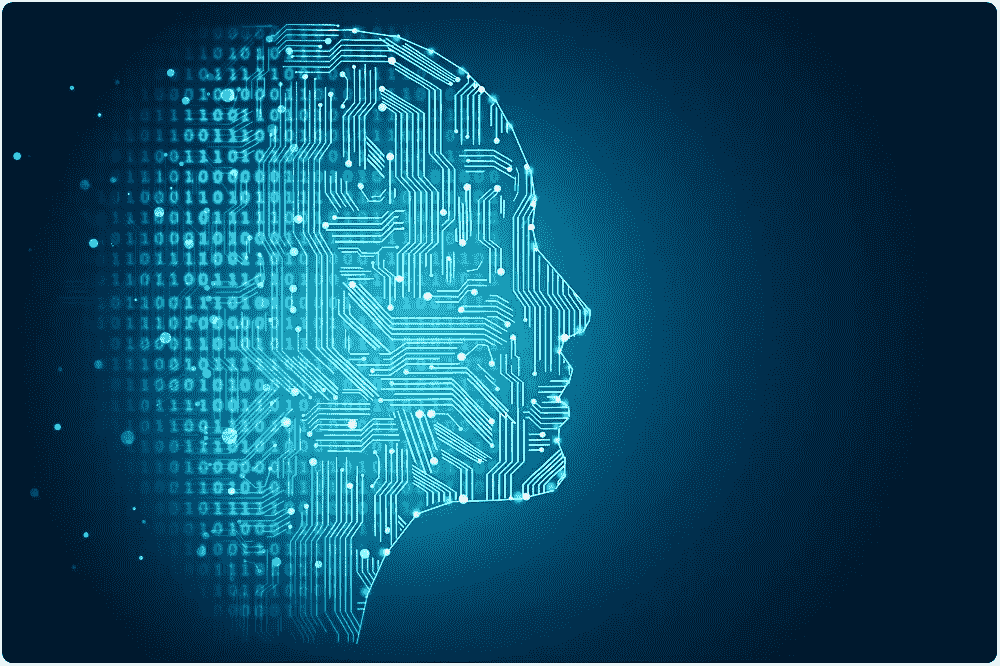
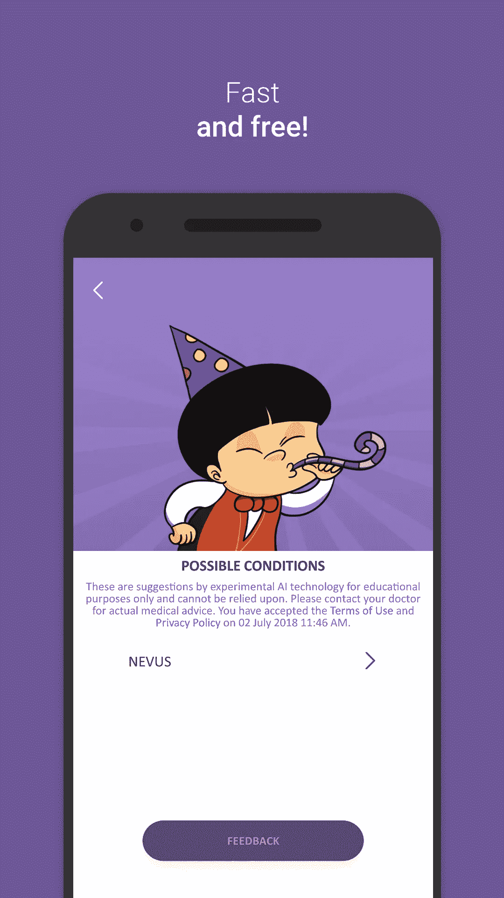

# 什么技术可能取代医生？

> 原文：<https://medium.datadriveninvestor.com/will-technology-might-replace-doctors-7af1b5a5e8e7?source=collection_archive---------36----------------------->

我没有水晶球**但是**我在沿着人工智能的思路思考。

***“我们现在应该停止培训放射科医生”* —杰弗里·辛顿**

虽然神经网络之父辛顿教授可能有点夸张，但人工智能是否会颠覆医学的话题分成了两个对立的极端:

1.  支持者是计算机科学家、人工智能博士、大型科技公司、小型创业公司和人工智能倡导者
2.  反对者:自然大部分是医护人员，比如医生*(有既得利益)和传统主义者

**注意，医生是一个相当多样化的群体。而大多数人认为“为什么要破坏没有坏的东西？”，真的有越来越多的临床医生希望人工智能扰乱他们的职业生涯，因为他们相信更大的图景。例如著名的* [*斯坦福 AIMI*](https://aimi.stanford.edu/)

作为一名医学博士和人工智能科学家，我个人认为人工智能可以取代医学中许多需要大量专业知识的狭窄领域——放射学恰好是其中之一。病理学等其他专业也可以由人工智能辅助或逐渐取代。一般来说，你的耐心接触越少，AI 取代你的可能性就越大。

结论仍然存在，但我相信创新精神。直觉告诉我，医生永远不会被完全取代——你能想象和一个机器人谈论你的健康问题吗？我当然不能。

人性化仍然是整个“医疗保健”理念的精髓。

[像 Medgic 这样的初创公司是人工智能医学的真正突破](https://www.medgic.co/)。它可能不会在开始时 100%准确，但作为深度学习技术的信徒，它会到达那里。

Screenshot of Medgic.co

我很高兴听到反对意见:)

祝您愉快！