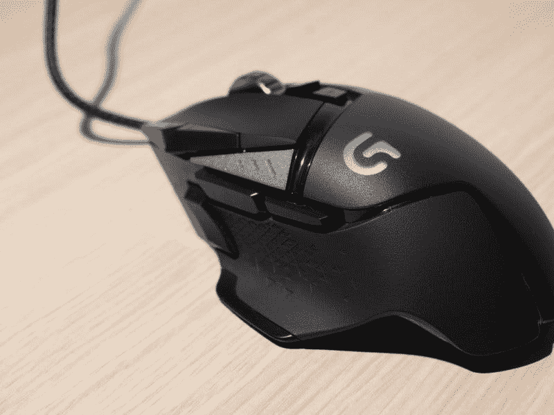
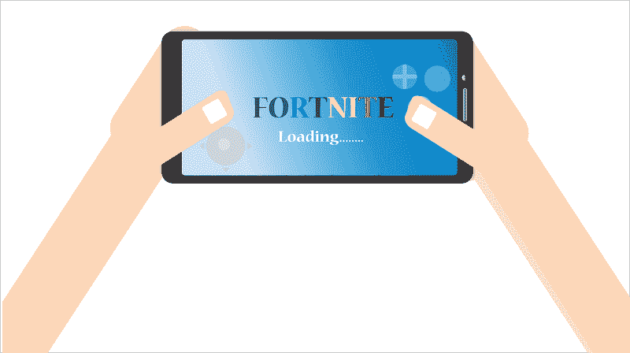

# 深渊会和堡垒之夜一起赚钱吗？—市场疯人院

> 原文：<https://medium.datadriveninvestor.com/will-the-abyss-make-money-with-fortnite-market-mad-house-5e149360fb50?source=collection_archive---------8----------------------->

深渊(ABYSS) 平台可以赚钱。赫然，*堡垒之夜*背后的公司；私人控股的 Epic Games，计划将其虚幻引擎 4 与深渊整合， *CoinDesk* [声称](https://www.coindesk.com/makers-of-fortnite-team-up-with-cryptos-steam-competitor-to-boost-game-development)。

详细说明[深渊](https://www.theabyss.com/)是一个游戏平台，使用一种他们称为**深渊令牌(深渊)**的加密货币进行支付。因此，他们打算让深渊成为玩家的另一个选择。Steem 是一个允许玩家接受加密货币支付的平台。

 [## 十大区块链课程-数据驱动的投资者

### 渴望在区块链发展吗？你想知道区块链是如何工作的，但不知道在哪里？或者就是太多了…

www.datadriveninvestor.com](https://www.datadriveninvestor.com/2019/03/08/top-10-blockchain-courses/) 

Epic 将[虚幻引擎](https://www.unrealengine.com/en-US/)描述为艺术家的“全套创作工具”。有效地说，虚幻引擎是一个软件开发工具包(SDK)；或工具箱，供游戏设计师、电影制作人和其他艺术家使用。过去用虚幻引擎构建的游戏包括；*质量效应，蝙蝠侠，荣誉勋章。*

# 史诗游戏为虚幻引擎增加了深渊

Coindesk 声称开发者可以将 Abyss 的支付解决方案添加到使用虚幻引擎开发的游戏中。因此，深渊和虚幻引擎可以让开发者轻松地将加密货币支付添加到游戏中。

然而，深渊是一个次要的球员，当你比较它的老 Steem。值得注意的是， *CoinDesk* 估计深渊上只有 6 款游戏，而 Steem 上有超过 30，000 款游戏。

Steem 和深渊的区别在于他们为大型多人在线(MMO)游戏设计了深渊。相比之下，Steem 适用于各种创作者，包括作家、播客、博客和电影制作人。

# 深渊能和 Steem 抗衡吗？

我的猜测是，Epic 希望通过与深渊合作来增加虚幻引擎的使用。值得注意的是，Steem 的平台已经取得了巨大的成功，在 2019 年 4 月拥有 10 亿个账户和 9000 万活跃用户， *Variety* [声称](https://variety.com/2019/gaming/news/steam-one-billion-accounts-1203201159/)。

此外，Coinmarketcap 计算出 STEEM 的市值为 1.322 亿美元，24 小时市场交易量为 375.7 万美元，2019 年 5 月 28 日的硬币价格为 41.8₵。Coinmarketcap 的计算基于 3.15962 亿钢的流通供应量和 3.329 亿钢的总供应量。

相比之下，coimarketcap 估计**深渊代币(深渊)**的市值为 501.7 万美元，24 小时市场交易量为 608，075 美元，2019 年 5 月 28 日的硬币价格为 2.2₵。他们的估计是基于 2.27558 亿深渊币的流通供应量和 5.09 亿深渊币的总供应量。

我认为 Epic Games 与深渊合作是因为其管理层认为他们将对较小的平台有更多的控制权。此外，Epic 将更少受到加密货币市场波动的影响，因为它像 ABYSS 一样专注于游戏的令牌更小。显然，Epic 可以用深渊赚更多的钱。

# 深渊能用史诗游戏赚钱吗

然而， *CoinDesk* 并没有说 Epic 的任何游戏是否会走向深渊。因此，*堡垒之夜*永远不会走向深渊。

*堡垒之夜*是 Epic 令人上瘾的多人射击游戏，风靡游戏世界。事实上，Statista [估计](https://www.statista.com/statistics/746230/fortnite-players/) *堡垒之夜*在 2019 年 3 月拥有约 2.5 亿玩家。此外，这款游戏非常受欢迎，我上次去科罗拉多州布埃纳维斯塔的杂货店时，看到一个小孩穿着堡垒之夜的 t 恤。

另一方面，将堡垒之夜赶下第一名的游戏可能会走出深渊。特别是，Epic Games 需要树立自己不仅仅是一个昙花一现的奇迹的形象。《堡垒之夜》是 Epic 最成功的内部游戏。

# 深渊会和 Epic 游戏商店整合吗？

值得注意的是，Epic 正试图通过其 [Epic 游戏商店](https://www.epicgames.com/store/en-US/)创收。详细来说，Epic Games Store 是 Epic 旗下游戏的应用商店。有趣的是，你可以通过 Epic 游戏商店网站访问虚幻引擎。

毫不奇怪的是，皇室战争堡垒可以在 Epic Games 商店买到。因此，深渊可以享受堡垒之夜的助推力；即使这个专营权永远不会到达它的平台。

此外，Epic 将虚幻引擎授权给开发者，每季度支付收入超过 3000 美元。反过来，开发者可以为特定的图书协商更好的条款。

因此，Epic 可以计划在 Epic 游戏商店中添加深渊和**深渊令牌(深渊)**。然而，*币台*未透露此类计划的详情。然而，深渊创始人康斯坦丁·鲍伊科-罗曼诺夫斯基在给*的电子邮件中声称开发者不需要与 Epic Games 签订单独的合同来接受深渊令牌。*

# 深渊能否与腾讯控股和迪士尼合作？

根据目前协议的条款，史诗游戏将为深渊提供未指明的营销服务。尚不清楚这些营销服务是否包括 Epic 的支持者；**华特·迪士尼公司(NYSE DIS)** 和**腾讯控股有限公司(OTC: TCHEY)** 。

[腾讯控股](https://en.wikipedia.org/wiki/Tencent)是非常受欢迎的微信社交媒体平台背后的中国社交媒体巨头。*应用业务*估计 2018 年第三季度有 10.8 亿用户。

此外，腾讯称微信在 2019 年 1 月有 10 亿活跃日用户。此外，应用商业计算出微信是世界上第五大最常用的应用。难以置信的是，*应用业务*估计每天有 4.1 亿个音视频通话通过微信。

鉴于这些能力；2018 年，腾讯每天发送 450 亿条微信消息，这可能会让腾讯的深渊更上一层楼。然而，腾讯和深渊将需要克服中国人民银行(PBOC)众所周知的[敌意](https://www.ccn.com/china-anti-crypto-central-bank-worried-cash-losing-relevance)以私人密码货币进入中华人民共和国。

# 深渊是一种好的密码货币吗？

与史诗游戏的结盟使**深渊令牌** **(深渊)成为一个有趣的替代硬币。**

深渊有一些有趣的属性，可能会很受欢迎。例如，玩家在玩多人在线游戏时，可以享受折扣并获得奖励积分。此外，深渊声称您可以很容易地提取其令牌，并将其兑换成其他数字货币。

然而，目前还不清楚您可以用深渊兑换哪些其他密码货币。我在 Bancor 的流动性网络上找不到**深渊令牌(深渊)**。Bancor 很重要，因为它提供了一种将基于 Ethereum 的替代币兑换成其他密码货币的快速方法。流动性意味着您可以随时将这些数字资产兑换成现金。

# 深渊需要稳定的加入

更重要的是，Bancor 提供了一些稳定的内容，如**戴(DAI)** 。 [Stablecoins](https://marketmadhouse.com/the-demise-of-bitcoin-and-the-future-of-stablecoins/) 是加密货币广泛采用的关键，因为它们包含一个智能合同，可以快速访问信托账户中的法定货币。

从理论上讲，无论你何时花掉阿呆、 [**【稳定】**](https://marketmadhouse.com/exploring-stablecoins-with-stably-or-stableusd/)**【USDS】**[**PAX OS Standard**](https://marketmadhouse.com/studying-stablecoins-with-the-new-digital-dollar-paxos-standard-pax/)**【PAX】**，智能合约都会向购买者释放法定货币。特别是，当你消费或转换 USDS、帕克斯或**双子座美元 GUSD】**时，智能合约应该释放 1 美元。很明显，双子座美元的信托账户在一家主要的美国金融机构，即****(纽约证券交易所代码:STT)** 。**

****

**快速访问 stablecoins 很重要，因为游戏玩家是真实的人，他们需要购买食物、电力、互联网服务和车辆燃料等物品。游戏玩家少；或开发商，将接受他们无法在当地杂货店消费的数字资产支付。**

**另一方面，我认为深渊将需要稳定的货币，提供除美元之外的其他货币。欧元对深渊的成功至关重要，因为包括德国在内的 19 个欧元区国家使用欧元作为他们的国家货币。德国是世界第四大经济体，焦点经济[估计](https://www.focus-economics.com/blog/the-largest-economies-in-the-world)。**

# **有趣的深渊特征**

**重要的是，包括 HitBTC、BITFINEX 和 DDEX trade ABYSS 在内的大量交易所。在交易所之外，深渊可以通过以太坊分散自主初始硬币发行( [DAICO](https://marketmadhouse.com/will-the-abyss-make-money-with-fortnite/#main) s)资助游戏开发。因此，深渊可以转换成以太坊。**

**与传统的首次公开募股(ICO)不同，DAICO 为一个像游戏一样的特定项目募集资金。每个 DAICO 将允许投资者向一个项目投资**以太坊(ETH)** 。有趣的是，DAICO 也是一种以太坊智能合约，如果项目失败，可以退款。**

# **深渊可扩展吗？**

**不幸的是，Abyss 团队未能在其网站上解决至关重要的区块链可伸缩性问题。由于所有的加密技术，区块链只能转移有限数量的数据或资金。每秒只能处理 4.6 **比特币(BTC)** 交易；比如*黑客诺恩的*肯尼李[估计](https://hackernoon.com/the-blockchain-scalability-problem-the-race-for-visa-like-transaction-speed-5cce48f9d44)。**

****

**以太坊创造者 Vitalik Buterin 甚至承认他的区块链“每秒只能处理 15 笔交易”，*投资区块链* [报道](https://www.investinblockchain.com/vitalik-ethereum-needs-100k-transactions-per-second/)。在这种情况下，如果以太坊游戏解决方案试图处理 20 个 TPS，它可能会崩溃。很明显，没有一个游戏平台会在这样的速度下赚钱。**

**Bancor 但是，以 **EOS (EOS)** 的形式提供了潜在的可扩展性解决方案。创建者[块。一个](https://block.one/)通过限制加密来构建比以太坊更快的 EOS。在这种情况下，EOS 处理了多达 3，996 个贸易点；然而，EOS 在 2019 年 5 月 24 日只处理了 48 个 TPS，*EOS 网络监视器* [计算](https://eosnetworkmonitor.io/)。**

**归根结底，深渊是一个迷人的区块链平台，拥有有趣的技术，可以通过销售具有巨大市场的产品赚很多钱。相反，我警告不要投机**深渊代币(深渊)**直到深渊证明它可以通过卖游戏赚钱。**

***原载于 2019 年 5 月 28 日*[*https://marketmadhouse.com*](https://marketmadhouse.com/will-the-abyss-make-money-with-fortnite/)*。***